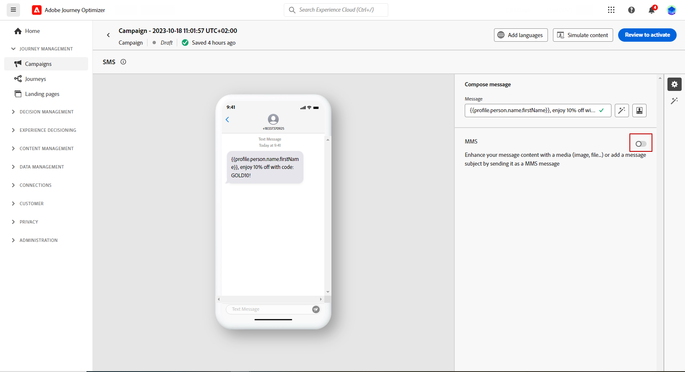

# 创建短信 (SMS/MMS) {#create-sms}

>[!CONTEXTUALHELP]
>id="ajo_message_sms"
>title="创建文本消息"
>abstract="要创建短信 (SMS/SMS)，请在历程或营销活动中添加短信操作，然后开始用个性化编辑器使其个性化。"

您可以使用Adobe Journey Optimizer设计和发送文本(SMS)和多媒体(MMS)消息。 您首先需要在历程或营销策划中添加短信操作，然后定义文本消息的内容，如下所述。 Adobe Journey Optimizer还提供了在发送之前测试文本消息的功能，以便您检查渲染、个性化属性和所有其他设置。

>[!NOTE]
>
>根据行业标准和法规，所有SMS/MMS营销消息都必须包含一种让接收者轻松取消订阅的方式。 要实现此目的，短信收件人可以使用选择启用和选择禁用关键词进行回复。 [了解如何管理选择退出](../privacy/opt-out.md#sms-opt-out-management-sms-opt-out-management)

## 添加短信 {#create-sms-journey-campaign}

浏览以下选项卡，了解如何在营销活动或历程中添加短信(SMS/MMS)。

>[!BEGINTABS]

>[!TAB 向历程添加短信]

1. 打开您的历程，然后从面板的&#x200B;**操作**&#x200B;部分拖放短信活动。

   

1. 提供有关消息的基本信息（标签、说明、类别），然后选择要使用的消息配置。

   

   有关如何配置历程的详细信息，请参阅[此页面](../building-journeys/journey-gs.md)

   默认情况下，**[!UICONTROL 配置]**&#x200B;字段已预填充用户用于该渠道的最后一个配置。

您现在可以从&#x200B;**[!UICONTROL 编辑内容]**&#x200B;按钮开始设计短信消息的内容，如下所述。

>[!TAB 向营销活动添加短信]

1. 访问&#x200B;**[!UICONTROL 营销活动]**&#x200B;菜单，然后单击&#x200B;**[!UICONTROL 创建营销活动]**。

1. 选择要执行的营销活动类型

   * **已计划 — 营销**：立即或在指定日期执行营销活动。 计划的营销活动旨在发送营销消息。 它们从用户界面配置和执行。

   * **API触发 — 营销/事务性**：使用API调用执行营销活动。 API触发的营销活动旨在发送营销或事务型消息，即，在个人执行操作（密码重置、购物车购买等）之后发送的消息。

1. 从&#x200B;**[!UICONTROL 属性]**&#x200B;部分，编辑营销活动的&#x200B;**[!UICONTROL 标题]**&#x200B;和&#x200B;**[!UICONTROL 描述]**。

1. 单击&#x200B;**[!UICONTROL 选择受众]**&#x200B;按钮，从可用Adobe Experience Platform受众列表中定义要定位的受众。 [了解详情](../audience/about-audiences.md)。

1. 在&#x200B;**[!UICONTROL 身份命名空间]**&#x200B;字段中，选择要使用的命名空间，以便识别所选受众中的个人。 [了解详情](../event/about-creating.md#select-the-namespace)。

1. 在&#x200B;**[!UICONTROL 操作]**&#x200B;部分中，选择&#x200B;**[!UICONTROL 短信]**，然后选择或创建新配置。

   在[此页面](sms-configuration.md)中了解有关短信配置的更多信息。

   

1. 单击&#x200B;**[!UICONTROL 创建试验]**&#x200B;开始配置内容试验并创建处理以测量其性能并为目标受众确定最佳选项。 [了解详情](../content-management/content-experiment.md)

1. 在&#x200B;**[!UICONTROL 操作跟踪]**&#x200B;部分中，指定是否要跟踪短信消息中的链接点击次数。

1. 营销活动旨在按特定日期或循环频率执行。 在[本节](../campaigns/create-campaign.md#schedule)中了解如何配置促销活动的&#x200B;**[!UICONTROL 计划]**。

1. 从&#x200B;**[!UICONTROL 操作触发器]**&#x200B;菜单中，选择短信消息的&#x200B;**[!UICONTROL 频率]**：

   * 一次
   * 每日
   * 每周
   * 月

您现在可以从&#x200B;**[!UICONTROL 编辑内容]**&#x200B;按钮开始设计文本消息的内容，如下所述。

>[!ENDTABS]

## 定义短信内容{#sms-content}

>[!CONTEXTUALHELP]
>id="ajo_message_sms_content"
>title="定义短信内容"
>abstract="通过使用个性化编辑器定义内容并纳入动态元素而自定义短信 (SMS/MMS) 并使其个性化。"

要配置短信内容，请执行以下步骤。 有关MMS的设置详情，请参阅[此部分](#mms-content)。

1. 在历程或营销策划配置屏幕中，单击&#x200B;**[!UICONTROL 编辑内容]**&#x200B;按钮以配置文本消息内容。

1. 单击&#x200B;**[!UICONTROL 消息]**&#x200B;字段以打开个性化编辑器。

   

1. 使用个性化编辑器定义内容、添加个性化和动态内容。 您可以使用任何属性，例如配置文件名称或城市。 您还可以定义条件规则。 浏览到以下页面，了解有关个性化编辑器中的[个性化](../personalization/personalize.md)和[动态内容](../personalization/get-started-dynamic-content.md)的更多信息。

1. 定义内容后，您可以在消息中添加跟踪的URL。 为此，请访问&#x200B;**[!UICONTROL 帮助程序功能]**&#x200B;菜单并选择&#x200B;**[!UICONTROL 帮助程序]**。

   请注意，要使用URL缩短功能，您必须首先配置子域，然后该子域将链接到您的配置。 [了解详情](sms-subdomains.md)

   >[!CAUTION]
   >
   > 要访问和编辑SMS子域，您必须对生产沙盒具有&#x200B;**[!UICONTROL 管理SMS子域]**&#x200B;权限。 可在[此部分](../administration/high-low-permissions.md)中详细了解权限。

   

1. 在&#x200B;**[!UICONTROL 帮助程序函数]**&#x200B;菜单中，单击&#x200B;**[!UICONTROL URL函数]**，然后选择&#x200B;**[!UICONTROL 添加URL]**。

   

1. 在`originalUrl`字段中，粘贴要缩短的URL并单击&#x200B;**[!UICONTROL 保存]**。

1. 单击&#x200B;**[!UICONTROL 保存]**&#x200B;并在预览中查看您的消息。 您现在可以测试和检查您的邮件内容，如[此部分](#sms-mms-test)中所详述。

## 定义彩信内容{#mms-content}

您可以通过发送多媒体消息服务(MMS)消息，启用视频、图片、音频剪辑和GIF等媒体的共享来增强通信。 此外，MMS允许在消息中最多包含1600个字符的文本。

>[!NOTE]
>
>* [此页面](../start/guardrails.md#sms-guardrails)中列出了MMS渠道的一些限制。

要创建MMS内容，请执行以下步骤：

1. 按照[此部分](#create-sms-journey-campaign)中的说明创建短信。

1. 编辑你的短信内容，如[此部分](#sms-content)中所述。

1. 启用MMS选项以将媒体添加到短信内容。

   

1. 向媒体添加&#x200B;**[!UICONTROL 标题]**。

1. 在&#x200B;**[!UICONTROL 媒体]**&#x200B;字段中输入媒体的URL。

   

1. 单击&#x200B;**[!UICONTROL 保存]**&#x200B;并在预览中查看您的消息。 您现在可以测试和检查消息内容，如下所述。

## 测试和发送消息 {#sms-mms-test}

使用&#x200B;**[!UICONTROL 模拟内容]**&#x200B;按钮预览您的文本消息内容、缩短的URL和个性化内容。

执行测试并验证内容后，即可向受众发送短信。 这些步骤在[此页面](send-sms.md)中详述

发送后，您可以在促销活动或历程报表中测量短信的影响。 有关报告的更多信息，请参考[此章节](../reports/campaign-global-report-cja-sms.md)。

**相关主题**

* [预览、测试和发送短信](send-sms.md)
* [配置短信渠道](sms-configuration.md)
* [短信/彩信报告](../reports/journey-global-report-cja-sms.md)
* [在历程中添加消息](../building-journeys/journeys-message.md)
* [在营销活动中添加消息](../campaigns/create-campaign.md)
