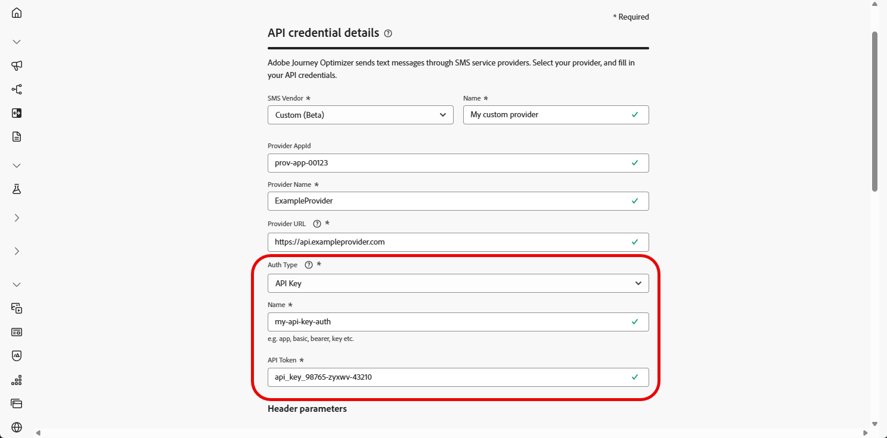

# 配置自定义 SMS 提供商 {#sms-configuration-custom}

>[!CONTEXTUALHELP]
>id="ajo_admin_sms_api_byop_provider_url"
>title="提供程序 URL"
>abstract="指定您计划连接的外部 API 的 URL。此 URL 是访问 API 的特性和功能的端点。"

>[!CONTEXTUALHELP]
>id="ajo_admin_sms_api_byop_header_parameters"
>title="标头参数"
>abstract="指定附加标头的标签、类型和值，以启用正确的身份验证、内容格式和有效的 API 通信。 "

>[!CONTEXTUALHELP]
>id="ajo_admin_sms_api_byop_provider_payload"
>title="提供程序负载"
>abstract="提供请求负载以确保发送正确的数据以供处理和生成响应。"

>[!AVAILABILITY]
>
>自定义提供商目前仅作为测试版提供给选定用户。 请联系您的Adobe代表以将其纳入Beta。
>请注意，此Beta不支持用于选择启用/选择禁用同意管理和投放报告的入站消息。

此功能使您能够集成和配置自己的短信提供商，从而除了默认提供商（Sinch、Twilio和Infobip）之外，还提供了灵活性。 这实现了短信的无缝创作、交付、报告和同意管理。

使用短信的自定义提供商配置，您可以：

* 直接在Journey Optimizer中配置自定义短信提供程序。
* 对动态消息传递使用高级有效负载自定义。
* 管理同意首选项（选择启用/选择禁用）以确保遵循相关说明。

## 创建API凭据 {#api-credential}

要在Journey Optimizer中使用Adobe无法立即提供的自定义提供商（例如Sinch、Infobip、Twilio）发送消息，请执行以下步骤：

1. 在左边栏中，导航到&#x200B;**[!UICONTROL 管理]** `>` **[!UICONTROL 渠道]**，选择&#x200B;**[!UICONTROL API凭据]**&#x200B;菜单，然后单击&#x200B;**[!UICONTROL 创建新API凭据]**&#x200B;按钮。

   

1. 配置您的SMS API凭据，如下所述：

   * **[!UICONTROL SMS供应商]**：自定义。

   * **[!UICONTROL 名称]**：输入API凭据的名称。

   * **[!UICONTROL 提供程序AppId]**：输入您的SMS提供程序提供的应用程序ID。

   * **[!UICONTROL 提供商名称]**：输入短信提供商的名称。

   * **[!UICONTROL 提供程序URL]**：输入短信提供程序的URL。

   * **[!UICONTROL 身份验证类型&#x200B;]**：选择授权类型，并根据所选的身份验证方法[完成相应的字段](#auth-options)。

     

1. 在&#x200B;**[!UICONTROL 标头]**&#x200B;部分中，单击&#x200B;**[!UICONTROL 添加新参数]**&#x200B;以指定将发送到外部服务的请求消息的HTTP标头。

   默认情况下，**Content-Type**&#x200B;和&#x200B;**Charset**&#x200B;标头字段已设置，无法删除。

   

1. 添加您的&#x200B;**[!UICONTROL 提供程序负载]**&#x200B;以验证和自定义您的请求负载。

   您可以使用配置文件属性动态个性化有效负载，并通过内置帮助程序功能确保发送准确的数据用于处理和生成响应。
<!--
1. Add your **Inbound settings** to determine how your system handles incoming messages and subscriber preferences: 

    * **[!UICONTROL Inbound Webhook URL]**: Specify the endpoint URL where inbound messages (e.g. replies or new messages from users) are sent.
    * **[!UICONTROL Opt-in Keywords]**: Enter the default or custom keywords that will automatically trigger your Opt-In Message. For multiple keywords, use comma-separated values.
    * **[!UICONTROL Opt-in Message]**: Enter the custom response that is automatically sent as your Opt-In Message.
    * **[!UICONTROL Opt-out Keywords]**: Enter the default or custom keywords that will automatically trigger your Opt-Out Message. For multiple keywords, use comma-separated values.
    * **[!UICONTROL Opt-out Message]**: Enter the custom response that is automatically sent as your Opt-Out Message.
-->

1. 完成API凭据配置后，单击&#x200B;**[!UICONTROL 提交]**。

1. 在&#x200B;**[!UICONTROL API凭据]**&#x200B;菜单中，单击bin图标以删除您的API凭据。

   

1. 要修改现有凭据，请找到所需的API凭据，然后单击&#x200B;**[!UICONTROL 编辑]**&#x200B;选项以进行必要更改。

   

创建和配置API凭据后，现在需要为SMS消息创建渠道平面。 [了解详情](sms-configuration-surface.md)

配置后，您可以利用所有现成的渠道功能，如消息创作、个性化、链接跟踪和报告。

### 自定义 SMS 提供商的身份验证选项 {#auth-options}

>[!CONTEXTUALHELP]
>id="ajo_admin_sms_api_byop_auth_type"
>title="身份验证类型"
>abstract="指定访问 API 所需的身份验证方法，这可确保与外部服务进行安全和授权的通信。"

>[!BEGINTABS]

>[!TAB API密钥]

创建API凭据后，完成API密钥身份验证所需的字段：

* **[!UICONTROL 名称]**&#x200B;：输入API密钥配置的名称。
* **[!UICONTROL API令牌]**&#x200B;：输入您的SMS提供商提供的API令牌。

>[!TAB MAC身份验证]

创建API凭据后，完成MAC身份验证所需的字段：

* **[!UICONTROL 名称]**&#x200B;：输入MAC身份验证配置的名称。
* **[!UICONTROL API令牌]**&#x200B;：输入您的SMS提供商提供的API令牌。
* **[!UICONTROL API密钥]**：输入您的SMS提供商提供的API密钥。 此密钥用于生成MAC（消息身份验证代码）以进行安全通信。
* **[!UICONTROL Mac授权哈希格式]**：选择MAC身份验证的哈希格式。

>[!TAB OAuth身份验证]

创建API凭据后，完成OAuth身份验证所需的字段：

* **[!UICONTROL 名称]**&#x200B;：输入OAuth身份验证配置的名称。

* **[!UICONTROL API令牌]**&#x200B;：输入您的SMS提供商提供的API令牌。

* **[!UICONTROL OAuth URL]**&#x200B;：输入用于获取OAuth令牌的URL。

* **[!UICONTROL OAuth主体]**&#x200B;：提供JSON格式的OAuth请求主体，包括`grant_type`、`client_id`和`client_secret`等参数。

>[!TAB JWT身份验证]

创建API凭据后，完成JWT身份验证所需的字段：

* **[!UICONTROL 名称]**&#x200B;：输入JWT身份验证配置的名称。

* **[!UICONTROL API令牌]**&#x200B;：输入您的SMS提供商提供的API令牌。

* **[!UICONTROL JWT有效负载]**&#x200B;：输入包含JWT所需声明的JSON有效负载，如颁发者、主题、受众和到期日期。

>[!ENDTABS]

## 操作说明视频 {#video}

>[!VIDEO](https://video.tv.adobe.com/v/3431625)
