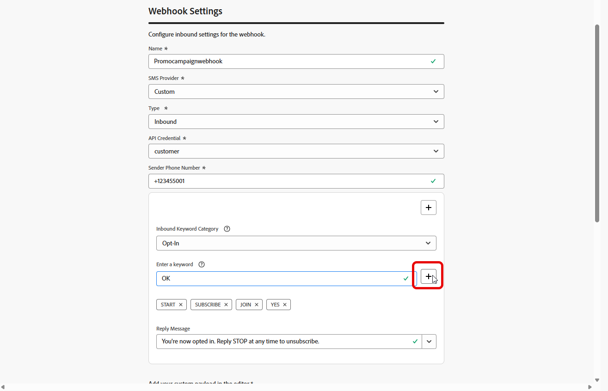

# 配置自定义提供商 {#sms-configuration-custom}

>[!CONTEXTUALHELP]
>id="ajo_admin_sms_api_byop_provider_url"
>title="提供程序 URL"
>abstract="指定您计划连接的外部 API 的 URL。此 URL 是访问 API 的特性和功能的端点。"

>[!CONTEXTUALHELP]
>id="ajo_admin_sms_api_byop_header_parameters"
>title="标头参数"
>abstract="指定附加标头的标签、类型和值，以启用正确的身份验证、内容格式和有效的 API 通信。 "

>[!CONTEXTUALHELP]
>id="ajo_admin_sms_api_byop_provider_payload"
>title="提供程序负载"
>abstract="提供请求负载以确保发送正确的数据以供处理和生成响应。"

此功能使您能够集成和配置自己的报文传送提供商，在默认选项（Sinch、Twilio和Infobip）之外提供灵活性。 这支持对SMS和RCS消息进行无缝创作、交付、报告和同意管理。

通过自定义提供商配置，您可以直接在Journey Optimizer中连接第三方消息服务，自定义动态内容的消息负载，以及管理选择加入/选择退出偏好设置以确保短信和RCS渠道之间的合规性。

要配置自定义提供商，请执行以下步骤：

1. [创建API凭据](#api-credential)
1. [创建Webhook](#webhook)
1. [创建渠道配置](sms-configuration-surface.md)
1. [通过短信渠道操作创建历程或营销活动](create-sms.md)

## 创建API凭据 {#api-credential}

要在Journey Optimizer中使用Adobe提供的现成可用的自定义提供商（例如Sinch、Infobip、Twilio）发送SMS和RCS消息，请执行以下步骤：

1. 在左边栏中，导航到&#x200B;**[!UICONTROL 管理]** `>` **[!UICONTROL 渠道]**，选择&#x200B;**[!UICONTROL SMS设置]**&#x200B;下的&#x200B;**[!UICONTROL API凭据]**&#x200B;菜单，然后单击&#x200B;**[!UICONTROL 创建新API凭据]**&#x200B;按钮。

   

1. 配置您的SMS API凭据，如下所述：

   * **[!UICONTROL SMS供应商]**：自定义。

   * **[!UICONTROL 名称]**：输入API凭据的名称。

   * **[!UICONTROL 提供程序AppId]**：输入您的SMS提供程序提供的应用程序ID。

   * **[!UICONTROL 提供商名称]**：输入短信提供商的名称。

   * **[!UICONTROL 提供程序URL]**：输入短信提供程序的URL。

   * **[!UICONTROL 身份验证类型&#x200B;]**：选择授权类型，并根据所选的身份验证方法[完成相应的字段](#auth-options)。

     

1. 在&#x200B;**[!UICONTROL 标头]**&#x200B;部分中，单击&#x200B;**[!UICONTROL 添加新参数]**&#x200B;以指定将发送到外部服务的请求消息的HTTP标头。

   默认情况下，**Content-Type**&#x200B;和&#x200B;**Charset**&#x200B;标头字段已设置，无法删除。

   

1. 添加您的&#x200B;**[!UICONTROL 提供程序负载]**&#x200B;以验证和自定义您的请求负载。

   对于RCS消息，此有效负载稍后将在[内容设计](create-sms.md#sms-content)期间使用。

1. 完成API凭据配置后，单击&#x200B;**[!UICONTROL 提交]**。

1. 在&#x200B;**[!UICONTROL API凭据]**&#x200B;菜单中，单击以删除您的API凭据。

   

1. 要修改现有凭据，请找到所需的API凭据，然后单击&#x200B;**[!UICONTROL 编辑]**&#x200B;选项以进行必要更改。

   

创建和配置API凭据后，现在需要为Webhook](#webhook)设置[入站设置，以发送短信消息。

### 自定义 SMS 提供商的身份验证选项 {#auth-options}

>[!CONTEXTUALHELP]
>id="ajo_admin_sms_api_byop_auth_type"
>title="身份验证类型"
>abstract="指定访问 API 所需的身份验证方法，这可确保与外部服务进行安全和授权的通信。"

>[!BEGINTABS]

>[!TAB API密钥]

创建API凭据后，完成API密钥身份验证所需的字段：

* **[!UICONTROL 名称]**&#x200B;：输入API密钥配置的名称。
* **[!UICONTROL API令牌]**&#x200B;：输入您的SMS提供商提供的API令牌。

>[!TAB MAC身份验证]

创建API凭据后，完成MAC身份验证所需的字段：

* **[!UICONTROL 名称]**&#x200B;：输入MAC身份验证配置的名称。
* **[!UICONTROL API令牌]**&#x200B;：输入您的SMS提供商提供的API令牌。
* **[!UICONTROL API密钥]**：输入您的SMS提供商提供的API密钥。 此密钥用于生成MAC（消息身份验证代码）以进行安全通信。
* **[!UICONTROL Mac授权哈希格式]**：选择MAC身份验证的哈希格式。

>[!TAB OAuth身份验证]

创建API凭据后，完成OAuth身份验证所需的字段：

* **[!UICONTROL 名称]**&#x200B;：输入OAuth身份验证配置的名称。

* **[!UICONTROL API令牌]**&#x200B;：输入您的SMS提供商提供的API令牌。

* **[!UICONTROL OAuth URL]**&#x200B;：输入用于获取OAuth令牌的URL。

* **[!UICONTROL OAuth主体]**&#x200B;：提供JSON格式的OAuth请求主体，包括`grant_type`、`client_id`和`client_secret`等参数。

>[!TAB JWT身份验证]

创建API凭据后，完成JWT身份验证所需的字段：

* **[!UICONTROL 名称]**&#x200B;：输入JWT身份验证配置的名称。

* **[!UICONTROL API令牌]**&#x200B;：输入您的SMS提供商提供的API令牌。

* **[!UICONTROL JWT有效负载]**&#x200B;：输入包含JWT所需声明的JSON有效负载，如颁发者、主题、受众和到期日期。

>[!ENDTABS]

## 创建Webhook {#webhook}

>[!BEGINSHADEBOX]

如果未提供选择加入或选择退出关键词，则使用标准同意消息尊重用户隐私。 添加自定义关键字会自动覆盖默认值。

**默认关键字：**

* **选择加入**：订阅，是，不停止，开始，继续，继续，开始
* **选择退出**：停止、退出、取消、结束、取消订阅、否
* **帮助**：帮助

>[!ENDSHADEBOX]

成功创建API凭据后，下一步是创建webhook并配置入站设置。 此配置可确保您的系统能够正确接收和处理传入的数据或消息。

1. 在左边栏中，导航到&#x200B;**[!UICONTROL 管理]** `>` **[!UICONTROL 渠道]**，选择&#x200B;**[!UICONTROL 短信设置]**&#x200B;下的&#x200B;**[!UICONTROL 短信Webhook]**&#x200B;菜单，然后单击&#x200B;**[!UICONTROL 创建Webhook]**&#x200B;按钮。

   

1. 配置Webhook设置，如下所述：

   * **[!UICONTROL 名称]**：输入Webhook的名称。

   * **[!UICONTROL 选择SMS供应商]**：自定义。

   * **[!UICONTROL 选择API凭据]**：从下拉列表中选择[以前配置的API凭据](#api-credential)。

   * **[!UICONTROL 选择加入关键字]**：输入将自动触发选择加入消息的默认或自定义关键字。 对于多个关键字，请使用逗号分隔的值。

   * **[!UICONTROL 选择加入消息]**：输入作为选择加入消息自动发送的自定义响应。

   * **[!UICONTROL 选择退出关键词]**：输入将自动触发选择退出消息的默认或自定义关键词。 对于多个关键字，请使用逗号分隔的值。

   * **[!UICONTROL 选择退出消息]**：输入作为选择退出消息自动发送的自定义响应。

   

1. 单击&#x200B;**[!UICONTROL 查看有效负载编辑器]**&#x200B;以验证和自定义您的请求有效负载。

   您可以使用配置文件属性动态个性化有效负载，并通过内置帮助程序功能确保发送准确的数据用于处理和生成响应。

1. 完成Webhook配置后，单击&#x200B;**[!UICONTROL 提交]**。

1. 在&#x200B;**[!UICONTROL Webhooks]**&#x200B;菜单中，单击以删除您的Webhook。

1. 要修改现有配置，请找到所需的Webhook，然后单击&#x200B;**[!UICONTROL 编辑]**&#x200B;选项以进行必要的更改。

1. 从您以前提交的&#x200B;**[!UICONTROL Webhook]**&#x200B;访问和复制新的&#x200B;**[!UICONTROL Webhook URL]**。

   

在为Webhook创建和配置入站设置后，您现在需要为短信创建[渠道配置](sms-configuration-surface.md)。

配置后，您可以利用所有现成的渠道功能，如消息创作、个性化、链接跟踪和报告。

## 操作说明视频 {#video}

>[!VIDEO](https://video.tv.adobe.com/v/3431625)

