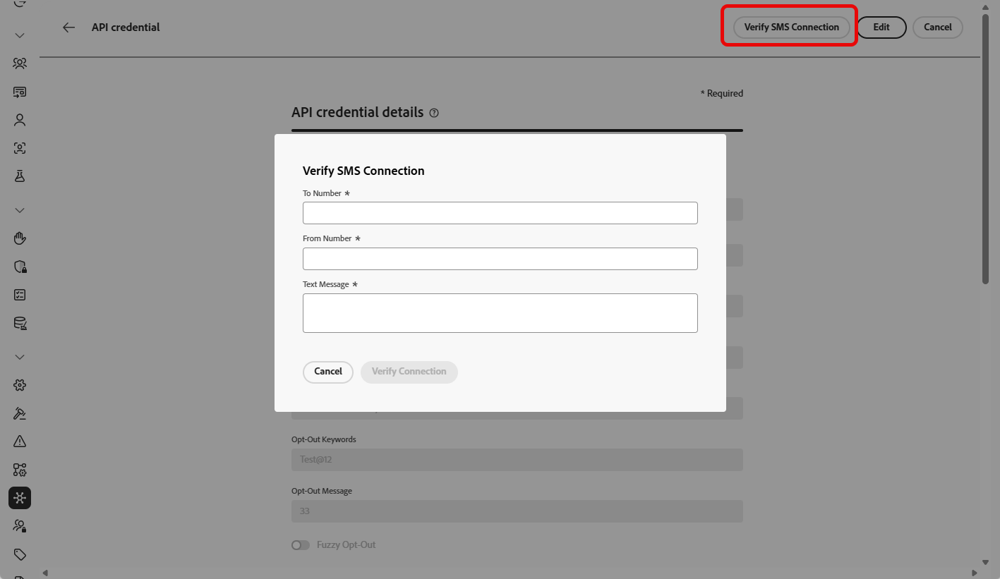

# 配置 Sinch 提供程序 {#sms-configuration-sinch}

在将Sinch提供程序与Journey Optimizer结合使用时，您可以找到三个不同的选项：

* **SMS配置**：设置您的Sinch API凭据以无缝发送SMS消息。

* **MMS配置**：对于多媒体消息(MMS)，请配置Sinch MMS API凭据。 请注意，跟踪和响应入站消息由短信配置处理。 MMS设置仅用于MMS消息的出站投放。

* **RCS配置**：设置您的Sinch API凭据以无缝发送RCS消息。

## 配置短信的API凭据{#create-api}

>[!BEGINSHADEBOX]

如果未提供选择加入或选择退出关键词，则使用标准同意消息尊重用户隐私。 添加自定义关键字会自动覆盖默认值。

**默认关键字：**

* **选择加入**：订阅，是，不停止，开始，继续，继续，开始
* **选择退出**：停止、退出、取消、结束、取消订阅、否
* **帮助**：帮助

>[!ENDSHADEBOX]

要配置您的Sinch提供商以使用Journey Optimizer发送短信消息和彩信，请执行以下步骤：

1. 在左边栏中，浏览到&#x200B;**[!UICONTROL 管理]** > **[!UICONTROL 渠道]** `>` **[!UICONTROL SMS设置]**&#x200B;并选择&#x200B;**[!UICONTROL API凭据]**&#x200B;菜单。 单击&#x200B;**[!UICONTROL 创建新API凭据]**&#x200B;按钮。

1. 配置您的SMS API凭据，如下所述：

   +++ 用于配置的短信凭据列表

   | 配置字段 | 描述 |
   |---|---|    
   | SMS供应商 | Sinch |
   | 名称 | 选择API凭据的名称。 |
   | 服务ID和API令牌 | 访问API页面，您可以在SMS选项卡下找到凭据。 请参阅[Sinch文档](https://developers.sinch.com/docs/sms/getting-started/){target="_blank"}以了解详情。 |
   | 选择加入关键词 | 输入将自动触发选择加入消息的默认或自定义关键词。 对于多个关键字，请使用逗号分隔的值。 |
   | 选择加入消息 | 输入作为选择加入消息自动发送的自定义响应。 |
   | 选择退出关键词 | 输入将自动触发选择退出消息的默认或自定义关键词。 对于多个关键字，请使用逗号分隔的值。 |
   | 选择退出消息 | 输入作为选择退出消息自动发送的自定义响应。 |
   | 帮助关键字 | 输入将自动触发&#x200B;**帮助消息**&#x200B;的默认关键字或自定义关键字。 对于多个关键字，请使用逗号分隔的值。 |
   | 帮助消息 | 输入作为&#x200B;**帮助消息**&#x200B;自动发送的自定义响应。 |
   | 双重选择加入关键词 | 输入触发双重选择加入流程的关键字。 如果用户轮廓不存在，则会在确认成功时创建该轮廓。对于多个关键字，请使用逗号分隔的值。 [了解有关短信双重选择加入的更多信息](https://video.tv.adobe.com/v/3427129/?learn=on)。 |
   | 双重选择加入消息 | 输入为响应双重选择加入确认而自动发送的自定义响应。 |
   | 入站编号 | 添加唯一的入站编号或短代码。 这允许您在不同沙盒中使用相同的API凭据，每个沙盒具有自己的入站编号或短代码。 |
   | 自定义入站关键词 | 为特定操作定义唯一的关键字，例如DISCOUNT、OFFERS、ENROLL。 这些关键字将作为属性捕获并存储在配置文件中，使您能够触发历程中的流区段鉴别并提供自定义响应或操作。 |
   | 默认入站回复消息 | 输入在最终用户发送与定义的任何关键字都不匹配的入站SMS时发送的默认回复。 |
   | 覆盖URL | 输入您的自定义URL以替换SMS投放报告、反馈数据、入站消息或事件通知的默认端点。 Sinch会将所有相关更新发送到此URL，而不是预定义的更新。 |

   +++

1. 启用&#x200B;**[!UICONTROL 模糊选择退出]**&#x200B;选项以检测类似于选择退出关键字的消息（如“CANCIL”），并在&#x200B;**[!UICONTROL 模糊自动回复]**&#x200B;字段中自定义确认回复。

   **[!UICONTROL Fuzzy Opt-out]**&#x200B;标识表示用户希望取消订阅的短信消息，即使该消息与定义的选择退出关键字不完全匹配。 它可以检测常见的选择退出短语和某些冒犯性术语，从而帮助确保您的营销活动尊重用户偏好并保持合规性。

1. 完成API凭据配置后，单击&#x200B;**[!UICONTROL 提交]**。

1. 在&#x200B;**[!UICONTROL API凭据]**&#x200B;菜单中，单击bin图标以删除您的API凭据。

1. 要修改现有凭据，请找到所需的API凭据，然后单击&#x200B;**[!UICONTROL 编辑]**&#x200B;选项以进行必要更改。

1. 单击现有API凭据中的&#x200B;**[!UICONTROL 验证SMS连接]**，通过向指定设备发送示例消息来测试和验证SMS API凭据。

1. 填写&#x200B;**数字**&#x200B;和&#x200B;**消息**&#x200B;字段，然后单击&#x200B;**[!UICONTROL 验证连接]**。

   >[!IMPORTANT]
   >
   >消息的结构必须与提供商的有效负荷格式保持一致。

   

创建和配置API凭据后，现在需要为SMS消息创建渠道配置。 [了解详情](sms-configuration-surface.md)

## 为MMS配置API凭据{#sinch-mms}

>[!IMPORTANT]
>
> 除了MMS设置之外，您还需要创建专门用于跟踪入站消息和管理同意请求的Sinch API凭据。

要配置Sinch MMS以使用Journey Optimizer发送MMS，请执行以下步骤：

1. 在左边栏中，浏览到&#x200B;**[!UICONTROL 管理]** > **[!UICONTROL 渠道]** `>` **[!UICONTROL SMS设置]**&#x200B;并选择&#x200B;**[!UICONTROL API凭据]**&#x200B;菜单。 单击&#x200B;**[!UICONTROL 创建新API凭据]**&#x200B;按钮。

1. 配置您的MMS API凭据，如下所述：

   * **[!UICONTROL SMS供应商]**： Sinch MMS。

   * **[!UICONTROL 名称]**：为您的API凭据选择一个名称。

   * **[!UICONTROL 项目ID]**、**[!UICONTROL 应用程序ID]**&#x200B;和&#x200B;**[!UICONTROL API令牌]**：请按照以下步骤收集您的MMS API凭据。

      * 对于&#x200B;**[!UICONTROL 项目ID]**&#x200B;和&#x200B;**[!UICONTROL 应用程序ID]**：访问Sinch仪表板上Sinch项目的[对话API概述](https://dashboard.sinch.com/convapi/overview)页面。
      * 对于&#x200B;**[!UICONTROL API令牌]**：获取Sinch项目的[访问密钥](https://community.sinch.com/t5/Customer-Dashboard/Sinch-Access-Keys/ta-p/12638)，并生成Sinch项目&#x200B;**访问密钥**&#x200B;中的&#x200B;**Base64 API令牌**。

1. 完成API凭据配置后，单击&#x200B;**[!UICONTROL 提交]**。

1. 在&#x200B;**[!UICONTROL API凭据]**&#x200B;菜单中，单击bin图标以删除您的API凭据。

1. 要修改现有凭据，请找到所需的API凭据，然后单击&#x200B;**[!UICONTROL 编辑]**&#x200B;选项以进行必要更改。

创建和配置API凭据后，现在需要为MMS消息创建渠道配置。 [了解详情](sms-configuration-surface.md)

## 为RCS配置API凭据

<!---->

Journey Optimizer通过Sinch支持RCS（富通信服务）消息传递，允许使用经过验证的企业个人资料以及品牌元素（如徽标和发件人名称）发送基本消息。

请注意，当用户档案的设备不支持RCS或暂时无法通过RCS访问时，消息会自动回退到短信。

<!--
### Basic RCS Messages

>[!AVAILABILITY]
>
> Basic RCS messages is only available upon Adobe RCS add-on offering.

1. **Set up your branded RCS agent**

    Create a branded RCS agent in the Sinch Dashboard. [Learn more on branded RCS agent](https://community.sinch.com/t5/RCS/Getting-Started-with-RCS-using-Conversation-API/ta-p/17844)

1. **Set up your [Custom API credentials](sms-configuration-custom.md)**
    
    Once your RCS agent is approved, you need to set up your Sinch API credentials, which include your access key, secret, and service plan ID. These credentials will be used by Journey Optimizer to authenticate and send messages through Sinch's platform.

1. **Create a [channel configuration](sms-configuration-surface.md) for your RCS messages**

    Configure a channel surface in Journey Optimizer by linking your Sinch credentials and defining the messaging parameters. This setup enables you to compose and send RCS messages from Journey Optimizer.

1. **Create and personalize your [SMS message](../sms/create-sms.md)**

    Your messages automatically falls back to SMS when the profile's device does not support RCS or is temporarily unreachable via RCS.
-->

### RCS多媒体消息

>[!AVAILABILITY]
>
> 高级RCS消息仅适用于Sinch管理的直接帐户。

1. **设置您的品牌RCS代理**

   在Sinch Dashboard中创建标记的RCS代理。 [了解有关品牌RCS代理的更多信息](https://community.sinch.com/t5/RCS/Getting-Started-with-RCS-using-Conversation-API/ta-p/17844)

1. **设置您的[自定义API凭据](sms-configuration-custom.md)**

   RCS代理获得批准后，您需要设置自定义API凭据，其中包括应用程序ID、名称、URL和身份验证类型。

1. **使用提供程序有效负载配置您的RCS。**

   在[自定义API凭据](sms-configuration-custom.md)中，添加提供程序有效负载以验证和自定义您的RCS消息。

1. **为您的RCS消息创建[通道配置](sms-configuration-surface.md)**

   通过链接您的Sinch凭据并定义消息传递参数，在Journey Optimizer中配置渠道平面。 此设置允许您从Journey Optimizer撰写和发送RCS消息。

1. **创建并个性化您的[短信](../sms/create-sms.md)**

   将有效负载直接粘贴到短信内容中，以嵌入和投放富通信服务(RCS)消息。

   ➡️ [在Sinch文档中了解Sinch如何支持RCS](https://sinch.com/blog/rcs-api-guide/)

