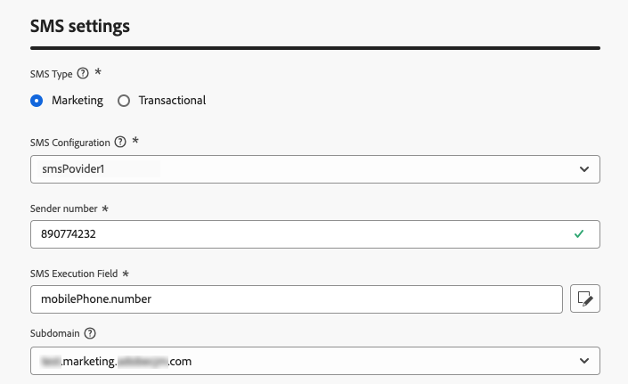

# 配置短信渠道 {#sms-configuration}

在发送短信或彩信之前，必须配置Adobe Journey Optimizer环境。 要执行这项操作，请执行以下操作：

* [集成提供程序设置](#create-api) 使用Journey Optimizer
* [创建短信表面](#message-preset-sms) （即短信预设），也用于MMS

这些步骤必须由Adobe Journey Optimizer执行 [系统管理员](../start/path/administrator.md).

## 先决条件{#sms-prerequisites}

Adobe Journey Optimizer目前与第三方提供商集成，这些提供商独立于Adobe Journey Optimizer提供短信服务。 支持的短信提供商包括： **Sinch**， **Twilio** 和 **Infobip**. 仅支持MMS **Sinch**.

在配置短信渠道之前，您必须使用这些提供商之一创建帐户，以获取 **api令牌** 和 **服务ID**，您需要配置Adobe Journey Optimizer与适用提供商之间的连接。

您对短信服务的使用受适用提供商提供的其他条款与条件的约束。 作为第三方解决方案，Adobe Journey Optimizer用户可通过集成使用Sinch、Twilio和Infobip。 Adobe不控制，也不对第三方产品负责。 有关文本消息服务(SMS/MMS)的任何问题或协助请求，请与提供商联系。

>[!CAUTION]
>
>要访问和编辑短信子域，您必须拥有 **[!UICONTROL 管理短信子域]** 生产沙盒的权限。 要了解有关权限的更多信息，请参阅 [此页面](../administration/high-low-permissions.md#administration-permissions).
>

## 创建新 API 凭据 {#create-api}

>[!CONTEXTUALHELP]
>id="ajo_admin_sms_api_header"
>title="用 Journey Optimizer 配置您的短信提供商"
>abstract="Adobe Journey Optimizer 通过短信服务提供商发送短信。选择提供商并填写 API 凭据。"

>[!CONTEXTUALHELP]
>id="ajo_admin_mms_api_header"
>title="用 Journey Optimizer 配置您的彩信提供商"
>abstract="Adobe Journey Optimizer 通过彩信服务提供商发送媒体内容。选择提供商并填写 API 凭据。"

>[!CONTEXTUALHELP]
>id="ajo_admin_sms_api"
>title="使用 Journey Optimizer 配置 SMS/MMS 供应商"
>abstract="在发送短信 (SMS/MMS) 之前，您必须将提供商设置与 Journey Optimizer 集成。完成后，您需要创建一个 SMS/MMS 表面。必须由 Adobe Journey Optimizer 系统管理员执行这些步骤。"
>additional-url="https://experienceleague.adobe.com/docs/journey-optimizer/using/sms/sms-configuration.html?lang=zh-Hans#message-preset-sms" text="创建短信渠道表面"

>[!CONTEXTUALHELP]
>id="ajo_admin_sms_configuration"
>title="选择短信供应商配置"
>abstract="选择为您的短信供应商配置的 API 凭据。"

要使用Journey Optimizer配置短信/彩信提供商，请执行以下步骤：

1. 在左边栏中，浏览 **[!UICONTROL 管理]** > **[!UICONTROL 渠道]** 并选择 **[!UICONTROL API凭据]** 菜单。 单击 **[!UICONTROL 创建新的API凭据]** 按钮。

   

1. 配置您的SMS API凭据，如下所述。

   

   * 对象 **[!DNL Sinch]**：

      * **[!UICONTROL 名称]**：选择API凭据的名称。

      * **[!UICONTROL 服务ID]** 和 **[!UICONTROL api令牌]**：访问API页面，您可以在SMS选项卡下找到凭据。 了解详情，请参阅 [Sinch文档](https://developers.sinch.com/docs/sms/getting-started/){target="_blank"}.

      * **[!UICONTROL 选择加入消息]**：输入将作为您的自动发送的自定义响应 **[!UICONTROL 选择加入消息]**.

      * **[!UICONTROL 帮助消息]**：输入将作为您的自动发送的自定义响应 **帮助消息**.

   * 对象 **[!DNL Sinch MMS]**：

      * **[!UICONTROL 名称]**：选择API凭据的名称。

      * **[!UICONTROL 项目编号]**， **[!UICONTROL 应用程序ID]** 和 **[!UICONTROL api令牌]**：从“对话API”菜单中，您可以在“应用程序”菜单中找到您的凭据。 了解详情，请参阅 [Sinch文档](https://docs.cc.sinch.com/cloud/service-configuration/en/oxy_ex-1/common/wln1620131604643.html){target="_blank"}.

   * 对象 **[!DNL Twilio]**：

      * **[!UICONTROL 名称]**：选择API凭据的名称。

      * **[!UICONTROL 帐户SID]** 和 **[!UICONTROL 身份验证令牌]**：访问Twilio控制台仪表板页面的“帐户信息”窗格以查找您的凭据。

      * **[!UICONTROL 消息SID]**：输入分配给Twilio API创建的每条消息的唯一标识符。 了解详情，请参阅 [Twilio文档](https://support.twilio.com/hc/en-us/articles/223134387-What-is-a-Message-SID-){target="_blank"}.

   * 对象 **[!DNL Infobip]**：

      * **[!UICONTROL 名称]**：选择API凭据的名称。

      * **[!UICONTROL API基本URL]** 和 **[!UICONTROL api令牌]**：访问您的Web界面主页或API密钥管理页面以查找您的凭据。 了解详情，请参阅 [Infobip文档](https://www.infobip.com/docs/api){target="_blank"}.

1. 单击 **[!UICONTROL 提交]** 完成API凭据配置时。

创建和配置API凭据后，现在需要为SMS消息创建渠道界面（即消息预设）。

## 创建短信表面 {#message-preset-sms}

>[!CONTEXTUALHELP]
>id="ajo_admin_surface_sms_type"
>title="定义消息类别"
>abstract="选择使用此表面的短信的类型：营销型的推广短信（需要用户同意）或交易型的非商业短信，如密码重置。"
>additional-url="https://experienceleague.adobe.com/docs/journey-optimizer/using/privacy/consent/opt-out.html#sms-opt-out-management" text="选择退出营销短信消息"

配置短信/彩信渠道后，您必须创建一个渠道平面以便能够从中发送短信消息 **[!DNL Journey Optimizer]**.

要创建渠道表面，请执行以下步骤：

1. 在左边栏中，浏览 **[!UICONTROL 管理]** > **[!UICONTROL 渠道]** 并选择 **[!UICONTROL 品牌化]** > **[!UICONTROL 渠道表面]**. 单击 **[!UICONTROL 创建渠道表面]** 按钮。

   

1. 输入表面的名称和描述（可选），然后选择短信渠道。

   

   >[!NOTE]
   >
   > 名称必须以字母(A-Z)开头。 它只能包含字母数字字符。 您也可以使用下划线 `_`，点`.` 和连字符 `-` 个字符。

1. 定义 **短信设置**.

   

   首先，选择 **[!UICONTROL 短信类型]** 将随表面一起发送的内容： **[!UICONTROL 事务性]** 或 **[!UICONTROL 营销]**.

   * 选择 **营销** 促销文本消息：这些消息需要用户同意。
   * 选择 **事务性** 用于非商业性消息，如订单确认、密码重置通知或投放信息。

   创建SMS/MMS消息时，必须选择与为消息选择的类别匹配的有效渠道平面。

   >[!CAUTION]
   >
   >**事务性** 消息可以发送给取消订阅营销通信的用户档案。 这些消息只能在特定上下文中发送。

1. 选择 **[!UICONTROL 短信配置]** 以与曲面相关联。

   有关如何配置环境以发送短信消息的更多信息，请参阅 [本节](#create-api).

1. 输入 **[!UICONTROL 发件人编号]** 您&#x200B;希望用于您的通信。

1. 选择您的 **[!UICONTROL 短信执行字段]** 以选择 **[!UICONTROL 配置文件属性]** 与用户档案的电话号码关联。

1. 如果要在短信消息中使用URL缩短功能，请从 **[!UICONTROL 子域]** 列表。

   >[!NOTE]
   >
   >要能够选择子域，请确保您之前已配置至少一个SMS/MMS子域。 [了解如何操作](sms-subdomains.md)

1. 输入 **[!UICONTROL 选择退出次数]** 要用于此表面。 当用户档案选择退出此号码时，您仍然可以通过可能用于发送短信的其他号码向他们发送消息 [!DNL Journey Optimizer].

   >[!NOTE]
   >
   >在 [!DNL Journey Optimizer]，不再在渠道级别管理短信的选择退出。 现在，它是特定于某个数字的。

1. 配置完所有参数后，单击 **[!UICONTROL 提交]** 以确认。 也可以将渠道曲面另存为草稿，并稍后恢复其配置。

   

1. 创建渠道表面后，它将显示在列表中，其中包含 **[!UICONTROL 正在处理]** 状态。

   >[!NOTE]
   >
   >如果检查不成功，请在中详细了解可能失败的原因 [本节](#monitor-channel-surfaces).

1. 检查成功后，渠道表面将获得 **[!UICONTROL 活动]** 状态。 它随时可用于投放消息。

   

您现在可以使用Journey Optimizer发送短信。

**相关主题**

* [创建短信(SMS/MMS)](create-sms.md)
* [在历程中添加消息](../building-journeys/journeys-message.md)
* [在营销活动中添加消息](../campaigns/create-campaign.md)

