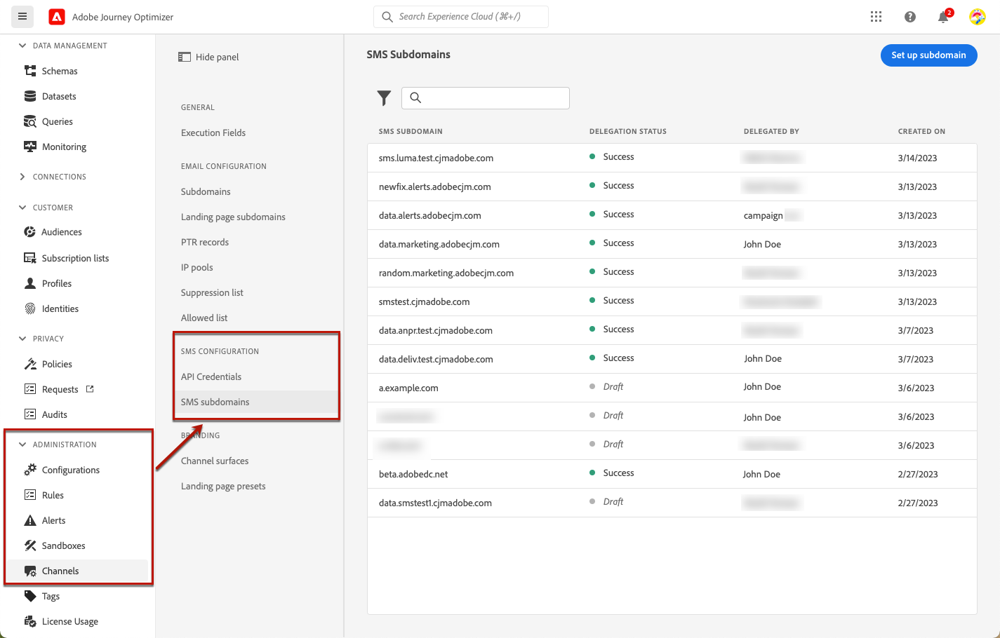

# 配置短信子域 {#lp-subdomains}

>[!CONTEXTUALHELP]
>id="ajo_admin_subdomain_sms_header"
>title="委派短信子域"
>abstract="您将设置您的子域以供短信使用。可使用已委派给 Adobe 的子域或配置另一子域。"

>[!CONTEXTUALHELP]
>id="ajo_admin_subdomain_sms"
>title="委派短信子域"
>abstract="您必须配置一个子域以用于短信消息，因为您需要此子域才能创建短信表面。您必须配置子域以用于登陆页面，因为您需要此子域才能创建登陆页面预设。 您可以使用已委派的子域来 Adobe 或配置新的子域。"
>additional-url="https://experienceleague.adobe.com/docs/journey-optimizer/using/sms/sms-configuration.html?lang=zh-Hans#message-preset-sms" text="创建短信表面"

>[!CONTEXTUALHELP]
>id="ajo_admin_config_sms_subdomain"
>title="选择短信子域"
>abstract="要可创建短信表面，请确保您以前已配置至少一个短信表面，以供从子域名称列表中选择。"
>additional-url="https://experienceleague.adobe.com/docs/journey-optimizer/using/sms/sms-configuration.html?lang=zh-Hans#message-preset-sms" text="创建短信表面"

要缩短添加到短信消息的URL，您必须设置将在以下情况下选择的子域： [创建短信表面](sms-configuration.md#message-preset-sms).

您可以使用已委派给Adobe的子域，也可以配置另一个子域。 了解有关委派子域以在中进行Adobe的更多信息 [本节](../configuration/delegate-subdomain.md).

>[!CAUTION]
>
>短信子域配置对所有环境都是通用的。 因此：
>
>* 要访问和编辑短信子域，您必须拥有 **[!UICONTROL 管理短信子域]** 生产沙盒的权限。
>
> * 对短信子域的任何修改也会影响生产沙盒。

## 使用现有子域 {#sms-use-existing-subdomain}

要使用已委派给Adobe的子域，请执行以下步骤。

1. 访问 **[!UICONTROL 管理]** > **[!UICONTROL 渠道]** 菜单，然后选择 **[!UICONTROL 短信配置]** > **[!UICONTROL 短信子域]**.

   

1. 单击 **[!UICONTROL 设置子域]**.

   

1. 选择 **[!UICONTROL 使用委派的子域]** 从 **[!UICONTROL 配置类型]** 部分。

   

1. 输入将在短信URL中显示的前缀。

   >[!NOTE]
   >
   >只允许使用字母数字字符和连字符。

1. 从列表中选择已委派的子域。

   >[!NOTE]
   >
   >您不能选择已用作短信子域的子域。

   <!--Capital letters are not allowed in subdomains. TBC by PM-->

   

   <!--Note that you cannot use multiple delegated subdomains of the same parent domain. For example, if 'marketing1.yourcompany.com' is already delegated to Adobe for your SMS messages, you will not be able to use 'marketing2.yourcompany.com'. However, multi-level subdomains being supported for SMS, you may proceed using a subdomain of 'marketing1.yourcompany.com' (such as 'email.marketing1.yourcompany.com'), or a different parent domain.-->

   >[!CAUTION]
   >
   >如果您使用选择已委派给Adobe的域 [CNAME方法](../configuration/delegate-subdomain.md#cname-subdomain-delegation)，您必须在托管平台上创建DNS记录。 要生成DNS记录，此过程与配置新的短信子域时的过程相同。 了解如何在 [本节](#sms-configure-new-subdomain).

1. 单击&#x200B;**[!UICONTROL 提交]**。

1. 提交后，子域将显示在列表中，其中包含 **[!UICONTROL 正在处理]** 状态。 有关子域状态的更多信息，请参阅 [本节](../configuration/about-subdomain-delegation.md#access-delegated-subdomains).<!--Same statuses?-->

   >[!NOTE]
   >
   >在能够使用该子域发送消息之前，您必须等待Adobe执行所需的检查，这最多可能需要4小时。<!--Learn more in [this section](delegate-subdomain.md#subdomain-validation).-->

1. 检查成功后，子域将获得 **[!UICONTROL 成功]** 状态。 它随时可用于创建短信渠道界面。

## 配置新子域 {#sms-configure-new-subdomain}

>[!CONTEXTUALHELP]
>id="ajo_admin_sms_subdomain_dns"
>title="生成匹配的 DNS 记录"
>abstract="要配置新的短信子域，您需要复制在 Journey Optimizer 界面中显示的 Adobe 名称服务器信息，将它粘贴到您的域托管解决方案中以生成匹配的 DNS 记录。检查成功后，该子域即可用于创建短信表面。"

要配置新子域，请执行以下步骤。

1. 访问 **[!UICONTROL 管理]** > **[!UICONTROL 渠道]** 菜单，然后选择 **[!UICONTROL 短信配置]** > **[!UICONTROL 短信子域]**.

1. 单击 **[!UICONTROL 设置子域]**.

1. 选择 **[!UICONTROL 添加您自己的域]** 从 **[!UICONTROL 配置类型]** 部分。

   

1. 指定要委派的子域。

   >[!CAUTION]
   >
   >您无法使用现有的短信子域。
   >
   >子域中不允许使用大写字母。

   不允许将无效子域委派给Adobe。 确保输入贵组织拥有的有效子域，如marketing.yourcompany.com。

   >[!NOTE]
   >
   >支持（同一父域的）多级别子域。 例如，您可以使用“sms.marketing.yourcompany.com”。

1. 将显示要放置在DNS服务器上的记录。 复制此记录或下载CSV文件，然后导航到您的域托管解决方案以生成匹配的DNS记录。

1. 确保已将DNS记录生成到域托管解决方案中。 如果一切配置正确，请选中“我确认……”框，然后单击 **[!UICONTROL 提交]**.

   

   >[!NOTE]
   >
   >配置新的短信子域时，它将始终指向CNAME记录。

1. 提交子域委派后，子域将显示在列表中，其中包含 **[!UICONTROL 正在处理]** 状态。 有关子域状态的更多信息，请参阅 [本节](../configuration/about-subdomain-delegation.md#access-delegated-subdomains).<!--Same statuses?-->

   >[!NOTE]
   >
   >在能够使用该子域发送短信消息之前，您必须等待Adobe执行所需的检查，这最多可能需要4小时。<!--Learn more in [this section](#subdomain-validation).-->

1. 检查成功后，子域将获得 **[!UICONTROL 成功]** 状态。 它随时可用于创建短信渠道界面。

   请注意，该子域将标记为 **[!UICONTROL 失败]** 如果您无法在托管解决方案上创建验证记录。
