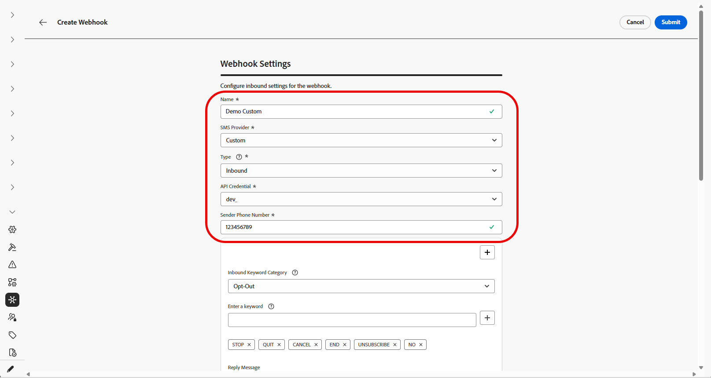

# 创建 Webhook {#webhook}

>[!CONTEXTUALHELP]
>id="ajo_channels_sms_webhook_settings_create"
>title="创建 SMS Webhook"
>abstract="您可以配置 Webhook 来捕获入站响应，以管理订阅和退订同意，并接收包含已读回执在内的投递报告（如可用）。"


>[!CONTEXTUALHELP]
>id="ajo_admin_sms_webhook_flow_type"
>title="选择您的 Webhook 类型"
>abstract="设置 webhook 时，可选择&#x200B;**入站**&#x200B;以捕获同意响应和用户偏好，或选择&#x200B;**[!UICONTROL 反馈]**&#x200B;以跟踪投递和互动事件，用于报告和分析。"

>[!BEGINSHADEBOX]

在Journey Optimizer中创建新的API凭据时，SMS Webhook现在可用于捕获入站关键词和反馈事件，如投放和错误。 由于每个提供程序具有不同的功能，因此有单独的说明来启用Webhook。
由于Webhook现在支持自定义提供商，因此现在可以从任何提供商那里收集反馈和入站关键词集合，以便在Journey Optimizer中报告和采取行动。

* **新客户：**&#x200B;可以按照此处的说明正确配置短信Webhook。

* **现有客户：**&#x200B;您可以从API凭据中存储的信息迁移到Webhook，并且没有客户迁移的时间表。 对于确实要迁移到SMS Webhook的现有客户，需要按照迁移指南中的记录执行迁移步骤。

>[!ENDSHADEBOX]

## 概述 {#overview}

成功创建API凭据后，您现在可以配置Webhook以捕获入站响应，用于管理选择加入和选择退出同意，并接收投放报表，包括可用的读取回执。

在设置webhook时，您可以根据要捕获的数据类型定义其用途：

* **入站**：如果要捕获同意响应（如选择加入或选择退出），并收集用户首选项，请使用此选项。

* **反馈**：选择此选项可跟踪投放和参与事件，包括投放、出站错误和读取回执（如果适用），以支持报告和分析。

根据您的提供商的不同，对于需要设置什么才能成功实施短信，会有不同的期望：

* **Sinch和Sinch对话**：创建一个webhook以处理入站和反馈事件。 无需配置有效负载。

* **Infobip**：创建两个单独的Webhook，一个用于入站事件，另一个用于反馈事件。 这两个webhook均无需有效负载配置。

* **Twilio**： Webhook不可用。 不支持入站和反馈数据收集。

* **自定义提供程序**：创建两个单独的Webhook，一个用于入站事件，另一个用于反馈事件。 两个Webhook都需要负载配置才能正常运行。

### 提供商支持 {#provider-support}

>[!NOTE]
>
>唯一支持的webhook格式是JSON。 不支持Webhook的表单数据。

下表显示了哪些提供商支持入站和反馈Webhook，以及是否需要创建有效负载：

| 提供商 | 入站Webhook | 反馈Webhook | 关键字 | 需要创建有效负载 | 需要Webhook | 有效负载创建 |
| --- | --- | --- | --- | --- | --- | --- |
| Infobip | 可配置 | 可配置 | 可配置 | 非必填 | 必需 | 非必填 |
| Sinch | 可配置 | 可配置 | 可配置 | 非必填 | 不是。 集成 | 不适用 |
| Sinch对话 | 可配置 | 可配置 | 可配置 | 非必填 | 不是。 集成 | 不适用 |
| Twilio | 不可用 | 不可用 | 不可用 | 不可用 | 不可用 | 不适用 |
| 自定义 | 可配置 | 可配置 | 可配置 | 必需 | 必需 | 必需 |

对于从API凭据迁移到SMS Webhook的客户，有关迁移路径的信息可在迁移指南中找到。

## 创建webhook

### 对于Sinch和Sinch对话 {#create-webhook-sinch}

对于Sinch和Sinch对话，请创建一个webhook以处理入站和反馈事件。 无需自定义有效负载配置。

1. 在左边栏中，导航到&#x200B;**[!UICONTROL 管理]** `>` **[!UICONTROL 渠道]**，选择&#x200B;**[!UICONTROL 短信设置]**&#x200B;下的&#x200B;**[!UICONTROL 短信Webhook]**&#x200B;菜单，然后单击&#x200B;**[!UICONTROL 创建Webhook]**&#x200B;按钮。

   

1. 配置webhook设置，如下所述：

   * **[!UICONTROL 名称]**：输入webhook的名称。

   * **[!UICONTROL 选择SMS供应商]**： Sinch或Sinch Conversational。

   * **[!UICONTROL API凭据]**：从下拉列表中选择[之前配置的API凭据](sms-configuration-sinch.md)。

   * **[!UICONTROL 发件人电话号码]**：输入要用于通信的发件人电话号码。

   

1. 通过在&#x200B;**[!UICONTROL 输入关键字]**&#x200B;字段中输入关键字来开始设置入站关键字。 可以添加和删除多个关键字。 请注意，关键字不区分大小写。

   

1. 从&#x200B;**[!UICONTROL 入站关键字类别]**&#x200B;下拉列表中选择关键字类别以进行配置：

   +++ 选择加入

   * 启用经用户同意选择加入的用户的关键字。 当用户消息与配置的关键字匹配时，其电话号码将选择加入以接收短信消息。

   * 默认情况下，启用了以下关键字：“订阅”、“是”、“不停止”、“继续”、“恢复”和“开始”。 通过单击删除任何默认关键字。

   * 使用&#x200B;**[!UICONTROL 回复消息]**&#x200B;字段创建当用户的入站消息与选择加入关键字匹配时自动发送的消息。

   +++

   +++ 选择禁用

   * 启用选择退出用户并取消同意发送文本消息的关键字。 当用户消息与配置的关键字匹配时，其电话号码将选择退出接收短信消息。

   * 默认情况下，启用了以下关键字： Stop、Quit、Cancel、End、Unsubscribe、No。 通过单击删除任何默认关键字。

   * 使用&#x200B;**[!UICONTROL 回复消息]**&#x200B;字段创建当用户的入站消息与选择退出关键字匹配时自动发送的消息。

   * 启用&#x200B;**[!UICONTROL 模糊逻辑]**&#x200B;以检测与配置的选择退出关键字相似的关键字。 如果用户的响应接近但不完全相同，则会发送在&#x200B;**[!UICONTROL 模糊自动响应]**&#x200B;字段中输入的消息。 通常，此消息指示未发生选择退出并指定取消订阅所需的确切关键词。

   +++

   +++ 双重选择加入

   * 启用双重选择加入要求的关键字。 当用户的消息与配置的关键字匹配时，他们在此阶段未完全选择启用。 此两步式同意工作流要求用户使用第二个关键字确认其选择加入。

   * 使用&#x200B;**[!UICONTROL 回复消息]**&#x200B;字段创建匹配双重选择加入关键字时自动发送的消息。 此消息会指示用户输入选择加入关键字，以完成选择加入流程。

   +++

   +++ 帮助

   * 启用在请求帮助时提供标准响应的关键字。 当用户的消息与配置的关键字匹配时，他们将收到帮助回复消息。

   * 默认情况下，启用了以下关键字：“帮助”、“信息”、“信息”。 通过单击删除任何默认关键字。

   * 使用&#x200B;**[!UICONTROL 回复消息]**&#x200B;字段创建当用户的入站消息与Help关键字匹配时自动发送的消息。

   +++

   +++ 自定义

   * 配置单个自定义关键字。 当用户的消息与此关键字匹配时，该关键字将写入&#x200B;**[!UICONTROL 消息反馈跟踪]**&#x200B;数据集以用于报告和构建受众。

   * 构建引用此关键字的受众（流或批次），以在您的历程和营销活动中使用。

   +++

1. 输入&#x200B;**[!UICONTROL 默认回复消息]**。 当用户的响应与任何配置的关键字不匹配时，将自动发送此消息。

   

1. 单击&#x200B;**[!UICONTROL 提交]**&#x200B;以保存webhook配置。

1. 从&#x200B;**[!UICONTROL Webhooks]**&#x200B;菜单中，可以编辑或删除现有的Webhook。

1. 访问新创建的Webhook并复制&#x200B;**[!UICONTROL Webhook URL]**。

   

1. 使用您的&#x200B;**[!UICONTROL Webhook URL]**&#x200B;启用&#x200B;**反馈**&#x200B;和&#x200B;**入站**&#x200B;活动以进入Journey Optimizer。

   * 对于短信渠道，[在Sinch文档中了解详情](https://community.sinch.com/t5/SMS/How-do-I-assign-a-callback-URL-to-an-SMS-service/ta-p/8414)

   * 对于MMS渠道，[在Sinch文档中了解详情](https://developers.sinch.com/docs/conversation/getting-started#5-handle-incoming-messages)

   * 对于直接通过Journey Optimizer购买短信的客户，请提交具有Adobe支持的支持工单。 Adobe客户团队将为您配置webhook URL。
     

如果您的webhook使用附加到现有渠道配置的API凭据，则webhook将立即生效。 否则，创建新的渠道配置。

➡️[了解有关渠道配置的更多信息](sms-configuration-surface.md)

### 对于Infobip {#create-webhook-infobip}

对于Infobip，请创建两个单独的Webhook：一个用于反馈事件，另一个用于入站事件。

1. 在左边栏中，导航到&#x200B;**[!UICONTROL 管理]** `>` **[!UICONTROL 渠道]**，选择&#x200B;**[!UICONTROL 短信设置]**&#x200B;下的&#x200B;**[!UICONTROL 短信Webhook]**&#x200B;菜单，然后单击&#x200B;**[!UICONTROL 创建Webhook]**&#x200B;按钮。

   

1. 配置webhook设置，如下所述：

   * **[!UICONTROL 名称]**：输入webhook的名称。

   * **[!UICONTROL 选择SMS供应商]**： Infobip。

   * **[!UICONTROL 类型]**：选择“反馈”或“入站”。 您需要单独创建这两个，从入站开始。

   * **[!UICONTROL API凭据]**：从下拉列表中选择[之前配置的API凭据](sms-configuration-infobip.md#api-credential)。

   * **[!UICONTROL 发件人电话号码]**：输入要用于通信的发件人电话号码。

   

1. 通过在&#x200B;**[!UICONTROL 输入关键字]**&#x200B;字段中输入关键字来开始设置入站关键字。 可以添加和删除多个关键字。 请注意，关键字不区分大小写。

   

1. 从&#x200B;**[!UICONTROL 入站关键字类别]**&#x200B;下拉列表中选择关键字类别以进行配置：

   +++ 选择加入

   * 启用经用户同意选择加入的用户的关键字。 当用户消息与配置的关键字匹配时，其电话号码将选择加入以接收短信消息。

   * 默认情况下，启用了以下关键字：“订阅”、“是”、“不停止”、“继续”、“恢复”和“开始”。 通过单击删除任何默认关键字。

   * 使用&#x200B;**[!UICONTROL 回复消息]**&#x200B;字段创建当用户的入站消息与选择加入关键字匹配时自动发送的消息。

   +++

   +++ 选择禁用

   * 启用选择退出用户并取消同意发送文本消息的关键字。 当用户消息与配置的关键字匹配时，其电话号码将选择退出接收短信消息。

   * 默认情况下，启用了以下关键字： Stop、Quit、Cancel、End、Unsubscribe、No。 通过单击删除任何默认关键字。

   * 使用&#x200B;**[!UICONTROL 回复消息]**&#x200B;字段创建当用户的入站消息与选择退出关键字匹配时自动发送的消息。

   * 启用&#x200B;**[!UICONTROL 模糊逻辑]**&#x200B;以检测与配置的选择退出关键字相似的关键字。 如果用户的响应接近但不完全相同，则会发送在&#x200B;**[!UICONTROL 模糊自动响应]**&#x200B;字段中输入的消息。 通常，此消息指示未发生选择退出并指定取消订阅所需的确切关键词。

   +++

   +++ 双重选择加入

   * 启用双重选择加入要求的关键字。 当用户的消息与配置的关键字匹配时，他们在此阶段未完全选择启用。 此两步式同意工作流要求用户使用第二个关键字确认其选择加入。

   * 使用&#x200B;**[!UICONTROL 回复消息]**&#x200B;字段创建匹配双重选择加入关键字时自动发送的消息。 此消息会指示用户输入选择加入关键字，以完成选择加入流程。

   +++

   +++ 帮助

   * 启用在请求帮助时提供标准响应的关键字。 当用户的消息与配置的关键字匹配时，他们将收到帮助回复消息。

   * 默认情况下，启用了以下关键字：“帮助”、“信息”、“信息”。 通过单击删除任何默认关键字。

   * 使用&#x200B;**[!UICONTROL 回复消息]**&#x200B;字段创建当用户的入站消息与Help关键字匹配时自动发送的消息。

   +++

   +++ 自定义

   * 配置单个自定义关键字。 当用户的消息与此关键字匹配时，该关键字将写入&#x200B;**[!UICONTROL 消息反馈跟踪]**&#x200B;数据集以用于报告和构建受众。

   * 构建引用此关键字的受众（流或批次），以在您的历程和营销活动中使用。

   +++

1. 输入&#x200B;**[!UICONTROL 默认回复消息]**。 当用户的响应与任何配置的关键字不匹配时，将自动发送此消息。

   

1. 单击&#x200B;**[!UICONTROL 提交]**&#x200B;以保存webhook配置。

1. 在&#x200B;**[!UICONTROL Webhooks]**&#x200B;菜单中，现在需要为Infobip创建&#x200B;**反馈** webhook。

1. 配置webhook设置，如下所述：

   * **[!UICONTROL 名称]**：输入webhook的名称。

   * **[!UICONTROL 选择SMS供应商]**： Infobip。

   * **[!UICONTROL 类型]**：选择反馈。

   

1. 单击&#x200B;**[!UICONTROL 提交]**&#x200B;保存您的反馈webhook配置。

1. 从&#x200B;**[!UICONTROL Webhooks]**&#x200B;菜单中，可以编辑或删除现有的Webhook。

1. 访问新创建的Webhook并从每个Webhook复制&#x200B;**[!UICONTROL Webhook URL]**。

   

1. 您现在可以使用这些URL启用回调URL，将反馈和入站事件引入Journey Optimizer。

如果您的webhook使用附加到现有渠道配置的API凭据，则webhook将立即生效。 否则，创建新的渠道配置。

➡️[了解有关渠道配置的更多信息](sms-configuration-surface.md)

### 对于自定义提供商 {#create-webhook-custom}

对于自定义短信提供商，请创建两个单独的Webhook：一个用于反馈事件，另一个用于入站事件。

1. 在左边栏中，导航到&#x200B;**[!UICONTROL 管理]** `>` **[!UICONTROL 渠道]**，选择&#x200B;**[!UICONTROL 短信设置]**&#x200B;下的&#x200B;**[!UICONTROL 短信Webhook]**&#x200B;菜单，然后单击&#x200B;**[!UICONTROL 创建Webhook]**&#x200B;按钮。

   

1. 配置webhook设置，如下所述：

   * **[!UICONTROL 名称]**：输入webhook的名称。

   * **[!UICONTROL 选择SMS供应商]**：自定义。

   * **[!UICONTROL 类型]**：选择“反馈”或“入站”。 您需要单独创建这两个，从入站开始。

   * **[!UICONTROL API凭据]**：从下拉列表中选择[之前配置的API凭据](sms-configuration-custom.md)。

   * **[!UICONTROL 发件人电话号码]**：输入要用于通信的发件人电话号码。

   

1. 通过在&#x200B;**[!UICONTROL 输入关键字]**&#x200B;字段中输入关键字来开始设置入站关键字。 可以添加和删除多个关键字。 请注意，关键字不区分大小写。

   

1. 从&#x200B;**[!UICONTROL 入站关键字类别]**&#x200B;下拉列表中选择关键字类别以进行配置：

   +++ 选择加入

   * 启用经用户同意选择加入的用户的关键字。 当用户消息与配置的关键字匹配时，其电话号码将选择加入以接收短信消息。

   * 默认情况下，启用了以下关键字：“订阅”、“是”、“不停止”、“继续”、“恢复”和“开始”。 通过单击删除任何默认关键字。

   * 使用&#x200B;**[!UICONTROL 回复消息]**&#x200B;字段创建当用户的入站消息与选择加入关键字匹配时自动发送的消息。

   +++

   +++ 选择禁用

   * 启用选择退出用户并取消同意发送文本消息的关键字。 当用户消息与配置的关键字匹配时，其电话号码将选择退出接收短信消息。

   * 默认情况下，启用了以下关键字： Stop、Quit、Cancel、End、Unsubscribe、No。 通过单击删除任何默认关键字。

   * 使用&#x200B;**[!UICONTROL 回复消息]**&#x200B;字段创建当用户的入站消息与选择退出关键字匹配时自动发送的消息。

   * 启用&#x200B;**[!UICONTROL 模糊逻辑]**&#x200B;以检测与配置的选择退出关键字相似的关键字。 如果用户的响应接近但不完全相同，则会发送在&#x200B;**[!UICONTROL 模糊自动响应]**&#x200B;字段中输入的消息。 通常，此消息指示未发生选择退出并指定取消订阅所需的确切关键词。

   +++

   +++ 双重选择加入

   * 启用双重选择加入要求的关键字。 当用户的消息与配置的关键字匹配时，他们在此阶段未完全选择启用。 此两步式同意工作流要求用户使用第二个关键字确认其选择加入。

   * 使用&#x200B;**[!UICONTROL 回复消息]**&#x200B;字段创建匹配双重选择加入关键字时自动发送的消息。 此消息会指示用户输入选择加入关键字，以完成选择加入流程。

   +++

   +++ 帮助

   * 启用在请求帮助时提供标准响应的关键字。 当用户的消息与配置的关键字匹配时，他们将收到帮助回复消息。

   * 默认情况下，启用了以下关键字：“帮助”、“信息”、“信息”。 通过单击删除任何默认关键字。

   * 使用&#x200B;**[!UICONTROL 回复消息]**&#x200B;字段创建当用户的入站消息与Help关键字匹配时自动发送的消息。

   +++

   +++ 自定义

   * 配置单个自定义关键字。 当用户的消息与此关键字匹配时，该关键字将写入&#x200B;**[!UICONTROL 消息反馈跟踪]**&#x200B;数据集以用于报告和构建受众。

   * 构建引用此关键字的受众（流或批次），以在您的历程和营销活动中使用。

   +++

1. 输入&#x200B;**[!UICONTROL 默认回复消息]**。 当用户的响应与任何配置的关键字不匹配时，将自动发送此消息。

   

1. 创建与来自提供商的JSON匹配的自定义有效负载。 请注意，唯一支持的webhook格式是JSON。 不支持Webhook的表单数据。

   入站webhook需要以下字段来接收来自提供商webhook的值：

   * **InboundMessage**：从用户接收的入站消息或关键字。
   * **ProfileNumber**：发送消息的用户的电话号码。
   * **RequestID**：短信提供商提供的唯一标识符，用于标识特定交易。
   * **OriginTimestamp**：收到消息时的时间戳（UTC格式）。
   * **InboundNumber**：用于此webhook配置的电话号码。

   >[!TIP]
   >
   > 打开示例JSON有效负荷的&#x200B;**[!UICONTROL 安装指南]**&#x200B;和分步指南。


1. 创建JSON文件后，单击&#x200B;**[!UICONTROL 查看有效负载编辑器]**，然后将JSON有效负载复制粘贴到编辑器并保存。

   

1. 单击&#x200B;**[!UICONTROL 提交]**&#x200B;以保存webhook配置。

1. 在&#x200B;**[!UICONTROL Webhooks]**&#x200B;菜单中，您现在需要为自定义提供程序创建&#x200B;**反馈** webhook。

1. 配置webhook设置，如下所述：

   * **[!UICONTROL 名称]**：输入webhook的名称。

   * **[!UICONTROL 选择SMS供应商]**：自定义。

   * **[!UICONTROL 类型]**：选择反馈。

   

1. 创建与提供商的JSON格式匹配的自定义有效负载。 请注意，唯一支持的webhook格式是JSON。 不支持Webhook的表单数据。

   反馈webhook需要以下字段来接收来自提供商webhook的值：

   * **客户端引用**：有效负载中返回的唯一标识符用于日志记录目的。
   * **代码**：短信提供商提供的失败代码。
   * **状态**：短信提供商提供的失败状态。

   +++负载示例

   ```json
   {
   "clientReference": "{{client_reference}}",
   "statuses": [
       {
           "code": "{{failureCode}}",
           "status": "{{feedbackStatus}}"
       }
   ]
   }
   ```

   +++

1. 单击&#x200B;**[!UICONTROL 查看有效负载编辑器]**，然后将JSON有效负载复制粘贴到编辑器并保存。

   

1. 单击&#x200B;**[!UICONTROL 提交]**&#x200B;保存您的反馈webhook配置。

1. 从&#x200B;**[!UICONTROL Webhooks]**&#x200B;菜单中，可以编辑或删除现有的Webhook。

1. 访问新创建的Webhook并从每个Webhook复制&#x200B;**[!UICONTROL Webhook URL]**。

1. 配置短信提供商将&#x200B;**反馈**&#x200B;和&#x200B;**入站**&#x200B;事件发送到Journey Optimizer中的这些webhook URL。

   配置说明因短信提供商而异。 有关设置回调URL的详细信息，请参阅提供商的文档。

如果您的webhook使用附加到现有渠道配置的API凭据，则webhook将立即生效。 否则，创建新的渠道配置。

➡️[了解有关渠道配置的更多信息](sms-configuration-surface.md)
