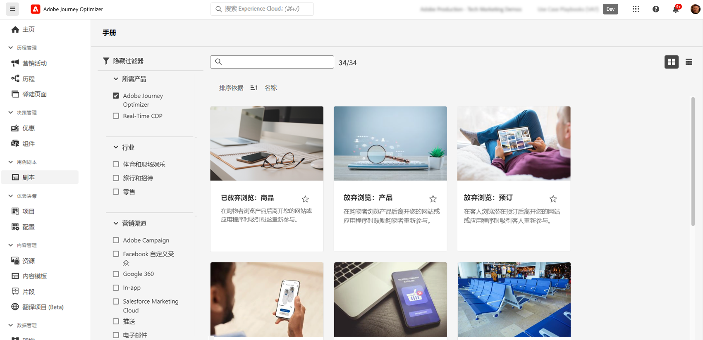

# AI 和智能功能 {#ai-features}

Adobe Journey Optimizer利用人工智能和机器学习的强大功能，帮助您创建、优化和提供卓越的客户体验。 从生成个性化内容到预测最佳发送时间，AI功能可简化您的工作流并最大化影响。 用例行动手册提供预建模板以快速实施常见营销方案。

## AI 助手 {#ai-assistant}

AI助手是您对Adobe Journey Optimizer的对话指南。 使用它可即时获得有关产品功能的答案、有关您历程的操作见解并帮助导航平台。

### 访问 AI 助手

单击顶部栏中的AI助手图标，打开屏幕右侧的助手面板。

>[!IMPORTANT]
>
>在使用AI助手之前，您必须同意[Adobe Experience Cloud Generative AI用户准则](https://experienceleague.adobe.com/zh-hans/docs/experience-platform/ai-assistant/home){target="_blank"}。

### AI助手可以执行的操作

**产品知识** — 询问有关Adobe Journey Optimizer功能和概念的问题：

* “如何在Adobe Journey Optimizer中设置营销活动？”
* “如何创建要在历程中使用的自定义操作？”
* “一个沙盒中可以有多少个实时活动？”

**Operational Insights (Beta)** — 获取历程的实时信息：

* “我有多少个实时历程？”
* “给我所有计划历程的列表”
* “过去7天内创建了多少历程？”

>[!NOTE]
>
>操作分析当前仅适用于&#x200B;**历程**，可反映您当前沙盒中的数据。

### 如何使用AI助手

1. 在面板底部的文本字段中输入您的问题
2. 按Enter键提交查询
3. 查看AI生成的响应
4. 单击&#x200B;**显示源**&#x200B;以访问相关文档
5. 使用向上/向下缩略图对响应质量进行评级

{width="40%" align="left"}

[详细了解Experience Platform中的AI助手](https://experienceleague.adobe.com/zh-hans/docs/experience-platform/ai-assistant/home){target="_blank"}

## 用于历程优化的高级AI代理 {#ai-agents}

Adobe Journey Optimizer在AI Assistant的对话功能的基础上，提供专业的AI代理，这些代理为旅程优化和试验提供深入分析和切实可行的建议。

### Journey Agent {#journey-agent}

Journey Agent包含两种AI助手技能：分析和创建。 使用它们可优化现有历程或从自然语言提示构建新历程。

+++**所需的权限**

* **查看历程** — 直接在AI助手中查看历程见解
* **管理历程** — 直接在AI助手中创建新旅程
* **查看区段** — 查看受众分析并搜索现有受众
* **管理区段** — 直接在AI助手中创建新受众
* **查看历程事件、数据源和操作** — 创建技能要求搜索历程事件和自定义操作

+++

#### 历程分析技能 {#journey-analyze-skill}

[历程分析代理](https://experienceleague.adobe.com/en/docs/experience-cloud-ai/experience-cloud-ai/agents/ajo-agent#journey-create-agent-skill-overview-and-user-guide){target="_blank"}可帮助您通过自然语言分析优化旅程性能：

+++**关键功能**

* **历程流失分析** — 识别客户在旅程中的流失位置和原因，检测脱离模式
* **受众重叠检测** — 分析多个历程中的受众重叠，以防止疲劳过度定位
* **计划冲突检测** — 识别针对同一受众的计划历程之间的时间冲突
* **运营分析** — 获取基于提示的分析，如“向我显示所有实时历程”或“超过X个历程中使用了哪些受众”

+++

+++**示例提示**

* “对旅程执行流失分析\[历程名称\]”
* “历程\[历程名称\]是否存在任何计划冲突？”
* “向我显示历程\[受众名称\]的历程重叠冲突”
* “超过5个历程中使用了哪些受众？”

+++

#### 历程创建技能 {#journey-create-skill}

[历程创建代理](https://experienceleague.adobe.com/en/docs/experience-cloud-ai/experience-cloud-ai/agents/ajo-agent#journey-analyze-agent-skill-overview-and-user-guide){target="_blank"}可帮助您从自然语言提示构建历程，将您的目标转换为结构化历程配置：

+++**关键功能**

* **自然语言历程创建** — 描述您所需的历程并自动创建它
* **基于事件和基于受众的开始** — 创建事件触发、基于受众、业务事件或受众资格历程
* **条件逻辑** — 根据客户属性或行为生成拆分路径
* **多渠道消息传递** — 添加电子邮件、推送和短信操作
* **计划** — 配置开始日期和步骤之间的计时

+++

+++**示例提示**

* “创建一个历程，该历程从客户在线购买产品并发送感谢推送通知时开始。”
* “在两周内发送三封电子邮件，从12月20日开始，构建一个以我的每日徒步旅行者受众为目标的历程。”
* “创建一个历程，该历程在用户进入我的商店位置时开始，并根据他们是否有有效的电子邮件地址进行跟踪。”

+++

### Experimentation Agent {#experimentation-agent}

[Experimentation Agent](https://experienceleague.adobe.com/zh-hans/docs/experience-cloud-ai/experience-cloud-ai/agents/agent-experiment){target="_blank"}可使您跨网站、电子邮件、推送消息和应用程序运行和管理数字实验的方式现代化：

+++**关键功能**

* **性能分析** — 清楚地了解实验中发生的情况
* **分析生成** — 说明结果出现的原因
* **机会发现** — 有关后续操作的指导
* **内容分析** — 检查消息元素，了解为什么某些处理优于其他处理
* **推荐生成** — 根据见解提出新的处理或调整建议

+++

+++**示例提示**

* “哪些实验正在运行\[Campaign Name\]？”
* “对于我的\[实验名称\]，采用什么治疗方法？”
* “我们从\[实验名称\]中学到了什么？”
* “你建议我在做这个实验之后做什么？”
* “从最近的测试中出现了哪些常见模式？”

+++

+++**所需的权限**

* **查看实验** — 在AI助手中查看实验见解
* **管理试验元数据** — 在AI助手中创建新试验

**注意：**&#x200B;可用于Journey Optimizer Experimentation Accelerator许可证。

+++

### 其他AI代理

**Audience Agent** — 用于跨Adobe Experience Platform进行对话式受众探索和管理，包括重复检测和大小跟踪。 [了解有关Audience Agent的更多信息](https://experienceleague.adobe.com/zh-hans/docs/experience-cloud-ai/experience-cloud-ai/agents/audience){target="_blank"}

**Agent Orchestrator** — 协调多个专业代理以解决复杂的多步营销挑战。 Orchestrator会自动确定要涉及的代理并对其进行有效的排序。 [了解有关Agent Orchestrator的更多信息](https://experienceleague.adobe.com/zh-hans/docs/experience-cloud-ai/experience-cloud-ai/agents/agent-orchestrator){target="_blank"}

## AI支持的内容生成 {#content-generation}

使用创作AI跨多个渠道创建和个性化内容，在保持品牌一致性的同时加快内容创建过程。 用于内容生成的AI助手可用于[电子邮件](../email/get-started-email.md)、[推送通知](../push/get-started-push.md)、[短信](../mobile/get-started-mobile.md)和[Web](../web/get-started-web.md)体验 — 帮助您生成主题行、正文文本、图像和完整的消息变体。

### 主要功能

* **生成完整内容** — 在一个流程中生成电子邮件、Web、登陆页和推送的完整内容体验（文本和图像）。 [使用AI助手生成完整内容](../content-management/generative-full-content.md)
* **文本生成** — 根据您的品牌语调和目标创建引人注目的副本。 [使用AI生成文本](../content-management/generative-text.md)
* **图像生成** — 使用Adobe Firefly生成自定义图像。 [使用AI生成图像](../content-management/generative-image.md)
* **内容变量** — 为A/B测试生成多个变量。 [使用AI的内容试验](../content-management/generative-experimentation.md)
* **Personalization** — 从Personalization编辑器或Email Designer工具栏（**添加表达式**）生成新表达式、解释现有代码或修复AI助手的问题。 用于Personalization表达式的[AI助手](../content-management/generative-personalization-expressions.md)
* **品牌一致性** — 确保生成的内容符合您的品牌准则。 [评估品牌一致性](../content-management/brands-score.md)
* **模板支持** — 利用您现有的电子邮件模板。 [使用内容模板](../content-management/content-templates.md)

### 最佳实践

* **具体化** — 提供清晰、详细的提示，以获得更好的结果。 [了解提示最佳实践](../content-management/ai-assistant-prompting-guide.md)
* **上传品牌资产** — 使用PDF、图像或ZIP文件（最大50MB）来保持品牌一致性
* **使用自定义模板** — 使用最多8到10个图像的品牌特定模板
* **提供反馈** — 为输出评级，以帮助改进AI模型
* **审阅所有内容** — 始终在发布前审阅人工智能生成的内容是否准确

[了解有关AI内容生成的更多信息](../content-management/gs-generative.md)

## 发送时间优化 {#send-time-optimization}

使用人工智能根据单个客户行为模式预测发送每条消息的最佳时间，最大化参与度。

### 工作原理

发送时间优化可分析历史参与数据（打开数和点击数），以预测每个客户何时最有可能与您的消息互动。 系统会自动在指定的时间范围内计划交货。

### 何时使用

| 最适合 | 不建议用于 |
|----------|---------------------|
| 营销活动和新闻稿 | 对时间敏感的运营消息（订单确认、密码重置） |
| 促销消息 | 紧急通知（航班延误、紧急警报） |
| 教育内容 | 具有特定时间要求的基于事件的消息 |
| 参与活动 | |

[了解更多关于发送时间优化的信息](../building-journeys/send-time-optimization.md)

## 用于决策的AI模型 {#ai-decisioning}

创建智能排名模型，以自动优化要向每位客户显示的选件，从而最大限度地实现业务目标。

### 模型类型

**自动优化** — 从客户交互中学习，以便随着时间的推移自动提高优惠性能

**个性化优化** — 使用客户配置文件属性和行为来预测每个人的最佳优惠

### 要求

* 至少2个具有足够交互数据的选件：
   * 100多个显示事件
   * 5次以上点击事件
   * 过去14天内
* 每个组织最多5个AI排名模型

[了解有关用于决策的AI模型的更多信息](../experience-decisioning/ranking/ai-models.md) | [创建AI排名模型](../experience-decisioning/ranking/create-ai-models.md)

## AI支持的规则和公式优化 {#decisioning-optimization}

Adobe Journey Optimizer可以自动分析以PQL语法表示的[决策规则](../experience-decisioning/rules.md)和[排名公式](../experience-decisioning/ranking/ranking-formulas.md)，并建议保留原始逻辑的简化。 发现简化后，规则或公式旁边会显示一个红色的&#x200B;**[!UICONTROL Optimize]**&#x200B;指示符，该指示符将打开原始表达式与AI建议的表达式的并排比较，并通过可下载的分析来验证两者行为是否相同。

### 关键功能

* **保留逻辑的简化** - AI建议使用较短的表达式，在模拟的配置文件上返回相同的结果。
* **验证报告** — 下载分析(TSV)，该分析显示应用更改之前，每个模拟配置文件是如何针对两个版本进行评估的。
* **一键应用** — 直接从&#x200B;**[!UICONTROL 优化]**&#x200B;窗口将原始PQL替换为优化版本。

### 资格

只将PQL表达式大于&#x200B;**2 KB** （UTF-8编码）的规则和排名公式作为分析目标，不分析较小的表达式。

### 权限

此功能使用与&#x200B;**AI助手**&#x200B;相同的生成AI访问控制。 必须向用户授予对&#x200B;**[!UICONTROL AI助手]**&#x200B;资源的&#x200B;**[!UICONTROL 生成内容]**&#x200B;权限。 [了解有关AI助手访问权限的更多信息](../content-management/gs-generative.md#generative-access)

[优化决策规则](../experience-decisioning/rules.md#optimize) | [优化排名公式](../experience-decisioning/ranking/ranking-formulas.md#optimize)

## 使用 AI 进行内容试验 {#experimentation}

**实验加速器**&#x200B;可帮助您使用人工智能驱动的见解和推荐更快地运行实验，更快地识别入选内容变体。

主要功能：

* 自动生成多个内容变体
* 接收试验设计的人工智能推荐
* 获取绩效趋势的早期指标
* 加快统计显着性的实现

[了解有关Experiment Accelerator的更多信息](../content-management/experiment-accelerator-gs.md)

## 用例行动手册 {#playbooks}

用例行动手册是帮助您快速实施常见营销方案的预建工作流。 每个行动手册都包括现成的历程、消息、架构和区段。

### 行动手册的工作原理

1. **浏览**&#x200B;行动手册库以查找与您的目标匹配的用例
2. **启用**&#x200B;行动手册以自动生成所有必需的资源
3. **自定义**&#x200B;生成的资产，以符合您的品牌和要求
4. 在开发沙盒中将&#x200B;**部署**&#x200B;到生产或测试

### 可用的行动手册

浏览Journey Optimizer行动手册以了解常见方案，例如：

* 放弃的购物车恢复
* 面向新客户的欢迎系列
* 购买后参与
* 生日消息
* 重新参与活动

+++**先决条件**

* 具有适当权限的沙盒
* 电子邮件、推送和/或短信的渠道配置
* 创建历程和消息的用户权限

+++

[查看所有可用的行动手册](https://experienceleague.adobe.com/docs/experience-platform/use-case-playbooks/playbooks/playbooks-list.html?lang=zh-Hans){target="_blank"} | [请参阅Experience Platform文档以了解详情](https://experienceleague.adobe.com/docs/experience-platform/use-case-playbooks/playbooks/overview.html){target="_blank"}

## 其他AI功能 {#additional-capabilities}

### 图像到 HTML 转换器

使用AI支持的转换技术，将静态图像设计(JPEG、PNG)转换为可编辑的HTML电子邮件模板。

[在HTML中了解有关图像的更多信息](../content-management/image-to-html.md)

### GenStudio性能营销

与Adobe GenStudio for Performance Marketing集成以创建支持AI的电子邮件内容并将模板导入Journey Optimizer以进行编排。 将Journey Optimizer模板导出到GenStudio，使用AI生成变体，并将其带回以进行部署。 （可用性有限，仅限电子邮件渠道。）

[了解有关GenStudio的更多信息](../integrations/genstudio.md)

### 品牌一致性评分

使用AI支持的评分（衡量语调、语音和消息传送的一致性）评估内容与品牌准则的匹配程度。

[了解有关品牌协调的更多信息](../content-management/brands-score.md)

## 常见问题 {#faq}

+++**我需要什么权限才能使用AI功能？**

* 用于生成内容的&#x200B;**[AI助手](#content-generation)** — 需要“生成内容”权限
* **[AI助手](#ai-assistant)**&#x200B;产品知识 — 需要与Adobe创作AI用户指南达成一致
* **[历程分析代理](#journey-agent)** — 需要查看/管理历程和查看/管理区段权限
* **[历程创建代理](#journey-create-agent)** — 需要管理历程、查看历程事件/数据源/操作、查看区段和管理区段权限
* **[Experimentation Agent](#experimentation-agent)** — 需要查看试验和管理试验元数据权限

所有AI代理都需要访问AI助手并同意Adobe Experience Cloud创新型人工智能用户准则。

[了解有关权限的更多信息](../administration/ootb-permissions.md)

+++

+++**AI 生成的内容是否始终准确？**

不是。 始终审阅[AI生成的内容](#content-generation)的准确性和品牌适当性。 使用反馈工具（拇指朝上/朝下）帮助改进模型。

+++

+++**主要限制是什么？**

* **[发送时间优化](#send-time-optimization)** — 仅适用于历程中的电子邮件和推送；需要30天的培训期
* **[AI内容生成](#content-generation)** — 不适用于直邮、内容卡、LINE或WhatsApp
* **[AI排名模型](#ai-decisioning)** — 每个组织最多5个模型；需要最少的交互数据

+++

+++**如何访问这些功能？**

大多数AI功能都包含在Adobe Journey Optimizer中。 某些功能（如[发送时间优化](#send-time-optimization)或[AI代理](#ai-agents)）可能需要Adobe启用。 请联系您的Adobe代表，了解有关您的特定许可证和可用功能的详细信息。

+++

>[!MORELIKETHIS]
>
>* [什么是Journey Optimizer？](get-started.md)  — 主要功能、用例和架构概述。
>* [了解它的工作方式](understanding-ajo.md) — Journey Optimizer和Experience Platform如何协同工作。
>* [AI内容生成](../content-management/gs-generative.md) — 使用AI助手生成电子邮件、推送、短信和Web内容。
>* [发送时间优化](../building-journeys/send-time-optimization.md) — 预测和优化每个人的邮件投放时间。
>* [用于决策的AI模型](../experience-decisioning/ranking/ai-models.md) — 使用AI排名模型自动对优惠进行排名和个性化。
