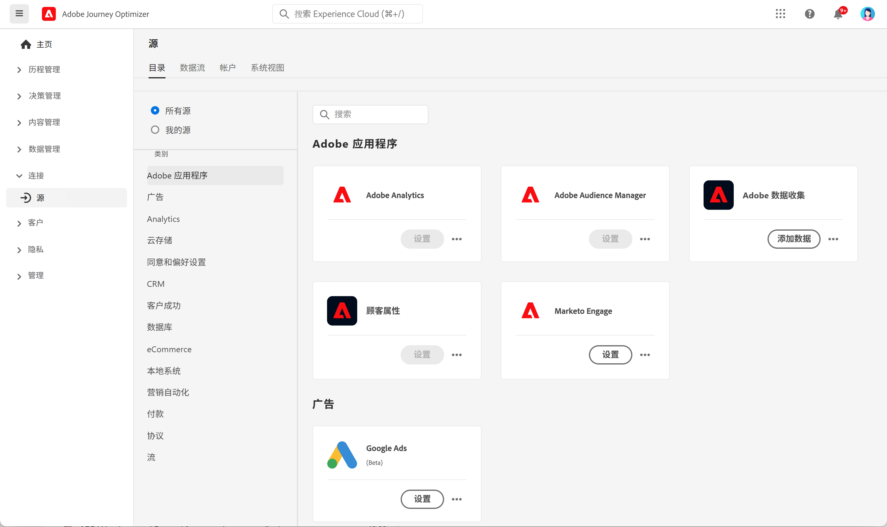

# 源连接器快速入门 {#sources-gs}

## 什么是源？ {#what-is-source}

**源**&#x200B;是将外部数据接入 Adobe Journey Optimizer 的连接器。 通过源，您可以从现有系统（如 CRM 平台、云存储或数据库）导入客户信息，并将这些数据用于创建个性化的客户历程。

请将源视为 Journey Optimizer 与外部数据系统之间的桥梁。 它们会自动同步数据，以便您始终拥有最新的客户信息来支持您的营销活动。

## 源为何重要 {#why-sources-matter}

源对于在 Journey Optimizer 中创建个性化、数据驱动型客户体验至关重要。 原因如下：

* **统一客户视图** - 整合多系统数据，全面掌握每个客户的完整画像
* **实时个性化** - 运用实时数据，在历程中及时传递相关消息
* **自动化数据同步** - 无需手动导入，即可保持客户信息的最新状态
* **高效工作流** - 一次连接，数据即可自动流入历程

例如，您可通过源导入电子商务平台的购买历史记录，随后创建根据客户购买历史发送个性化产品推荐的历程。

## 您可以使用源做什么 {#sources-use-cases}

Journey Optimizer 中源的常见用例包括：

* **从 CRM 系统导入客户数据** - 同步来自 Salesforce 或 Microsoft Dynamics 等平台的联系人信息、偏好设置及互动历史记录
* **连接购买数据** - 从电商平台获取订单历史与产品偏好，用于个性化产品建议
* **集成忠诚度计划数据** - 获取积分余额与会员等级信息，以回馈互动最积极的客户
* **同步行为数据** - 导入网站互动与应用程序使用模式，触发相关历程
* **更新轮廓属性** - 通过云存储或数据库的数据保持客户轮廓的实时性

## 常见源类型 {#source-types}

Journey Optimizer 支持多种源类型，可与您的现有系统连接：

**Adobe 应用程序：**
* Adobe Analytics
* Adobe Audience Manager
* Adobe Campaign
* Adobe Commerce

**云存储：**
* Amazon S3
* Azure Blob Storage
* Google 云存储
* SFTP

**数据库：**
* Amazon Redshift
* Google BigQuery
* Microsoft SQL Server
* MySQL
* PostgreSQL

**CRM 和营销自动化：**
* Microsoft Dynamics
* Salesforce
* Salesforce Marketing Cloud

➡️ 完整列表请参阅 [Experience Platform 源目录](https://experienceleague.adobe.com/docs/experience-platform/sources/home.html?lang=zh-Hans#sources-catalog){target="_blank"}

## 开始之前 {#prerequisites}

在配置源之前，请确保您具有：

* **适当的权限** - 在 Adobe Experience Platform 中管理源的访问权限
* **源系统凭据** - 用于连接外部系统的身份验证信息
* **了解您的数据** - 明确所需数据字段及其在 Journey Optimizer 轮廓中的映射关系

➡️了解[访问控制和权限](../administration/permissions.md)

## 源的工作方式 {#how-sources-work}

Adobe Journey Optimizer 使用 Adobe Experience Platform 中的源框架。 基本工作流程如下：

1. **连接** - 设置外部数据系统的身份验证
2. **选择数据** - 选择需导入的数据内容及同步频率
3. **字段映射** - 定义外部数据字段与 Journey Optimizer 轮廓属性的对应关系
4. **计划** - 设置自动数据更新间隔
5. **监控** - 跟踪数据流状态并解决同步问题

配置完毕后，源将在后台自动运行，确保您的客户数据实时更新，随时可在历程中使用。

>[!NOTE]
>
>**编排的营销活动的数据摄取** – 对于与编排的营销活动一起使用的基于文件的变更数据捕获源，`_change_request_type` 字段是必需的。 支持的值为 `u`（更新插入）或 `d`（删除）。 这些值必须为小写的 `u` 和 `d`，而不是大写的 `U` 和 `D`。 [详细了解编排的营销活动护栏和限制](../orchestrated/guardrails.md)

## 了解详情 {#learn-more}

观看此视频，了解源连接器及其在 Journey Optimizer 中的配置方法：

>[!VIDEO](https://video.tv.adobe.com/v/335919?quality=12)

有关配置和管理源的详细信息，请参阅 [Adobe Experience Platform 源文档](https://experienceleague.adobe.com/docs/experience-platform/sources/home.html?lang=zh-Hans){target="_blank"}。

## 后续步骤 {#next-steps}

现在您已了解源的概念及其重要性：

* 请浏览[源目录](https://experienceleague.adobe.com/docs/experience-platform/sources/home.html?lang=zh-Hans#sources-catalog){target="_blank"}查找适合您系统的连接器
* 学习如何 [创建源连接](https://experienceleague.adobe.com/docs/experience-platform/sources/ui-tutorials/create/overview.html?lang=zh-Hans){target="_blank"}
* 了解[数据映射与转换](https://experienceleague.adobe.com/docs/experience-platform/sources/ui-tutorials/dataflow/overview.html?lang=zh-Hans){target="_blank"}
* 了解如何[在历程中使用导入的数据](../building-journeys/journey-gs.md)
* 查看[数据管理快速入门](../data/gs-data.md)概述，了解各种源是如何融入 Journey Optimizer 的完整数据设置中的
