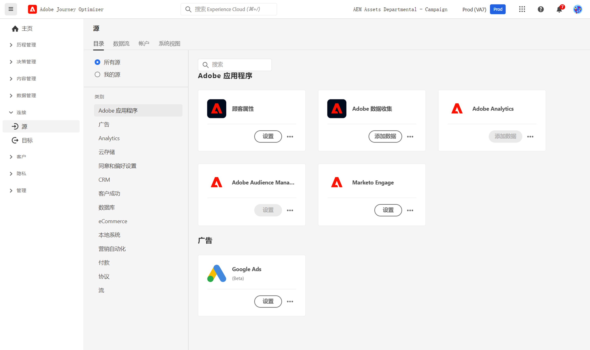

# 源连接器入门 {#sources-gs}

Adobe Journey Optimzer 允许从外部源摄取数据，同时让您能够使用 Platform 服务来构建、标记和增强传入数据。您可以从各种源中摄取数据，如 Adobe 应用程序、基于云的存储、数据库和许多其他源。

在此视频中了解源连接器以及如何在 Journey Optimizer 中进行配置：

>[!VIDEO](https://video.tv.adobe.com/v/335919?quality=12)

了解有关如何使用源连接器从外部源摄取数据的更多信息，请参阅 [Adobe Experience Platform 文档](https://experienceleague.adobe.com/docs/experience-platform/sources/home.html?lang=zh-Hans){target="_blank"}。
