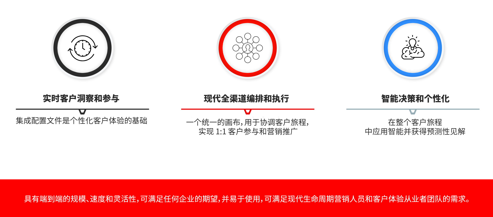

# Journey Optimizer 入门 {#cjm-gs}

>[!CONTEXTUALHELP]
>id="test_id"
>title="某些测试内容"
>abstract="为将情境帮助集成到 AJO 中的测试内容。"

## 什么是 [!DNL Adobe Journey Optimizer]？{#about-cjm}

[!DNL Adobe Journey Optimizer] 帮助企业为其客户提供互联、情境式和个性化的体验。客户历程是客户与品牌互动的整个过程，从接触的第一刻起直到客户离开。这个过程从认知阶段开始，在这个阶段，客户了解到品牌并开始接触品牌。然后，客户将进一步与品牌互动，访问在线和实体商店，并进行购买、发送消息或发布评论。

[!DNL Adobe Journey Optimizer] 原生构建于 [!DNL Adobe Experience Platform] 之上并将统一的实时客户档案、API 优先的开放框架、集中式 Offer Decisioning、人工智能 (AI) 和机器学习 (ML) 整合在一起，以便进行个性化和优化。Journey Optimizer 使品牌厂商能够在整个客户历程中以智能化的方式决定下一项最合适的互动，而且可以在规模化程度上快速灵活地完成这一工作。借助 [!DNL Adobe Journey Optimizer]，公司可以在同一应用程序中创建并投放计划的营销活动（如零售商店的每周促销活动）和量身定制的个人通信（如忠诚度应用程序向客户推送其可能查看过的、之前无现货的商品）。

➡️ [探索 Journey Optimizer](https://experienceleague.adobe.com/docs/journey-optimizer-learn/tutorials/introduction-to-journey-optimizer/introduction.html?lang=zh-Hans){target=&quot;_blank&quot;}（视频）

## 用例 {#use-cases}

* 营销人员可以使用 [!DNL Adobe Journey Optimizer] 发送个性化通信内容和基于受众的批量通信内容。例如，服装店通常会向上周购买过产品的所有客户发送购买后调查。由于天气恶劣，少数货物的交付出现延误。服装店知道哪些客户尚未收到他们的货物，就可以将这些客户排除在计划的客户满意度调查之外，并另外发送一封个性化电子邮件，为延迟道歉并根据客户过去的购买情况提供折扣代码和产品推荐。

   营销人员还可以使用该应用程序发送基于行为的实时通信内容。例如，同一零售商可以通过向客户发送一条符合其尺码的毛衣有现货的推送通知，来实时吸引那些进入商店停车场的忠实客户。

* 参与客户体验的非营销人员（如运营团队和客户支持人员）可以使用 [!DNL Adobe Journey Optimizer] 管理各种任务，如运营通知，甚至可以监控入门流程。 以一个游乐园为例，乐园访客可以下载移动应用程序作为其乐园体验的一部分。维护人员可以使用 [!DNL Adobe Journey Optimizer] 将游乐设施目前因维修而关闭的情况通知给园内游客。

## 主要功能 {#key-capabilities}

[!DNL Adobe Journey Optimizer] 是一款灵活的、可扩展的应用程序，能够创建并提供贴心且及时的个性化客户体验，可用于任意应用程序、设备或渠道中。

主要功能包括：

* **实时客户洞察和参与** - 集成的用户档案可与来自客户接触点中的所有源头的数据（包括行为、交易、财务和运营数据）相融合，以优化客户当时的个人和情境体验。

* **现代化的全渠道编排和执行** - 在单个画布上协调和优化客户历程以实现一对一客户参与和营销推广，帮助品牌厂商在整个客户生命周期中提供更多价值。&amp; 在 [!DNL Adobe Journey Optimizer] 中设计的客户历程可以是动态的、基于事件的，以帮助品牌厂商对实时信号做出反应，并将这些交互与计划的活动联系起来，从而就向客户发送的通信内容、发送时间以及发送渠道做出正确的决策。

* **智能化决策和个性化** - 品牌厂商可以应用集中化的决策，并采用人工智能和机器学习技术来对客户体验的整个过程进行预测性分析，从而更轻松地实现决策的自动化和大规模的体验优化。Offer Decisioning 支持通过 [!DNL Adobe Journey Optimizer] 对跨渠道的优惠进行规模化的集中管理。

## 架构 {#architecture}

了解 [!DNL Adobe Journey Optimizer] 的基本架构、集成点以及 [!DNL Journey Optimizer] 与其他 Adobe 应用程序的关系。

>[!VIDEO](https://video.tv.adobe.com/v/334205?quality=12)

>[!NOTE]
>
> Adobe Experience Cloud 一般隐私准则和程序适用于 [!DNL Journey Optimizer]。[进一步了解 Adobe Experience Cloud 隐私](https://www.adobe.com/cn/privacy/experience-cloud.html)。
> 在开始之前，您还需要了解](https://experienceleague.adobe.com/docs/experience-platform/profile/guardrails.html?lang=zh-Hans)针对 Real-time Customer Profile 数据的防护。[

**另请参阅**

* [开始使用的关键步骤](quick-start.md)
* [创建您的第一条消息](../messages/get-started-content.md)
* [设计历程并发送消息](../building-journeys/journey-gs.md)
* [实时报告](../reports/live-report.md)
* [Journey Optimizer 常见问题解答](assets/do-not-localize/AJO-FAQ.pdf) (PDF)
* [Journey Optimizer 安全概述](https://www.adobe.com/content/dam/cc/en/security/pdfs/AJO_SecurityOverview.pdf) (PDF)
