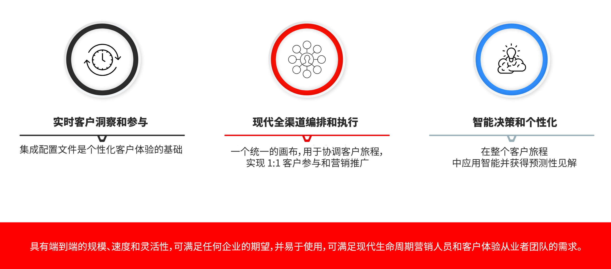

# Journey Optimizer 入门 {#ajo-gs}

>[!BEGINSHADEBOX]

**在此页面上：**&#x200B;了解Adobe Journey Optimizer是什么、其核心功能以及具体用例，以便您可以决定它如何适应您的客户参与目标。

>[!ENDSHADEBOX]

本页介绍 Adobe Journey Optimizer：什么是 Adobe Journey Optimizer、它面向哪些用户、它的关键功能及其在 Adobe Experience Platform 架构中的定位。 这是新用户的建议起点。

## 什么是 [!DNL Adobe Journey Optimizer]？{#about-ajo}

[!DNL Adobe Journey Optimizer]是一款企业应用程序，用于跨所有渠道和接触点创建和提供互联、情境式和个性化的客户体验。 它是基于 [!DNL Adobe Experience Platform] 原生构建的，并且利用统一的实时客户轮廓、API 优先的开放式框架、集中式产品建议决策和 AI/ML 功能。 借助 Journey Optimizer，品牌商可通过单个应用程序大规模地编排计划营销活动和实时事件触发型通信。 其结果是带来有意义的品牌体验，提升客户忠诚度和存留期价值。

本指南适用于不熟悉 Journey Optimizer 的营销从业者、运营团队和管理员。

➡️ [了解 Journey Optimizer](https://experienceleague.adobe.com/docs/journey-optimizer-learn/tutorials/introduction-to-journey-optimizer/introduction.html?lang=zh-Hans){target="_blank"}（视频）

<!--
 Use [!DNL Adobe Journey Optimizer] to build multi-step customer journeys that initiate a sequence of interactions, offers, and messages across channels in real time. This approach ensures customers are engaged at the optimal moments based on their actions and relevant business signals. Learn how to build journeys in [this section](../building-journeys/journey-gs.md).

You can also create audience-based campaigns to send messages.
-->

## 主要功能 {#key-capabilities}

[!DNL Adobe Journey Optimizer] 是一款灵活的、可扩展的应用程序，能够创建并提供贴心且及时的个性化客户体验，可用于任意应用程序、设备或渠道中。

主要功能包括：

### 实时客户见解与参与度

集成的用户档案融合了来自客户接触点中所有源头的数据（包括行为、交易、财务和运营数据）相融合，以优化客户当时的个人和情境体验。 [了解用户档案和受众](../audience/get-started-profiles.md)

### 现代全渠道编排和执行

在单个画布上协调和优化客户历程以实现 1:1客户互动和营销推广，帮助品牌厂商在整个客户生命周期中实现更多价值。 在[!DNL Adobe Journey Optimizer]中设计的客户历程可以是动态的、基于事件的，以帮助品牌厂商对实时信号做出反应，并将这些交互与计划的营销活动联系起来，从而就向客户发送的通信内容、发送时间以及发送渠道做出正确的决策。 嵌入式内容创建工具（包括拖放式可视设计器、可重用模板、内容片段和个性化编辑器）允许团队直接在同一工作流中创作、个性化设置和管理每个渠道的消息。 [构建您的首个历程](../building-journeys/journey-gs.md) | [设计您的内容](../../rp_landing_pages/content-management-landing-page.md)

### 智能化决策与个性化

品牌厂商可以应用集中化的决策，并采用人工智能和机器学习技术在整个客户体验过程中配置预测性见解，从而更轻松地实现决策的自动化和大规模的体验优化。 决策功能支持通过 [!DNL Adobe Journey Optimizer] 对跨渠道的产品建议进行规模化的集中管理。 [浏览优惠决策](../offers/get-started/starting-offer-decisioning.md) | [发现 AI 功能](ai-features.md)

## 用例 {#use-cases}

这些示例说明 Journey Optimizer 的功能如何在不同的角色、行业和渠道中协同工作。

### 延迟发货恢复 {#uc-delayed-shipment}

**角色：**&#x200B;营销人员 | **核心功能：**[统一轮廓 + 受众排除](../audience/get-started-profiles.md)

一家服装店通常会向过去一周内购买过产品的所有顾客发送购买后调查问卷。 由于天气恶劣，少数货物的交付出现延误。 服装店知道哪些客户尚未收到其货物，就可以将这些客户排除在计划的客户满意度调查之外，并另外发送一封个性化电子邮件，为延迟道歉并根据客户过去的购买情况提供折扣代码和产品推荐。

[营销活动快速入门](../campaigns/get-started-with-campaigns.md)

### 实时店内参与 {#uc-instore}

**角色：**&#x200B;营销人员 | **核心功能：**[地理围栏触发 + 推送](../push/get-started-push.md)

同一零售商可以通过向客户发送一条符合其尺码且有现货的毛衣推送通知，来实时吸引那些进入商店停车场的忠实客户。

[推送通知快速入门](../push/get-started-push.md)

### 放弃购物车订单挽回 {#uc-cart}

**角色：**&#x200B;营销人员 | **核心功能：**[事件触发的多步历程](../building-journeys/journey-gs.md)

当客户将商品添加到在线购物车但未完成购买就离开时，Journey Optimizer 会实时检测事件并自动启动挽回历程。 客户会收到一封个性化电子邮件，提醒他们有哪些未完成购买的商品。 如果他们在 24 小时内未点击进入，则会发送后续推送通知 - 根据他们的浏览历史记录和忠诚度状态进行个性化定制。

[构建您的首个历程](../building-journeys/journey-gs.md)

### 流媒体服务欢迎系列 {#uc-welcome}

**角色：**&#x200B;营销人员 | **核心功能：**[事件触发的欢迎历程](../building-journeys/journey-gs.md)

当客户订阅流媒体服务时，Journey Optimizer 会检测到注册事件并立即启动多步骤欢迎历程。 客户会收到一封欢迎电子邮件，鼓励他们首次打开应用程序。 如果在 48 小时内未检测到登录活动，则会发送后续推送通知，其中包含根据用户注册期间声明的兴趣提供个性化内容建议 - 从第一天起就将被动订阅者转变为参与活跃的用户。

[构建您的首个历程](../building-journeys/journey-gs.md)

### 带说明的预订提醒 {#uc-reservation}

**角色：**&#x200B;营销人员 | **核心功能：**[计划 + 位置感知消息](../campaigns/get-started-with-campaigns.md)

一家酒店品牌会在每位客人预订时间前一小时，及时向他们发送提醒。 通知包括客人姓名、预订时间以及基于位置的达到路线 - 自动根据客户个人资料和预订数据拼合，无需营销团队手动操作。

[营销活动快速入门](../campaigns/get-started-with-campaigns.md)

### 主动服务中断通知 {#uc-outage}

**角色：**&#x200B;运营 | **核心功能：**[大规模自动受众选择](../audience/about-audiences.md)

当发生服务中断时，Journey Optimizer 会根据客户的帐户数据和使用模式自动识别受影响的客户。 这些客户会收到主动通知，确认问题并说明后续步骤 - 将潜在的负面体验转化为大规模提供的透明度和信任时刻。

[构建您的首个历程](../building-journeys/journey-gs.md)

### AI 提供支持的促销活动 {#uc-ai-campaign}

**角色：**&#x200B;营销人员 | **核心功能：**[AI 内容生成 + 试验](ai-features.md)

一个计划推出新品的零售品牌使用 Journey Optimizer 的 AI 助手在几分钟内生成多个主题行和正文变体，并遵循自然语言提示及其上传的品牌准则。 内置内容试验会自动在初始受众样本中识别表现最佳的变体。 然后，入选消息将部署到其余收件人，无需额外的撰稿工作即可最大程度地提高参与度。

[探索 AI 和智能功能](ai-features.md) | [了解内容试验](../content-management/experiment-accelerator-gs.md)

### 通过移动应用程序发送维护警报 {#uc-maintenance}

**角色：**&#x200B;运营 | **核心功能：**[非营销历程编排](../building-journeys/journey-gs.md)

非营销人员（如运营团队和客户支持人员）可以使用[!DNL Adobe Journey Optimizer]管理运营通知或监控客户加入流程。 例如，在一个游客需要下载移动应用程序作为体验一部分的游乐园中：维护人员可以使用 Journey Optimizer 通知游客哪些游乐设施因维护而暂时关闭。

[构建您的首个历程](../building-journeys/journey-gs.md)

## 可用性和授予许可 {#availability}

本文档介绍 Journey Optimizer 的当前版本，除非另有说明，否则同时适用于 B2C 和 B2B Edition 用户。 您的环境中可用的组件和功能取决于您的[权限](../administration/permissions.md)和[许可方案](https://helpx.adobe.com/cn/legal/product-descriptions/adobe-journey-optimizer.html){target="_blank"}。 如有任何问题，请联系 Adobe 客户成功经理或 Adobe 代表。

[!DNL Adobe CX Enterprise]一般隐私准则和程序适用于[!DNL Journey Optimizer]。 [了解有关 [!DNL Adobe CX Enterprise] 隐私](https://www.adobe.com/cn/privacy/experience-cloud.html){target="_blank"}的更多信息。

## 架构 {#architecture}

Journey Optimizer 是基于 Adobe Experience Platform 原生构建的，共享其数据基础、身份标识图和治理服务。如需详细了解这些系统如何协同工作，请参阅[了解 Journey Optimizer](understanding-ajo.md)。

## 相关资源 {#related-resources}

* [启动的关键步骤](quick-start.md) - 面向管理员、营销人员和数据工程师的基于角色的快速入门指南。
* [数据管理入门](../data/gs-data.md) - 了解如何在 Journey Optimizer 中摄取、统一和激活数据。
* [设计历程并发送消息](../building-journeys/journey-gs.md) - 构建您的第一个客户历程并配置渠道操作。
* [实时报告](../reports/live-report.md) - 实时监控营销活动和历程绩效。
* [Journey Optimizer 简介教程](https://experienceleague.adobe.com/zh-hans/docs/journey-optimizer-learn/tutorials/introduction-to-journey-optimizer/introduction){target="_blank"} - Journey Optimizer 核心概念的引导式视频讲解。
* [Journey Optimizer 安全概述](https://www.adobe.com/content/dam/cc/en/security/pdfs/AJO_SecurityOverview.pdf) (PDF) - 安全体系结构、数据保护和合规性详细信息。
* [Journey Optimizer 产品说明](https://helpx.adobe.com/cn/legal/product-descriptions/adobe-journey-optimizer.html){target="_blank"} - 官方许可条款和版本功能细分。
