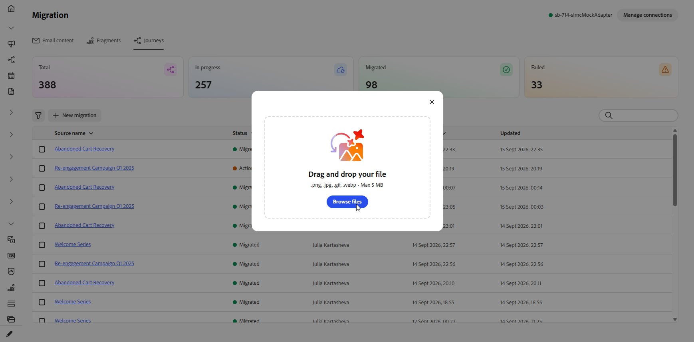
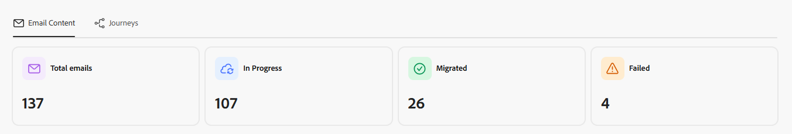

# 迁移内容和历程 {#migrate-content-and-journeys}

如果您从另一个营销平台移动到[!DNL Journey Optimizer]，则不必从空白板开始。 Journey Optimizer包括一个专用工作区，用于导入您的现有电子邮件内容和历程。 它会将它们转换为[!DNL Journey Optimizer]内容模板和历程，因此您可以从停止的位置选择重建内容，而不是从头开始重建所有内容。

要将您的内容和历程迁移到Journey Optimizer，您需要以下权限：管理营销活动、管理历程、管理消息、管理区段、管理库项目、查看和管理沙盒以及管理AJO集成配置。 [了解有关角色和权限的更多信息](../administration/permissions.md)

您可以直接从[!DNL Journey Optimizer]主页访问此工作区。

## 设置连接 {#set-up-a-connection}

>[!CONTEXTUALHELP]
>id="ajo_migration_connection_name"
>title="连接名称"
>abstract="标识源系统的描述性名称（例如“Marketing-Automation-Prod”）。 必须以字母开头，并且只包含字母数字、下划线或连字符（4-50 个字符）。"

>[!CONTEXTUALHELP]
>id="ajo_migration_base_api_url"
>title="基本API URL"
>abstract="API 的根 URL，不含资源路径或查询字符串，例如 https://api.example.com。"

>[!CONTEXTUALHELP]
>id="ajo_migration_authentication_method"
>title="选择一个身份验证方式"
>abstract="API 密钥会随每个请求发送一个凭据，而 OAuth 2.0 则使用基于令牌的协议，这更适合企业和第三方 API。"

>[!CONTEXTUALHELP]
>id="ajo_migration_client_id"
>title="客户端 ID"
>abstract="您的应用程序的公共标识符，在您通过授权服务器注册时发布。"

>[!CONTEXTUALHELP]
>id="ajo_migration_client_secret"
>title="客户端密码"
>abstract="只有您的应用程序和授权服务器才知道的机密凭据。 切勿在客户端代码中将其公开。"

>[!CONTEXTUALHELP]
>id="ajo_migration_token_url"
>title="令牌 URL"
>abstract="发布客户端凭据流的访问令牌的授权服务器端点，通常以 /oauth/token 或 /token 结尾。"

>[!NOTE]
>
>如果您上传HTML文件或屏幕截图而不是通过API导入，则不需要连接。

要通过API导入内容或历程，请首先将[!DNL Journey Optimizer]连接到您的源平台：

1. 在工作区中选择&#x200B;**[!UICONTROL 管理连接]**。

   

1. 单击&#x200B;**[!UICONTROL 新建连接]**。

   

1. 请填写以下详细信息：

   * **[!UICONTROL 连接名称]**：标识源系统的名称，如`Marketing-Automation-Prod`。 名称必须以字母开头，并且只能包含字母、数字、下划线或连字符，长度介于4到50个字符之间。
   * **[!UICONTROL 基本API URL]**：源系统API的根URL，不含任何资源路径或查询字符串，如`https://api.example.com`。
   * **[!UICONTROL 描述]**：可帮助您和其他用户识别此连接目的的可选上下文。
   * **[!UICONTROL 身份验证方法]**： [!DNL Journey Optimizer]如何对源系统进行身份验证。 选择&#x200B;**API密钥**&#x200B;以通过每个请求发送单个凭据。 选择&#x200B;**OAuth 2.0**&#x200B;以使用更适合企业和第三方API的基于令牌的协议。
   * **[!UICONTROL 客户端ID]**：向授权服务器注册应用程序时分配给该应用程序的公共标识符。 OAuth 2.0连接需要。
   * **[!UICONTROL 客户端密钥]**：与您的客户端ID关联的机密凭据。 保持私密性，因为只有您的应用程序和授权服务器才知道这一点。 OAuth 2.0连接需要。
   * **[!UICONTROL 令牌URL]**：为客户端凭据流颁发访问令牌的授权服务器终结点，通常以`/oauth/token`或`/token`结尾。 OAuth 2.0连接需要。

     

1. 选择&#x200B;**[!UICONTROL 创建]**。

1. 设置连接后，使用高级菜单将其删除，或将其标记为默认值，以便在下次导入内容或历程时预先选择该连接。

   

## 导入电子邮件内容 {#import-email-content}

当您拥有内容的源（HTML文件或与源平台的连接）后，请将其导入工作区以将其转换为[!DNL Journey Optimizer]内容模板。

1. 从&#x200B;**[!UICONTROL 电子邮件内容]**&#x200B;选项卡，选择导入电子邮件内容的方式：

   * **[!UICONTROL 上传HTML]**：从您的计算机中选择一个或多个HTML电子邮件文件。

   * **[!UICONTROL 从连接浏览]**：直接从连接的营销平台浏览和选择电子邮件，而无需手动导出和上传文件。

   

1. 要上传HTML，请浏览您的文件或将其拖放到上传区域。 完成后单击&#x200B;**[!UICONTROL 上传]**。

   文件必须采用`.html`或`.htm`格式，并且不能大于10 MB。

   电子邮件内容的

1. 对于从连接导入，请从“电子邮件”列表中选择，然后单击&#x200B;**[!UICONTROL 导入]**。

1. 访问导入的电子邮件并查看导入的HTML。

1. 添加您的&#x200B;**[!UICONTROL 主题行]**，并将每个个性化占位符映射到相应的配置文件属性。

   工作区会自动将源脚本语法转换为Handlebars语法。 有关支持的运算符列表，请参阅[运算符](https://experienceleague.adobe.com/zh-hans/docs/journey-optimizer/using/content-management/personalization/functions/operators)。

   

1. 选择一个文件夹以将电子邮件的图像上传到[!DNL Experience Manager Assets]，然后单击&#x200B;**[!UICONTROL 上传资产]**。

   

1. 电子邮件准备就绪后，选择&#x200B;**[!UICONTROL 迁移]**，然后选择&#x200B;**在[!DNL Journey Optimizer]**&#x200B;中查看以打开新的内容模板。

   已完成电子邮件的

您的内容模板现在可在[!DNL Journey Optimizer]中使用，并可在您的历程中使用。

➡️ [了解有关内容模板的更多信息](../content-management/use-content-templates.md)

## 导入历程 {#import-journeys}

通过导入历程流的屏幕快照或连接到源平台来重新创建历程。

1. 从&#x200B;**[!UICONTROL 历程]**&#x200B;选项卡中，选择您希望导入旅程的方式：

   * **[!UICONTROL 上传屏幕截图]**：从您的计算机中选择一个或多个历程屏幕截图。

   * **[!UICONTROL 从连接浏览]**：直接从连接的营销平台浏览并选择历程，而无需手动导出和上传屏幕截图。

   

1. 要上传HTML，请浏览您的文件或将其拖放到上传区域。 完成后单击&#x200B;**[!UICONTROL 上传]**。

   文件必须采用.png、.jpg、.gif、.webp格式且不得大于5 MB。

   

1. 对于从连接导入，请从历程列表中选择，然后单击&#x200B;**[!UICONTROL 导入]**。

1. 预览工作区从您的源生成的历程。

1. 从&#x200B;**[!UICONTROL 操作项]**&#x200B;窗格中，根据每个项所属的活动类型解析该项：

   * 对于每个消息步骤，选择渠道配置和内容模板。
   * 为每个&#x200B;**[!UICONTROL 受众]**&#x200B;活动选择受众。

1. 选择&#x200B;**[!UICONTROL 应用更改]**，然后选择&#x200B;**在[!DNL Journey Optimizer]**&#x200B;中查看以打开历程画布。

   

您的历程现在位于[!DNL Journey Optimizer]中，您可以在其中查看画布、做出任何最终调整并在准备好上线时激活它。

➡️ [了解有关历程创建的更多信息](../building-journeys/journey-gs.md)

## 跟踪迁移 {#track-migration-progress}

工作区概述可帮助您跟踪您导入的每封电子邮件，并快速找到仍在等待操作的电子邮件。 每个导入的电子邮件都会显示需要审阅、迁移或失败的状态，因此您可以一眼就看到它的位置。 屏幕顶部的一组KPI为您提供了每种状态的项目一目了然计数：

* **电子邮件总数** （或&#x200B;**历程总数**）：导入到工作区中的项目总数。
* **进行中**：迁移之前仍在审核或映射的项。
* **已迁移**：已成功转换并且在[!DNL Journey Optimizer]中可用的项目。
* **失败**：无法迁移需要注意的项目。

通过一组过滤器，您可以缩小导入电子邮件内容的列表，以便能够专注于特定子集，而不是滚动浏览每个项目。 组合以下一个或多个筛选器以查找您要查找的内容：

* **[!UICONTROL 状态]**：仅显示具有特定状态的电子邮件，如&#x200B;**[!UICONTROL 需要审阅]**、**[!UICONTROL 已迁移]**&#x200B;或&#x200B;**[!UICONTROL 失败]**。
* **[!UICONTROL 已创建]**：显示在特定日期范围内导入的电子邮件。
* **[!UICONTROL 已更新]**：显示特定日期范围内上次修改的电子邮件。

