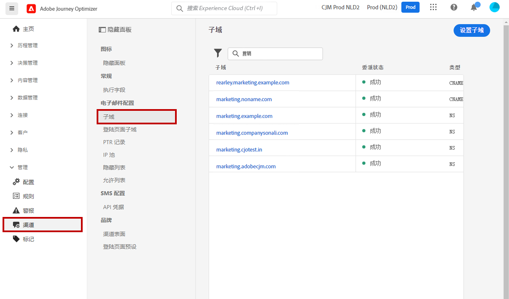
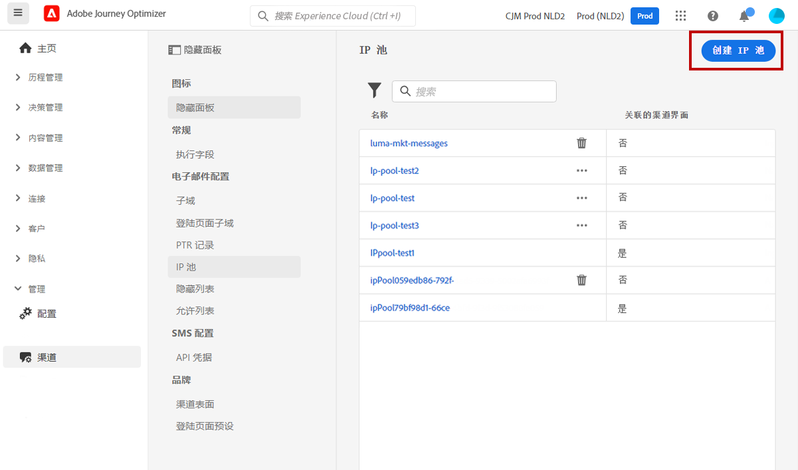

# 系统管理员入门指南 {#get-started-sys-admins}

在开始使用 [!DNL Adobe Journey Optimizer] 之前，需要执行多个步骤来准备环境。您必须执行这些步骤，以便[数据工程师](data-engineer.md)和[历程实践者](marketer.md)可以开始使用 [!DNL Adobe Journey Optimizer]。

作为&#x200B;**系统管理员**，您需要&#x200B;**了解产品配置文件并为沙盒管理和渠道配置分配权限**。您还需要设置沙盒，并为可用的产品配置文件管理这些沙盒。然后，您便能够将团队成员分配到产品配置文件中。

这些功能可以由有权访问 Admin console 的&#x200B;**[!UICONTROL 产品管理员]**&#x200B;管理。[进一步了解 Adobe Admin Console](https://helpx.adobe.com/cn/enterprise/admin-guide.html){target=&quot;_blank&quot;}。

在以下页面中了解访问管理：

1. **创建沙盒**&#x200B;以将实例分割为单独的独立虚拟环境。**沙盒**&#x200B;在 [!DNL Journey Optimizer] 中创建。在[沙盒](../../administration/sandboxes.md)部分了解详情。

   >[!NOTE]
   >作为&#x200B;**系统管理员**，如果在 [!DNL Journey Optimizer] 中看不到&#x200B;**[!UICONTROL 沙盒]**&#x200B;菜单，请在 [Admin Console](https://adminconsole.adobe.com/){target=&quot;_blank&quot;} 中更新您的权限。在[本页](../../administration/permissions.md#edit-product-profile)了解如何更新产品配置文件。

1. **了解产品配置文件**。产品配置文件是一组单一的权利，允许用户访问界面中的特定功能或对象。在[开箱即用的产品配置文件](../../administration/ootb-product-profiles.md)中了解详情。

1. 为产品配置文件（包括&#x200B;**沙箱**）**设置权限**，并通过将团队成员分配给不同的产品配置文件来授予他们访问权限。此步骤在 [Admin Console](https://adminconsole.adobe.com/){target=&quot;_blank&quot;} 中执行。权限是单一的权利，可用于定义分配给&#x200B;**[!UICONTROL 产品配置文件]**&#x200B;的授权。每个权限都集中在功能（例如历程或优惠）下，代表 [!DNL Journey Optimizer] 中的不同功能或对象。在[权限级别](../../administration/high-low-permissions.md)部分了解详情。

此外，还须将需要访问 Assets Essentials 的用户添加到 **Assets Essentials Consumer Users** 或/和 **Assets Essentials Users** 产品配置文件中。[详情请参阅 Assets Essentials 文档](https://experienceleague.adobe.com/docs/experience-manager-assets-essentials/help/deploy-administer.html?lang=zh-Hans){target=&quot;_blank&quot;}。

>[!NOTE]
>对于在 2022 年 1 月 6 日之前购买的 Journey Optimizer 产品，您必须为组织部署 [!DNL Adobe Experience Manager Assets Essentials]。在[部署 Assets Essentials](https://experienceleague.adobe.com/docs/experience-manager-assets-essentials/help/deploy-administer.html?lang=zh-Hans){target=&quot;_blank&quot;} 部分了解详情。

首次访问 [!DNL Journey Optimizer] 时，系统会为您预置一个生产沙盒，并根据您的合同分配特定数量的 IP。

要创建您的历程并发送消息，请访问&#x200B;**管理**&#x200B;菜单。浏览&#x200B;**[!UICONTROL 渠道]**&#x200B;菜单以配置消息和渠道界面（即消息预设）。

>[!NOTE]
>作为&#x200B;**系统管理员**，如果在 [!DNL Journey Optimizer] 中看不到&#x200B;**[!UICONTROL 渠道]**&#x200B;菜单，请在 [Admin Console](https://adminconsole.adobe.com/){target=&quot;_blank&quot;} 中更新您的权限。在[本页](../../administration/permissions.md#edit-product-profile)了解如何更新产品配置文件。

请遵循以下步骤：

1. **配置消息和渠道**：定义界面，调整和自定义电子邮件、短信和推送消息设置

   * 在 [!DNL Adobe Experience Platform] 和 [!DNL Adobe Experience Platform Launch] 中定义&#x200B;**推送通知设置**。[了解详情](../../push/push-gs.md)

   * 创建&#x200B;**渠道界面**（即消息预设），以配置电子邮件、短信和推送通知所需的所有技术参数。[了解详情](../../configuration/channel-surfaces.md)

   * 配置&#x200B;**短信渠道**&#x200B;以配置短信所需的所有技术参数。[了解详情](../../sms/sms-configuration.md)

   * 管理在将电子邮件地址发送到禁止列表之前执行&#x200B;**重试**&#x200B;的天数。[了解详情](../../configuration/manage-suppression-list.md)

1. **委派子域**：对于要在 Journey Optimizer 中使用的任何新子域，第一步是进行委派。[了解详情](../../configuration/about-subdomain-delegation.md)

   

1. **创建 IP 池**：将为实例配置的 IP 地址组合在一起，可提高电子邮件的可投放性和信誉。[了解详情](../../configuration/ip-pools.md)

   

1. **管理禁止和允许列表**：使用禁止和允许列表提高可投放性

   * [禁止列表](../../reports/suppression-list.md)包含要从投放中排除的电子邮件地址，因为发送给这些联系人可能会损害您的发送信誉和投放率。您可以监测在历程中自动排除发送的所有电子邮件地址，例如无效地址、始终软退信的地址、可能对您的电子邮件信誉造成不利影响的地址，以及针对您的某封电子邮件发出某种垃圾邮件投诉的收件人。了解如何管理[禁止列表](../../configuration/manage-suppression-list.md)和[重试](../../configuration/retries.md)。
   

   * 借助[允许列表](../../configuration/allow-list.md)，可指定单独的电子邮件地址或域，这些地址或域将是唯一有权接收您从特定沙盒发送的电子邮件的收件人或域。这样可以防止您在测试环境中意外地向实际的客户地址发送电子邮件。了解如何[启用允许列表](../../configuration/allow-list.md)。
   在[!DNL Adobe Journey Optimizer][本页面](../../reports/deliverability.md)中了解有关可投放性管理的更多信息。
