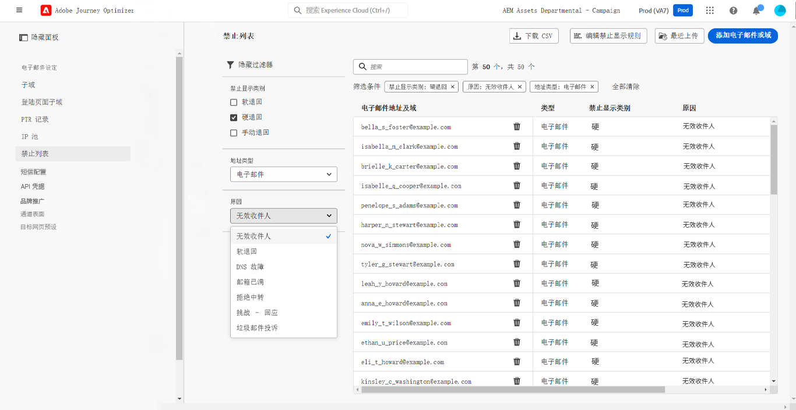

# 系统管理员入门指南 {#get-started-sys-admins}

作为&#x200B;**系统管理员**，您负责配置 Journey Optimizer 环境并管理访问权限，以确保团队能够高效、安全地开展工作。您负责执行关键的配置步骤，以便[数据工程师](data-engineer.md)、[开发人员](developer.md)和[营销人员](marketer.md)可以开始使用[!DNL Adobe Journey Optimizer]。

您的主要职责包括：设置用户组与权限、创建和管理用于为不同用户组划分数据和历程的沙盒环境，以及配置交付渠道和消息预设，以确保通过 Journey Optimizer 交付的各种消息与资产保持品牌一致性。您确保在维护安全性与合规性的同时，让合适的人员能够访问相应的功能。

这些功能可以由有权访问权限产品的&#x200B;**[!UICONTROL 产品管理员]**&#x200B;管理。[了解有关权限的更多信息](../../administration/permissions.md){target="_blank"}。

## 设置访问和权限

按照以下步骤配置访问管理：

1. **创建沙盒**&#x200B;以将实例分割为单独的独立虚拟环境。**沙盒**&#x200B;在 [!DNL Journey Optimizer] 中创建。在[沙盒](../../administration/sandboxes.md)部分了解详情。

   >[!NOTE]
   >作为&#x200B;**系统管理员**，如果 [!DNL Journey Optimizer] 中未显示&#x200B;**[!UICONTROL 沙盒]**&#x200B;菜单，则需要更新您的权限。要了解如何更新角色，请参阅[此页面](../../administration/permissions.md#edit-product-profile)。

1. **了解角色**。角色是一组单一的权利，允许用户访问界面中的特定功能或对象。请参阅[开箱即用的角色](../../administration/ootb-product-profiles.md)部分，了解更多信息。

1. 为角色&#x200B;**设置权限**（包括&#x200B;**沙盒**），并通过向团队成员分配不同的角色来向其授予访问权限。权限是单一的权利，可用于定义分配给&#x200B;**[!UICONTROL 角色]**&#x200B;的授权。每个权限都集中在功能（例如历程或产品建议）下，代表 [!DNL Journey Optimizer] 中的不同功能或对象。在[权限级别](../../administration/high-low-permissions.md)部分了解详情。

1. **使用对象级访问控制**（可选）。对历程、营销活动和渠道配置等对象应用访问标签，以控制哪些用户可以访问特定资源。了解有关[对象级访问控制 (OLAC)](../../administration/object-based-access.md) 的详细信息。

此外，还必须将需要访问 Assets Essentials 的用户添加到 **Assets Essentials Consumer Users** 或/和 **Assets Essentials Users** 角色。[请参阅 Assets Essentials 文档以了解详情](https://experienceleague.adobe.com/docs/experience-manager-assets-essentials/help/deploy-administer.html?lang=zh-Hans){target="_blank"}。

首次访问 [!DNL Journey Optimizer] 时，系统会为您设置一个生产沙盒，并根据合同分配特定数量的 IP。

## 配置渠道和消息

若要允许[营销人员](marketer.md)创建和发送消息，请访问&#x200B;**管理**&#x200B;菜单。浏览&#x200B;**[!UICONTROL 渠道]**&#x200B;菜单以配置渠道设置。

>[!NOTE]
>作为&#x200B;**系统管理员**，如果 [!DNL Journey Optimizer] 中未显示&#x200B;**[!UICONTROL 渠道]**&#x200B;菜单，请在[权限](../../administration/permissions.md){target="_blank"}产品中更新您的权限。

执行以下步骤：

1. **设置渠道配置**。定义电子邮件、短信、推送通知、Web推送、直邮和其他渠道所需的所有技术参数：

   * 在 [!DNL Adobe Experience Platform] 和 Adobe Experience Platform 数据收集功能中定义&#x200B;**推送通知设置**。[了解详情](../../push/push-gs.md)

   * 配置&#x200B;**Web推送通知**&#x200B;以将通知传送到移动浏览器和桌面浏览器。 [了解详情](../../push/push-configuration-web.md)

   * 创建&#x200B;**渠道配置**，以配置电子邮件、短信、推送、应用程序内、网站及其他渠道所需的所有技术参数。[了解详情](../../configuration/channel-surfaces.md)

   * 配置&#x200B;**短信渠道**，以设置短信所需的所有技术参数。[了解详情](../../sms/sms-configuration.md)

   * 管理在将电子邮件地址发送到禁止列表之前执行&#x200B;**重试**&#x200B;的天数。[了解详情](../../configuration/manage-suppression-list.md)

   * 在渠道配置级别启用&#x200B;**消息导出**，以便根据需要存档已发送的电子邮件和短信内容（附加产品）。 [了解详情](../../configuration/message-export.md)

1. **委派子域**：对于要在 Journey Optimizer 中使用的任何新子域，第一步是进行委派。[了解详情](../../configuration/about-subdomain-delegation.md)。如果需要，可将子域从CNAME迁移到自定义委派。 [了解详情](../../configuration/custom-subdomain-migration.md)

   

1. **创建 IP 池**：将为实例配置的 IP 地址组合在一起，可提高电子邮件的可投放性和信誉。[了解详情](../../configuration/ip-pools.md)

   

1. **管理禁止和允许列表**：使用禁止和允许列表提高可投放性

   * [禁止列表](../../reports/suppression-list.md)包含要从投放中排除的电子邮件地址，因为发送给这些联系人可能会损害您的发送信誉和投放率。您可以监测在历程中自动排除发送的所有电子邮件地址，例如无效地址、始终软退信的地址、可能对您的电子邮件信誉造成不利影响的地址，以及针对您的某封电子邮件发出某种垃圾邮件投诉的收件人。了解如何管理[禁止列表](../../configuration/manage-suppression-list.md)和[重试](../../configuration/retries.md)。

   

   * 借助[允许列表](../../configuration/allow-list.md)，可指定单独的电子邮件地址或域，这些地址或域将是唯一有权接收您从特定沙盒发送的电子邮件的收件人或域。这样可以防止您在测试环境中意外地向实际的客户地址发送电子邮件。了解如何[启用允许列表](../../configuration/allow-list.md)。

   在[!DNL Adobe Journey Optimizer][此页面](../../reports/deliverability.md)中了解有关可投放性管理的更多信息。

## 其他功能

随着组织需求的增长，请考虑以下高级功能：

* **同意策略**：如果您的组织已购买 Healthcare Shield 或 Privacy and Security Shield，可创建同意策略以尊重客户跨渠道的偏好设置。[了解详情](../../action/consent.md)

* **数据治理策略**：应用数据使用标签和策略，以控制在营销活动中如何使用数据。[了解详情](../../action/action-privacy.md)

* **IP 预热计划**：逐步增加电子邮件发送量，以在电子邮件服务提供商处建立发件人声誉。[了解详情](../../configuration/ip-warmup-gs.md)

* **安静时间**：为基于时间的排除配置规则集，当消息不应在特定时段发送时。 [了解详情](../../conflict-prioritization/quiet-hours.md)

## 跨角色协作

您的管理工作为所有团队的成功奠定了基础：

>[!BEGINTABS]

>[!TAB 支持数据工程师]

与[数据工程师](data-engineer.md)就数据管理和访问进行协作：

* 授予数据管理和架构创建的权限
* 批准用于开发和测试的沙盒访问权限
* 协调数据保留策略和治理规则
* 启用对高级功能（如联合受众合成）的访问权限

>[!TAB 启用开发人员权限]

与[开发人员](developer.md)就 API 访问和测试进行协作：

* 通过 Adobe Developer Console 提供 API 凭据
* 为开发与测试设置沙盒环境
* 批准渠道配置（推送证书、短信提供商）
* 协调测试环境和部署策略

>[!TAB 赋能营销人员]

与[营销人员](marketer.md)在权限和渠道设置上进行协作：

* 分配适当的权限以创建历程和营销活动
* 配置他们将使用的渠道（电子邮件、推送、短信等）
* 支持测试环境和审批工作流
* 启用对新特性和功能的访问权限

>[!ENDTABS]

## 后续步骤

配置环境后：

1. **验证设置**：确认所有团队成员都能访问其所需功能
2. **监视器使用情况**：使用管理功能板跟踪系统使用情况并发现问题
3. **维护权限**：随着团队角色的变动，定期审查并更新权限
