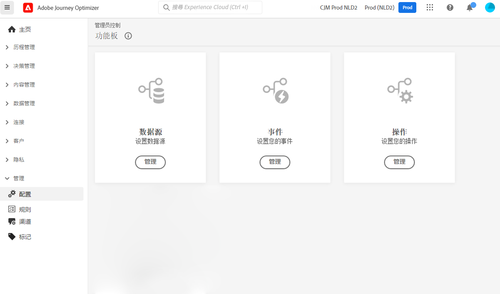

# 数据工程师入门 {#data-engineer}

作为 **Adobe Journey Optimizer 数据工程师**，需要准备和维护客户用户档案数据以支持通过 [!DNL Journey Optimizer] 编排的体验，使用架构对客户和业务数据进行建模，并为摄取数据配置源连接器。[系统管理员](administrator.md)向您授予访问权限并准备好环境后，您即可开始使用 [!DNL Adobe Journey Optimizer]。

在本页中了解如何&#x200B;**识别数据并创建架构和数据集**，以将您的数据导入 Adobe Experience Platform。

>[!NOTE]
>
>要了解有关&#x200B;**数据摄取**&#x200B;的更多信息，请参阅 [Adobe Experience Platform 文档](https://experienceleague.adobe.com/docs/experience-platform/ingestion/home.html?lang=zh-Hans){target="_blank"}。

以下各部分中详细介绍了为用户档案和测试用户档案创建身份命名空间和启用数据集的步骤：

1. **创建身份命名空间**。在 Adobe [!DNL Journey Optimizer] 中，跨设备和渠道的&#x200B;**身份**&#x200B;与用户相关联，从而会生成一个身份图。关联的身份图用于根据您所有业务接触点之间的交互对体验进行个性化。要了解有关身份和身份命名空间的更多信息，请参阅[本页](../../audience/get-started-identity.md)。

1. **创建架构**&#x200B;并为用户档案启用。架构是一组规则，用于表示和验证数据的结构和格式。在高层面上，架构提供了真实世界对象（如人）的抽象定义，并概括了该对象的每个实例中应包含哪些数据（如名字、姓氏、生日等）。要了解有关架构的更多信息，请参阅[本页](../../data/get-started-schemas.md)。

1. **创建数据集**&#x200B;并为用户档案启用。数据集是用于数据集合的存储和管理结构，通常是表格，其中包含架构（列）和字段（行）。数据集还包含描述其存储的数据的各方面特性的元数据。创建数据集后，您可以将其映射到现有架构并向其中添加数据。要了解有关数据集的更多信息，请参阅[本页](../../data/get-started-datasets.md)。

1. **配置源连接器**。Adobe Journey Optimzer 允许从外部源摄取数据，同时让您能够使用 Platform 服务来构建、标记和增强传入数据。您可以从各种源中摄取数据，如 Adobe 应用程序、基于云的存储、数据库和许多其他源。要了解有关源连接器的更多信息，请参阅[本页](../get-started-sources.md)。

1. **创建测试用户档案**。当在历程中使用[测试模式](../../building-journeys/testing-the-journey.md)时，需要测试用户档案，并在发送之前[预览和测试消息](../../email/preview.md)。[本页](../../audience/creating-test-profiles.md)中详细说明了创建测试用户档案的步骤。

此外，要在历程中发送消息，您必须配置&#x200B;**[!UICONTROL 数据源]**、**[!UICONTROL 事件]**&#x200B;和&#x200B;**[!UICONTROL 操作]**。[在此部分中](../../configuration/about-data-sources-events-actions.md)了解详情。

* **数据源**&#x200B;配置允许您定义与系统的连接，以检索将在您的历程中使用的其他信息。要了解有关数据源的更多信息，请参阅[此部分](../../datasource/about-data-sources.md)。

* **事件**&#x200B;允许您统一触发历程，向流入历程的个人实时发送消息。在事件配置中，您可以配置历程中的预期事件。传入事件的数据按照 Adobe 体验数据模型 (XDM) 进行标准化。事件来自已验证和未验证事件（如 Adobe Mobile SDK 事件）的流摄取 API。要了解有关事件的更多信息，请参阅[此部分](../../event/about-events.md)。

* [!DNL Journey Optimizer] 附带内置消息功能：您可以在历程中创建消息并设计内容。如果您使用第三方系统来发送消息，例如 Adobe Campaign，请创建&#x200B;**自定义操作**。要了解有关此中操作的更多信息，请参阅[此部分](../../action/action.md)。
