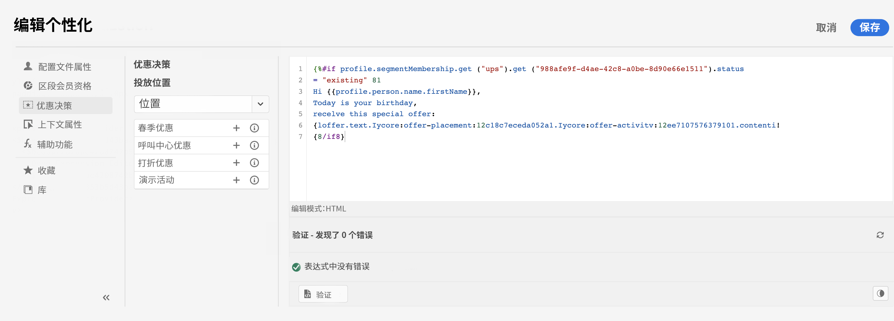
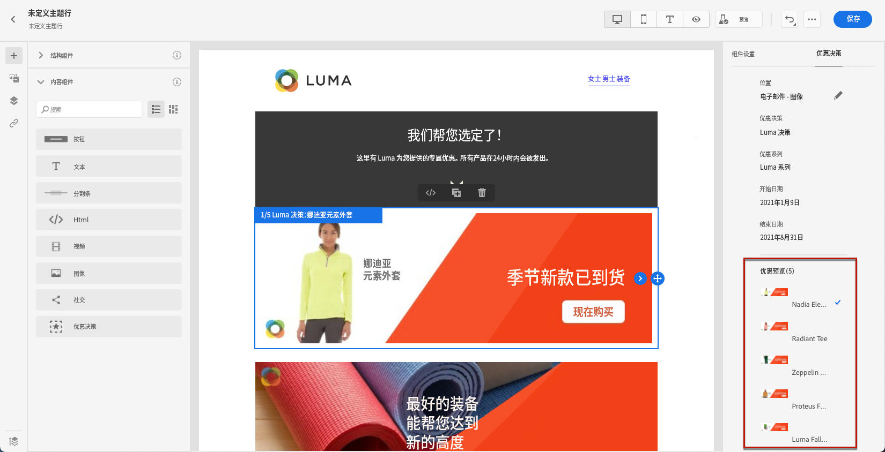
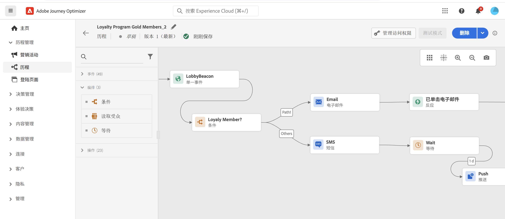

# 营销人员入门指南 {#get-started-marketers}

作为&#x200B;**营销人员**&#x200B;或&#x200B;**历程实践者**，您负责创建产品建议和历程以及设计内容。[系统管理员](administrator.md)和[数据工程师](data-engineer.md)向您授予访问权限并准备好环境后，您即可开始使用 [!DNL Adobe Journey Optimizer]。

请参阅以下部分，以设置第一个历程、添加产品建议与资源并发送消息：

1. **创建受众**。Journey Optimizer 允许通过区段定义直接从&#x200B;**受众**&#x200B;菜单创建受众，并将其用于历程。要了解有关受众的更多信息，请参阅[本页面](../../audience/about-audiences.md)。[在此示例中](../../audience/creating-a-segment-definition.md)了解如何构建区段定义。

1. **添加个性化和动态内容**。利用 Journey Optimizer 个性化和动态内容功能，根据受众调整消息。详细了解[个性化](../../personalization/personalize.md)和[动态内容](../../personalization/get-started-dynamic-content.md)。

   

1. **创建和管理资源**。[!DNL Adobe Experience Manager Assets] 提供了单一集中式资源存储库，您可以使用它来填充消息。[在此部分中](../../integrations/assets.md)了解详情。

1. **添加产品建议**。使用 [!DNL Journey Optimizer] 可在适当的时候将优质的产品和体验提供给所有接触点上的客户。设计完成后，将个性化的产品建议锁定至您的受众。[在此部分中](../../offers/get-started/starting-offer-decisioning.md)了解有关决策管理的更多信息。

   

1. **测试和验证**。定义内容后，您可以使用测试用户档案、从 CSV/JSON 文件上传的示例输入数据或手动添加来预览其内容。

   如果插入[个性化内容](../../personalization/personalize.md)，您可以查看此内容在消息中的显示方式。此外，您还可以将您的 **Litmus** 帐户用于 [!DNL Journey Optimizer]，以即时预览您的&#x200B;**电子邮件在主流电子邮件客户端中的渲染方式**。这样，即可确保您的电子邮件内容在各种收件箱中都具有美观的显示效果且正常工作。[在此部分中](../../content-management/preview-test.md)了解如何测试和验证消息。

1. **设计客户历程**，以提供个性化的情境式体验。[!DNL Journey Optimizer] 使您可以利用存储在事件或数据源中的上下文数据，生成实时编排用例。设计由以下功能提供支持的分步式高级方案：

   * 使用 Adobe Experience Platform 受众在接收到事件时触发发送实时&#x200B;**单一投放**，或进行&#x200B;**批量**&#x200B;处理。

   * 利用来自事件的&#x200B;**上下文数据**、来自 Adobe Experience Platform 的信息或来自第三方 API 服务的数据。

   * 使用&#x200B;**内置渠道操作**（电子邮件、短信、推送和应用程序内消息）发送在 [!DNL Journey Optimizer] 中设计的消息；或者，如果您使用第三方系统，可以创建&#x200B;**自定义操作**&#x200B;来发送消息。

   * 使用&#x200B;**历程设计器**，构建分步式用例：轻松地拖放进入事件或读取受众活动、添加条件和发送个性化消息。

   

   请参阅[本节](../../building-journeys/journey-gs.md)，了解如何设计和执行历程

1. **监测消息和历程**。为确保消息成功执行、发送和投放，[!DNL Journey Optimizer] 提供了用于监测当前已发布和触发的消息的功能。请参阅[本节](../../reports/report-gs-cja.md)，了解如何检测性能表现。
