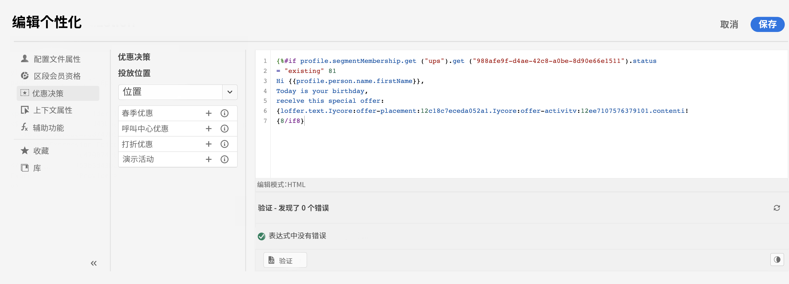
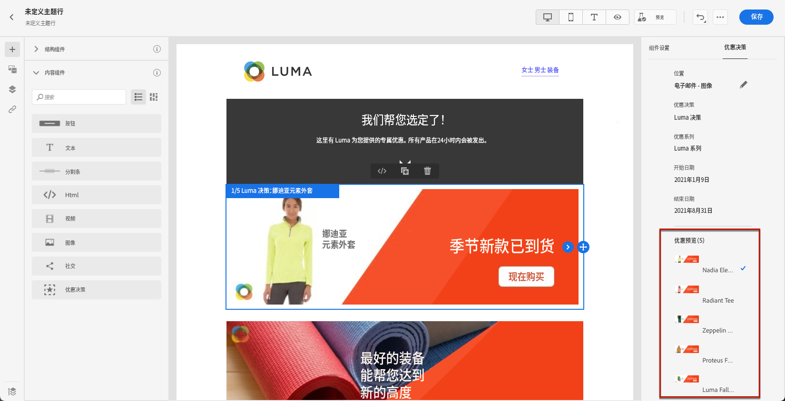
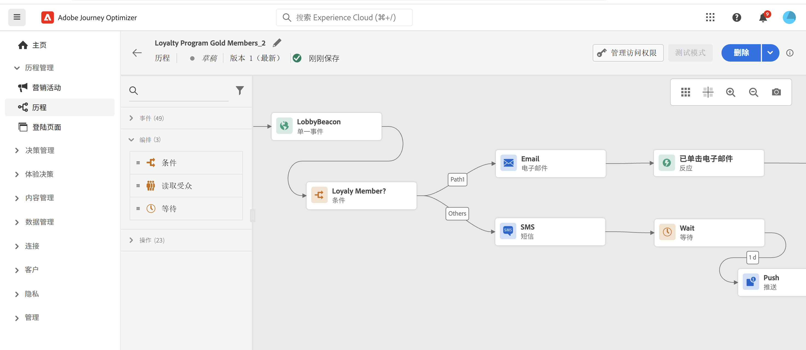

# 营销人员快速入门 {#get-started-marketers}

>[!BEGINSHADEBOX]

**在此页面上：**&#x200B;遵循营销人员的入门路径，以便在Journey Optimizer中构建受众、设计内容并编排提供个性化客户体验的历程和营销活动。

>[!ENDSHADEBOX]

作为&#x200B;**营销人员**&#x200B;或&#x200B;**商业从业者**，您负责设计客户历程，以便为客户提供个性化的情境式体验。 您创建并管理这些个性化历程中的所有不同组成部分，包括电子邮件和推送消息、优惠以及用于智能个性化消息内容的决策组件。 Journey Optimizer 提供统一的用户体验，让您能够在一个地方实现完整的端到端用例。 [系统管理员](administrator.md)和[数据工程师](data-engineer.md)向您授予访问权限并准备好环境后，您即可开始使用 [!DNL Adobe Journey Optimizer]。

>[!NOTE]
>
>**实施顺序：** [管理员](administrator.md) → [数据工程师](data-engineer.md) → [开发人员](developer.md) →您位于此处： **营销人员**
>
>在生成历程之前，请确认[环境设置](administrator.md)和[数据配置](data-engineer.md)已完成。

## 从基础开始入门

>[!NOTE]
>
>初次使用Journey Optimizer？ 在开始本指南之前，请阅读[Journey Optimizer是什么](../get-started.md)。

与您的[管理员](administrator.md)协作以获取访问权限，并与[数据工程师](data-engineer.md)配合，为高级分段设置受众群体、数据和关系型架构。 查看[数据管理快速入门](../../data/gs-data.md)概述，了解在构建历程和营销活动之前需要完成哪些数据设置。

请按照以下核心步骤开始构建体验：

1. **创建受众**。 通过区段定义、上传 CSV 文件或使用受众构成功能来构建受众群体。 Journey Optimizer 提供多种方式来定位合适的客户。 了解更多关于[受众](../../audience/about-audiences.md)和[创建区段定义](../../audience/creating-a-segment-definition.md)的信息。

1. **设计内容**。 在所有渠道（包括电子邮件、短信、推送通知、Web 推送、应用程序内、Web、直邮、和内容卡片）创建引人入胜的消息：
   * 使用 **AI 助手**&#x200B;根据您的品牌指南生成电子邮件内容、主题行和图像。 [了解 AI 内容生成](../../content-management/gs-generative.md)
   * 利用客户数据、动态内容和条件逻辑实现&#x200B;**消息个性化**。 [了解个性化](../../personalization/personalize.md)
   * **对上下文数据进行迭代**&#x200B;以展示来自事件、自定义操作和数据集查询的动态列表。 [了解如何迭代上下文数据](../../personalization/iterate-contextual-data.md)
   * 创建可重复使用的&#x200B;**内容模板**&#x200B;和&#x200B;**片段**&#x200B;以保持品牌一致性。 [使用模板](../../content-management/content-templates.md)
   * 在移动应用和网站内提供持久且非侵入式的&#x200B;**内容卡片**。 与推送通知不同，内容卡片会保持可见状态，直至被取消。 [了解内容卡片](../../content-card/create-content-card.md)
   * 通过 **Adobe Experience Manager Assets** 集成来管理资产。 [了解资产](../../integrations/assets.md)

   

1. **添加优惠与决策**。 利用 AI 驱动的决策，在最佳时机为每位客户提供最合适的优惠。 使用 Decisioning 对推送通知、短信和其他渠道进行个性化设置。 了解[决策管理](../../offers/get-started/starting-offer-decisioning.md)和 [Decisioning](../../experience-decisioning/gs-experience-decisioning.md)。

   

1. **测试和验证**。 在发送前预览和测试内容：
   * 使用&#x200B;**测试用户档案**&#x200B;预览个性化内容并检查跨设备渲染效果
   * 使用来自 CSV/JSON 文件的&#x200B;**样本数据**&#x200B;进行测试
   * 在主流电子邮件客户端中预览&#x200B;**电子邮件渲染效果**
   * 运行 **A/B 测试与试验**&#x200B;以优化内容变体。 运用多臂老虎机试验方法，实时自动将更多流量分配给胜出的内容变体。 [了解试验](../../content-management/content-experiment.md)
   * 为营销活动和历程设置&#x200B;**审批工作流**（需要额外的许可证）。 [了解审批](../../test-approve/gs-approval.md)

   了解如何[测试和验证消息](../../content-management/preview-test.md)。

1. **构建客户历程**。 使用历程画布创建实时、个性化的体验。 在 AI 助手中使用 **Journey 代理**&#x200B;通过自然语言提示创建历程。 [了解 Journey 代理](../ai-features.md#journey-agent)

   * 通过&#x200B;**事件**（客户行为）或&#x200B;**受众**（批量发送）触发历程
   * 添加&#x200B;**条件**，根据客户数据创建个性化路径
   * 对所有渠道操作（电子邮件、推送、短信等）使用统一的&#x200B;**操作活动**。 [了解操作活动](../../building-journeys/journey-action.md)
   * 添加&#x200B;**内容决策活动**&#x200B;以将个性化产品建议直接集成到历程流程图中。 [了解内容决策活动](../../building-journeys/content-decision.md)
   * 使用&#x200B;**等待活动**&#x200B;在消息间实现精准的时序安排
   * 在单一历程中跨&#x200B;**多个渠道**&#x200B;发送消息
   * 使用&#x200B;**波次发送**&#x200B;以受控批次方式投放消息（历程为有限可用性版）
   * 应用 **A/B 测试**&#x200B;并优化发送时间以最大限度提升互动效果
   * 利用&#x200B;**数据集查找**&#x200B;功能，通过 Adobe Experience Platform 的实时数据丰富历程体验。 [了解数据集查找](../../building-journeys/dataset-lookup.md)
   * 利用&#x200B;**补充标识符**，允许同一轮廓进入多个历程实例（例如，不同的订单或预订）。 [了解补充标识符](../../building-journeys/supplemental-identifier.md)

   

   了解如何[设计和执行历程](../../building-journeys/journey-gs.md)并探索[历程用例](../../building-journeys/jo-use-cases.md)。 了解[进入/退出标准](../../building-journeys/entry-exit-criteria-guide.md)以控制轮廓的流转。

1. **启动编排的营销活动**。 使用可视化画布，设计规模化、多步骤的复杂批量营销活动：

   * 通过关系型查询即时构建&#x200B;**按需受众**，将客户数据与帐户、购买记录、订阅及其他实体相连接
   * 创建&#x200B;**多实体分段**&#x200B;以实现精准目标选择（例如：“订阅在 30 天内到期的客户”或“近期有大额购买的帐户”）
   * 在启动前通过精确的受众数量获得&#x200B;**发送前可见性**
   * 设计&#x200B;**多步骤工作流**，用于季节性促销、产品发布、忠诚度优惠或基于帐户的营销活动
   * 安排营销活动立即运行、在特定时间运行或按定期计划（每日、每周、每月）运行
   * 以&#x200B;**批处理模式**&#x200B;处理受众群体，所有客户档案同步推进工作流程
   * 使用&#x200B;**波次发送**&#x200B;以受控批次方式投放消息，以提升可投放性和负载控制

   了解如何[开始使用编排的营销活动](../../orchestrated/gs-orchestrated-campaigns.md)，并了解何时[使用营销活动与历程](../../orchestrated/orchestrated-campaigns-faq.md)。

1. **监测和优化**。 追踪绩效表现并持续优化成效：
   * 监控&#x200B;**实时历程**&#x200B;表现并识别瓶颈
   * 分析&#x200B;**消息送达**&#x200B;率和参与量度
   * 利用集成 Customer Journey Analytics 的&#x200B;**报告仪表板**
   * 追踪&#x200B;**转化率**&#x200B;与业务影响
   * 利用冲突管理规则管理&#x200B;**消息频率与优先级**，避免过度通信
   * 使用&#x200B;**免打扰时间**（基于时间的排除）以避免在特定时段发送。 [了解冲突管理](../../conflict-prioritization/gs-conflict-prioritization.md)和[免打扰时间](../../conflict-prioritization/quiet-hours.md)

   了解如何[监控绩效表现](../../reports/report-gs-cja.md)。

## 迈向成功的最佳实践

### 内容创建

* **从模板着手**：使用预构建模板和内容片段以加速创建并保持一致性
* **尽早测试，频繁测试**：始终跨设备预览内容，并使用测试客户档案验证个性化效果
* **善用 AI**：使用 AI 助手生成初稿和变体，但需始终根据品牌调性进行审阅与优化
* **保持简洁**：清晰简洁的文案搭配明确的行动号召，其效果优于复杂布局

### 历程设计

* **明确目标**：在构建历程前，确立成功的衡量标准
* **绘制客户体验蓝图**：在实施前将整个客户历程可视化
* **策略性运用等待活动**：在发送后续跟进前，给予客户充分的参与时间
* **规划退出策略**：明确客户应在何时、因何原因退出历程
* **在草稿模式下测试**：激活前通过试运行验证历程逻辑

[学习客户历程最佳实践](../../building-journeys/entry-exit-criteria-guide.md#best-practices)

### 营销活动编排

* **选择合适的方式**：对于实时、行为触发的体验，可选择[比较历程类型](../../building-journeys/journey.md#journey-types)；对于计划性、批量的营销活动，可选择[营销活动类型](../../campaigns/get-started-with-campaigns.md#campaign-types)。
* **明确营销活动目标**：在设计多步骤工作流前确立目标
* **从试点受众开始**：在扩大规模前验证受众数量与分段逻辑
* **利用关联数据**：运用多实体分段技术，将客户数据与帐户、购买记录及订阅信息关联，实现精准定向
* **保持分段规则简洁**：通过清晰、可维护的规则来优化性能和透明度
* **采用统一命名**：通过清晰的命名规范简化营销活动管理

### 受众目标选择

* **精心细分**：依据明确的标准创建具体且可操作的受众区段
* **定期更新**：通过设置适当的评估计划确保受众信息保持最新
* **平衡规模与精度**：确保目标受众规模足以支撑统计显著性，同时保持足够的针对性以提升相关性
* **利用丰富属性**：借助计算属性和增强数据实现更深层次的个性化

### 频率管理

* **尊重客户偏好**：遵守退订选项与通信偏好设置
* **设置频率上限**：运用规则集防止跨渠道消息疲劳
* **协调营销活动**：运用冲突管理确保客户在恰当时机收到正确信息
* **监控互动情况**：留意客户疲劳迹象（如开启率下降、退订率上升）

[了解频率上限设置](../../conflict-prioritization/channel-capping.md)

## 浏览用例

通过实际案例了解 Journey Optimizer 功能：

**历程用例**（实时，一对一）：

* **欢迎系列**：通过个性化多步骤历程引导新客户入驻。 [查看用例](https://experienceleague.adobe.com/zh-hans/docs/journey-optimizer-learn/tutorials/use-cases/customer-onboarding)
* **购物车挽回**：与放弃购物车商品的客户重新建立互动。 [查看用例](https://experienceleague.adobe.com/zh-hans/docs/journey-optimizer-learn/tutorials/use-cases/abandoned-cart)
* **事件驱动型消息**：实时响应客户操作
* **生日营销活动**：发送由用户档案日期触发的个性化生日消息
* **产品推荐**：根据浏览和购买历史记录推荐相关产品

**编排的营销活动用例**（批量、一对多）：

* **季节性促销活动**：跨客户细分群体发起协同营销活动（例如：假日促销、返校季活动）
* **产品发布**：通过序列化消息向目标受众发布新产品信息
* **忠诚度计划优惠**：根据购买历史记录，为高价值客户提供分等级优惠奖励
* **基于帐户的营销**：针对具有特定特征及相关联系人的帐户开展定向营销
* **续订订阅**：通过多实体查询联系订阅即将过期的客户
* **再互动营销活动**：通过批量模式向不活跃客户推送定向优惠以赢回客户。 [查看用例](https://experienceleague.adobe.com/zh-hans/docs/experience-platform/rtcdp/use-cases/personalization-insights-engagement/use-cases-luma)

**历程模式：**

* [向订阅者发送消息](../../building-journeys/message-to-subscribers-uc.md)：通过个性化内容定向投放订阅列表
* [多渠道消息推送](../../building-journeys/journeys-uc.md)：将电子邮件、推送通知与反应事件相结合
* [仅限工作日的电子邮件](../../building-journeys/weekday-email-uc.md)：利用基于时间的条件来安排通信计划

浏览完整的[客户历程用例库](../../building-journeys/jo-use-cases.md)，并进一步了解[编排的营销活动](../../orchestrated/gs-orchestrated-campaigns.md)。

## 跨角色协作

您的营销工作需要与其他团队协作：

>[!BEGINTABS]

>[!TAB 与数据工程师协作]

与[数据工程师](data-engineer.md)协作处理数据和受众配置：

* 请求新增用于个性化和分段的计算属性
* 为编排的营销活动协调关联架构
* 就受众群体质量与数据准确性提供反馈
* 满足高级分段的多实体数据要求

>[!TAB 与开发人员协作]

与[开发人员](developer.md)就事件跟踪和实施进行协作：

* 对应触发历程事件的用户互动行为达成一致
* 在启动前测试移动端和网页端的实施效果
* 验证内容表现和用户参与追踪数据的准确性
* 排查消息投放或个性化相关的问题

>[!TAB 与管理员协作]

与[管理员](administrator.md)就访问权限和配置进行协作：

* 为您的营销活动和历程申请渠道配置权限
* 确认编排的营销活动和其他功能的许可证访问权限
* 报告权限或访问相关问题
* 协调新功能的启用和测试环境

>[!ENDTABS]

## 后续步骤

1. **从小处着手**：创建一个简单的欢迎历程或单次消息营销活动来熟悉平台
2. **善用 AI**：借助 AI 助手提问并加速内容创作
3. **加入社区**：在 [Experience League 社区](https://experienceleaguecommunities.adobe.com/t5/journey-optimizer/ct-p/journey-optimizer?profile.language=zh-Hans){target="_blank"}中与其他 Journey Optimizer 用户交流
4. **探索教程**：在 [Experience League](https://experienceleague.adobe.com/docs/journey-optimizer-learn/tutorials/overview.html?lang=zh-Hans){target="_blank"} 上观看分步操作视频

## 其他角色指南 {#other-role-guides}

| 角色 | 指南 |
|------|-------|
| 管理员 | [管理员入门](administrator.md) |
| 数据工程师 | [数据工程师入门](data-engineer.md) |
| Developer | [开发人员入门](developer.md) |
| 营销人员 | [营销人员入门指南](marketer.md) |

返回[角色和职责概述](../quick-start.md) ·返回[开始](../../../rp_landing_pages/get-started-landing-page.md)
