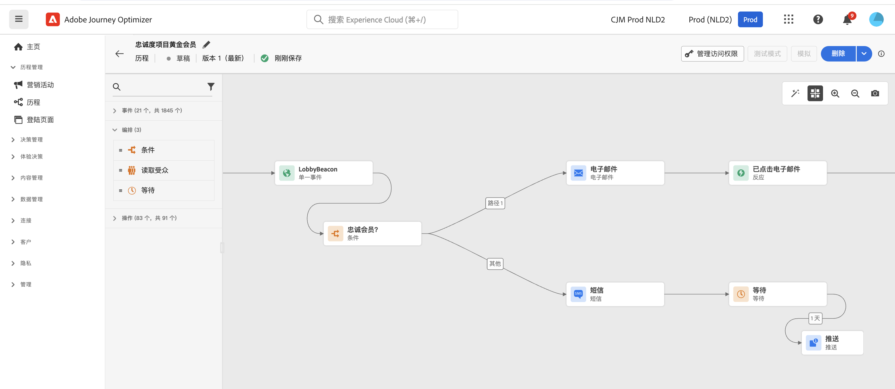

# 营销人员快速入门 {#get-started-marketers}

作为&#x200B;**营销人员**&#x200B;或&#x200B;**商业从业者**，您设计客户历程以便为客户提供个性化的情境式体验。 您可以创建和管理这些个性化历程的所有不同组件，包括电子邮件和推送消息、优惠和决策组件，以便智能地个性化消息内容。 Journey Optimizer提供统一的用户体验，您可以在一个位置实施整个端到端用例。 [系统管理员](administrator.md)和[数据工程师](data-engineer.md)向您授予访问权限并准备好环境后，您即可开始使用 [!DNL Adobe Journey Optimizer]。

## 开始使用要点

Journey Optimizer在一个应用程序中整合了实时客户洞察、现代全渠道编排和智能决策。 跨电子邮件、短信、推送、应用程序内、Web、内容卡等创建个性化、连接的客户体验。

Journey Optimizer提供两种强大的编排方法：

* **历程**：实时、一对一的参与，其中每位客户均按照自己的进度前进，并受行为或事件触发
* **编排的营销活动**：大规模复杂的多步骤批量营销活动，受众可通过工作流一起进行这些活动 — 非常适合品牌发起的营销活动，如季节性促销活动、产品发布活动或基于帐户的通信

与您的[管理员](administrator.md)合作以获取访问权限，并与[数据工程师](data-engineer.md)合作设置受众、数据和关系架构以实现高级分段。

请按照以下核心步骤开始构建体验：

1. **创建受众**。通过区段定义构建受众、上传CSV文件或使用受众合成。 Journey Optimizer提供了多种方法来定位合适的客户。 了解有关[受众](../../audience/about-audiences.md)和[创建区段定义](../../audience/creating-a-segment-definition.md)的更多信息。

1. **设计内容**。 跨所有渠道创建引人注目的消息，包括电子邮件、短信、推送、应用程序内、Web和内容卡：
   * 使用&#x200B;**AI助手**&#x200B;根据您的品牌指南生成电子邮件内容、主题行和图像。 [了解AI内容生成](../../content-management/gs-generative.md)
   * 使用客户数据、动态内容和条件逻辑&#x200B;**个性化消息**。 [了解个性化](../../personalization/personalize.md)
   * **对上下文数据进行迭代**&#x200B;以显示来自事件、自定义操作和数据集查找的动态列表。 [了解如何迭代上下文数据](../../personalization/iterate-contextual-data.md)
   * 创建可重复使用的&#x200B;**内容模板**&#x200B;和&#x200B;**片段**&#x200B;以保持品牌一致性。 [使用模板](../../content-management/content-templates.md)
   * 在移动应用和网站中交付持久、非侵入式&#x200B;**内容卡**。 与推送通知不同，内容卡保持可见状态，直到被取消。 [了解内容卡片](../../content-card/create-content-card.md)
   * 通过&#x200B;**Adobe Experience Manager Assets**&#x200B;集成管理资源。 [了解资源](../../integrations/assets.md)

   

1. **添加优惠和决策**。 使用AI支持的决策在适当的时间为每位客户提供最佳选件。 了解[决策管理](../../offers/get-started/starting-offer-decisioning.md)和[Experience Decisioning](../../experience-decisioning/gs-experience-decisioning.md)。

   

1. **测试和验证**。发送前预览和测试内容：
   * 使用&#x200B;**测试用户档案**&#x200B;预览个性化并检查跨设备渲染
   * 使用CSV/JSON文件中的示例数据&#x200B;**进行测试**
   * 在常用电子邮件客户端上预览&#x200B;**电子邮件渲染**
   * 运行&#x200B;**A/B测试和实验**&#x200B;以优化内容变化。 使用多臂老虎机试验自动分配更多流量以实时赢得变体。 [了解试验](../../content-management/content-experiment.md)
   * 为营销活动和历程设置&#x200B;**审批工作流**（需要额外的许可证）。 [了解审批](../../test-approve/gs-approval.md)

   了解如何[测试和验证消息](../../content-management/preview-test.md)。

1. **构建客户历程**。 使用历程画布创建实时、个性化的体验：

   * 触发包含&#x200B;**事件** （客户操作）或&#x200B;**受众** （批次发送）的历程
   * 添加&#x200B;**条件**&#x200B;以根据客户数据创建个性化路径
   * 使用&#x200B;**等待活动**&#x200B;创建消息之间的完美计时
   * 在一个历程中跨&#x200B;**多个渠道**&#x200B;发送消息
   * 应用&#x200B;**A/B测试**&#x200B;并优化发送时间以最大化参与度
   * 使用&#x200B;**数据集查找**&#x200B;利用Adobe Experience Platform中的实时数据扩充历程。 [了解数据集查找](../../building-journeys/dataset-lookup.md)
   * 利用&#x200B;**补充标识符**&#x200B;允许同一配置文件输入多个历程实例（例如，不同的订单或预订）。 [了解补充标识符](../../building-journeys/supplemental-identifier.md)

   

   了解如何[设计和执行历程](../../building-journeys/journey-gs.md)并探索[历程用例](../../building-journeys/jo-use-cases.md)。 了解[进入/退出条件](../../building-journeys/entry-exit-criteria-guide.md)以控制配置文件流。

1. **启动编排的营销活动**。 使用可视画布大规模设计复杂的多步批量营销活动：

   * 即时使用关系查询生成&#x200B;**按需受众**，以将客户数据与帐户、购买、订阅和其他实体连接
   * 创建&#x200B;**多实体分段**&#x200B;以实现准确定位（例如，“订阅在30天内过期的客户”或“最近购买过高额商品的客户”）
   * 在启动之前获取&#x200B;**发送前可见性**&#x200B;以及准确的受众计数
   * 为季节性促销活动、产品发布、忠诚度优惠或基于帐户的营销设计&#x200B;**多步骤工作流**
   * 安排活动立即运行、在特定时间运行或按定期计划（每天、每周、每月）运行
   * 在&#x200B;**批处理模式**&#x200B;中处理受众，其中所有用户档案一起通过工作流进行

   了解如何[开始使用编排的营销活动](../../orchestrated/gs-orchestrated-campaigns.md)，并了解何时[使用营销活动与历程](../../orchestrated/orchestrated-campaigns-faq.md)。

1. **监视和优化**。 随时间推移跟踪性能并改进结果：
   * 监视&#x200B;**实时历程**&#x200B;性能并识别瓶颈
   * 分析&#x200B;**消息投放**&#x200B;率和参与量度
   * 将&#x200B;**报告功能板**&#x200B;与Customer Journey Analytics集成一起使用
   * 跟踪&#x200B;**转化**&#x200B;和业务影响
   * 使用冲突管理规则管理&#x200B;**消息频率和优先级**&#x200B;以防止过度通信。 [了解冲突管理](../../conflict-prioritization/gs-conflict-prioritization.md)

   了解如何[监视性能](../../reports/report-gs-cja.md)。

## 获得成功的最佳实践

### 内容创建

* **从模板开始**：使用预建模板和内容片段加快创建并维护一致性
* **提前测试，经常测试**：始终跨设备预览内容并使用测试配置文件验证个性化
* **明智地利用AI**：将AI助手用于初始草稿和变体，但始终针对您的品牌声音进行审查和优化
* **保持简单**：具有强大行动号召的简明清晰邮件比复杂布局表现更好

### 历程设计

* **定义明确的目标**：在构建历程之前建立成功量度
* **映射客户体验**：在实施之前可视化整个历程
* **策略性地使用等待活动**：在发送跟进信息之前给客户时间进行参与
* **规划退出策略**：定义客户应退出历程的时间和原因
* **在草稿模式下测试**：在激活之前通过试运行验证历程逻辑

[了解历程最佳实践](../../building-journeys/entry-exit-criteria-guide.md#best-practices)

### 营销活动编排

* **选择正确的方法**：将历程用于实时行为触发的体验；将编排的活动用于计划的批量活动
* **定义明确的营销活动目标**：在设计多步骤工作流之前建立目标
* **从试点受众开始**：在缩放之前验证计数和分段逻辑
* **利用关系数据**：使用多实体分段将客户数据与帐户、购买、订阅连接起来，以实现准确定位
* **使分段保持简单**：使用明确的可维护规则优化性能和透明度
* **使用一致的命名**：通过明确的命名惯例使营销活动管理更容易

### 受众定位

* **仔细细分**：根据明确的条件创建特定的、可操作的受众区段
* **定期刷新**：通过设置适当的评估计划，确保受众保持最新
* **平衡大小和精度**：目标受众足够大，具有足够的统计意义，但足够具体，具有相关性
* **使用扩充属性**：利用计算属性和扩充数据实现更深入的个性化

### 频率管理

* **尊重客户首选项**：尊重选择退出和通信首选项
* **设置频率上限**：使用规则集防止跨渠道的消息疲劳
* **协调营销活动**：使用冲突管理以确保客户在正确的时间收到正确的消息
* **监测参与度**：观察疲劳迹象（打开率下降，取消订阅次数增加）

[了解频率封顶](../../conflict-prioritization/channel-capping.md)

## 探索用例

从演示Journey Optimizer功能的实际示例中学习：

**历程用例**（实时，一对一）：

* **欢迎系列**：通过个性化的多步骤历程载入新客户。 [查看用例](https://experienceleague.adobe.com/zh-hans/docs/journey-optimizer-learn/tutorials/use-cases/customer-onboarding)
* **放弃的购物车恢复**：重新吸引将商品留在购物车中的客户。 [查看用例](https://experienceleague.adobe.com/zh-hans/docs/journey-optimizer-learn/tutorials/use-cases/abandoned-cart)
* **事件驱动消息传递**：实时响应客户操作
* **生日营销活动**：发送由用户档案日期触发的个性化生日消息
* **产品推荐**：根据浏览和购买历史记录推荐相关产品

**编排的活动用例**（批次，一对多）：

* **季节性促销活动**：跨客户区段启动协调的促销活动（例如，假日销售、返校）
* **产品发布**：通过顺序消息向目标受众公告新产品
* **忠诚度计划优惠**：通过基于购买历史记录的分层优惠奖励高价值客户
* **基于帐户的营销**：具有特定特征和相关联系人的目标帐户
* **续订订阅**：使用多实体查询联系订阅即将过期的客户
* **重新参与营销活动**：在批处理模式下重新吸引具有目标优惠的非活动客户。 [查看用例](https://experienceleague.adobe.com/zh-hans/docs/experience-platform/rtcdp/use-cases/personalization-insights-engagement/use-cases-luma)

**历程模式：**

* [向订阅者发送邮件](../../building-journeys/message-to-subscribers-uc.md)：具有个性化内容的Target订阅列表
* [多渠道消息传递](../../building-journeys/journeys-uc.md)：将电子邮件和推送与反应事件相结合
* [仅限工作日的电子邮件](../../building-journeys/weekday-email-uc.md)：使用基于时间的条件安排通信

浏览完整的[历程用例库](../../building-journeys/jo-use-cases.md)并了解有关[编排的营销活动](../../orchestrated/gs-orchestrated-campaigns.md)的更多信息。

## 与其他角色协作

您的营销工作与其他团队相关联：

* **与[数据工程师合作](data-engineer.md)**：请求新的计算属性，协调编排的营销活动的关系架构，提供受众质量反馈，并协调高级分段的多实体数据要求
* **与[开发人员合作](developer.md)**：调整事件触发器、测试移动实施并验证跟踪
* **与[管理员](administrator.md)**&#x200B;合作：请求渠道配置，确认协调营销活动的许可证访问权限，报告权限问题，协调新功能启用

## 保持最新

了解最新的Journey Optimizer功能和营销特性：

* **[发行说明](../../rn/release-notes.md)**：查看每月发布的新功能、渠道更新和增强功能
* **[文档更新](../../rn/documentation-updates.md)**：跟踪最近的更改，包括新用例、最佳实践和功能文档
* **[产品通知](../../rn/releases.md#staying-informed)**：了解如何订阅有关Journey Optimizer更新的电子邮件和产品内通知，包括新渠道、即将推出的功能以及重要的营销活动公告

## 后续步骤

1. **从小处开始**：创建简单的欢迎历程或单消息营销活动以了解平台
2. **利用AI**：使用AI助手提问并加快内容创建
3. **加入社区**：与[Journey Optimizer社区中的其他Experience League用户建立联系](https://experienceleaguecommunities.adobe.com/t5/journey-optimizer/ct-p/journey-optimizer){target="_blank"}
4. **浏览教程**：观看[Experience League](https://experienceleague.adobe.com/docs/journey-optimizer-learn/tutorials/overview.html?lang=zh-Hans){target="_blank"}上的分步视频
