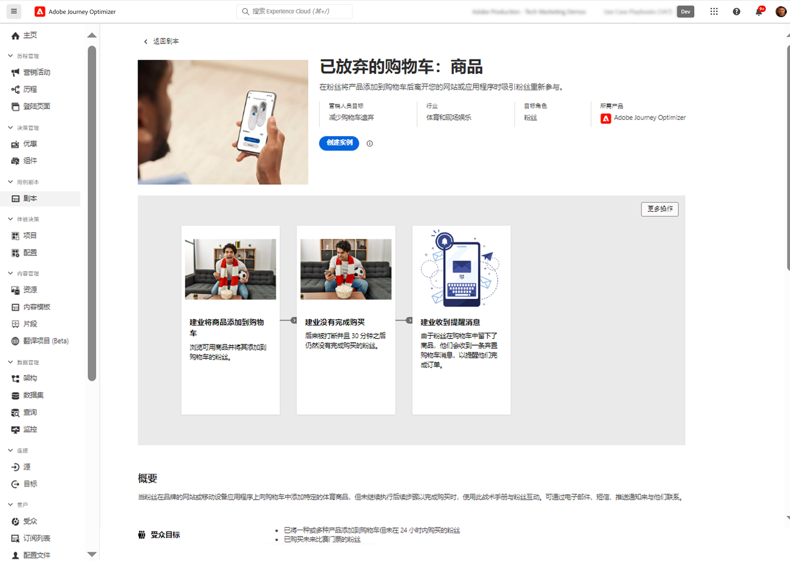
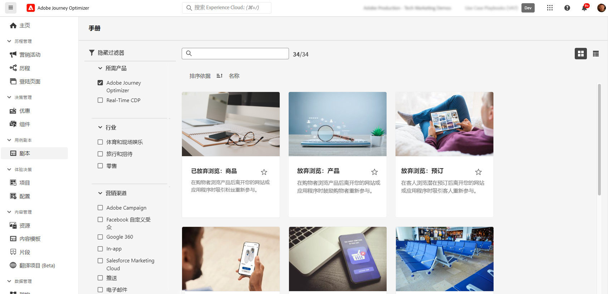

# 用例战术手册 {#playbooks}

>[!PREREQUISITES]
>
>在使用用例战术手册之前，需要执行以下配置步骤。有关每个步骤的详细信息，请参阅用例战术手册文档的[入门](https://experienceleague.corp.adobe.com/docs/experience-platform/use-case-playbooks/playbooks/get-started.html?lang=zh-Hans){target="_blank"}页面。
>
>* 创建沙盒
>* 配置用户权限
>* 为电子邮件、推送和短信通知配置 Journey Optimizer 渠道表面

用例战术手册是预定义的工作流程，用于处理您可以使用 Adobe Experience Platform 和 Journey Optimizer 执行的常见用例。

{width="85%"}

每个战术手册都提供了全面的概述，包括实施战术手册的意图、目标、目标角色和所需的资源。此外，每个战术手册中都有思维导图，用于直观地表示与战术手册关联的真实客户接触点。

{width="85%"}

要访问手册，请导航到位于左侧导航边栏的&#x200B;**[!UICONTROL 战术手册]**&#x200B;菜单。该库包含多个使用 Adobe Journey Optimizer 实施的战术手册。为了轻松访问战术手册，请使用搜索栏旁边的筛选器。有关 Journey Optimizer 手册的完整列表，请参见[用例战术手册文档](https://experienceleague.adobe.com/docs/experience-platform/use-case-playbooks/playbooks/playbooks-list.html?lang=zh-Hans){target="_blank"}。

{width="85%"}

选择最符合您需求的战术手册后，就可以启用该战术手册。这将创建一个战术手册实例，并自动生成支持特定用例所需的资源。资源包括 Journey Optimizer 资产（如历程、消息）以及 Adobe Experience Platform 资产（如架构或区段）。

>[!NOTE]
>
>这些对象旨在帮助您了解实施特定用例所需的所有资源。它们不包含任何数据，并且将在开发沙盒上创建它们。

要实施用例，您可以导航到每个对象并根据需求进行调整。您还可以在团队之间共享战术手册实例页面 URL，以便协作实施用例。

此外，您可以将战术手册资产导入其他沙盒中。假如您已设置自己的架构、字段和字段组，这样做可以使生成的资产与现有资产保持一致，并确保其与数据兼容。有关这些步骤的详情，请参见[用例战术手册文档](https://experienceleague.adobe.com/docs/experience-platform/use-case-playbooks/playbooks/data-awareness.html?lang=zh-Hans){target="_blank"}。
