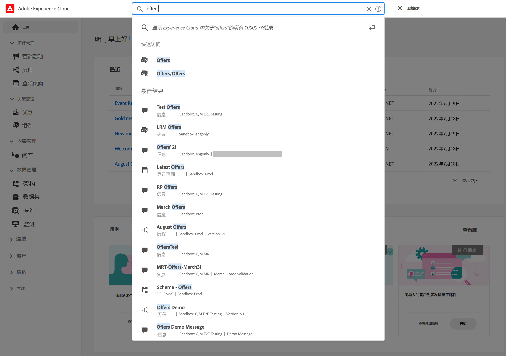
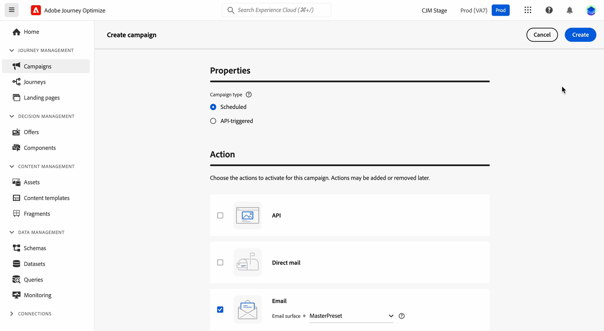
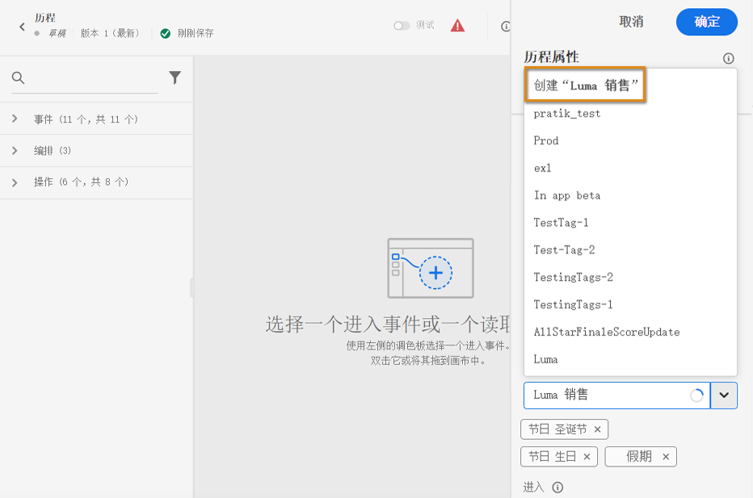

# 搜索、筛选、组织 {#search-filter-organize}

## 搜索 {#unified-search}

在 Adobe Journey Optimizer 界面，使用顶部中央位置的 Adobe Experience Cloud 统一搜索功能在沙盒中查找资产、历程和数据集等等。

开始输入内容以显示排名靠前的结果。与输入的关键词有关的帮助文章也会显示在结果中。

按 **Enter** 键访问所有结果并按业务对象进行筛选。

## 筛选器列表 {#filter-lists}

在大多数列表中，可使用搜索栏查找特定项目并定义筛选条件。

单击列表左上角的筛选图标即可访问过滤器。利用筛选菜单，可根据不同的条件筛选显示的元素：您可以选择仅显示特定类型或状态的元素、您创建的元素或最近 30 天内修改的元素。选项因上下文不同而异。

此外，您还可以使用统一标记来根据分配给对象的标记筛选列表。目前，标记可用于历程和营销活动。[了解如何使用标记](#tags)

>[!NOTE]
>
>请注意，显示的列可以使用列表右上角的配置按钮进行个性化设置。为每个用户保存个性化设置。

在列表中，您可以对每个元素执行基本操作。例如，您可以删除项目或制作项目副本。

## 使用统一标记 {#tags}

>[!CONTEXTUALHELP]
>id="ajo_campaigns_tags"
>title="标记"
>abstract="利用此字段，您可以将 Adobe Experience Platform 统一标记分配给您的营销活动。这样，您就可以轻松地对营销活动进行分类，并改进营销活动列表中的搜索。"

使用 Adobe Experience Platform [统一标记](https://experienceleague.adobe.com/docs/experience-platform/administrative-tags/overview.html?lang=zh-Hans)，您可以轻松地对 Journey Optimizer 对象进行分类，以改进列表中的搜索。

在 Journey Optimizer 中为受众添加有意义的标签，这可让您稍后更轻松地进行筛选和搜索以查找受众。标记还可用于在可搜索的相关文件夹中组织受众，创建个性化产品建议和体验，以及用在体验决策规则中。

### 向对象添加标记 {#add-tags}

此&#x200B;**[!UICONTROL 标记]**&#x200B;字段允许您定义对象的标记。标记可用于以下对象：

* [营销活动](../campaigns/create-campaign.md#create)
* [决策项](../experience-decisioning/items.md)
* [片段](../content-management/fragments.md)
* [历程](../building-journeys/journey-properties.md)
* [登陆页面](../landing-pages/create-lp.md)
* [订阅列表](../landing-pages/subscription-list.md)
* [模板](../content-management/content-templates.md)
* [渠道配置](../configuration/channel-surfaces.md#channel-config-tags)

您可以选择现有标记，也可以创建新标记。要实现此目的，请执行以下步骤。

1. 开始键入所需标记的名称，并/或从列表中进行选择。

   

   >[!NOTE]
   >
   > 标记不区分大小写。

1. 如果您要搜索的标记不可用，请单击&#x200B;**[!UICONTROL 创建]**，定义新标记。该标记会被自动添加到当前对象中，并可用于所有其他对象。

   

1. 所选或创建的标记列表显示在&#x200B;**[!UICONTROL 标记]**&#x200B;字段的下方。您可以根据需要定义任意数量的标记。

>[!NOTE]
> 
> 您复制或创建对象的新版本时，会保留标记。

### 标记筛选 {#filter-on-tags}

每个对象列表都会显示一个专用列，以便您轻松查看标记。

此外，筛选器仅可用于显示具有特定标记的对象。

您可以在任何类型的历程或营销活动（实时、草稿等）中添加或移除标记。为此，请单击对象旁边的&#x200B;**[!UICONTROL 更多操作]**&#x200B;图标，然后选择&#x200B;**[!UICONTROL 编辑标记]**。

### 管理标记 {#manage-tags}

管理员可以删除标记，并使用&#x200B;**[!UICONTROL 管理]**&#x200B;下的&#x200B;**[!UICONTROL 标记]**&#x200B;菜单按类别进行组织。在[统一标记文档](https://experienceleague.adobe.com/docs/experience-platform/administrative-tags/ui/managing-tags.html?lang=zh-Hans)中了解标记管理的更多信息。

>[!NOTE]
>
> 直接从 Journey Optimizer **[!UICONTROL 标记]**&#x200B;字段创建的标记会自动添加到内置的“未分类”类别中。
