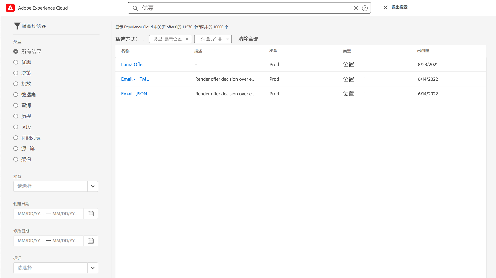
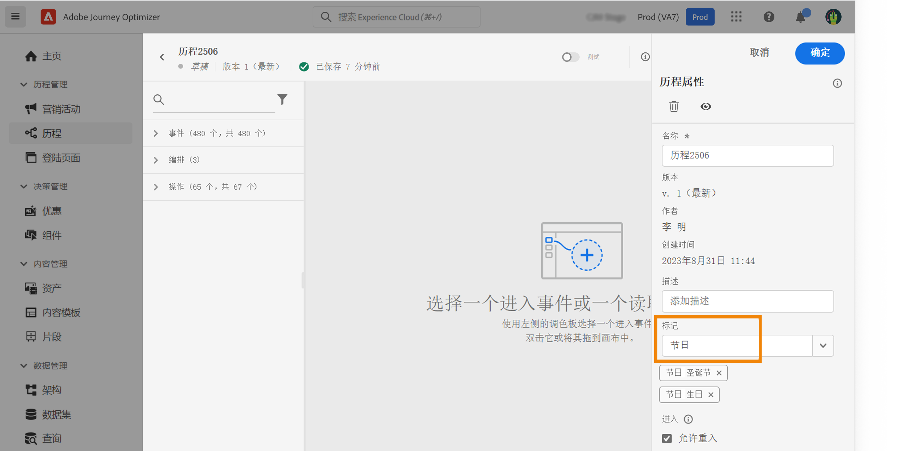
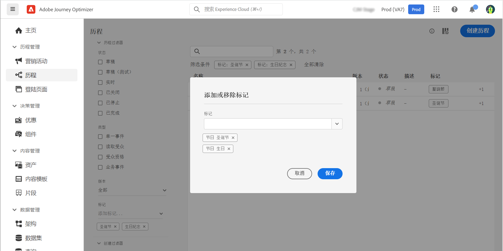

# 搜索、筛选、组织 {#search-filter-organize}

## 搜索{#unified-search}

在 Adobe Journey Optimizer 界面的任何地方，使用顶部中央位置的 Adobe Experience Cloud 统一搜索功能在沙盒中查找资产、历程和数据集等等。

开始输入内容以显示排名靠前的结果。与输入的关键词有关的帮助文章也会显示在结果中。

按 **Enter** 键访问所有结果并按业务对象进行筛选。

## 筛选器列表{#filter-lists}

在大多数列表中，可使用搜索栏查找特定项目并定义筛选条件。

单击列表左上角的筛选图标即可访问筛选器。利用筛选菜单，可根据不同的条件筛选显示的元素：您可以选择仅显示特定类型或状态的元素、您创建的元素或最近 30 天内修改的元素。选项因上下文不同而异。

此外，您还可以使用统一标记来根据分配给对象的标记筛选列表。目前，标记可用于历程和营销活动。[了解如何使用标记](#tags)

>[!NOTE]
>
>请注意，显示的列可以使用列表右上角的配置按钮进行个性化设置。为每个用户保存个性化设置。

在列表中，您可以对每个元素执行基本操作。例如，您可以删除项目或制作项目副本。

## 使用统一标记 {#tags}

使用 Adobe Experience Platform [统一标记](https://experienceleague.adobe.com/docs/experience-platform/administrative-tags/overview.html?lang=zh-Hans)，您可以轻松地对 Journey Optimizer 历程和营销活动进行分类，以改进列表中的搜索。

>[!AVAILABILITY]
>
>统一标记目前为 Beta 版。文档和功能可能会发生变化。

### 向对象添加标记

使用&#x200B;**标记**&#x200B;字段（在[历程](../building-journeys/journey-gs.md#change-properties)或[营销活动](../campaigns/create-campaign.md#create)）属性中，您可以为对象定义标记。您可以选择现有标记，也可以创建新标记。

开始键入所需标记的名称，然后从列表中选择该名称。如果不可用，请单击&#x200B;**创建**&#x200B;以创建并添加。您可以根据需要定义任意数量的标记。

定义的标记列表显示在&#x200B;**标记**&#x200B;字段的下方。

>[!NOTE]
>
> 标记区分大小写
> 
> 您复制或创建历程或营销活动的新版本时，会保留标记。

### 标记筛选

历程和营销活动列表会显示专门的一列，以便您能够轻松地显示标记。

此外，筛选器仅可用于显示具有特定标记的历程或营销活动。

您可以在任何类型的历程或营销活动（实时、草稿等）中添加或移除标记。为此，请单击对象旁边的&#x200B;**更多操作**&#x200B;图标，然后选择&#x200B;**编辑标记**。

### 管理标记

管理员可以删除标记，并使用&#x200B;**管理**&#x200B;下的&#x200B;**标记**&#x200B;菜单按类别进行组织。在[统一标记文档](https://experienceleague.adobe.com/docs/experience-platform/administrative-tags/ui/managing-tags.html?lang=zh-Hans)中了解标记管理的更多信息。

>[!NOTE]
>
> 直接从 Journey Optimizer **[!UICONTROL 标记]**&#x200B;字段创建的标记会自动添加到内置的“未分类”类别中。
