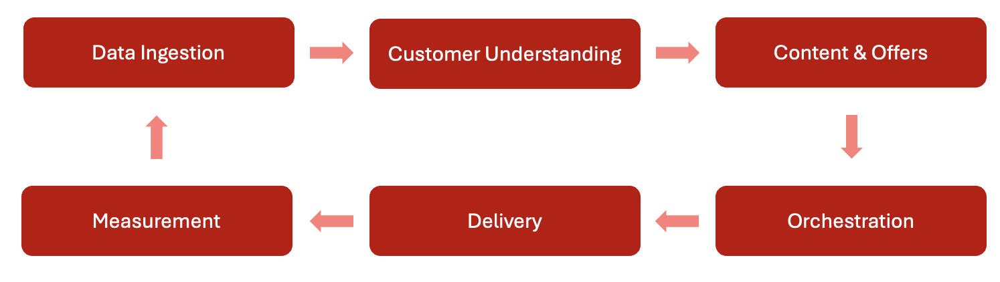

# 了解Journey Optimizer {#understanding-ajo}

本页介绍Adobe Experience Platform和Journey Optimizer如何协同工作，涵盖持续的数据到体验周期、关键功能领域、架构详细信息和集成点。

Adobe Journey Optimizer和Adobe Experience Platform可协同工作，实现大规模的数据驱动个性化。 此页面介绍这些系统如何运行以及它们的主要功能领域如何相结合以提供卓越的客户体验。 [了解关键功能](get-started.md) | [探索关键术语](terminology.md)

## Journey Optimizer的工作原理 {#how-it-works}

没有统一的数据基础，品牌就不得不依赖多个特定于渠道的工具，这使其难以保持对每个客户的一致视图或实时对其行为采取行动。 Journey Optimizer通过在Adobe Experience Platform的基础上将客户数据、内容创建和历程编排连接到一个连续的系统中来解决此问题。 其结果是打造有意义的品牌体验，进而提高客户忠诚度和实现存留期价值。

Adobe Journey Optimizer作为连续流运行，收集、分析和应用数据以创建个性化的客户历程。

### Adobe Experience Platform：基础 {#aep-foundation}

Adobe Experience Platform作为骨干，使品牌商能够集中客户数据并激活它以实现个性化体验：

* **Data Platform** — 用于收集、管理和构建客户数据的中心中心，以确保跨系统的一致性。 [了解架构和数据集](../data/get-started-schemas.md)
* **数据摄取（源）** — 使用预建连接器从CRM平台、网站、移动应用程序和云存储导入数据。 [浏览数据源](get-started-sources.md)
* **实时客户个人资料** — 通过合并来自多个来源的数据（电子邮件交互、店内购买、Web行为）来创建统一的个人资料。 [了解用户档案](../audience/get-started-profiles.md)
* **治理层** — 在遵守法规的同时管理数据访问、隐私合规性和安全性。 [查看隐私文档](../privacy/get-started-privacy.md)

### Adobe Journey Optimizer：编排引擎 {#ajo-orchestration}

Adobe Journey Optimizer运用Adobe Experience Platform提供的数据和见解，提供智能、个性化的客户体验：

* **客户了解** — 实时客户配置文件支持按受众细分目标消息传送。 [创建受众](../audience/about-audiences.md)
* **内容和选件** — 内置的可视化设计器、可重用模板和集中式资源库允许团队为任何渠道创作和个性化消息，而无需离开平台。 动态个性化根据客户属性、行为和上下文来调整内容。 然后，实时决策逻辑为每位个人选择最佳选件。 [设计内容](../../rp_landing_pages/content-management-landing-page.md) | [管理资源](../integrations/assets.md) | [管理优惠](../offers/get-started/starting-offer-decisioning.md)
* **历程和营销活动管理** — 自动处理交互（历程）序列或计划一次性定向消息（营销活动）。 [生成历程](../building-journeys/journey-gs.md) | [创建营销活动](../campaigns/get-started-with-campaigns.md)
* **投放（连接）** — 通过电子邮件、短信、推送通知和直邮等渠道发送消息；将数据导出到外部系统。 [配置渠道](../configuration/get-started-configuration.md)
* **测量和分析** — 通过报告跟踪客户参与和促销活动效果，以便持续改进。 [查看报告](../reports/campaign-global-report-cja.md)

### 持续优化周期 {#optimization-cycle}

该生态系统作为一个持续优化周期运行。 数据推动客户了解，从而形成个性化内容和决策。 这些功能经过精心编排为历程，跨渠道交付，进行有效性衡量并随着时间的推移而优化。

## 主要职能领域 {#functional-areas}

Journey Optimizer包括七个紧密结合的关键功能领域：

| 功能区 | 用途 | 关键活动 |
|-----------------|---------|----------------|
| **数据管理** | 组织客户数据 | 定义架构、创建数据集、从各种系统导入数据。 [了解详情](../data/get-started-schemas.md) |
| **客户管理** | 了解您的客户是谁 | 构建统一的用户档案、解析身份和创建受众。 [了解详情](../audience/get-started-profiles.md) |
| **内容管理** | 创建个性化消息 | 设计电子邮件、管理资产、构建模板和片段、个性化内容。 [了解详情](../../rp_landing_pages/content-management-landing-page.md) |
| **决策管理** | 实时选择最佳选件 | 管理优惠库、定义规则、应用约束、建立排名逻辑。 [了解详情](../offers/get-started/starting-offer-decisioning.md) |
| **历程管理** | 设计自动化客户体验 | 使用可视设计器创建历程、设置触发器、添加条件和等待步骤。 [了解详情](../building-journeys/journey-gs.md) |
| **连接** | 连接数据源和渠道 | 配置源连接器、设置通道、连接到外部平台。 [了解详情](../configuration/get-started-configuration.md) |
| **管理和隐私** | 控制设置和合规性 | 管理用户、配置沙盒、设置渠道和处理隐私请求。 [了解详情](../administration/permissions.md) |

### 这些领域如何协同工作 {#working-together}

这些职能领域以连续的周期运作：

1. **数据摄取** — 数据流入Adobe Experience Platform，由数据管理构建
2. **客户了解** - Real-time Customer Profiles统一数据；客户管理创建受众
3. **内容和优惠策略** — 内容管理创建消息；决策管理定义优惠逻辑
4. **编排** -历程管理使用客户数据、内容和决策映射跨渠道的交互
5. **传递** — 连接有助于通过渠道传递消息或与外部系统共享数据
6. **测量** — 性能数据将分析反馈回以优化受众、内容、决策和历程
7. **治理** — 管理和隐私控制确保整个过程中的合规性

## 架构详细信息 {#architecture-details}

Journey Optimizer是原生构建在Adobe Experience Platform上的四个应用程序之一，另外三个应用程序是Real-Time CDP、Customer Journey Analytics和Adobe Mix Modeler。 它共享AEP的核心服务 — 实时客户档案、身份图、数据治理和查询服务 — 因此它无需单独的集成即可访问统一的客户数据基础。 Journey Optimizer可以作为独立应用程序运行，也可以与其他AEP本机应用程序互操作。

要深入了解技术架构（包括集成模式、先决条件和系统数据流），请参阅[Adobe Journey Optimizer蓝图](https://experienceleague.adobe.com/en/docs/blueprints-learn/architecture/architecture-diagrams/customer-journeys/journey-optimizer/journey-optimizer-overview){target="_blank"}。 有关实施注意事项，[查看护栏和限制](guardrails.md)。

## 隐私和安全性 {#privacy-security}

Adobe Experience Cloud的隐私和安全实践适用于Adobe Journey Optimizer。 这些措施可确保遵守GDPR等隐私法规，从而使您能够提供个性化体验，同时维护客户信任。 [在Journey Optimizer中了解有关隐私的更多信息](../privacy/get-started-privacy.md)
