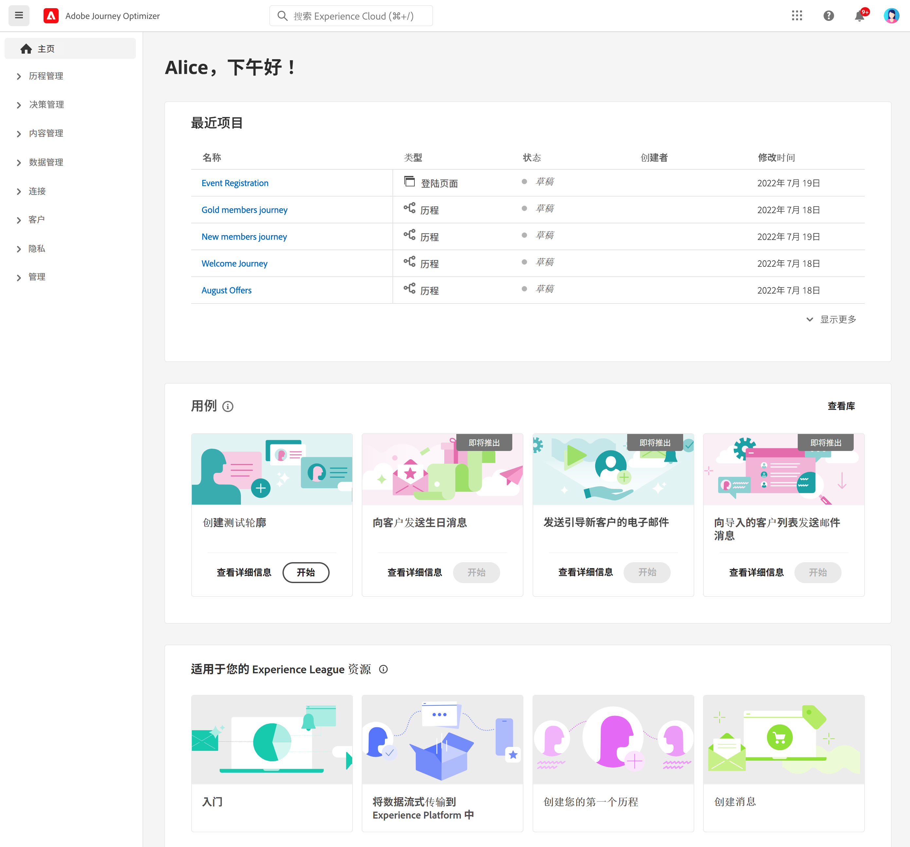
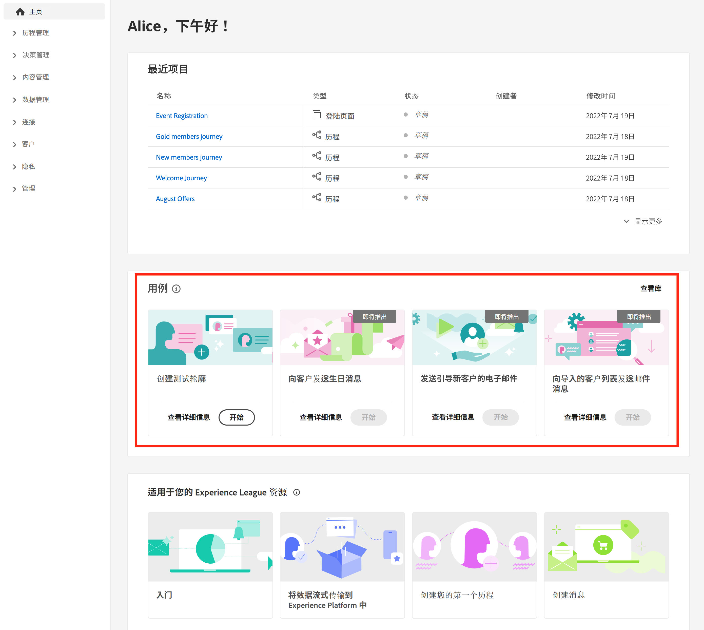
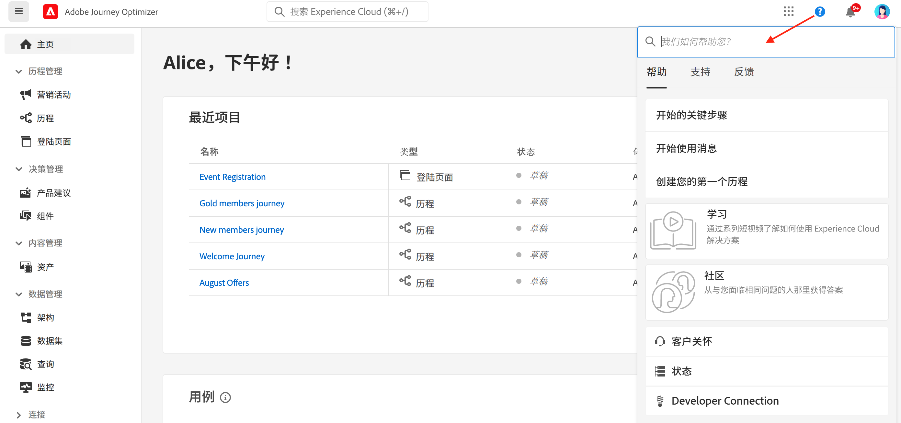
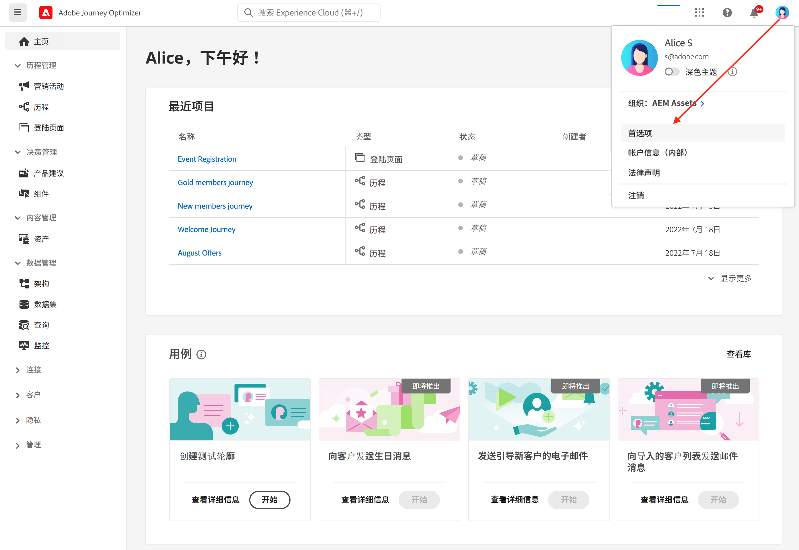
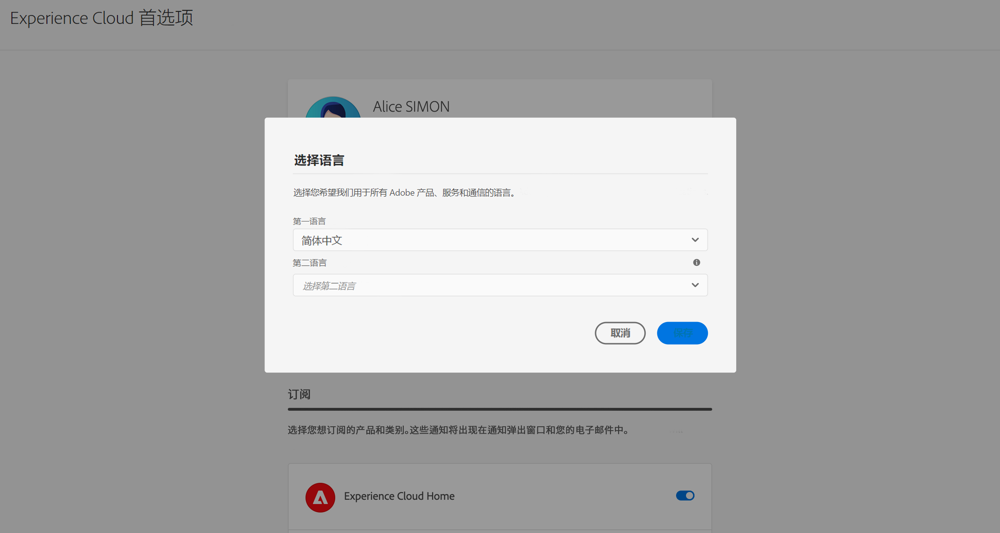
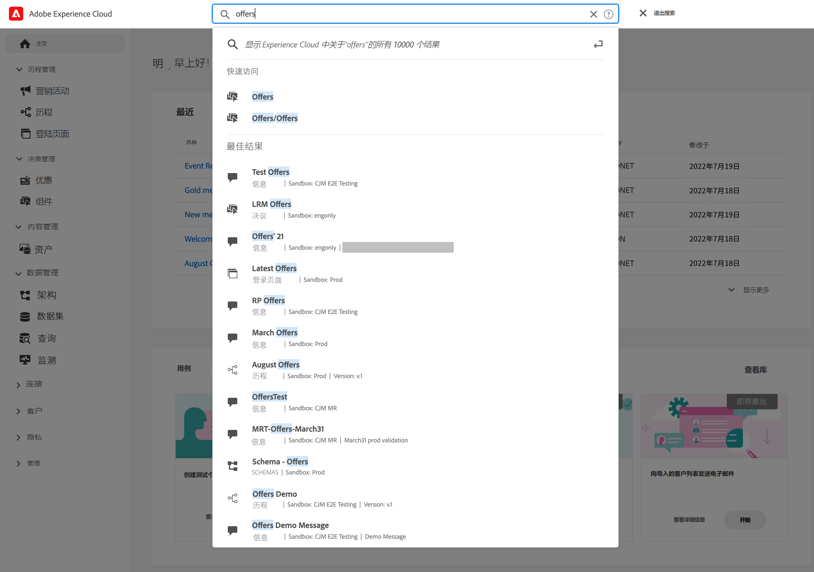
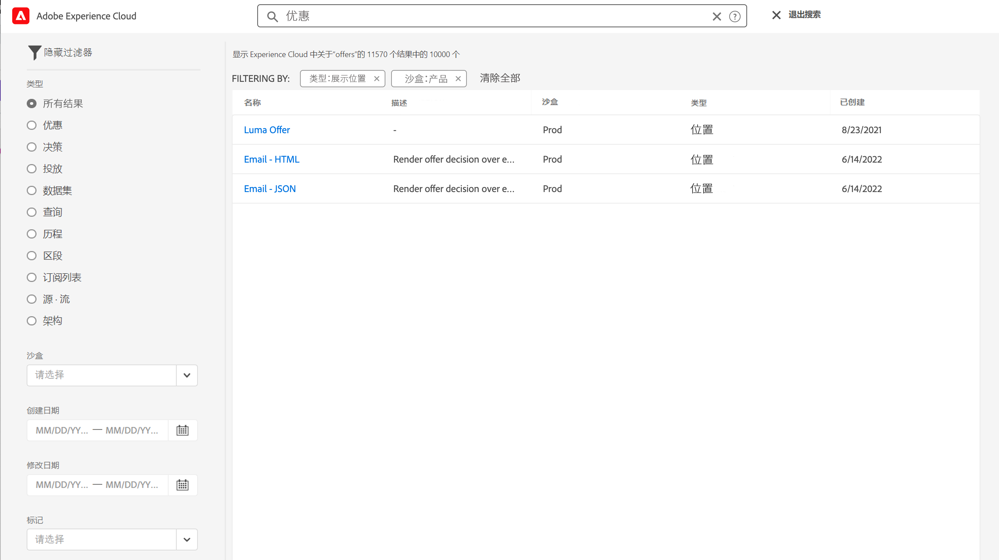
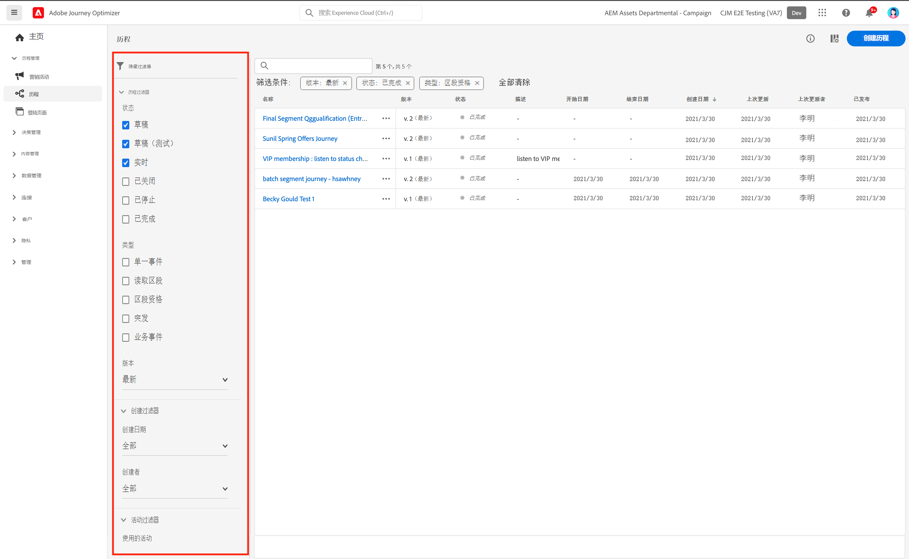
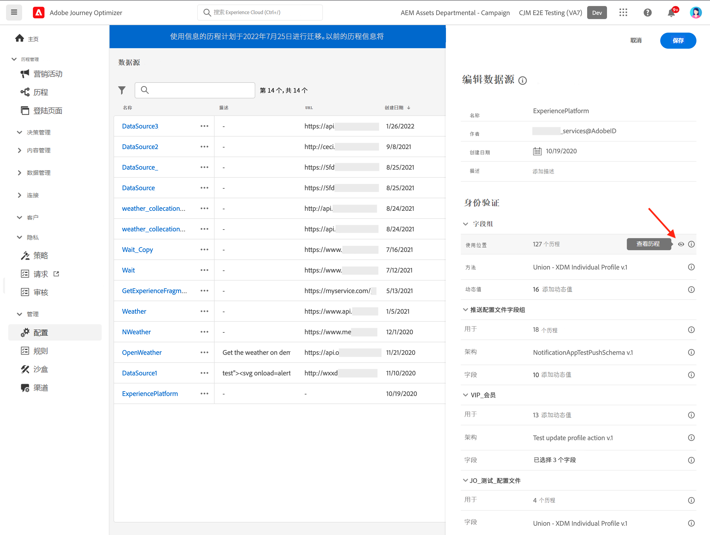
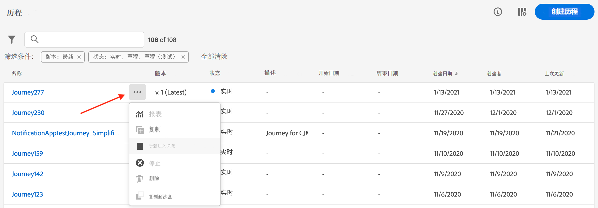

# 用户界面 {#cjm-user-interface}

连接到 [Adobe Experience Cloud](http://experience.adobe.com) 并浏览至 [!DNL Journey Optimizer]。

浏览用户界面时的主要概念与 Adobe Experience Platform 中是类似的。如需更多详细信息，请参阅 [Adobe Experience Platform 文档](https://experienceleague.adobe.com/docs/experience-platform/landing/platform-ui/ui-guide.html?lang=zh-Hans#adobe-experience-platform-ui-guide){target=&quot;_blank&quot;}。

用户界面中可用的组件和功能取决于您的[权限](../administration/permissions.md)和[许可方案](https://helpx.adobe.com/cn/legal/product-descriptions/adobe-journey-optimizer.html){target=&quot;_blank&quot;}。如有任何问题，请联系 Adobe 客户成功经理。

>[!NOTE]
>
>本文档经常更新，以反映产品用户界面的最新更改。但是，某些屏幕截图可能与用户界面略有不同。

## 左侧导航栏 {#left-nav}

使用左侧的链接访问 [!DNL Journey Optimizer] 功能。

>[!NOTE]
>
>可用功能可能因您的权限和许可协议而异。

您可以在左侧导航栏中找到以下完整的服务和功能列表以及相关帮助页面的链接。

**主页**

[!DNL Journey Optimizer] 主页包含可供开始使用的关键链接和资源。**[!UICONTROL 最近]**&#x200B;列表提供指向最近创建的事件和历程的快捷方式。此列表显示创建和修改它们的日期及状态。

**[!UICONTROL 历程管理]**

* **[!UICONTROL 历程]** - 创建、配置和编排客户历程。[了解详情](../building-journeys/journey-gs.md#jo-build)

* **[!UICONTROL 登陆页面]** - 创建、设计、测试和发布登陆页面。[了解详情](../landing-pages/get-started-lp.md)

**[!UICONTROL 决策管理]**

* **[!UICONTROL 优惠]** - 通过此菜单访问近期的源和数据集。使用此部分可创建新优惠。[了解详情](../offers/offer-library/creating-personalized-offers.md)

* **[!UICONTROL 组件]** - 创建投放位置、规则和标记。[了解详情](../offers/offer-library/key-steps.md)

**[!UICONTROL 内容管理]**

* **[!UICONTROL 资源]** - [!DNL Adobe Experience Manager Assets Essentials] 是一个集中式资源存储库，您可以使用它填充消息。[了解详情](../design/assets-essentials.md)

**[!UICONTROL 数据管理]**

* **[!UICONTROL 架构]** - 使用 Adobe Experience Platform 在称为“架构编辑器”的交互式可视画布中创建和管理 Experience Data Model (XDM) 架构。[了解详情](get-started-schemas.md)

* **[!UICONTROL 数据集]** - 摄取到 Adobe Experience Platform 中的所有数据将作为数据集保留在数据湖中。数据集是用于数据集合的存储和管理结构，通常是表格，其中包含架构（列）和字段（行）。[了解详情](get-started-datasets.md)

* **[!UICONTROL 查询]** - 使用 Adobe Experience Platform Query Service 编写和执行查询，查看先前执行的查询，以及访问由您组织内的用户保存的查询。[了解详情](get-started-queries.md)

* **[!UICONTROL 监测]** - 使用此菜单可监测 Adobe Experience Platform 用户界面中的数据摄取。[了解详情](https://experienceleague.adobe.com/docs/experience-platform/ingestion/quality/monitor-data-ingestion.html?lang=zh-Hans){target=&quot;_blank&quot;}

**[!UICONTROL 连接]**

* **[!UICONTROL 源]** - 使用此菜单从各种来源（如 Adobe 应用程序、基于云的存储、数据库等）中摄取数据，并构建、标记和增强传入数据。[了解详情](get-started-sources.md)

**[!UICONTROL 客户]**

* **[!UICONTROL 区段]** - 创建和管理 Experience Platform 区段定义，并将其用于您的历程。[了解详情](../segment/about-segments.md)

* **[!UICONTROL 用户档案]** - Real-time Customer Profile 可以为每位客户创建整体视图，结合来自多个渠道（包括在线、离线、CRM 和第三方数据）的数据。[了解详情](../segment/get-started-profiles.md)

* **[!UICONTROL 身份]** - Adobe Experience Platform Identity Service 通过 Adobe Experience Platform 中称为“身份图”的方式管理客户的跨设备、跨渠道和近乎实时的身份识别。[了解详情](../segment/get-started-identity.md)

**[!UICONTROL 管理]**

* **[!UICONTROL 历程管理]** - 使用此菜单来配置要在历程中使用的[事件](../event/about-events.md)、[数据源](../datasource/about-data-sources.md)和[操作](../action/action.md)。

* **[!UICONTROL 沙盒]** - Adobe Experience Platform 提供了可将单个实例划分为多个单独的虚拟环境的沙盒，以帮助开发和改进数字体验应用程序。[了解详情](../administration/sandboxes.md)

* **[!UICONTROL 警报]** - 利用该用户界面，可根据 Adobe Experience Platform Observability Insights 显示的量度，查看已接收警报的历史记录。利用此 UI，还可查看、启用和禁用可用的警报规则。[了解详情](https://experienceleague.adobe.com/docs/experience-platform/observability/alerts/overview.html?lang=zh-Hans){target=&quot;_blank&quot;}

## 产品内用例 {#in-product-uc}

在主页中利用 [!DNL Adobe Journey Optimizer]用例，快速输入一些信息以创建客户历程。

可用用例包括：

* **创建测试用户档案**，以使用我们的 CSV 模板创建测试用户档案，测试个性化消息和历程。[在此页面中](../segment/creating-test-profiles.md#use-case-1)了解如何实施此用例。
* **向客户发送生日消息**，可以在临近客户生日时自动向其发送祝福电子邮件。（即将推出）
* **向新客户发送电子邮件**，可以轻松发送最多两封电子邮件来欢迎新注册的客户。（即将推出）
* **将推送消息发送到导入的客户列表**，可以快速将推动通知发送到从 CSV 文件导入的客户列表。（即将推出）

单击&#x200B;**[!UICONTROL 查看详细信息]**&#x200B;了解关于每个用例的更多信息。

单击&#x200B;**[!UICONTROL 开始]**&#x200B;按钮开始实施用例。

您可以从&#x200B;**[!UICONTROL 查看用例库]**&#x200B;按钮访问执行的用例。

## 辅助功能{#accessibility}

[!DNL Adobe Journey Optimizer] 中的辅助功能源自于 Adobe Experience Platform：

* 键盘辅助功能
* 颜色对比度
* 验证必填字段

在 Adobe Experience Platform 文档中[了解详情](https://experienceleague.adobe.com/docs/experience-platform/accessibility/features.html?lang=zh-Hans){target=&quot;_blank&quot;}。

您可以在 [!DNL Journey Optimizer] 中使用这些常用键盘快捷键：

| 操作 | 快捷键 |
| --- | --- |
| 在用户界面元素、部分和菜单组之间移动 | Tab |
| 在用户界面元素、部分和菜单组之间向后移动 | Shift + Tab |
| 在部分内移动，将焦点设置到单个元素 | 箭头 |
| 选择或清除焦点元素 | 回车键或空格键 |
| 取消选择、折叠面板、或关闭对话框 | Esc |

在 Adobe Experience Platform 文档中[了解详情](https://experienceleague.adobe.com/docs/experience-platform/accessibility/custom.html?lang=zh-Hans){target=&quot;_blank&quot;}。

您可以在 Journey Optimizer 的特定部分中使用这些快捷键：

<table>
  <thead>
    <tr>
      <th>界面元素</th>
      <th>操作</th>
      <th>快捷键</th>
    </tr>
  </thead>
  <tr>
    <td>历程、操作、数据源或事件列表</td>
    <td>创建历程、操作、数据源或事件</td>
    <td>C</td>
  </tr>
  <tr>
    <td rowspan="3">历程画布处于草稿状态</td>
    <td>从左侧面板的第一个可用位置从上到下添加活动</td>
    <td>双击活动</td>
  </tr>
  <tr>
    <td>选择所有活动</td>
    <td>Ctrl + A (Windows) Command + A (Mac)</td>
  </tr>
  <tr>
    <td>删除选定的活动</td>
    <td>Delete 键或退格键，然后按回车键以确认删除</td>
  </tr>
  <tr>
  <td rowspan="3">

以下元素的配置窗格：

<ul>
  <li>历程中的活动</li>
  <li>事件</li>
  <li>数据源</li>
  <li>操作</li>
</ul>

</td>
    <td>移到要配置的下一个字段</td>
    <td>Tab</td>
  </tr>
  <tr>
    <td>保存更改并关闭配置窗格</td>
    <td>回车键</td>
  </tr>
  <tr>
    <td>放弃更改并关闭配置窗格</td>
    <td>Esc</td>
  </tr>
  <tr>
    <td rowspan="4">测试模式下的历程</td>
    <td>启用或禁用测试模式</td>
    <td>T</td>
  </tr>
  <tr>
    <td>在基于事件的历程中触发事件</td>
    <td>E</td>
  </tr>
  <tr>
    <td>

在基于区段的历程中触发事件，其中&#x200B;**[!UICONTROL 一次单个配置文件]**&#x200B;选项处于打开状态

</td>
    <td>P</td>
  </tr>
  <tr>
    <td>显示测试日志</td>
    <td>L</td>
  </tr>
<!-- //Ajouter ce raccourci quand il marchera (actuellement, le raccourci Ctrl/Cmd+F du navigateur a priorité sur celui de AJO).//
  <tr>
    <td>Page with a search bar</td>
    <td>Select the search bar</td>
    <td>Ctrl/Command + F</td>
  </tr>
-->
  <tr>
    <td>文本字段</td>
    <td>选择所选字段中的所有文本</td>
    <td>Ctrl + A (Windows) Command + A (Mac)</td>
  </tr>
  <tr>
    <td rowspan="2">弹出窗口</td>
    <td>保存更改或确认操作</td>
    <td>回车键</td>
  </tr>
  <tr>
    <td>关闭窗口</td>
    <td>Esc</td>
  </tr>
  <tr>
    <td>简单表达式编辑器</td>
    <td>选择并添加字段</td>
    <td>双击字段</td>
  </tr>
  <tr>
    <td>浏览 XDM 字段</td>
    <td>选择节点的所有字段</td>
    <td>选择父节点</td>
  </tr>
  <tr>
    <td>负载预览</td>
    <td>选择有效负载</td>
    <td>Ctrl + A (Windows) Command + A (Mac)</td>
  </tr>
</table>

## 查找帮助和支持 {#find-help}

从主页的下半部分访问 Adobe Journey Optimizer 关键帮助页面。

使用&#x200B;**帮助**&#x200B;图标来访问帮助页面、联系支持人员和分享反馈。 您可以从搜索字段搜索帮助文章和视频。

## 支持的浏览器 {#browsers}

Adobe [!DNL Journey Optimizer] 界面设计为可在最新版 Google Chrome 中发挥最佳表现。在旧版本或其他浏览器上使用某些功能时可能会遇到问题。

## 语言偏好设置 {#language-pref}

用户界面目前提供以下语言版本：

* 英语
* 法语
* 德语

您的默认界面语言由您的用户档案中指定的首选语言决定。

如要更改您的语言：

* 单击右上角头像中的 **Preferences**。
   
* 然后，单击电子邮件地址下显示的语言
* 选择首选语言，然后单击 **Save**。如果您正在使用的组件没有您第一语言的本地化版本，那么您可以选择第二种语言。
   

## 搜索{#unified-search}

在 Adobe Journey Optimizer 界面的任何地方，使用顶部中央位置的 Adobe Experience Cloud 统一搜索功能在沙箱中查找资产、历程和数据集等等。

开始输入内容以显示排名靠前的结果。与输入的关键词有关的帮助文章也会显示在结果中。

按 **Enter** 键访问所有结果并按业务对象进行筛选。

## 过滤器列表{#filter-lists}

在大多数列表中，搜索栏允许您搜索特定项目并选择筛选条件。

单击列表左上角的过滤器图标即可访问过滤器。通过使用过滤器菜单，您可以根据不同的条件筛选显示的元素。您可以选择仅显示特定类型或状态的元素、您创建的元素或最近 30 天内修改过的元素。选项因上下文不同而异。

在历程列表中，您可以根据历程的状态、类型和版本从&#x200B;**[!UICONTROL 状态和版本筛选器]**&#x200B;中筛选历程。类型可以是：**[!UICONTROL 单一事件]**、**[!UICONTROL 区段鉴别]**、**[!UICONTROL 读取区段]**、**[!UICONTROL 业务事件]**&#x200B;或&#x200B;**[!UICONTROL 突发]**。您可以从&#x200B;**[!UICONTROL 活动过滤器]**&#x200B;和&#x200B;**[!UICONTROL 数据过滤器]**&#x200B;中选择仅显示使用特定事件、字段组或操作的历程。通过&#x200B;**[!UICONTROL 发布过滤器]**，您可以选择发布日期或用户。例如，您可以选择显示昨天发布的最新版实时历程。[了解详情](../building-journeys/using-the-journey-designer.md)。

>[!NOTE]
>
>请注意，显示的列可以使用列表右上角的配置按钮进行个性化设置。为每个用户保存个性化设置。

使用&#x200B;**[!UICONTROL 上次更新]**&#x200B;和&#x200B;**[!UICONTROL 上次更新者]**&#x200B;列检查历程的上次更新时间以及保存该更新的人员。

在“事件”、“数据源”和“操作”配置窗格中，**[!UICONTROL 使用位置]**&#x200B;字段显示使用该特定事件、字段组或操作的历程数。您可以单击&#x200B;**[!UICONTROL 查看历程]**&#x200B;按钮以显示相应历程的列表。

在列表中，您可以对每个元素执行基本操作。例如，您可以删除项目或制作项目副本。

