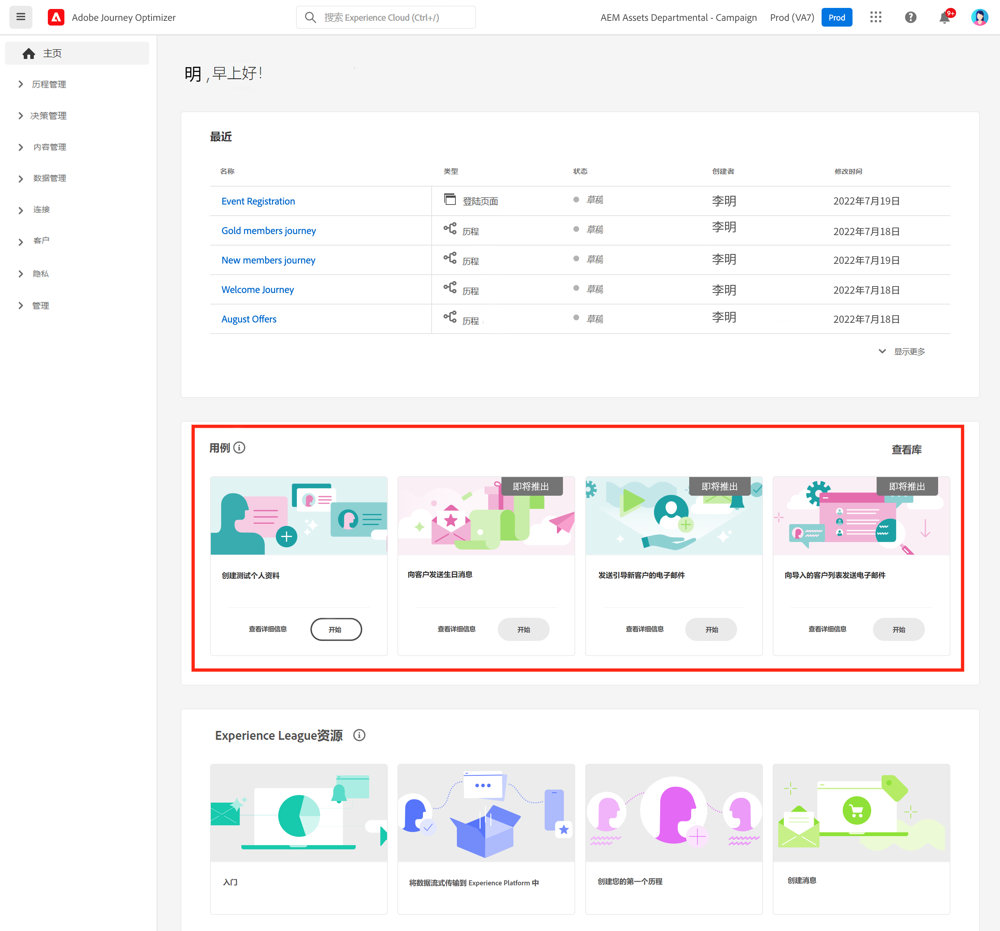
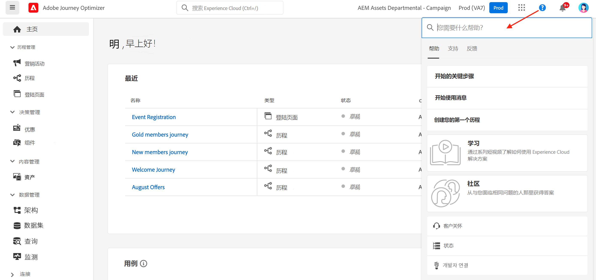
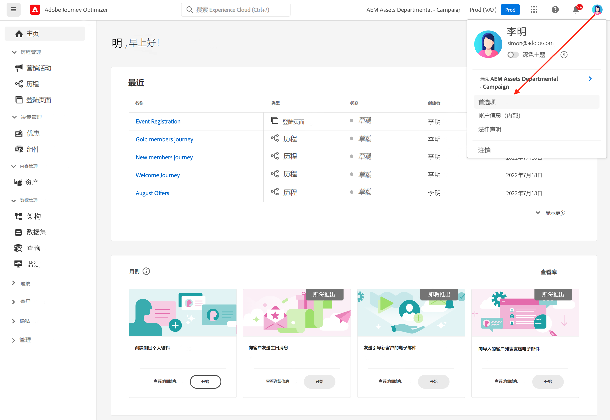

# 用户界面 {#cjm-user-interface}

要访问 [!DNL Adobe Journey Optimizer]，请使用 Adobe ID 连接到 [Adobe Experience Cloud](https://experience.adobe.com)，然后选择 [!DNL Journey Optimizer]。

浏览用户界面时的主要概念与 Adobe Experience Platform 中是类似的。如需更多详细信息，请参阅 [Adobe Experience Platform 文档](https://experienceleague.adobe.com/docs/experience-platform/landing/platform-ui/ui-guide.html?lang=zh-Hans#adobe-experience-platform-ui-guide)。{target="_blank"}

用户界面中可用的组件和功能取决于您的[权限](../administration/permissions.md)和[许可方案](https://helpx.adobe.com/cn/legal/product-descriptions/adobe-journey-optimizer.html){target="_blank"}。如有任何问题，请联系 Adobe 客户成功经理。

>[!NOTE]
>
>本文档经常更新，以反映产品用户界面的最新更改。但是，某些屏幕截图可能与用户界面略有不同。

## 左侧导航栏 {#left-nav}

使用左侧的链接访问 [!DNL Journey Optimizer] 功能。

>[!NOTE]
>
>可用功能可能因您的权限和许可协议而异。

您可以在左侧导航栏中找到以下完整的服务和功能列表以及相关帮助页面的链接。

### 主页 {#left-nav-home}

[!DNL Journey Optimizer] 主页包含可供开始使用的关键链接和资源。

**[!UICONTROL 最近]**&#x200B;列表提供指向最近创建的事件和历程的快捷方式。此列表显示创建和修改它们的日期及状态。

浏览产品内使用案例，开始创建资源和消息。[了解详情](#in-product-use-cases)。

使用主页底部的链接了解如何开始使用 [!DNL Journey Optimizer]。[了解详情](#find-help-and-support)。

### [!UICONTROL 历程管理] {#left-nav-journey}

通过此部分构建营销活动和历程。

* **[!UICONTROL 营销活动]** - 创建、配置和编排营销活动，使用各种渠道向特定受众投放一次性内容。[了解详情](../campaigns/get-started-with-campaigns.md)

* **[!UICONTROL 历程]** - 创建、配置和编排客户历程：将事件、编排和操作活动相结合，构建多步骤跨渠道方案。[了解详情](../building-journeys/journey-gs.md#jo-build)

* **[!UICONTROL 登陆页面]** - 创建、设计、测试和发布登陆页面：将用户链接发送到在线表单，用户可以在其中选择加入或选择退出接收通信，或订阅特定服务。[了解详情](../landing-pages/get-started-lp.md)

### [!UICONTROL 决策管理] {#left-nav-offers}

通过此部分创建优惠和组件。

* **[!UICONTROL 优惠]** - 通过此菜单访问近期的源和数据集。使用此部分可创建新优惠。[了解详情](../offers/offer-library/creating-personalized-offers.md)

* **[!UICONTROL 组件]** - 创建投放位置、规则和标记。[了解详情](../offers/offer-library/key-steps.md)

### [!UICONTROL 内容管理] {#left-nav-content}

通过此部分创建和管理内容。

* **[!UICONTROL 资源]** - [!DNL Adobe Experience Manager Assets] 是一个集中式资源存储库，您可以使用它填充消息。[了解详情](../content-management/assets.md)

* **[!UICONTROL 内容模板]** - 为了加快并改进设计过程，创建独立模板以轻松地在 Journey Optimizer 营销活动和历程中重复使用自定义内容。[了解详情](../content-management/content-templates.md)

* **[!UICONTROL 片段]** - 创建和管理片段以顺利完成电子邮件设计过程：预构建可用于快速组合电子邮件内容的自定义内容块。[了解详情](../content-management/fragments.md)

### [!UICONTROL 数据管理] {#left-nav-data}

通过此部分管理数据。

* **[!UICONTROL 架构]** - 使用 Adobe Experience Platform 在称为“架构编辑器”的交互式可视画布中创建和管理 Experience Data Model (XDM) 架构。[了解详情](../data/get-started-schemas.md)

* **[!UICONTROL 数据集]** - 摄取到 Adobe Experience Platform 中的所有数据将作为数据集保留在数据湖中。数据集是用于数据集合的存储和管理结构，通常是表格，其中包含架构（列）和字段（行）。[了解详情](../data/get-started-datasets.md)

* **[!UICONTROL 查询]** - 使用 Adobe Experience Platform Query Service 编写和执行查询，查看先前执行的查询，以及访问由您组织内的用户保存的查询。[了解详情](../data/get-started-queries.md)

* **[!UICONTROL 监测]** - 使用此菜单可监测 Adobe Experience Platform 用户界面中的数据摄取。在 [Adobe Experience Platform 文档](https://experienceleague.adobe.com/docs/experience-platform/ingestion/quality/monitor-data-ingestion.html?lang=zh-Hans){target="_blank"}中了解更多信息

### [!UICONTROL 连接] {#left-nav-connections}

通过此部分管理与其他应用程序和云的数据连接。

* **[!UICONTROL 源]** - 使用此菜单从各种来源（如 Adobe 应用程序、基于云的存储、数据库等）中摄取数据。您可以构建、标记和增强传入数据。[了解详情](get-started-sources.md)

* **[!UICONTROL 目标]** - 使用此菜单创建与云存储位置的实时连接，以导出数据集的内容。[了解详情](../data/export-datasets.md)

### [!UICONTROL 客户] {#left-nav-customers}

通过此部分管理受众和个人资料数据。

* **[!UICONTROL 受众]** - 创建和管理 Experience Platform 受众，并将其用于历程。[了解详情](../audience/about-audiences.md)

* **[!UICONTROL 订阅列表]** - 在 [!DNL Journey Optimizer] 中，选择加入订阅服务的客户会被收录到订阅列表中。[了解详情](../landing-pages/subscription-list.md)

* **[!UICONTROL 用户档案]** - Real-time Customer Profile 可以为每位客户创建整体视图，结合来自多个渠道（包括在线、离线、CRM 和第三方数据）的数据。[了解详情](../audience/get-started-profiles.md)

* **[!UICONTROL 身份]** - Adobe Experience Platform Identity Service 通过 Adobe Experience Platform 中称为“身份图”的方式管理客户的跨设备、跨渠道和近乎实时的身份识别。[了解详情](../audience/get-started-identity.md)

### [!UICONTROL 隐私] {#left-nav-privacy}

通过此部分控制隐私管理和请求。

* **[!UICONTROL 策略]** - 通过 Adobe Experience Platform，您可以为字段添加标签，并为每个渠道创建营销操作。然后，可定义链接到标签和营销操作的治理策略。[了解详情](../action/action-privacy.md)

* **[!UICONTROL 请求]** - 在 Adobe Experience Platform Privacy Service 中管理隐私请求。它提供 RESTful API 和用户界面，可帮助您管理客户数据请求。[了解详情](../privacy/requests.md)

* **[!UICONTROL 审核]** - 浏览到此部分，查看活动日志。[了解详情](../privacy/audit-logs.md)

* **[!UICONTROL 数据卫生]** - 此部分允许您配置和计划数据卫生操作，确保正确维护记录。[了解详情](../privacy/data-hygiene.md)

### [!UICONTROL 管理] {#left-nav-admin}

* **[!UICONTROL 配置]** - 使用此菜单来配置要在历程中使用的[事件](../event/about-events.md)、[数据源](../datasource/about-data-sources.md)和[操作](../action/action.md)。

  您还可以访问&#x200B;**报告**&#x200B;部分，以便为营销活动试验配置报告。[了解详情](../content-management/reporting-configuration.md)

* **[!UICONTROL 业务规则]** - 使用此部分可创建跨渠道业务规则，控制用户接收消息或进入历程的频率。[了解详情](../configuration/frequency-rules.md)

* **[!UICONTROL 警报]** - 利用该用户界面，可根据 Adobe Experience Platform Observability Insights 显示的量度，查看已接收警报的历史记录。利用此 UI，还可查看、启用和禁用可用的警报规则。[了解详情](../reports/alerts.md)

* **[!UICONTROL 沙盒]** - Adobe Experience Platform 提供了可将单个实例划分为多个单独的虚拟环境的沙盒，以帮助开发和改进数字体验应用程序。浏览此部分以管理沙盒。[了解详情](../administration/sandboxes.md)

* **[!UICONTROL 渠道]** - 使用此部分配置渠道，包括子域、配置和可投放性设置。[了解详情](../configuration/get-started-configuration.md)

* **[!UICONTROL 标记]** - 使用统一标记，您可以轻松地对历程和营销活动进行分类，以改进列表中的搜索。[了解详情](../start/search-filter-categorize.md#work-with-unified-tags)

## 产品内用例 {#in-product-uc}

在 [!DNL Adobe Journey Optimizer] 主页中，产品用例提供了快速输入信息，便于创建测试个人资料或您的第一个客户历程。

可用用例包括：

* **创建测试用户档案**，以使用我们的 CSV 模板创建测试用户档案，测试个性化消息和历程。[在此页面中](../audience/creating-test-profiles.md#use-case-1)了解如何实施此用例。
* **向客户发送生日消息**，可以在临近客户生日时自动向其发送祝福电子邮件。（即将推出）
* **向新客户发送电子邮件**，可以轻松发送最多两封电子邮件来欢迎新注册的客户。（即将推出）
* **将推送消息发送到导入的客户列表**，可以快速将推动通知发送到从 CSV 文件导入的客户列表。（即将推出）

要了解有关每个用例的更多信息，请单击&#x200B;**[!UICONTROL 查看详细信息]**&#x200B;链接。

要运行用例，请单击&#x200B;**[!UICONTROL 开始]**&#x200B;按钮。

您可以通过&#x200B;**[!UICONTROL 查看库]**&#x200B;按钮访问执行的用例。

## 查找帮助和支持 {#find-help}

从主页的下半部分访问 Adobe Journey Optimizer 关键帮助页面。

使用&#x200B;**帮助**&#x200B;图标来访问帮助页面、联系支持人员和分享反馈。您可以从搜索字段搜索帮助文章和视频。

在每个页面中，使用上下文帮助按钮了解有关功能的更多信息，并浏览到 **[!DNL Adobe Experience League]** 文档。

## 语言首选项 {#language-pref}

用户界面提供以下语言版本：

* 英语
* 法语
* 德语
* 意大利语
* 西班牙语
* 葡萄牙语（巴西）
* 日语
* 朝鲜语
* 繁体中文
* 简体中文

您的默认界面语言由您的用户档案中指定的首选语言决定。

如要更改您的语言：

* 单击右上角头像中的 **Preferences**。
  
* 然后，单击电子邮件地址下显示的语言
* 选择首选语言，然后单击 **Save**。如果您正在使用的组件没有您第一语言的本地化版本，那么您可以选择第二语言。
  

<!--CONTEXTUAL HELP TO DISPATCH IN DOCS ONCE FEATURE LIVE-->

<!--PRIORITIZATION & CONFLICT MANAGEMENT-->

>[!CONTEXTUALHELP]
>id="ajo_journey_priority"
>title="优先级"
>abstract="为历程分配优先级，范围从 0 到 100。数字越大，表示优先级越高。当两个历程使用同一表面时，Journey Optimizer 将选择具有最高优先级的历程。如果历程优先级相同，则将选择最近修改的历程。"

>[!CONTEXTUALHELP]
>id="ajo_campaigns_campaign_priority"
>title="优先级"
>abstract="为营销活动分配优先级等级，范围从 0 到 100。数字越大，表示优先级越高。当两个营销活动使用同一表面时，Journey Optimizer 将选择具有最高优先级等级的营销活动。如果营销活动优先级相同，则将选择最近修改的营销活动。"

>[!CONTEXTUALHELP]
>id="ajo_campaigns_campaign_conflict"
>title="营销活动中的冲突查看器"
>abstract="营销活动中的冲突查看器"

>[!CONTEXTUALHELP]
>id="ajo_journey_conflict"
>title="历程中的冲突查看器"
>abstract="历程中的冲突查看器"

>[!CONTEXTUALHELP]
>id="ajo_rule_set_domain"
>title="对象类型"
>abstract="对象类型"

>[!CONTEXTUALHELP]
>id="ajo_journey_capping_rule"
>title="将规则集应用于历程"
>abstract="待定"

>[!CONTEXTUALHELP]
>id="ajo_rule_set_rule_type"
>title="规则类型"
>abstract="规则类型"

>[!CONTEXTUALHELP]
>id="ajo_rule_set_concurrency_prioritization"
>title="优先顺序展望"
>abstract="优先顺序展望"

>[!CONTEXTUALHELP]
>id="ajo_campaigns_capping_rule"
>title="将规则集应用于营销活动"
>abstract="待定"

<!--TO REMOVE?-->

>[!CONTEXTUALHELP]
>id="ajo_rule_set_prioritization"
>title="优先级中的因素"
>abstract="待定"

<!--TO REMOVE?-->

<!--CONTENT LOCKING-->

>[!CONTEXTUALHELP]
>id="ajo_locking_governance"
>title="治理"
>abstract="治理"

>[!CONTEXTUALHELP]
>id="ajo_locking_mode"
>title="模式"
>abstract="模式"

>[!CONTEXTUALHELP]
>id="ajo_locking_content_addition"
>title="启用内容添加"
>abstract="启用内容添加"

>[!CONTEXTUALHELP]
>id="ajo_locking_structure"
>title="结构中的内容锁定"
>abstract="结构中的内容锁定"

>[!CONTEXTUALHELP]
>id="ajo_locking_component"
>title="在组件中使用特定锁定"
>abstract="在组件中使用特定锁定"

>[!CONTEXTUALHELP]
>id="ajo_email_editable_areas"
>title="突出显示可编辑区域"
>abstract="突出显示可编辑区域"

>[!CONTEXTUALHELP]
>id="ajo_email_locking_activated"
>title="已启用治理"
>abstract="内容锁定已激活，可能会阻止您进行修改。"

>[!CONTEXTUALHELP]
>id="ajo_email_locking_read_only"
>title="只读"
>abstract="此内容为只读内容，无法修改。"

<!--GOVERNANCE POLICIES-->

>[!CONTEXTUALHELP]
>id="ajo_data_governance_policy_violation"
>title="数据治理策略违规"
>abstract="数据治理策略违规"

<!--APPROVAL POLICIES-->

>[!CONTEXTUALHELP]
>id="ajo_permissions_approval_policy"
>title="审批策略"
>abstract="审批策略"

>[!CONTEXTUALHELP]
>id="ajo_approval_policy_request_approval"
>title="请求审批"
>abstract="请求审批"

>[!CONTEXTUALHELP]
>id="ajo_approval_policy_request_change"
>title="请求更改"
>abstract="请求更改"

>[!CONTEXTUALHELP]
>id="ajo_campaigns_edit_disabled"
>title="编辑已禁用"
>abstract="编辑已禁用（营销活动）"

>[!CONTEXTUALHELP]
>id="ajo_journey_edit_disabled"
>title="编辑已禁用"
>abstract="编辑已禁用（历程）"

>[!CONTEXTUALHELP]
>id="ajo_approval_policy_approval_status"
>title="审批状态"
>abstract="审批状态"

>[!CONTEXTUALHELP]
>id="ajo_campaigns_approve"
>title="审批"
>abstract="批准（营销活动）"

>[!CONTEXTUALHELP]
>id="ajo_journey_approve"
>title="审批"
>abstract="批准（历程）"

<!--Multilingual-->

>[!CONTEXTUALHELP]
>id="ajo_multi_custom_conditional"
>title="自定义条件设置"
>abstract="自定义条件设置"

>[!CONTEXTUALHELP]
>id="ajo_multi_fallback"
>title="回退首选项"
>abstract="回退首选项"
