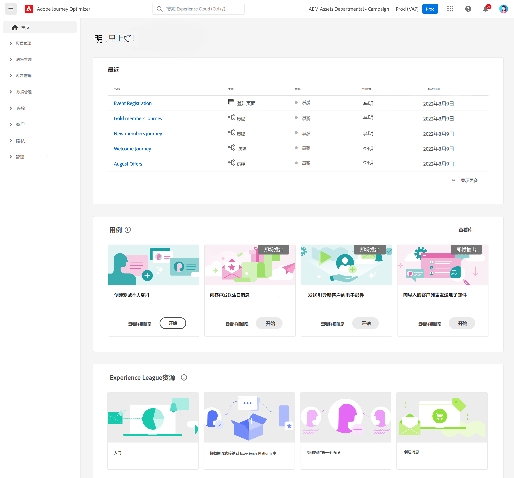

# 用户界面 {#cjm-user-interface}

连接到 [Adobe Experience Cloud](http://experience.adobe.com) 浏览 [!DNL Journey Optimizer].

浏览用户界面时的主要概念是Adobe Experience Platform的常见概念。 请参阅 [Adobe Experience Platform文档](https://experienceleague.adobe.com/docs/experience-platform/landing/platform-ui/ui-guide.html#adobe-experience-platform-ui-guide){target=&quot;_blank&quot;}以了解更多详细信息。

用户界面中可用的组件和功能取决于您的 [权限](../administration/permissions.md) 在 [许可包](https://helpx.adobe.com/legal/product-descriptions/adobe-journey-optimizer.html){target=&quot;_blank&quot;}。 如有任何问题，请联系您的Adobe客户成功经理。

>[!NOTE]
>
>此文档经常更新以反映产品用户界面中的最新更改。 但是，某些屏幕截图可能与您的用户界面略有不同。

## 左侧导航 {#left-nav}

浏览左侧的链接以访问 [!DNL Journey Optimizer] 功能。

>[!NOTE]
>
>可用功能可能因您的权限和许可协议而异。

您可以在下面找到左侧导航中可用的服务和功能的完整列表，以及指向关联帮助页面的链接。

**主页**

[!DNL Journey Optimizer] 主页包含要开始的关键链接和资源。 的 **[!UICONTROL Recents]** 列表提供了最近创建的事件和历程的快捷方式。 此列表显示了其创建和修改日期及状态。

**[!UICONTROL JOURNEY MANAGEMENT]**

* **[!UICONTROL Journeys]**  — 创建、配置和编排客户旅程。 [了解更多](../building-journeys/journey-gs.md#jo-build)

* **[!UICONTROL Landing pages]**  — 创建、设计、测试和发布登陆页面。 [了解更多](../landing-pages/get-started-lp.md)

**[!UICONTROL DECISION MANAGEMENT]**

* **[!UICONTROL Offers]**  — 通过此菜单访问您最近的源和数据集。 使用此部分可创建新选件。 [了解更多](../offers/offer-library/creating-personalized-offers.md)

* **[!UICONTROL Components]**  — 创建版面、规则和标记。 [了解更多](../offers/offer-library/key-steps.md)

**[!UICONTROL CONTENT MANAGEMENT]**

* **[!UICONTROL Assets]** - [!DNL Adobe Experience Manager Assets Essentials] 是用于填充消息的资产集中存储库。 [了解更多](../email/assets-essentials.md)

**[!UICONTROL DATA MANAGEMENT]**

* **[!UICONTROL Schemas]**  — 使用Adobe Experience Platform在称为架构编辑器的交互式可视化画布中创建和管理Experience Data Model(XDM)架构。 [了解更多](../data/get-started-schemas.md)

* **[!UICONTROL Datasets]**  — 摄取到Adobe Experience Platform的所有数据都将作为数据集在数据湖中持久保留。 数据集是用于数据集合（通常是表）的存储和管理结构，其中包含架构（列）和字段（行）。 [了解更多](../data/get-started-datasets.md)

* **[!UICONTROL Queries]**  — 使用Adobe Experience Platform查询服务来编写和执行查询、查看以前执行的查询，以及访问组织内用户保存的查询。 [了解更多](../data/get-started-queries.md)

* **[!UICONTROL Monitoring]**  — 使用此菜单可在Adobe Experience Platform用户界面中监控数据摄取。 [了解更多](https://experienceleague.adobe.com/docs/experience-platform/ingestion/quality/monitor-data-ingestion.html){target=&quot;_blank&quot;}

**[!UICONTROL CONNECTIONS]**

* **[!UICONTROL Sources]**  — 使用此菜单从各种源（如Adobe应用程序、基于云的存储、数据库等）中摄取数据，并构建、标记和增强传入数据。 [了解更多](get-started-sources.md)

**[!UICONTROL CUSTOMER]**

* **[!UICONTROL Segments]**  — 创建和管理Experience Platform区段定义，并将其用于您的历程。 [了解更多](../segment/about-segments.md)

* **[!UICONTROL Profiles]**  — 实时客户资料可整合来自多个渠道的数据（包括在线、离线、CRM和第三方数据），从而创建每个客户的整体视图。 [了解更多](../segment/get-started-profiles.md)

* **[!UICONTROL Identities]** - Adobe Experience Platform Identity Service可在Adobe Experience Platform内称为身份图的中管理客户的跨设备、跨渠道和近乎实时的标识。 [了解更多](../segment/get-started-identity.md)

**[!UICONTROL ADMINISTRATION]**

* **[!UICONTROL Journey Administration]**  — 使用此菜单配置 [事件](../event/about-events.md), [数据源](../datasource/about-data-sources.md) 和 [操作](../action/action.md) 以在您的历程中使用。

* **[!UICONTROL Sandboxes]** - Adobe Experience Platform提供将单个实例分区为单独虚拟环境的沙盒，以帮助开发和改进数字体验应用程序。 [了解更多](../administration/sandboxes.md)

* **[!UICONTROL Alerts]**  — 利用用户界面，可根据Adobe Experience Platform可观性分析显示的量度，查看接收警报的历史记录。 UI还允许您查看、启用和禁用可用的警报规则。 [了解更多](https://experienceleague.adobe.com/docs/experience-platform/observability/alerts/overview.html){target=&quot;_blank&quot;}

## 产品内用例 {#in-product-uc}

利用 [!DNL Adobe Journey Optimizer] 使用案例，并提供一些快速输入以创建客户历程。

可用用例包括：

* **创建测试用户档案**，以使用我们的CSV模板创建测试用户档案，以测试个性化消息和历程。 了解如何实施此用例 [本页](../segment/creating-test-profiles.md#use-case-1).
* **向客户发送生日消息**，以自动发送一封电子邮件，祝您的客户在生日前后满意。 （即将推出）
* **向载入新客户发送电子邮件**，以轻松发送最多两封电子邮件来欢迎新注册的客户。 （即将推出）
* **将推送消息发送到导入的客户列表**，以快速向从CSV文件导入的客户列表发送推送通知。 （即将推出）

单击 **[!UICONTROL View details]** 以详细了解每个用例。

单击 **[!UICONTROL Begin]** 按钮来启动用例。

您可以从 **[!UICONTROL View use case library]** 按钮。

## 辅助功能{#accessibility}

中的辅助功能 [!DNL Adobe Journey Optimizer] 继承自Adobe Experience Platform:

* 键盘辅助功能
* 颜色对比度
* 验证必填字段

[了解更多](https://experienceleague.adobe.com/docs/experience-platform/accessibility/features.html)Adobe Experience Platform文档中的{target=&quot;_blank&quot;}。

您可以在 [!DNL Journey Optimizer]:

| 操作 | 快捷键 |
| --- | --- |
| 在用户界面元素、节和菜单组之间移动 | 选项卡 |
| 在用户界面元素、节和菜单组之间向后移动 | Shift +选项卡 |
| 在部分内移动以将焦点设置到单个元素 | 箭头 |
| 选择或清除焦点元素 | 输入或空格键 |
| 取消选择、折叠窗格或关闭对话框 | Esc |

[了解更多](https://experienceleague.adobe.com/docs/experience-platform/accessibility/custom.html)Adobe Experience Platform文档中的{target=&quot;_blank&quot;}。

您可以在Journey Optimizer的特定部分中使用以下快捷键：

<table>
  <thead>
    <tr>
      <th>界面元素</th>
      <th>操作</th>
      <th>快捷键</th>
    </tr>
  </thead>
  <tr>
    <td>历程、操作、数据源或事件列表</td>
    <td>创建旅程、操作、数据源或事件</td>
    <td>C</td>
  </tr>
  <tr>
    <td rowspan="3">处于草稿状态的历程画布</td>
    <td>从左侧面板的第一个可用位置从上到下添加活动</td>
    <td>双击活动</td>
  </tr>
  <tr>
    <td>选择所有活动</td>
    <td>Ctrl + A(Windows) Command + A(Mac)</td>
  </tr>
  <tr>
    <td>删除选定的活动</td>
    <td>删除或Backspace，然后按Enter以确认删除</td>
  </tr>
  <tr>
  <td rowspan="3">

以下元素的配置窗格：

<ul>
  <li>历程中的活动</li>
  <li>事件</li>
  <li>数据源</li>
  <li>操作</li>
</ul>

</td>
    <td>移到要配置的下一个字段</td>
    <td>选项卡</td>
  </tr>
  <tr>
    <td>保存更改并关闭配置窗格</td>
    <td>输入</td>
  </tr>
  <tr>
    <td>放弃更改并关闭配置窗格</td>
    <td>Esc</td>
  </tr>
  <tr>
    <td rowspan="4">在测试模式下的历程</td>
    <td>启用或禁用测试模式</td>
    <td>T</td>
  </tr>
  <tr>
    <td>在基于事件的历程中触发事件</td>
    <td>E</td>
  </tr>
  <tr>
    <td>

在基于区段的历程中触发事件，其中 **[!UICONTROL Single profile at a time]** 选项处于打开状态

</td>
    <td>P</td>
  </tr>
  <tr>
    <td>显示测试日志</td>
    <td>L</td>
  </tr>
<!-- //Ajouter ce raccourci quand il marchera (actuellement, le raccourci Ctrl/Cmd+F du navigateur a priorité sur celui de AJO).//
  <tr>
    <td>Page with a search bar</td>
    <td>Select the search bar</td>
    <td>Ctrl/Command + F</td>
  </tr>
-->
  <tr>
    <td>文本字段</td>
    <td>选择所选字段中的所有文本</td>
    <td>Ctrl + A(Windows) Command + A(Mac)</td>
  </tr>
  <tr>
    <td rowspan="2">弹出窗口</td>
    <td>保存更改或确认操作</td>
    <td>输入</td>
  </tr>
  <tr>
    <td>关闭窗口</td>
    <td>Esc</td>
  </tr>
  <tr>
    <td>简单表达式编辑器</td>
    <td>选择并添加字段</td>
    <td>双击字段</td>
  </tr>
  <tr>
    <td>浏览XDM字段</td>
    <td>选择节点的所有字段</td>
    <td>选择父节点</td>
  </tr>
  <tr>
    <td>负载预览</td>
    <td>选择有效负载</td>
    <td>Ctrl + A(Windows) Command + A(Mac)</td>
  </tr>
</table>

## 查找帮助和支持 {#find-help}

从主页的下半部分访问Adobe Journey Optimizer关键帮助页面。

使用 **帮助** 图标以访问帮助页面、与支持部门联系并分享反馈。 您可以从搜索字段搜索帮助文章和视频。

## 支持的浏览器 {#browsers}

Adobe [!DNL Journey Optimizer] 界面在最新版本的Google Chrome中可发挥最佳作用。 在较旧版本或其他浏览器上使用某些功能时，您可能会遇到问题。

## 语言首选项 {#language-pref}

用户界面目前提供以下语言版本：

* 英语
* 法语
* 德语
* 意大利语
* 西班牙语
* 葡萄牙语（巴西）
* 日语
* 朝鲜语

您的默认界面语言由用户配置文件中指定的首选语言决定。

要更改语言，请执行以下操作：

* 单击 **首选项** 从你的头像，在右上方。
   
* 然后，单击电子邮件地址下显示的语言
* 选择首选语言并单击 **保存**. 如果您使用的组件未以第一种语言本地化，则可以选择第二种语言。
   

## 搜索{#unified-search}

在Adobe Journey Optimizer界面的任意位置，使用顶部栏中心的统一Adobe Experience Cloud搜索功能，在沙箱中查找资产、历程、数据集等。

开始输入内容以显示排名最前的结果。 有关输入关键词的帮助文章也会显示在结果中。

按 **输入** 访问所有结果并按业务对象进行过滤。

## 过滤器列表{#filter-lists}

在大多数列表中，搜索栏允许您搜索特定项目并选择筛选条件。

单击列表左上角的过滤器图标，即可访问过滤器。 利用过滤器菜单，可根据不同的条件过滤显示的元素。 您可以选择仅显示特定类型或状态的元素、您创建的元素或最近30天内修改的元素。 选项因上下文而异。

在历程列表中，您可以根据历程的状态、类型和 **[!UICONTROL Status and version filters]**. 类型可以是： **[!UICONTROL Unitary event]**, **[!UICONTROL Segment qualification]**, **[!UICONTROL Read segment]**, **[!UICONTROL Business event]** 或 **[!UICONTROL Burst]**. 您可以选择仅显示使用 **[!UICONTROL Activity filters]** 和 **[!UICONTROL Data filters]**. 的 **[!UICONTROL Publication filters]** 允许您选择发布日期或用户。 例如，您可以选择显示昨天发布的最新版实时历程。 [了解更多](../building-journeys/using-the-journey-designer.md).

>[!NOTE]
>
>请注意，显示的列可以使用列表右上角的配置按钮进行个性化设置。 为每个用户保存个性化。

使用 **[!UICONTROL Last update]** 和 **[!UICONTROL Last update by]** 列来检查您的历程的上次更新时间以及保存者。

在“事件”、“数据源”和“操作”配置窗格中， **[!UICONTROL Used in]** 字段显示使用该特定事件、字段组或操作的历程数。 您可以单击 **[!UICONTROL View journeys]** 按钮以显示相应历程的列表。

在列表中，您可以对每个元素执行基本操作。 例如，您可以复制或删除项目。

