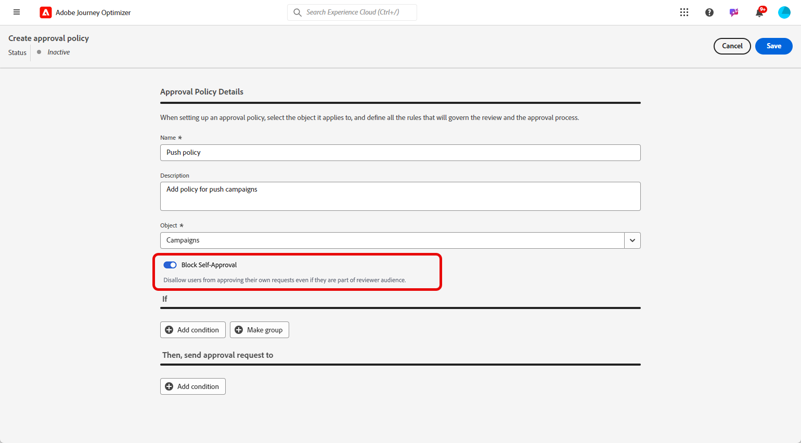

# 创建和管理审批策略 {#approval-policies}

>[!CONTEXTUALHELP]
>id="ajo_approval_policy_request_approval"
>title="请求审批"
>abstract="请求审批"

>[!CONTEXTUALHELP]
>id="ajo_approval_policy_request_change"
>title="请求更改"
>abstract="请求更改"

>[!NOTE]
>
>要创建批准策略，您必须在Adobe Experience Platform中拥有系统管理员或产品管理员权限。 [了解详情](https://experienceleague.adobe.com/en/docs/experience-platform/access-control/home)

批准策略允许管理员为历程和营销活动建立验证流程。 此系统概述了特定条件，这些条件决定了历程或活动是否需要批准。 这些策略的复杂程度可能有所不同，从仅要求所有营销活动由特定用户或团队审核，到根据营销活动的创建者建立标准。

## 创建审批策略 {#create-policies}

>[!CONTEXTUALHELP]
>id="ajo_permissions_approval_policy"
>title="新建审批策略"
>abstract="在此屏幕中，输入名称并选择审批策略的上下文，然后构建条件以确定谁可以启动审批请求以及谁可以验证审批请求。"

要创建批准策略，请执行以下步骤：

1. 从Journey Optimizer的&#x200B;**[!UICONTROL 管理]**&#x200B;菜单中，依次访问&#x200B;**[!UICONTROL 权限]**&#x200B;和&#x200B;**[!UICONTROL 策略]**。

   

1. 在&#x200B;**[!UICONTROL 审批策略]**&#x200B;选项卡中单击&#x200B;**[!UICONTROL 创建]**，选择&#x200B;**[!UICONTROL 审批策略]**，然后单击&#x200B;**[!UICONTROL 确认]**。

1. 输入策略的&#x200B;**[!UICONTROL 名称]**&#x200B;和&#x200B;**[!UICONTROL 描述]**。

1. 选择策略将应用于&#x200B;**[!UICONTROL 历程]**&#x200B;还是&#x200B;**[!UICONTROL 营销活动]**。

   

您现在可以优化条件以指定谁可以启动审批请求以及谁可以验证审批请求。

## 设置审批策略的条件 {#conditions}

要定义与审批策略关联的条件，请执行以下步骤：

1. 访问您的&#x200B;**[!UICONTROL 审批策略]**。

1. 在&#x200B;**[!UICONTROL If]**&#x200B;菜单下，单击&#x200B;**[!UICONTROL 添加条件]**&#x200B;以定义将触发审批请求的对象或用户。

1. 选择适当的&#x200B;**[!UICONTROL 类别]**、**[!UICONTROL 匹配规则]**&#x200B;和&#x200B;**[!UICONTROL 选项]**。

   例如，“如果操作与任何直邮相匹配”或“如果请求者用户名与John Doe匹配”。

   

+++ 了解关于可用类别和选项的更多信息
   <table>
    <tr>
      <th>类别</th>
      <th>选项</th>
    </tr>
    <tr>
      <td rowspan="3">营销活动类型</td>
      <td>已计划（营销）</td>
    </tr>
    <tr>
    <td>API触发（营销）</td>
    </tr>
    <tr>
    <td>API触发（事务性）</td>
    </tr>
    <tr>
    <td rowspan="8">操作</td>
    <td>应用程序内</td>
    </tr>
    <tr>
    <td>推送通知</td>
   </tr>
    <tr>
    <td>短信</td>
    </tr>
    <tr>
    <td>电子邮件</td>
    </tr>
    <tr>
    <td>直邮</td>
    </tr>
    <tr>
    <td>Web</td>
    </tr>
    <tr>
    <td>基于代码</td>
    </tr>
    <tr>
    <td>内容信息卡</td>
    </tr>
    <tr>
    <td>请求者用户名</td>
    <td>设计请求者的姓名和电子邮件地址</td>
    </tr>
    <tr>
    <td>请求者用户组</td>
    <td>已设计请求者的用户组的名称</td>
    </tr>
    </table>

1. 若要添加更多条件，请单击&#x200B;**[!UICONTROL 添加条件]**&#x200B;以定义其他规则，并选择&#x200B;**[!UICONTROL And]**&#x200B;或&#x200B;**[!UICONTROL Or]**&#x200B;以指定连接条件的方式。

1. 在&#x200B;**[!UICONTROL Then，将审批请求发送到]**&#x200B;菜单下，单击&#x200B;**[!UICONTROL 添加条件]**&#x200B;以定义哪个用户可以接受审批请求。

1. 从&#x200B;**[!UICONTROL 类别]**&#x200B;下拉列表中，选择要选择用户组还是单个用户。

1. 然后，从&#x200B;**[!UICONTROL 选项]**&#x200B;下拉列表中，选择特定用户组或用户。

   选定的用户或用户组将负责验证审批请求。

   

1. 若要添加更多条件，请单击&#x200B;**[!UICONTROL 添加条件]**&#x200B;以定义其他规则，并选择&#x200B;**[!UICONTROL And]**&#x200B;或&#x200B;**[!UICONTROL Or]**&#x200B;以指定连接条件的方式。

1. 完全配置策略后，单击&#x200B;**[!UICONTROL 保存]**。

您现在可以激活审批策略以应用它。

## 激活和管理审批策略 {#activate-policies}

要应用审批策略，您必须激活它。 要执行此操作，请执行以下步骤：

1. 访问您的&#x200B;**[!UICONTROL 审批策略]**。

1. 然后，单击&#x200B;**[!UICONTROL 激活]**&#x200B;以将配置的条件应用到您的环境。

   >[!NOTE]
   >
   >激活策略后，便无法对其进行编辑。 要修改条件，请先取消激活策略。

   

1. 从&#x200B;**[!UICONTROL 策略]**&#x200B;菜单中，打开高级选项，以根据需要编辑&#x200B;**[!UICONTROL 3}、**[!UICONTROL &#x200B;停用&#x200B;]**或**[!UICONTROL &#x200B;复制&#x200B;]**策略。]**

   
