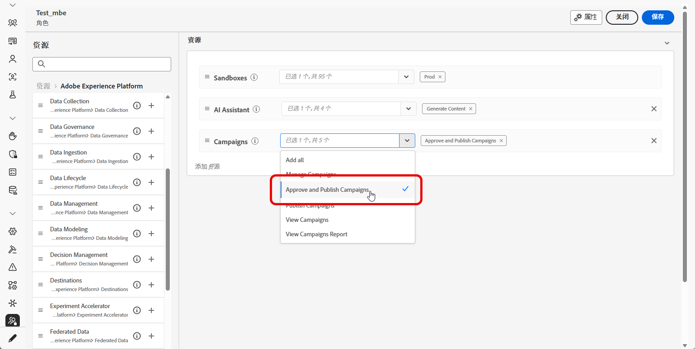
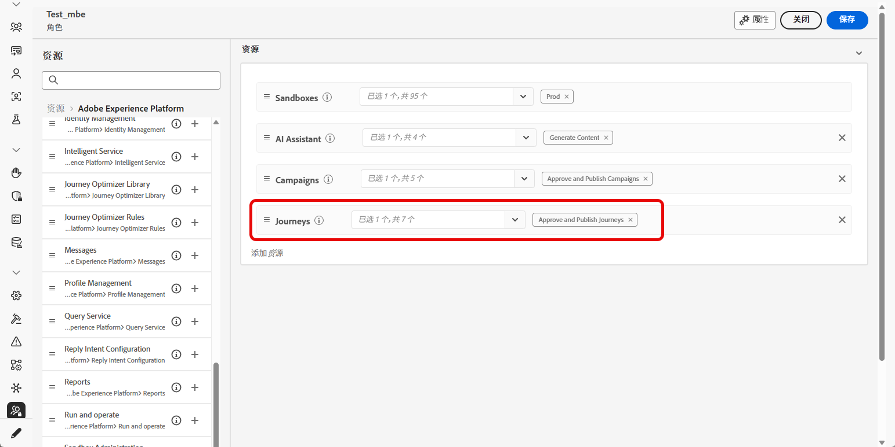
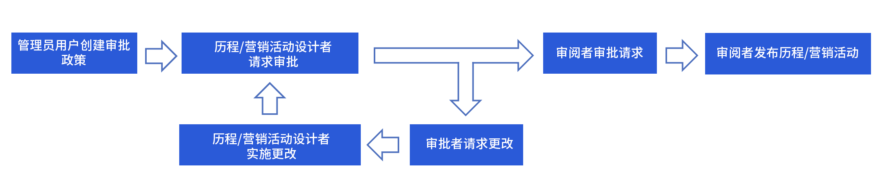
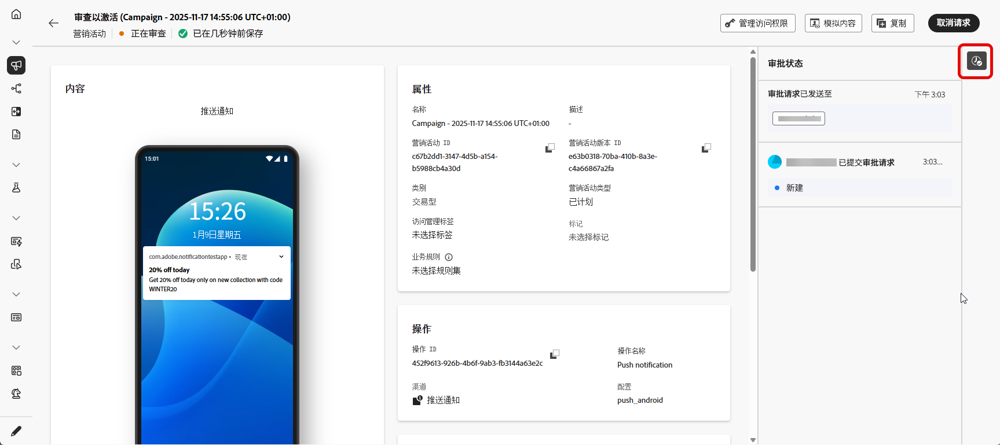

# 历程和营销活动审批入门 {#send-proofs}

>[!AVAILABILITY]
>
> 目前，审批策略仅面向一部分组织提供（限量发布版）。要获得访问权限，请与 Adobe 代表联系。

## 审批策略入门 {#gs}

通过 Journey Optimizer，您可以设置审批流程，从而使营销团队可以确保营销活动及历程在投入使用之前由相应的负责人审查和签署。

审批策略直接在用户界面中引入了结构化工作流程，不需要依赖外部媒介（如电子邮件或任务管理工具），确保集中管理和跟踪所有审批。

此外，该功能可增强对历程和营销活动发布的控制：在 Journey Optimizer 中嵌入审批流程后，营销活动和历程在审查期间将保持“锁定”状态，确保在获得所有必要审批之前不会发生更改或意外激活。

## 先决条件 {#prerequisites}

在开始之前，请确保已配置以下权限。

要访问审批并发布历程和营销活动，需要向用户授予&#x200B;**审批和发布营销活动**&#x200B;及&#x200B;**审批和发布历程**&#x200B;权限。[了解详情](../administration/permissions.md)

+++  了解如何分配与审批相关的权限

1. 在&#x200B;**权限**&#x200B;产品中，转到&#x200B;**角色**&#x200B;选项卡并选择所需的&#x200B;**角色**。

1. 单击&#x200B;**编辑**，修改权限。

1. 添加&#x200B;**营销活动**&#x200B;资源，然后从下拉菜单中选择&#x200B;**审批和发布营销活动**。

   {zoomable="yes"}

1. 添加&#x200B;**历程**&#x200B;资源，然后从下拉菜单中选择&#x200B;**审批和发布历程**。

   {zoomable="yes"}

1. 单击&#x200B;**保存**&#x200B;以应用更改。

任何已分配此角色的用户的权限都将自动更新。

1. 要将此角色分配给新用户，请导航到&#x200B;**角色**&#x200B;仪表板中的&#x200B;**用户**&#x200B;选项卡，然后单击&#x200B;**添加用户**。

1. 输入用户名、电子邮件地址或从列表中选择，然后单击&#x200B;**保存**。

1. 如果之前没有创建用户，请参阅[此文档](https://experienceleague.adobe.com/zh-hans/docs/experience-platform/access-control/abac/permissions-ui/users)。

用户将收到一封电子邮件，其中包含访问实例的说明。

+++

## 审批流程概述 {#process}

全局审批流程如下所示：

{zoomable="yes"}

1. **审批策略设置**

   管理员用户可以创建审批策略，定义将策略应用于历程或营销活动的条件。例如，您可以创建一个审批策略，要求在激活之前审批特定用户创建的所有计划营销活动。[了解如何创建审批策略](approval-policies.md)

1. **提交营销活动/历程以供审批**

   营销活动/历程创建者负责构建历程或营销活动，并进行提交以供审批。营销活动/历程进入“正在审查”状态后，在此期间无法进行任何编辑，除非取消请求。[了解如何请求审批](request-approval.md)

   >[!NOTE]
   >
   >只有在设置了审批策略时，才需要提交营销活动和历程以供审批。如果未设置此类策略，创建者无需审批即可直接发布营销活动或历程。

1. **审查和审批**

   在应用于历程或营销活动的审批策略中定义的审批者将会收到通知。他们可以审查历程或营销活动内容、受众和设置。如果需要进行更改，审批者会请求进行更改，使营销活动返回到“草稿”状态以进行修订。如果准备就绪，他们可以激活并发布历程或营销活动。[了解如何审查和审批请求](review-approve-request.md)

## 监测审批请求 {#monitor}

您可以监测为给定历程或营销活动提交的所有审批和更改请求。为此，请单击历程画布或营销活动审查屏幕右上角的&#x200B;**[!UICONTROL 显示审核记录]**&#x200B;图标。

