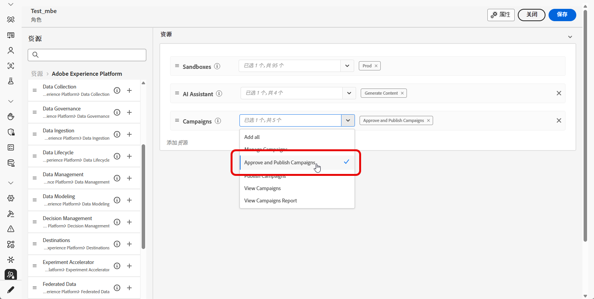
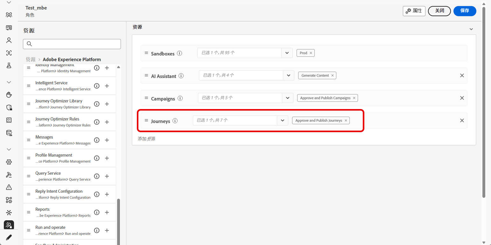
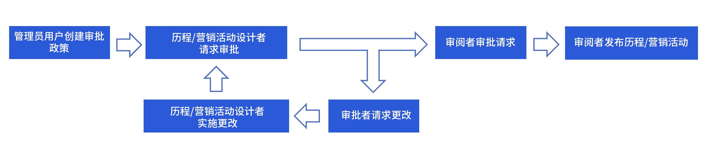
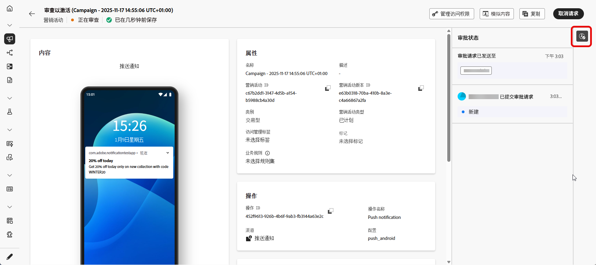

# 历程和营销活动审批入门 {#send-proofs}

## 审批策略入门 {#gs}

借助[!DNL Journey Optimizer]，您可以设置审批流程，从而使营销团队可以确保营销活动及历程在上线之前由相应的利益相关者审查和批准。

审批策略直接在用户界面中引入了结构化工作流程，不需要依赖外部媒介（如电子邮件或任务管理工具），确保集中管理和跟踪所有审批。

此外，该功能可增强对历程和营销活动发布的控制：在 Journey Optimizer 中嵌入审批流程后，营销活动和历程在审查期间将保持“锁定”状态，确保在获得所有必要审批之前不会发生更改或意外激活。

## 先决条件 {#prerequisites}

在开始之前，请确保已配置以下权限。

要审批并发布历程和营销活动，用户需要被授予&#x200B;**审批和发布营销活动**&#x200B;及&#x200B;**审批和发布历程**&#x200B;权限。 [了解详情](../administration/permissions.md)

+++  了解如何分配与审批相关的权限

1. 在&#x200B;**权限**&#x200B;产品中，转到&#x200B;**角色**&#x200B;选项卡并选择所需的&#x200B;**角色**。

1. 单击&#x200B;**编辑**，修改权限。

1. 添加&#x200B;**营销活动**&#x200B;资源，然后从下拉菜单中选择&#x200B;**审批和发布营销活动**。

   {zoomable="yes"}

1. 添加&#x200B;**历程**&#x200B;资源，然后从下拉菜单中选择&#x200B;**审批和发布历程**。

   {zoomable="yes"}

1. 单击&#x200B;**保存**&#x200B;以应用更改。

任何已分配此角色的用户的权限都将自动更新。

1. 要将此角色分配给新用户，请导航到&#x200B;**角色**&#x200B;仪表板中的&#x200B;**用户**&#x200B;选项卡，然后单击&#x200B;**添加用户**。

1. 输入用户名、电子邮件地址或从列表中选择，然后单击&#x200B;**保存**。

1. 如果之前没有创建用户，请参阅[此文档](https://experienceleague.adobe.com/zh-hans/docs/experience-platform/access-control/abac/permissions-ui/users)。

用户将收到一封电子邮件，其中包含访问实例的说明。

+++

## 审批流程概述 {#process}

全局审批流程如下所示：

{zoomable="yes"}

1. **审批策略设置**

   管理员用户可以创建审批策略，定义将策略应用于历程或营销活动的条件。 例如，您可以创建一个审批策略，要求在激活之前审批特定用户创建的所有计划营销活动。 [了解如何创建审批策略](approval-policies.md)

1. **提交营销活动/历程以供审批**

   营销活动/历程创建者生成历程或营销活动，并进行提交以供审批。 营销活动/历程进入“正在审查”状态后，在此期间无法进行任何编辑，除非取消请求。 [了解如何请求审批](request-approval.md)

   >[!NOTE]
   >
   >只有在设置了审批策略时，才需要提交营销活动和历程以供审批。 如果未设置此类策略，创建者无需审批即可直接发布营销活动或历程。

1. **审查和审批**

   在应用于历程或营销活动的审批策略中定义的审批者将会收到通知。 他们可以审查历程或营销活动内容、受众和设置。 如果需要进行更改，审批者会请求进行更改，使营销活动返回到“草稿”状态以进行修订。 如果准备就绪，他们可以激活并发布历程或营销活动。 [了解如何审查和审批请求](review-approve-request.md)

## 监测审批请求 {#monitor}

您可以监测为给定历程或营销活动提交的所有审批和更改请求。 为此，请单击历程画布或营销活动审查屏幕右上角的&#x200B;**[!UICONTROL 显示审核记录]**&#x200B;图标。

## 常见问题 {#faq}

+++是否需要为每个营销活动或历程创建审批策略？

不可以。 审批策略是有条件的。 只有当您要强制审查一组特定的营销活动或历程（例如，由特定团队创建的所有预定营销活动）时，才需要创建策略。 如果营销活动或历程不存在任何策略，则创建者可以直接发布，而无需请求审批。

+++

+++如果审批者暂时无法处理，该怎么办？

请求会保持“审核中”状态，直到审批者对其执行操作为止。 您可以取消请求（将项目返回至“草稿”），待有合适的审批者可用后重新提交。 管理员还可以更新审批策略以添加其他审批者。

+++

+++我能否在营销活动或历程处于待审批状态时对其进行编辑？

不可以。 提交审批后，营销活动或历程处于锁定的“审核中”状态。 要进行更改，创建者或审批者必须首先取消请求。 该项目将返回到“草稿”，可在重新提交之前进行编辑。

+++

+++我在下拉列表中未看到审批和发布权限 - 我应该检查哪些内容？

确保首先添加正确的资源。 **审批和发布营销活动**&#x200B;权限要求将&#x200B;**营销活动**&#x200B;资源添加到该角色，而&#x200B;**审批和发布历程**&#x200B;需要&#x200B;**历程**&#x200B;资源。 两者必须单独添加。 [了解如何分配与审批相关的权限](#prerequisites)

+++

+++如果多个策略可能匹配，[!DNL Journey Optimizer] 如何确定适用的审批策略？

当多个活动审批策略可以应用于同一历程或营销活动时，最近&#x200B;**激活的策略**&#x200B;优先。 该策略中定义的审批者用户组将收到通知，并负责处理该审批请求。

[了解详情](approval-policies.md#multiple-policies)

+++

+++如果请求者属于多个用户组，他们能否选择将审批请求发送到哪个组？

不可以。 请求者无法手动选择哪个用户组接收或路由审批请求。 根据[策略优先权](approval-policies.md#multiple-policies)应用的审批策略中指定的用户组会自动收到通知。

+++

## 其他资源

* **[创建审批策略](approval-policies.md)** - 了解如何设置审批策略以强制执行营销活动和历程的审核工作流。
* **[请求审批](request-approval.md)** - 了解如何提交内容以供审批并跟踪审批状态。
* **[审核和批准请求](review-approve-request.md)** – 了解如何作为审批者审核、批准或拒绝审批请求。
* **[使用样本输入进行模拟](simulate-sample-input.md)** - 了解如何使用样本配置文件数据测试和验证内容。
