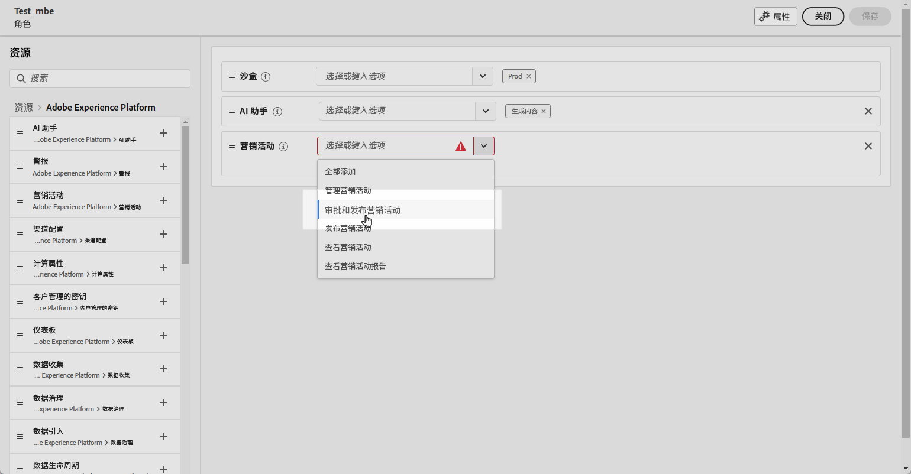
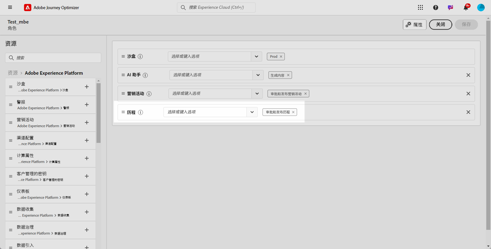
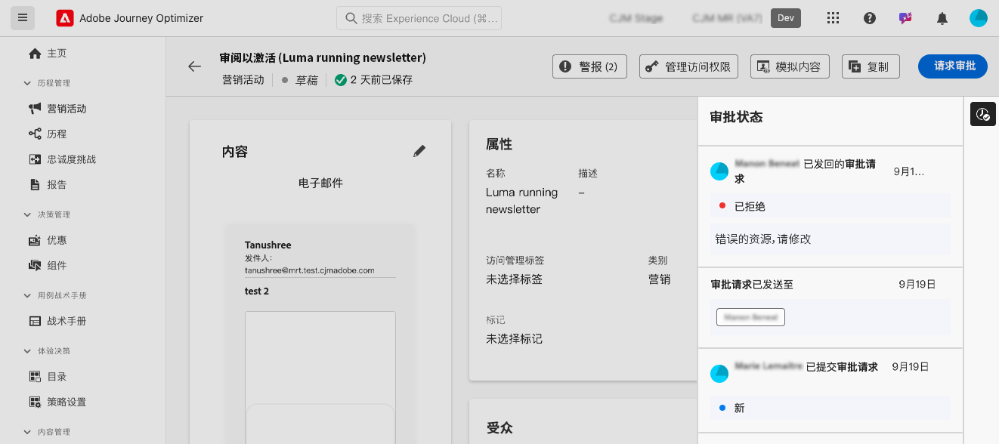

# 历程和营销活动批准入门 {#send-proofs}

>[!AVAILABILITY]
>
> 批准策略当前仅适用于一组组织（限量发布）。 要获得访问权限，请与 Adobe 代表联系。

## 审批策略入门 {#gs}

Journey Optimizer允许您设置审批流程，以便营销团队确保活动及历程在投入使用之前由相应的利益相关者审查和签署。

批准策略直接在用户界面中引入结构化工作流，消除了对外部媒介（如电子邮件或任务管理工具）的需求，并确保集中管理和跟踪所有批准。

此外，此功能可增强对历程和营销策划发布的控制：在Journey Optimizer中嵌入审批流程后，营销策划和历程在审核期间将保持“锁定”状态，确保在获得所有必要审批之前不会发生更改或意外激活。

## 先决条件 {#prerequisites}

在开始之前，请确保已配置以下权限。

要访问批准和发布历程和营销活动，需要向用户授予&#x200B;**批准和发布营销活动**&#x200B;和&#x200B;**批准和发布历程**&#x200B;权限。 [了解详情](../administration/permissions.md)

+++  了解如何分配与审批相关的权限

1. 在&#x200B;**权限**&#x200B;产品中，转到&#x200B;**角色**&#x200B;选项卡并选择所需的&#x200B;**角色**。

1. 单击&#x200B;**编辑**，修改权限。

1. 添加&#x200B;**营销活动**&#x200B;资源，然后从下拉菜单中选择&#x200B;**批准和发布营销活动**。

   {zoomable="yes"}

1. 添加&#x200B;**历程**&#x200B;资源，然后从下拉菜单中选择&#x200B;**批准和发布历程**。

   {zoomable="yes"}

1. 单击&#x200B;**保存**&#x200B;以应用更改。

任何已分配此角色的用户的权限都将自动更新。

1. 要将此角色分配给新用户，请导航到&#x200B;**角色**&#x200B;仪表板中的&#x200B;**用户**&#x200B;选项卡，然后单击&#x200B;**添加用户**。

1. 输入用户名、电子邮件地址或从列表中选择，然后单击&#x200B;**保存**。

1. 如果之前没有创建用户，请参阅[此文档](https://experienceleague.adobe.com/zh-hans/docs/experience-platform/access-control/abac/permissions-ui/users)。

用户将收到一封电子邮件，其中包含访问实例的说明。

+++

## 审批流程概述 {#process}

全局审批流程如下所示：

{zoomable="yes"}

1. **审批策略设置**

   管理员用户创建审批策略，定义策略应用于历程或营销策划的条件。 例如，您可以创建一个批准策略，要求在激活之前批准给定用户创建的所有计划营销活动。 [了解如何创建审批策略](approval-policies.md)

1. **提交营销活动/历程以供审批**

   营销活动/历程创建者构建历程或营销活动，并提交它以供审批。 营销活动/历程进入“正在审查”状态，在此期间无法进行任何编辑，除非取消请求。 [了解如何请求审批](request-approval.md)

   >[!NOTE]
   >
   >只有设置了审批策略时，才需要提交营销活动和历程以供审批。 如果没有此类策略，则创建者无需批准即可直接发布活动或历程。

1. **审核和批准**

   适用于历程或营销策划的审批策略中定义的审批者，将收到通知。 他们可以审查历程或营销活动内容、受众和设置。 如果需要进行更改，审批者会请求进行更改，并将营销活动返回到“草稿”以进行修订。 如果准备就绪，他们可以激活并启动历程或营销活动。 [了解如何审阅和批准请求](review-approve-request.md)

## 监控审批请求 {#monitor}

您可以监控为给定历程或营销活动提交的所有批准和更改请求。 为此，请单击位于历程画布或营销策划审核屏幕右上角的&#x200B;**[!UICONTROL 显示审核记录]**&#x200B;按钮。

