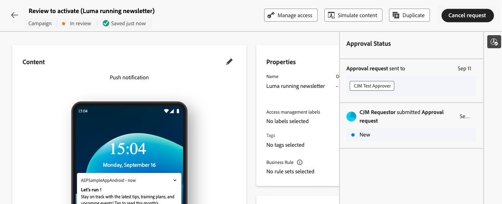

# 请求审批 {#request-approval}

>[!AVAILABILITY]
>
> 批准策略当前仅适用于一组组织（限量发布）。 要获得访问权限，请与 Adobe 代表联系。

如果您的组织启用了审批工作流功能，您将注意到创建营销策划和创建历程工作流中分别不再提供&#x200B;**[!UICONTROL 激活]**&#x200B;和&#x200B;**[!UICONTROL Publish]**&#x200B;按钮。 这些按钮已被&#x200B;**[!UICONTROL 请求审批]**&#x200B;按钮替换。

创建营销活动或历程后，您需要单击&#x200B;**[!UICONTROL 请求审批]**&#x200B;按钮。 这将检查您的沙盒中是否存在适用于活动或历程的有效审批策略。 如果找到相关的批准策略，则将开始批准流程。 如果不存在适用的审批策略，则将自动审批并激活或发布营销活动或历程。

**[!UICONTROL 请求审批]**&#x200B;窗格打开。 如有必要，请为审批者提供消息，然后单击&#x200B;**[!UICONTROL 发送]**&#x200B;以提交您的请求。

当营销活动或历程处于&#x200B;**[!UICONTROL 审核]**&#x200B;状态时，您可以选择取消审批请求。 通过单击&#x200B;**[!UICONTROL 取消请求]**&#x200B;按钮，营销活动或历程将返回到草稿阶段，并向审阅人发送通知，告知他们请求已被取消。 然后，您可以进行必要的编辑，并重新提交营销活动或历程以供审批。

将审批请求发送给审批者后，审批者可以审阅该请求，然后激活历程/营销活动以使其上线，或者在必要时请求更改。 [了解如何审阅和批准请求](review-approve-request.md)

如果批准者请求发生更改，系统会通过电子邮件和Journey Optimizer警报向您发送通知，单击屏幕右上角的铃铛图标可在&#x200B;**[!UICONTROL 请求]**&#x200B;选项卡中访问警报。

要处理更改请求，请从电子邮件或警报中打开它，以访问历程或营销策划，并进行请求的更改。 当您的历程/营销活动准备好再次接受审核时，使用&#x200B;**[!UICONTROL 请求审批]**&#x200B;按钮发送新的审批请求。
