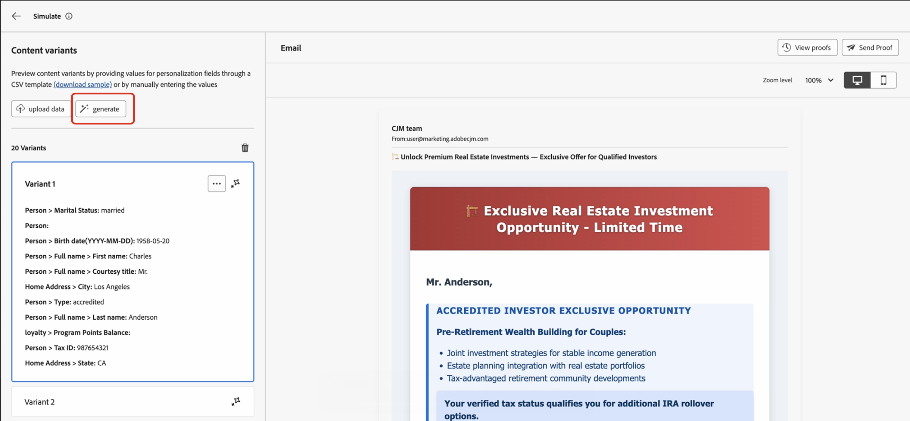
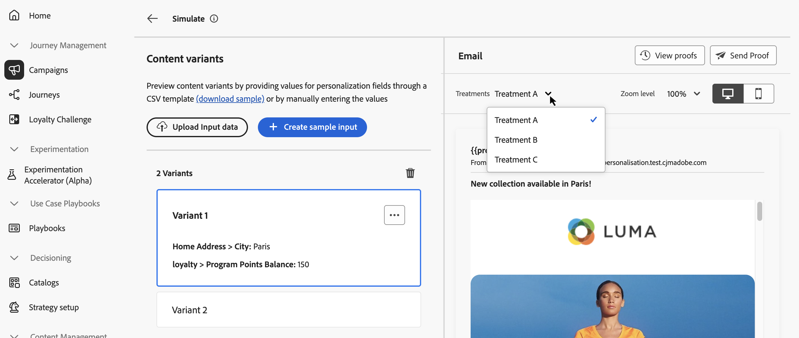

# 模拟内容变体 {#custom-profiles}

>[!CONTEXTUALHELP]
>id="ajo_simulate_sample_profiles"
>title="使用示例输入进行模拟"
>abstract="在此屏幕中，您可以通过以下方式测试内容变体：使用AI自动生成变体、通过CSV或JSON模板添加值、手动输入变体或使用测试用户档案。"

当您的内容包含个性化或条件逻辑时，您需要验证它在发送之前是否正确呈现每种类型的收件人。

[!DNL Journey Optimizer]中的&#x200B;**[!UICONTROL 模拟内容变体]**&#x200B;体验可通过以下方式解决此问题：允许您从单个屏幕测试内容的多个变体、使用AI自动生成、手动输入、从文件导入，或基于可重复使用的模拟用户。 您可以预览每个变体呈现和发送验证的方式，所有这些操作都不需要预先在Adobe Experience Platform中创建持久性配置文件。

从您的内容中，选择&#x200B;**[!UICONTROL 模拟内容]**，然后选择&#x200B;**[!UICONTROL 模拟内容变体]**&#x200B;以打开单个体验，您可以：

* **使用AI自动生成变体**&#x200B;以覆盖个性化和条件分支
* **手动添加变体**&#x200B;或从CSV或JSON文件添加变体
* **使用模拟用户**&#x200B;预览和校对已保存的可重用测试数据
* **预览**&#x200B;呈现并&#x200B;**发送所选变体的电子邮件校样**

自动检测内容中用于个性化的所有属性。 变体是内容的一个版本，其属性的值不同。

>[!NOTE]
>
>变体仅用作当前内容的测试目的。 它们不会存储在Adobe Experience Platform中，而是会存储在您的用户浏览器会话中，这意味着在注销或从其他设备工作时，它们不会显示。

## 护栏和限制 {#limitations}

开始使用示例输入数据测试内容之前，请考虑以下护栏和先决条件。

* **渠道** — 模拟内容变体可用于：

   * 电子邮件、短信和推送通知渠道；
   * 所有入站渠道（Web、基于代码的体验、应用程序内、内容卡）。

* **支持的功能** — 内容变体可以与[!DNL Journey Optimizer]多语言内容和内容实验功能一起使用。 这允许您测试多种语言的消息并通过实验优化内容。

  您还可以利用内容变体来测试内容模板。

  >[!NOTE]
  >
  >目前，收件箱呈现和垃圾邮件报告在当前的体验中不可用。 若要使用这些功能，请从内容中选择&#x200B;**[!UICONTROL 模拟内容]**&#x200B;按钮以访问上一个用户界面。

* **属性** — 同时支持配置文件和上下文属性。

* **数据类型** — 为变量输入数据时仅支持以下数据类型：数字（整数和小数）、字符串、布尔值和日期类型。 任何其他数据类型将显示错误。

* **变体的数量** — 您最多可以添加30个变体以使用文件、手动或自动生成来测试您的内容。

## 创建内容变体

若要为内容创建变体，请单击“模拟内容”按钮&#x200B;**&#x200B;**，然后选择“模拟内容变体”**&#x200B;**。


您可以通过以下方式创建变体：

* [手动或从文件](#profiles)添加变体。
* 使用AI [自动生成变体](#auto-generate-variants)。
* [从现有的模拟用户中选择变体](#simulated-users)。

创建变体后，您可以[预览内容并发送校样](#preview-proofs)。

### 手动或从文件添加变体 {#profiles}

访问内容变体体验时，内容中使用的所有个性化字段都会自动检测并显示在空白变体中。

例如，如果您的电子邮件包含两个个性化字段“First name”和“City”，则它们将显示在列表中。 最初，不输入任何值，并且预览窗格中不显示个性化内容。


您可以手动添加变体，也可以从文件上传变体。

+++ 手动添加变体

要编辑默认变体的值，请单击&#x200B;**[!UICONTROL 编辑]**&#x200B;按钮，为每个个性化字段提供自定义值。 预览窗格将更新以显示您的内容如何呈现输入值。

要添加新变体，请单击&#x200B;**[!UICONTROL 创建样本]**&#x200B;按钮。 出现一个新的空白变体，其中包含所有检测到的个性化字段。 您可以根据需要编辑新变体。


+++

+++ 从文件添加变体

您可以上载包含预定义变体和值的文件以加快该过程。

1. 单击&#x200B;**[!UICONTROL 上载数据]**&#x200B;按钮以打开文件上载屏幕。
1. 选择&#x200B;**[!UICONTROL 下载示例]**&#x200B;以下载CSV、JSON或JSONLINES文件模板。
1. 打开模板文件，并为每个配置文件属性填写所需的值。 该模板包含用于内容中用于个性化的每个配置文件属性的列。

   示例JSON语法：

   ```json
   {
   "profile": {
       "attributes": {
       "person": {
           "name": {
               "lastName": "Doe",
               "firstName": "John"
               }
           }
       }
   }
   }
   ```

1. 文件准备就绪后，选择&#x200B;**[!UICONTROL 确认]**&#x200B;以加载文件。 上传后，会为文件中的每个条目向列表添加新变体。

+++

### 自动生成内容变体 {#auto-generate-variants}

[!DNL Journey Optimizer]可以使用基于人工智能的模拟自动生成内容变体，这样您就无需手动构建变体即可验证个性化逻辑。

在呈现内容以进行模拟或验证时，系统会分析您的内容，标识个性化字段，并使用有意义的值替换它们，以实现近乎真实的预览。

要自动生成变体，请单击&#x200B;**[!UICONTROL 生成]**&#x200B;按钮，然后等待系统生成变体。



>[!NOTE]
>
>生成会生成一个变量。 单击&#x200B;**[!UICONTROL 生成]**&#x200B;会将列表中的所有现有内容变体（包括手动添加或从文件添加的任何内容变体）替换为一个生成的变体。

查看变体列表中生成的变体及其渲染。

### 从模拟用户中选择变体 {#simulated-users}

在&#x200B;**[!UICONTROL 模拟内容变体]**&#x200B;中，您可以将变体基于&#x200B;**模拟用户**。 模拟用户是为测试而创建的临时性类似配置文件的实体，无需在Adobe Experience Platform中使用持久配置文件。 与仅为当前浏览器会话添加的变体不同，模拟用户会进行保存，并且可供历程和其他用户重用。

从历程&#x200B;**[!UICONTROL 模拟]**&#x200B;功能创建和管理模拟用户。 有关创建、保存和重用这些对象的完整过程，请参阅[创建和管理模拟用户](../building-journeys/simulate-journey.md#test-users)。

创建模拟用户后，您可以使用它们预览内容。 为此，请执行以下步骤：

1. 单击&#x200B;**[!UICONTROL 选择变体]**&#x200B;按钮。
1. 在现有模拟用户列表中，选择要使用的用户，然后单击&#x200B;**[!UICONTROL 选择]**。

   

1. 选定的模拟用户将添加到内容变体列表中，您可以在其中预览内容及其属性值。 您也可以手动编辑变体的值以进行测试，但这些更改不会保存回模拟用户。

## 预览内容和发送校样 {#preview-proofs}

添加变体后，您可以使用变体在右侧窗格中预览内容并发送电子邮件校样。

### 预览内容变体 {#preview}

要使用变体预览内容，请从列表中选择相关变体，以使用为此变体输入的信息更新预览窗格中的内容。

在下面的示例中，我们为电子邮件主题行添加了两个变体：

| 变量1选择 | 变量2选择 |
|----------|-------------|
|  |  |

<!--
For multilingual content and experimentation, a dropdown is available to switch between the different language variants or treatments.


-->

### 发送校样 {#proofs}

Journey Optimizer允许您向电子邮件地址发送验证，同时模拟您在模拟屏幕中添加的一个或多个变体。 步骤如下：

1. 验证是否已添加变体来测试您的内容，然后单击&#x200B;**[!UICONTROL 发送校样]**&#x200B;按钮。

1. 在&#x200B;**[!UICONTROL 收件人]**&#x200B;字段中，输入要向其发送校样的电子邮件地址，然后单击&#x200B;**[!UICONTROL 添加]**。 重复操作以将验证发送到其他电子邮件地址。 您最多可以添加10个验证收件人。

1. 在屏幕的底部，选择要在验证中使用的变体。 您可以选择多个变体，在这种情况下，电子邮件将包含与所选变体相同数量的验证。

   有关变体的详细信息，请选择&#x200B;**[!UICONTROL 查看配置文件详细信息]**&#x200B;链接。 这允许您显示在上一屏幕中为不同变体输入的信息。

   

1. 单击&#x200B;**[!UICONTROL 发送校样]**&#x200B;按钮以开始发送校样。

1. 要跟踪校样发送，请在模拟内容屏幕中单击&#x200B;**[!UICONTROL 查看校样]**&#x200B;按钮。


