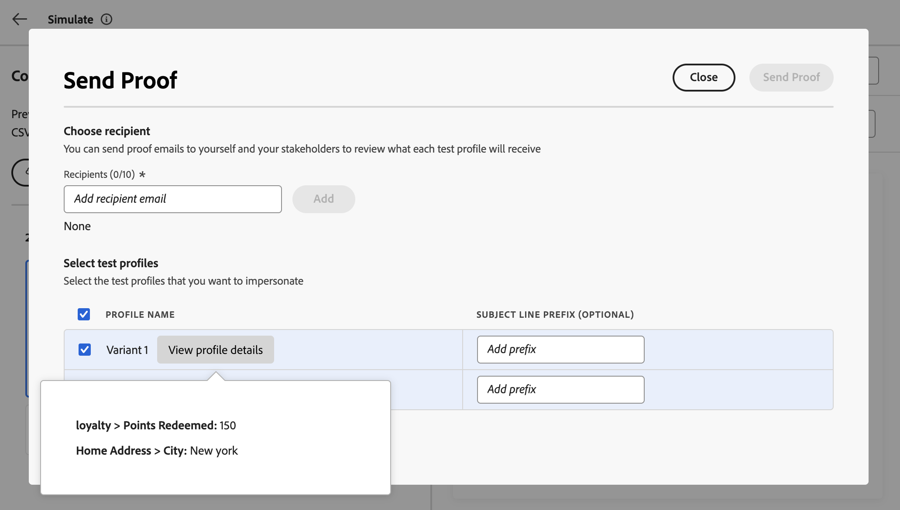

# 使用示例输入数据测试您的内容（Beta 版） {#custom-profiles}

>[!CONTEXTUALHELP]
>id="ajo_simulate_sample_profiles"
>title="使用示例输入进行模拟"
>abstract="在此屏幕中，您可以通过 CSV 或 JSON 模板为个性化字段提供值或手动输入值来测试您的内容的不同变体。"

>[!AVAILABILITY]
>
>此功能目前以公共测试版的形式向所有客户提供。

历程优化器允许您测试各种内容变体，方法是预览内容并使用从CSV或JSON文件上传或手动添加的示例输入数据发送校样。 系统会自动检测内容中用于个性化的所有用户档案属性，可使用这些属性进行测试以创建多个变体。

>[!NOTE]
>
>目前，模拟内容变体仅适用于电子邮件、短信和推送通知渠道。

要访问此体验，请单击“**[!UICONTROL 模拟内容]**”按钮，然后选择“**[!UICONTROL 模拟内容变体(Beta)]**”。

测试内容的主要步骤如下：

1. 通过上传文件或手动添加数据，使用示例输入数据添加最多30个变体。 [了解如何添加变体](#profiles)
1. 使用不同的变体检查内容的预览。 [了解如何预览您的内容](#preview)
1. 对于电子邮件内容，使用不同的变体向电子邮件地址发送最多10个验证。 [了解如何发送校样](#proofs)

## 护栏和限制 {#limitations}

开始使用示例输入数据测试内容之前，请考虑以下护栏和先决条件。

* 截至目前，使用示例输入数据进行测试仅适用于电子邮件、短信和推送通知渠道。 无法从Email Designer中的“模拟内容”按钮访问该体验。
* 当前体验中不提供以下功能：收件箱呈现、垃圾邮件报告、多语言内容和内容体验。 若要使用这些功能，请从内容中选择&#x200B;**[!UICONTROL 模拟内容]**&#x200B;按钮以访问上一个用户界面。
* 当前仅支持配置文件属性。 如果在内容中使用上下文属性进行个性化，您将无法使用这些属性测试内容。
* 为变量输入数据时仅支持以下数据类型：数字（整数和小数）、字符串、布尔和日期类型。 任何其他数据类型将显示错误。

## 添加变体 {#profiles}

您可以使用文件或手动添加最多30个变体来测试内容。

>[!NOTE]
>
>添加的变体仅用作当前内容的测试目的。 不会存储在Adobe Experience Platform中，而是会存储在您的用户浏览器会话中，这意味着在注销或从其他设备工作时，不会显示这些文件。

### 使用文件添加变体 {#file}

要从文件添加变体，请执行以下步骤：

1. 单击&#x200B;**[!UICONTROL 下载示例]**&#x200B;链接以检索文件模板，然后选择要使用的文件格式（CSV、JSON或JSONLINES）。

1. 单击&#x200B;**[!UICONTROL 下载]**，然后将模板存储到所需位置。

1. 打开文件，然后填写模板以满足您的需求。 该模板包含用于内容中用于个性化的每个配置文件属性的列。

1. 当文件准备就绪时，单击&#x200B;**[!UICONTROL 上载输入数据]**&#x200B;以加载该数据以测试您的内容。

1. 上传文件后，会在左窗格中为文件中的每一行添加一个框。 每个框都包含内容中用于个性化的所有配置文件属性。 您现在可以使用变体在右侧窗格中预览您的内容并发送校样。

   

### 手动添加变体 {#manual}

要手动添加变体，请执行以下步骤：

1. 单击&#x200B;**[!UICONTROL 创建示例输入]**&#x200B;按钮。

   在左窗格中添加了一个框，其中包含内容中用于个性化的所有配置文件属性。

1. 填写变体的样本输入数据，然后单击&#x200B;**[!UICONTROL 保存]**。

   

1. 添加变体后，您可以使用变体在右侧窗格中预览内容并发送校样。

## 预览您的内容变体 {#preview}

要使用任一变体预览内容，请选择相关的框以使用为此变体输入的信息更新右侧部分中的内容预览。

您可以使用右上角的省略号按钮并选择&#x200B;**[!UICONTROL 删除]**&#x200B;随时删除变体。 要编辑变体的信息，请单击省略号按钮，然后选择&#x200B;**[!UICONTROL 编辑]**。

## 发送校样 {#proofs}

Journey Optimizer允许您向电子邮件地址发送验证，同时模拟您在模拟屏幕中添加的一个或多个变体。 步骤如下：

1. 验证是否已添加变体来测试您的内容，然后单击&#x200B;**[!UICONTROL 发送校样]**&#x200B;按钮。

1. 在&#x200B;**[!UICONTROL 收件人]**&#x200B;字段中，输入要向其发送校样的电子邮件地址，然后单击&#x200B;**[!UICONTROL 添加]**。 重复操作以将验证发送到其他电子邮件地址。 您最多可以添加10个验证收件人。

1. 在屏幕的底部，选择要在验证中使用的变体。 您可以选择多个变体，在这种情况下，电子邮件将包含与所选变体相同数量的验证。

   有关变体的详细信息，请选择&#x200B;**[!UICONTROL 查看配置文件详细信息]**&#x200B;链接。 这允许您显示在上一屏幕中为不同变体输入的信息。

   

1. 单击&#x200B;**[!UICONTROL 发送校样]**&#x200B;按钮以开始发送校样。

1. 要跟踪校样发送，请在模拟内容屏幕中单击&#x200B;**[!UICONTROL 查看校样]**&#x200B;按钮。

