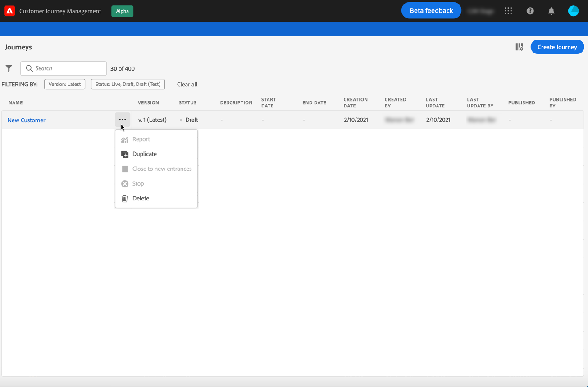

# 用户界面 {#cjm-user-interface}

此文档经常更新以反映产品中的最新更改。但是，某些屏幕快照可能与您的用户界面略有不同。

## 工作区{#cjm-workspace}

连接到[Adobe Experience Cloud](http://experience.adobe.com)后，浏览到[!DNL Journey Optimizer]。

>[!NOTE]
>
>浏览用户界面时的主要概念在[Adobe Experience Platform文档](https://experienceleague.adobe.com/docs/experience-platform/landing/platform-ui/ui-guide.html?lang=en#adobe-experience-platform-ui-guide)中有详细介绍。

使用左侧的链接浏览功能。

>[!NOTE]
>
>可用功能可能因您的权限和许可协议而异。

您可以在左边栏中条目的完整列表下找到相关文档的链接。

**主页**

[!DNL Journey Optimizer] 主页包含指向开始的关键链接和资源。**[!UICONTROL Recents]**&#x200B;列表为最近创建或更新的消息、事件和旅程提供了快捷方式。 此列表显示其创建和修改日期及状态。

**[!UICONTROL JOURNEY MANAGEMENT]**

* **[!UICONTROL Journeys]**  — 创建、配置和编排客户旅程。了解本节](building-journeys/journey-gs.md#jo-build)中的更多信息[

* **[!UICONTROL Messages]**  — 创建、设计、测试和发布电子邮件和推送消息。了解本节](create-message.md)中的更多信息[

**[!UICONTROL DECISION MANAGEMENT]**

* **[!UICONTROL Offers]**  — 通过此菜单访问您最近的源和数据集。使用此部分可创建新优惠。 [了解详情](offers/offer-library/creating-personalized-offers.md)

* **[!UICONTROL Components]**  — 创建版面、规则和标记。了解有关[本节](offers/offer-library/key-steps.md)的详细信息

**[!UICONTROL CONTENT MANAGEMENT]**

* **[!UICONTROL Assets]** - [!DNL Adobe Experience Manager Assets Essentials] 是一个资产的集中存储库，您可以使用它填充您的消息。了解有关[本节](assets-essentials.md)的详细信息

**[!UICONTROL DATA MANAGEMENT]**

* **[!UICONTROL Schemas]**  — 使用Adobe Experience Platform在称为“模式编辑器”的交互式可视画布中创建和管理体验数据模型(XDM)模式。[在本文档中了解更多信息](https://experienceleague.adobe.com/docs/experience-platform/xdm/tutorials/create-schema-ui.html)

* **[!UICONTROL Datasets]**  — 摄取到Adobe Experience Platform中的所有数据都将作为数据集保留在数据湖中。数据集是存储和管理构建，用于模式集合，通常是表格，其中包含（列）和字段（行）。 [了解如何在本文档中预览和创建数据集](https://experienceleague.adobe.com/docs/experience-platform/catalog/datasets/user-guide.html)

* **[!UICONTROL Queries]**  — 使用Adobe Experience Platform 查询服务编写和执行查询,视图先前执行的查询，以及访问由您组织内的用户保存的查询。[在本文档中了解更多信息](https://experienceleague.adobe.com/docs/experience-platform/query/ui/overview.html)

* **[!UICONTROL Monitoring]**  — 使用此菜单可监视Adobe Experience Platform用户界面中的数据摄取。[在本文档中了解更多信息](https://experienceleague.adobe.com/docs/experience-platform/ingestion/quality/monitor-data-ingestion.html)

**[!UICONTROL CONNECTIONS]**

* **[!UICONTROL Sources]**  — 使用此菜单从各种来源(如Adobe应用程序、基于云的存储、数据库等)中摄取数据，并构建、标记和增强传入数据。[在本文档中了解更多信息](https://experienceleague.adobe.com/docs/experience-platform/sources/home.html)

**[!UICONTROL CUSTOMER]**

* **[!UICONTROL Segments]**  — 创建和管理Experience Platform细分定义，并将其用于您的旅程。了解有关[此页面](segment/about-segments.md)的详细信息

* **[!UICONTROL Profiles]**  — 实时客户用户档案可以为每位客户创建整体视图，将来自多个渠道（包括在线、离线、CRM和第三方数据）的数据组合在一起。[在本文档中了解更多信息](https://experienceleague.adobe.com/docs/experience-platform/profile/ui/user-guide.html)

* **[!UICONTROL Identities]** - Adobe Experience Platform Identity Service通过Adobe Experience Platform中称为身份图的方式管理客户的跨设备、跨渠道和近乎实时的身份识别。[了解如何在本文档中创建身份命名空间](https://experienceleague.adobe.com/docs/experience-platform/identity/namespaces.html?lang=en#manage-namespaces)

**[!UICONTROL ADMINISTRATION]**

* **[!UICONTROL Journey Administration]**  — 使用此菜单配置 [事件](event/about-events.md)、 [数](datasource/about-data-sources.md) 据  源和要在旅程中使用的操作。

* **[!UICONTROL Sandboxes]** - Adobe Experience Platform提供沙箱，可将单个实例分为单独的虚拟环境，以帮助开发和发展数字体验应用程序。[了解有关此文档中沙箱的更多信息](https://experienceleague.adobe.com/docs/experience-platform/sandbox/ui/user-guide.html)

## 浏览器和语言支持

Adobe [!DNL Journey Optimizer]接口设计为在最新版Google Chrome中发挥最佳作用。 在旧版本或其他浏览器上使用某些功能时可能遇到问题。

用户界面目前提供以下语言版本：

* 英语
* 法语
* 德语

您的默认界面语言由用户用户档案中指定的首选语言决定。

要更改您的语言：

* 单击右上角的&#x200B;**编辑头像中的首选项**。
* 然后，单击&#x200B;**访问Adobe帐户**&#x200B;以访问Adobe用户档案。
* 选择顶部的&#x200B;**通知**&#x200B;选项卡，然后单击&#x200B;**首选项**。
* 选择首选语言，然后单击&#x200B;**保存**。

>[!NOTE]
>
>您需要注销并重新登录到[!DNL Journey Optimizer]以应用更改。

## 搜索和过滤{#section_lgm_hpz_pgb}

在大多数列表中，搜索栏允许您搜索项目。

单击列表左上角的过滤器图标即可访问&#x200B;**[!UICONTROL Filters]**。过滤器菜单允许您根据不同的条件过滤显示的元素。 您可以选择仅显示特定类型或状态的元素、您创建的元素或最近30天内修改的元素。

在旅程列表中，除了&#x200B;**[!UICONTROL Creation filters]**&#x200B;之外，您还可以根据显示的旅程的状态和版本(**[!UICONTROL Status and version filters]**)筛选显示的旅程。 您可以选择仅显示使用特定事件、字段组或操作（**[!UICONTROL Activity filters]**&#x200B;和&#x200B;**[!UICONTROL Data filters]**）的旅程。 **[!UICONTROL Publication filters]**&#x200B;允许您选择发布日期或用户。 例如，您可以选择显示昨天发布的最新版实时旅程。 [了解详情](building-journeys/using-the-journey-designer.md)。

>[!NOTE]
>
>请注意，显示的列可以使用列表右上角的配置按钮进行个性化设置。为每个用户保存个性化设置。

使用&#x200B;**[!UICONTROL Last update]**&#x200B;和&#x200B;**[!UICONTROL Last update by]**&#x200B;列检查旅程的上次更新发生的时间以及保存该更新的人员。

在“事件”、“数据源”和“操作”配置窗格中，**[!UICONTROL Used in]**&#x200B;字段显示使用该特定事件、字段组或操作的旅程数。 您可以单击 **[!UICONTROL View journeys]**&#x200B;按钮以显示相应历程的列表。

在不同的列表中，您可以对每个元素执行基本操作。例如，您可以重复或删除项目。

## 浏览Adobe Experience Platform字段{#friendly-names-display}

在定义[事件有效负载](event/about-creating.md#define-the-payload-fields)、[字段组有效负载](datasource/configure-data-sources.md#define-field-groups)以及在[表达式编辑器](https://experienceleague.adobe.com/docs/journeys/using/building-advanced-conditions-journeys/expressionadvanced.html)中选择字段时，除字段名称外，还会显示其显示名称。此信息可从体验数据模型中的架构定义中检索。

如果在设置架构时提供了诸如“xdm:alternateDisplayInfo”之类的描述符，则用户友好型名称将替换显示名称。当使用“eVar”和通用字段时，它特别有用。 您可以通过API调用配置易记名称描述符。 有关详细信息，请参阅[架构注册开发人员指南](https://experienceleague.adobe.com/docs/experience-platform/xdm/api/getting-started.html)。

如果友好名称可用，则字段将显示为`<friendly-name>(<name>)`。如果没有可用的友好名称，将显示其显示名称，如`<display-name>(<name>)`。如果这两种名称均未定义，则仅显示字段的技术名称 `<name>`。

>[!NOTE]
>
>从架构组合中选择字段时，不会检索友好名称。

## 辅助功能{#cjm-accessibility}

以下是 [!DNL Journey Optimizer] 界面中提供的不同快捷键。

_在历程、操作、数据源或事件列表中：_

* 按 **c** 创建新历程、操作、数据源或事件。

_在历程中配置活动时：_

画布会自动保存。您可以在画布的左上角看到其保存状态。

* 按 **Esc** 键关闭配置窗格并放弃所做的更改。这等同于 **[!UICONTROL Cancel]**&#x200B;按钮。
* 按 **Enter** 键或单击窗格外部以关闭配置窗格。更改已保存。这等同于 **[!UICONTROL Ok]**&#x200B;按钮。
* 如果按 **Delete** 或 **Backspace** 键，则之后可以按 **Enter** 键以确认删除。

_在弹出窗口中：_

* 按 **Esc** 键将其关闭（等同于 **[!UICONTROL Cancel]** 按钮）。
* 按 **Enter** 键保存或确认（等同于 **[!UICONTROL Ok]** 或 **[!UICONTROL Save]** 按钮）。

_在事件、数据源或操作配置窗格中：_

* 按 **Esc** 关闭配置窗格而不保存。
* 按 **Enter** 键保存修改并关闭配置窗格。
* 按 **Tab** 键在不同字段之间跳转以配置。

_在简单的表达式编辑器中_

* 双击左侧的字段以添加查询（等同于拖放）。

_浏览 XDM 字段时：_

* 选中“节点”将选择该节点的所有字段。

_在所有文本区域中：_

* 使用 **Ctrl/Command + A** 组合键选择文本。在有效负载预览中，将选择有效负载。

_在带有搜索栏的屏幕中：_

* 使用 **Ctrl/Command + F** 组合键选择搜索栏。

_在历程的画布中：_

* 使用 **Ctrl/Command + A** 组合键选择所有活动。
* 选择一个或多个活动后，按 **Delete** 或 **Backspace** 键以删除活动。然后，可以按 **Enter** 键以在确认弹出窗口中进行确认。
* 双击左侧面板上的活动，将其添加到第一个可用位置（从上到下）。

_在历程中：_

* 按 **T** 可启用/禁用测试模式。
* 在基于事件的历程中，在测试模式下，按 **E** 可触发事件。
* 在基于客户细分的历程中，当在测试模式下选择&#x200B;**一次单个用户档案**&#x200B;选项时，按 **P** 可触发事件。
* 在测试模式下，按 **L** 可显示日志。
