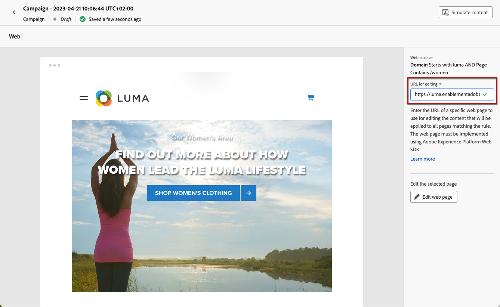
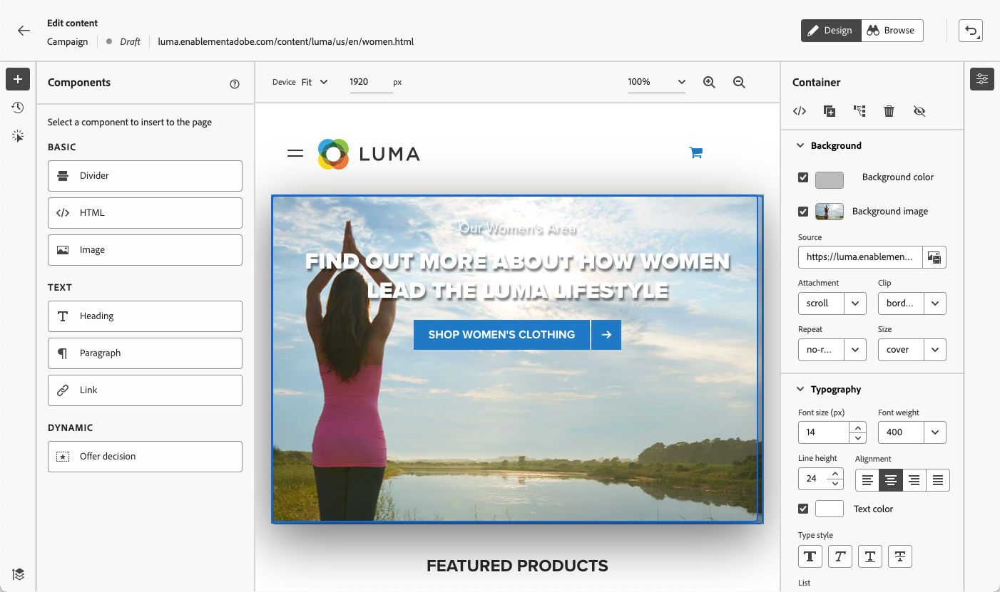
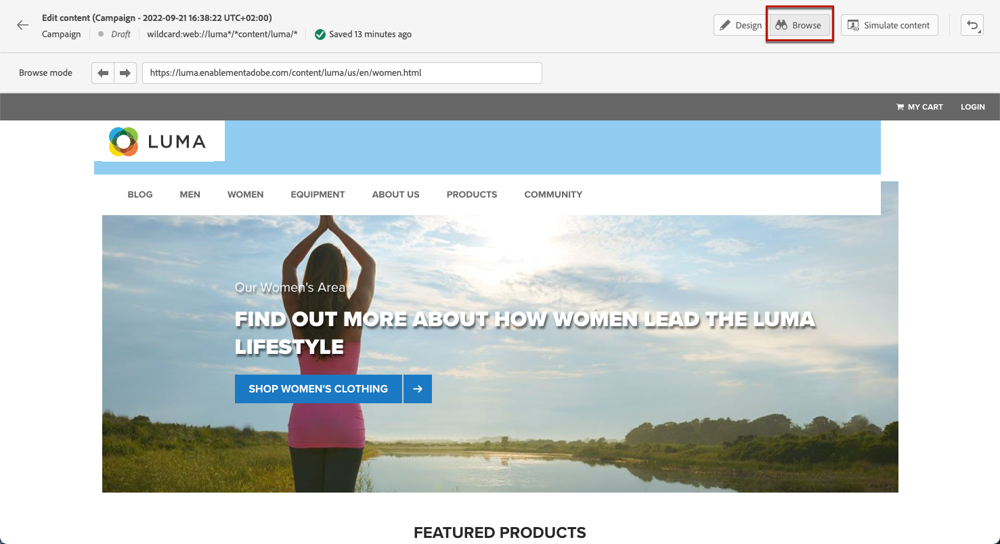
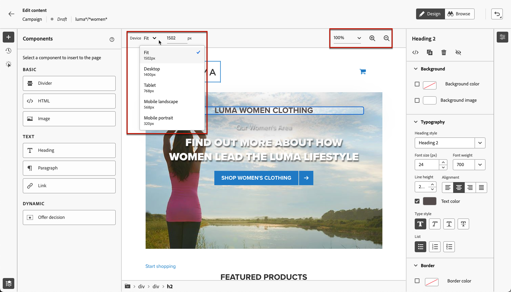

# 创建 Web 页面 {#author-web}

>[!BEGINSHADEBOX]

您将在本文档中找到的内容：

* [Web 渠道入门](get-started-web.md)
* [创建 Web 体验](create-web.md)
* **[创建 Web 页面](author-web.md)**
* [可视化编辑帮助程序扩展](visual-editing-helper.md)
* [Web 报告](web-report.md)

>[!ENDSHADEBOX]

在 [!DNL Journey Optimizer] web创作由Adobe Experience Cloud Visual Helper chrome浏览器扩展提供支持。 [了解详情](visual-editing-helper.md)

在 [!DNL Journey Optimizer] 用户界面，请遵循 [此部分](create-web.md#prerequesites).

## 编辑网页内容 {#edit-web-content}

>[!CONTEXTUALHELP]
>id="ajo_web_url_to_edit_surface"
>title="确认要编辑的 URL"
>abstract="确认特定网页的 URL，用于编辑将应用到上面定义的 Web 表面的内容。网页必须使用 Adobe Experience Platform Web SDK 实施。"
>additional-url="https://experienceleague.adobe.com/docs/platform-learn/implement-web-sdk/overview.html?lang=zh-Hans" text="了解详情"

>[!CONTEXTUALHELP]
>id="ajo_web_url_to_edit_rule"
>title="输入 URL 以进行编辑"
>abstract="输入特定网页的 URL，用于编辑将应用到与规则匹配的所有页面上的内容。网页必须使用 Adobe Experience Platform Web SDK 实施。"
>additional-url="https://experienceleague.adobe.com/docs/platform-learn/implement-web-sdk/overview.html?lang=zh-Hans" text="了解详情"

<!--Confirm the URL to use for authoring content on the surface. Typically the Authoring URL will be the surface URL itself, but you may include extra parameters if required. The page must include the Adobe Experience Platform Web SDK.-->

从营销活动创建Web操作后，即可使用Web设计器编辑内容。 为此，请执行以下步骤。

>[!CAUTION]
>
>要在 [!DNL Journey Optimizer]，则必须使用 [Adobe Experience Platform Web SDK](https://experienceleague.adobe.com/docs/platform-learn/implement-web-sdk/overview.html?lang=zh-Hans){target="_blank"}.

1. 从 **[!UICONTROL 操作]** 选项卡，选择 **[!UICONTROL 编辑内容]** 以开始创作web营销活动。

1. 如果您创建的页面与规则匹配，则必须输入与此规则匹配的任何URL。 更改将应用于与规则匹配的所有页面。

   >[!NOTE]
   >
   >如果您输入单个URL作为Web界面，则要个性化的URL已经填充。

   

1. 此时会显示页面内容。

   >[!CAUTION]
   >
   >网页必须包含 [Adobe Experience Platform Web SDK](https://experienceleague.adobe.com/docs/platform-learn/implement-web-sdk/overview.html?lang=zh-Hans){target="_blank"}.

1. 单击 **[!UICONTROL 打开Web设计器]** 来编辑。 [了解详情](author-web.md)

   

1. 此时将显示Web设计器。

   

1. 从画布中选择任何元素，如图像、按钮、段落、文本、容器、标题、链接等。 和使用：

   * 用于编辑其内容、布局、插入链接或个性化等的上下文菜单。

      

   * 用于编辑、复制、删除或隐藏每个元素的右侧面板顶部的图标。

      

   * 根据所选元素动态更改的右侧面板。 例如，您可以编辑元素的背景、排版规则、边框、大小、位置、间距、效果或内联样式。

      

## 使用内容组件 {#content-components}

>[!CONTEXTUALHELP]
>id="ajo_web_designer_components"
>title="将内容组件添加到网页"
>abstract="您可以将许多组件添加到网页，然后根据需要进行编辑。"

1. 从 **[!UICONTROL 组件]** 左侧的窗格中，您可以将以下组件添加到网页中，并根据需要对其进行编辑：

   * [除法器](../email/content-components.md#divider)
   * [HTML](../email/content-components.md#HTML)
   * [图像](../email/content-components.md#image)
   * 标题 — 使用此组件与使用 **[!UICONTROL 文本]** 组件。 [了解详情](../email/content-components.md#text)
   * 段落 — 使用此组件与使用 **[!UICONTROL 文本]** 组件。 [了解详情](../email/content-components.md#text)
   * 链接 — 了解如何在 [此部分](../email/styling-links.md)
   * [优惠决策](../email/add-offers-email.md)

   

1. 将鼠标悬停在页面中，然后单击 **[!UICONTROL 此项前插入]** 或 **[!UICONTROL 此项后插入]** 按钮将组件附加到页面上的现有元素。

   

1. 从为此组件显示的容器中，根据需要编辑组件内容。

   

1. 从 **[!UICONTROL 容器]** 窗格，如背景、文本颜色、边框、大小、位置等。 具体取决于选定的组件。

   

## 在Web设计器中导航

### 使用痕迹导航

1. 从画布中选择任意元素。

1. 单击 **[!UICONTROL 展开/折叠痕迹导航]** 按钮来快速显示有关选定元素的信息。

   

1. 将鼠标悬停在痕迹导航上时，编辑器中会高亮显示相应的元素。

1. 使用它，您可以轻松导航到可视编辑器中的任何父元素、同级元素或子元素。

### 交换到浏览模式 {#browse-mode}

>[!CONTEXTUALHELP]
>id="ajo_web_designer_browse"
>title="使用浏览模式"
>abstract="在此模式下，您可以从要个性化的选定表面导航到确切的页面。"

您可以从默认 **[!UICONTROL 设计]** 模式 **[!UICONTROL 浏览]** 模式。

从 **[!UICONTROL 浏览]** 模式下，您可以从要个性化的选定表面导航到确切的页面。

当处理身份验证后或特定URL开头不可用的页面时，此插件特别有用。 例如，您将能够进行身份验证，导航到帐户页面或购物车页面，然后切换回 **[!UICONTROL 设计]** 模式来执行对所需页面所做的更改。

### 更改设备大小

您可以将设备大小更改为预定义的大小，例如 **[!UICONTROL 平板电脑]** 或 **[!UICONTROL 移动设备横向]**，或定义自定义大小。 输入所需的像素数以定义自定义大小。

您还可以将缩放焦点从25%更改为400%。

## 管理修改 {#manage-modifications}

>[!CONTEXTUALHELP]
>id="ajo_web_designer_modifications"
>title="轻松管理所有更改"
>abstract="使用此窗格，您可以浏览和管理您添加到网页的所有调整和样式。"

您可以轻松管理您添加到网页的所有组件、调整和样式。

1. 选择 **[!UICONTROL 修改]** 按钮以在左侧显示相应的窗格。

   

1. 您可以查看对页面所做的每项更改。

1. 选择不需要的修改并单击删除图标以将其删除。

   

   >[!CAUTION]
   >
   >删除某个操作时请务必小心，因为该操作可能会影响后续操作。

1. 您还可以使用 **[!UICONTROL 撤消/重做]** 按钮。

   

   单击并按住按钮可在 **[!UICONTROL 撤消]** 和 **[!UICONTROL 重做]** 选项。 然后，单击按钮本身以应用所需的操作。

## 添加个性化和选件

要添加个性化，请选择一个容器，然后从显示的上下文菜单栏中选择个性化图标。 使用表达式编辑器添加更改。 [了解详情](../personalization/personalization-build-expressions.md)

使用 **[!UICONTROL 优惠决策]** 插入组件 [选件](../offers/get-started/starting-offer-decisioning.md) 到您的网页中。 该过程与 [向电子邮件添加选件](../email/add-offers-email.md). 它将利用决策管理来选择最佳选件，以提供给您的客户。

## 测试Web营销活动 {#test-web-campaign}

>[!CONTEXTUALHELP]
>id="ajo_web_designer_preview"
>title="预览 Web 体验"
>abstract="模拟您将获得的 Web 体验。"

要显示已修改的Web体验的预览，请执行以下步骤。

>[!CAUTION]
>
>您必须具有测试用户档案，以模拟将向他们提供哪些选件。 了解如何 [创建测试用户档案](../segment/creating-test-profiles.md).

1. 从 **[!UICONTROL 编辑内容]** 屏幕或web designer中，选择 **[!UICONTROL 模拟内容]**.

   

1. 单击 **[!UICONTROL 管理测试用户档案]** 选择一个或多个测试用户档案。
1. 将显示已修改网页的预览。

   

1. 您还可以复制测试URL以将其粘贴到任何浏览器中，或在默认浏览器中将其打开。
