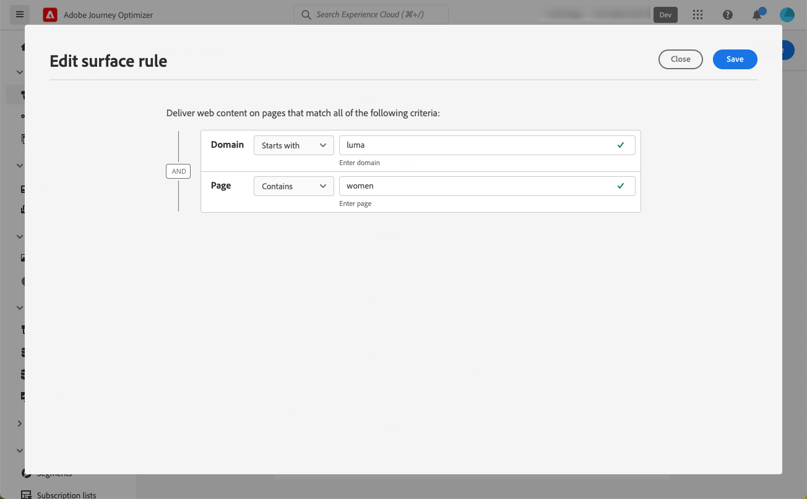

# 创建 Web 体验 {#create-web}

>[!BEGINSHADEBOX]

您将在本文档中找到的内容：

* [Web 渠道入门](get-started-web.md)
* **[创建 Web 体验](create-web.md)**
* [创建 Web 页面](author-web.md)
* [可视化编辑帮助程序扩展](visual-editing-helper.md)
* [Web 报告](web-report.md)

>[!ENDSHADEBOX]

[!DNL Journey Optimizer] 允许您通过入站web营销活动将您交付给客户的web体验个性化。

>[!CAUTION]
>
>当前位于 [!DNL Journey Optimizer] 您只能使用 **营销活动**.

## 先决条件 {#prerequesites}

在 [!DNL Journey Optimizer] 用户界面中，请遵循以下先决条件：

* 要向网站添加修改，您需要实施 [Adobe Experience Platform Web SDK](https://experienceleague.adobe.com/docs/platform-learn/implement-web-sdk/overview.html?lang=zh-Hans){target="_blank"} 在您的网站上。

* 访问 [!DNL Journey Optimizer] web designer中，您必须下载 [Adobe Experience Cloud Visual Editing Helper](https://chrome.google.com/webstore/detail/adobe-experience-cloud-vi/kgmjjkfjacffaebgpkpcllakjifppnca){target="_blank"} 浏览器扩展。 [了解详情](visual-editing-helper.md)

>[!CAUTION]
>
>Google Chrome当前是唯一支持在 [!DNL Journey Optimizer].

要正确交付Web体验，必须定义以下设置：

* 在 [Adobe Experience Platform数据收集](https://experienceleague.adobe.com/docs/experience-platform/edge/datastreams/overview.html){target="_blank"}，请确保在 **[!UICONTROL Adobe Experience Platform]** 你们都有 **[!UICONTROL 边缘分割]** 和 **[!UICONTROL Adobe Journey Optimizer]** 选项。

   这可确保Journey Optimizer集客事件由Adobe Experience Platform Edge正确处理。 [了解详情](https://experienceleague.adobe.com/docs/experience-platform/edge/datastreams/configure.html?lang=zh-Hans){target="_blank"}

   

   >[!NOTE]
   >
   >的 **[!UICONTROL Adobe Journey Optimizer]** 选项仅在 **[!UICONTROL 边缘分割]** 选项。

* 在 [Adobe Experience Platform](https://experienceleague.adobe.com/docs/experience-platform/profile/home.html?lang=zh-Hans){target="_blank"}, make sure you have one merge policy with the **[!UICONTROL Active-On-Edge Merge Policy]** option enabled. To do this, select a policy under the **[!UICONTROL Customer]** > **[!UICONTROL Profiles]** > **[!UICONTROL Merge Policies]** Experience Platform menu. [Learn more](https://experienceleague.adobe.com/docs/experience-platform/profile/merge-policies/ui-guide.html#configure){target="_blank"}

   此合并策略由 [!DNL Journey Optimizer] 入站渠道，以在边缘上正确激活和发布入站营销活动。 [了解详情](https://experienceleague.adobe.com/docs/experience-platform/profile/merge-policies/ui-guide.html){target="_blank"}

   

## 创建Web营销活动 {#create-web-campaign}

>[!CONTEXTUALHELP]
>id="ajo_web_surface"
>title="定义 Web 表面"
>abstract="Web 表面可以匹配单个页面 URL 或多个页面，这让您可以在一个或多个网页上传递内容修改。"

要开始通过营销活动构建Web体验，请执行以下步骤。

1. 创建营销活动. [了解详情](../campaigns/create-campaign.md)

1. 选择 **[!UICONTROL Web]** 操作。

   

1. 定义 Web 表面.

   >[!NOTE]
   >
   >Web表面是由将要交付内容的URL标识的Web属性。 它可以匹配单个页面URL或多个页面，从而允许您在一个或多个网页之间交付修改。

   您可以输入 **[!UICONTROL 页面URL]** 如果您只想将更改应用到单个页面，请执行以下操作：

   

1. 或者，您可以构建 **[!UICONTROL 页面匹配规则]** 要定位与同一规则匹配的多个URL — 例如，如果您要将更改应用到整个网站的主页横幅，或添加显示在网站所有产品页面上的热门图像。

   要执行此操作，请选择 **[!UICONTROL 页面匹配规则]** 单击 **[!UICONTROL 创建规则]**.

   

1. 为 **[!UICONTROL 域]** 和 **[!UICONTROL 页面]** 字段。

   例如，如果要编辑Luma网站所有女产品页面上显示的元素，请选择 **[!UICONTROL 域]** > **[!UICONTROL 开始于]** > `luma` 和 **[!UICONTROL 页面]** > **[!UICONTROL 包含]** > `women`.

   

1. 保存更改。规则显示在 **[!UICONTROL 创建营销活动]** 屏幕。

   

1. 定义网页曲面后，选取 **[!UICONTROL 创建]**. 您现在可以配置营销活动属性和设置。

## 配置Web营销活动 {#configure-web-campaign}

1. 在 **[!UICONTROL 属性]** 选项卡，您可以编辑营销活动名称并根据需要添加描述。

   

1. 要为Web营销活动分配自定义或核心数据使用标签，请选择 **[!UICONTROL 管理访问权限]** 按钮。 [了解有关对象级别访问控制(OLAC)的更多信息](../administration/object-based-access.md)

1. 您可以选择 **[!UICONTROL 内容实验]** 要测试部分受众的内容处理，以确定哪个处理对特定量度效果最佳。 [了解详情](../campaigns/content-experiment.md)

   >[!AVAILABILITY]
   >
   >的 **内容实验** 功能当前仅适用于一组组织（有限可用性）。 有关更多信息，请与您的 Adobe 代表联系。

1. 从 **[!UICONTROL 操作]** 选项卡，选择 **[!UICONTROL 编辑内容]** 以开始创作web营销活动。 [了解详情](author-web.md)

   

1. 从 **[!UICONTROL 受众]** 选项卡，定义谁将能够查看您的web营销活动。 默认情况下，Web营销活动对所有访客都可见。

   

   您还可以选择特定受众。 使用 **[!UICONTROL 选择受众]** 按钮以显示可用的Adobe Experience Platform区段列表。 [了解有关区段的更多信息](../segment/about-segments.md)

   >[!NOTE]
   >
   >对于API触发的营销活动，需要通过API调用来设置受众。 [了解详情](../campaigns/api-triggered-campaigns.md)

   

1. 在 **[!UICONTROL 身份命名空间]** 字段中，选择要用于识别选定区段中个人的命名空间。 [了解有关命名空间的更多信息](../event/about-creating.md#select-the-namespace)

1. 定义 **[!UICONTROL 计划]** 网站营销活动。 [了解详情](../campaigns/create-campaign.md#schedule)

   

   默认情况下，该工作流从手动激活时开始，在手动停止时结束，但您也可以定义特定日期和时间，以便您看到所做的修改。

   

## 激活Web营销活动 {#activate-web-campaign}

定义 [网站营销活动设置](#configure-web-campaign) 并根据需要使用 [网站设计工具](author-web.md)，您可以查看并激活Web营销活动。 按照以下步骤操作。

>[!NOTE]
>
>您还可以在激活Web营销活动内容之前对其进行预览。 [了解详情](author-web.md#test-web-campaign)

1. 在您的Web营销活动中，选择 **[!UICONTROL 查看以激活]**.

   

1. 根据需要，查看和编辑内容、属性、表面、受众和计划。

1. 选择 **[!UICONTROL 激活]**.

   

   >[!NOTE]
   >
   >在单击 **[!UICONTROL 激活]**，则网站上可能最多需要15分钟才能实时显示web促销活动更改。

您的Web营销活动将 **[!UICONTROL 实时]** 状态，现在对选定受众可见。 营销活动的每个收件人都可以通过 [!DNL Journey Optimizer] web设计器。

>[!NOTE]
>
>如果您为Web营销活动定义了计划，则它具有 **[!UICONTROL 已计划]** 状态，直到达到开始日期和时间。
>
>如果激活一个与另一个已上线营销活动相同的网页相同的Web营销活动，则所有更改都将应用于您的网页。

了解有关在中激活营销活动的更多信息 [此部分](../campaigns/review-activate-campaign.md).

## 停止Web营销活动 {#stop-web-campaign}

Web营销活动上线后，您可以停止该活动以阻止受众看到您所做的修改。 按照以下步骤操作。

1. 从列表中选择一个实时营销活动。

1. 从顶部菜单中，选择 **[!UICONTROL 停止营销活动]**.

   

1. 您添加的修改将不再对您定义的受众可见。

>[!NOTE]
>
>Web营销活动停止后，您将无法再次编辑或激活它。 您只能复制并激活复制的营销活动。
