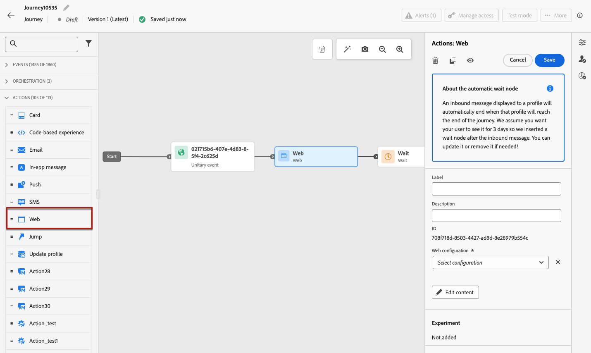

# 创建 Web 体验 {#create-web}

[!DNL Journey Optimizer]允许您通过入站历程或营销活动为客户提供Web体验，并使之个性化。

## 通过历程和营销活动定义 Web 体验 {#create-web-experience}

>[!CONTEXTUALHELP]
>id="ajo_web_surface"
>title="定义 Web 配置"
>abstract="Web 配置可以匹配单个页面 URL 或多个页面，这让您可以在一个或多个网页上传递内容修改。"

>[!CONTEXTUALHELP]
>id="ajo_web_surface_rule"
>title="构建页面匹配规则"
>abstract="一条页面匹配规则即可针对多个匹配同一规则的 URL - 例如，如果要将更改应用于跨越整个网站的主图横幅或添加在网站的所有产品页面上显示的置顶图像。"

要通过营销活动或历程开始构建Web体验，请执行以下步骤。

>[!NOTE]
>
>如果您是首次创建 Web 体验，请确保遵循[此部分](web-prerequisites.md)中叙述的先决条件。

>[!BEGINTABS]

>[!TAB 向历程添加Web体验]

要将&#x200B;**Web**&#x200B;活动添加到历程，请执行以下步骤：

1. [创建历程](../building-journeys/journey-gs.md)。

1. 通过[事件](../building-journeys/general-events.md)或[读取受众](../building-journeys/read-audience.md)活动开始您的历程。

1. 从调色板的&#x200B;**[!UICONTROL 操作]**&#x200B;部分拖放&#x200B;**[!UICONTROL Web]**&#x200B;活动。

   

   >[!NOTE]
   >
   >由于&#x200B;**Web**&#x200B;是入站消息活动，因此它附带3天&#x200B;**等待**&#x200B;活动。 [了解详情](../building-journeys/wait-activity.md#auto-wait-node)

1. 为您的消息输入&#x200B;**[!UICONTROL 标签]**&#x200B;和&#x200B;**[!UICONTROL 描述]**。

1. 选择或创建要使用的[Web配置](web-configuration.md)。

   

1. 选择&#x200B;**[!UICONTROL 编辑内容]**&#x200B;按钮并根据需要编辑您的内容。 [了解详情](#edit-web-content)

1. 如有必要，请通过拖放其他操作或事件来完成旅程流程。 [了解详情](../building-journeys/about-journey-activities.md)

1. Web体验准备就绪后，完成配置并发布历程以激活它。 [了解详情](../building-journeys/publishing-the-journey.md)

有关如何配置历程的详细信息，请参阅[此页面](../building-journeys/journey-gs.md)。

>[!TAB 创建 Web 营销活动]

要通过营销活动开始构建Web体验，请执行以下步骤。

1. 创建营销策划。 [了解详情](../campaigns/create-campaign.md)

1. 选择要执行的营销活动类型

   * **已计划 — 营销**：立即或在指定日期执行营销活动。 计划的营销活动旨在发送营销消息。 它们从用户界面配置和执行。

   * **API触发 — 营销/事务性**：使用API调用执行营销活动。 API触发的营销活动旨在发送营销或事务型消息，即，在个人执行操作（密码重置、购物车购买等）之后发送的消息。 [了解如何使用API触发营销活动](../campaigns/api-triggered-campaigns.md)

1. 完成创建Web营销活动的步骤，例如营销活动属性、[受众](../audience/about-audiences.md)和[计划](../campaigns/create-campaign.md#schedule)。

1. 选择&#x200B;**[!UICONTROL Web]**&#x200B;操作。

1. 选择或创建Web配置。 [了解有关Web配置的更多信息](web-configuration.md)

   

1. 单击&#x200B;**[!UICONTROL 编辑内容]**&#x200B;按钮根据需要编辑您的内容。 [了解详情](#edit-web-content)

   <!---->

有关如何配置营销活动的详细信息，请参阅[此页面](../campaigns/get-started-with-campaigns.md)。

➡️[在此视频中了解如何创建Web营销活动](#video)

>[!ENDTABS]

## 编辑 Web 内容 {#edit-web-content}

>[!CONTEXTUALHELP]
>id="ajo_web_url_to_edit_surface"
>title="确认要编辑的 URL"
>abstract="确认特定网页的 URL，用于编辑将应用到上面定义的 Web 配置的内容。网页必须使用 Adobe Experience Platform Web SDK 实施。"
>additional-url="https://experienceleague.adobe.com/docs/platform-learn/implement-web-sdk/overview.html?lang=zh-Hans" text="了解详情"

>[!CONTEXTUALHELP]
>id="ajo_web_url_to_edit_rule"
>title="输入 URL 以进行编辑"
>abstract="输入特定网页的 URL，用于编辑将应用到与规则匹配的所有页面上的内容。网页必须使用 Adobe Experience Platform Web SDK 实施。"
>additional-url="https://experienceleague.adobe.com/docs/platform-learn/implement-web-sdk/overview.html?lang=zh-Hans" text="了解详情"

将Web操作](#create-web-experience)添加到历程或营销活动后，您可以使用以下任一方式编辑网站内容：[

* [Web设计器](web-visual-editor.md)，用于使用可视编辑器创作您的体验；
* 或[非可视编辑器](web-non-visual-editor.md)。

要开始创作Web体验，请执行以下步骤。

1. 从营销活动的&#x200B;**[!UICONTROL 操作]**&#x200B;选项卡或历程中的&#x200B;**[!UICONTROL Web]**&#x200B;活动，选择&#x200B;**[!UICONTROL 编辑内容]**。

   

1. 将显示版本屏幕。 您可以：

   * 单击&#x200B;**[!UICONTROL 编辑网页]**&#x200B;按钮开始使用Web设计器创作内容以获得可视化体验。 [了解详情](web-visual-editor.md)

     

   * 取消选择&#x200B;**[!UICONTROL 可视编辑器]**&#x200B;选项以改用非可视编辑模式，然后单击&#x200B;**[!UICONTROL 添加修改]**&#x200B;以开始编辑您的Web内容而不加载可视编辑器。 [了解详情](web-non-visual-editor.md)

     

## 测试 Web 体验 {#test-web-experience}

>[!CONTEXTUALHELP]
>id="ajo_web_designer_preview"
>title="预览 Web 体验"
>abstract="模拟您将获得的 Web 体验。"

在使用Web设计器[创作Web体验](web-visual-editor.md)后，您可以使用测试配置文件预览修改后的网页。 如果插入个性化内容，则可以使用测试配置文件数据检查此内容的显示方式。

为此，请在历程或营销活动编辑内容屏幕中单击&#x200B;**[!UICONTROL 模拟内容]**，然后添加测试配置文件以使用测试配置文件数据检查网页。

您还可以在默认浏览器中打开它，或复制测试URL以将其粘贴到任何浏览器中。 这样，您就可以与团队和利益相关者共享链接，这些利益相关者将能够在营销活动上线之前在任何浏览器中预览新的Web体验。

>[!NOTE]
>
>在复制测试URL时，显示的内容是在[!DNL Journey Optimizer]中生成内容模拟时所使用的测试配置文件的个性化内容。

有关如何选择测试用户档案和预览内容的详细信息，请参阅[内容管理](../content-management/preview-test.md)部分。

## 让您的Web体验上线 {#web-experience-live}

>[!IMPORTANT]
>
> 如果您的营销活动受批准政策的约束，则需要请求批准才能激活您的Web体验。 [了解详情](../test-approve/gs-approval.md)

定义Web体验并根据需要编辑内容后，您可以激活历程或营销活动，以使更改对受众可见。

您还可以在上线之前预览Web体验内容。 [了解详情](#test-web-experience)

>[!NOTE]
>
>如果您激活的Web历程/营销活动影响的页面与另一个已上线的历程或营销活动相同，则所有更改将应用于您的网页。
>
>如果多个历程或营销策划更新了网站的相同元素，则优先级最高的历程/营销策划优先。

### Publish网络历程 {#activate-web-journey}

要在历程中让您的Web体验处于实时状态，请执行以下步骤。

1. 验证您的历程是否有效并且没有错误。 [了解详情](../building-journeys/troubleshooting.md#checking-for-errors-before-testing)

1. 在历程中，选择位于右上角的下拉菜单中的&#x200B;**[!UICONTROL Publish]**&#x200B;选项。

   

   >[!NOTE]
   >
   >在[本节](../building-journeys/publishing-the-journey.md)中了解有关发布历程的更多信息。

您的Web历程处于&#x200B;**[!UICONTROL 实时]**&#x200B;状态，现在为只读。 历程的每个收件人都可以看到您添加到网站的修改。

>[!NOTE]
>
>单击&#x200B;**[!UICONTROL Publish]**&#x200B;后，最多可能需要15分钟才能将更改内容实时发布到您的网站上。

### 激活Web活动 {#activate-web-campaign}

定义Web营销活动设置并根据需要编辑内容后，即可查看和激活Web营销活动。 请按照以下步骤操作。

1. 从您的Web营销活动中，选择&#x200B;**[!UICONTROL 审阅以激活]**。

1. 检查并编辑内容、属性、配置、受众和计划（如果需要）。

1. 选择&#x200B;**[!UICONTROL 激活]**。

   

   >[!NOTE]
   >
   >在[此部分](../campaigns/review-activate-campaign.md)中了解关于激活营销活动的更多信息。

您的Web营销活动处于&#x200B;**[!UICONTROL 上线]**&#x200B;状态，现在对所选受众可见。 营销活动的每个收件人都可以看到您在网站中添加的修改。

>[!NOTE]
>
>单击“**[!UICONTROL 激活]**”后，可能需要长达15分钟时间，网站营销活动更改才能在您的网站上实时可用。
>
>如果您为Web营销活动定义了计划，则在到达开始日期和时间之前，其状态为&#x200B;**[!UICONTROL 已计划]**。

一旦您的体验上线，您就可以监控Web历程和营销活动。 [了解详情](monitor-web-experiences.md)

## 停止Web历程或营销活动 {#stop-web-experience}

在Web历程或营销活动处于实时状态时，您可以停止它以阻止受众看到您的修改。 请按照以下步骤操作。

1. 从相应的列表中选择实时历程或营销策划。

1. 根据您的具体情况执行相关操作：

   * 从营销活动顶部菜单中，选择&#x200B;**[!UICONTROL 停止营销活动]**。

     

   * 从历程顶部菜单中，单击&#x200B;**[!UICONTROL 更多]**&#x200B;按钮，然后选择&#x200B;**[!UICONTROL 停止]**。

     

1. 您添加的修改不再对您定义的受众可见。

>[!NOTE]
>
>Web历程或营销策划一旦停止，您将无法再次编辑或激活它。 您只能复制它并激活复制的历程/营销策划。

## 操作方法视频{#video}

以下视频介绍了如何创建Web营销活动、配置其属性、审查和发布它。

>[!VIDEO](https://video.tv.adobe.com/v/3418800/?quality=12&learn=on)