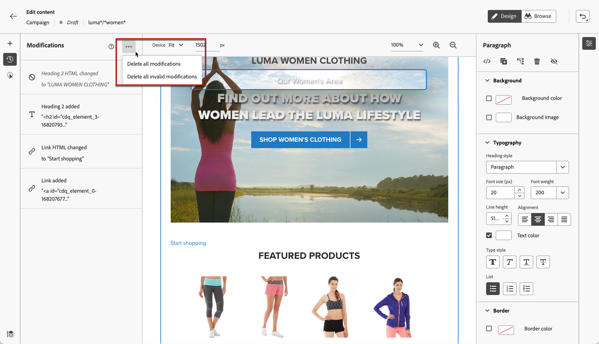

# 管理Web修改 {#manage-web-modifications}

>[!CONTEXTUALHELP]
>id="ajo_web_designer_modifications"
>title="轻松管理所有更改"
>abstract="使用此窗格，您可以浏览和管理您添加到网页的所有调整和样式。"

您可以轻松管理添加到网页的所有组件、调整和样式。 您还可以直接从专用窗格添加修改。

## 使用修改窗格 {#use-modifications-pane}

1. 选择 **[!UICONTROL 修改]** 图标，以在左侧显示相应的窗格。

   

1. 您可以查看对页面所做的每项更改。

1. 选择不需要的修改，然后单击删除图标以将其删除。

   

   >[!CAUTION]
   >
   >在删除操作时请务必谨慎，因为此操作可能影响后续操作。

1. 使用 **[!UICONTROL 更多操作]** 按钮位于顶部 **[!UICONTROL 修改]** 窗格，以便一次删除所有修改。

   

1. 从 **[!UICONTROL 更多操作]** 菜单也可以仅删除无效的修改，即由其他更改覆盖的更改。 例如，如果修改文本的颜色，然后删除该文本，则颜色修改将变得无效，因为该文本已不存在。

1. 您还可以使用取消和重做操作 **[!UICONTROL 撤消/重做]** 按钮。

   

   单击并按住按钮以在 **[!UICONTROL 还原]** 和 **[!UICONTROL 重做]** 选项。 然后，单击按钮本身以应用所需的操作。
