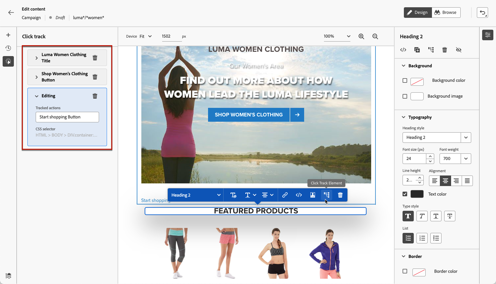

# 监测 Web 活动 {#monitor-web-experiences}

## 检查Web报告 {#check-web-reports}

在Web体验上线后，您可以检查[历程报告](../reports/journey-global-report-cja.md#web-cja)和[促销活动报告](../reports/campaign-global-report-cja.md#web)的&#x200B;**[!UICONTROL Web]**&#x200B;选项卡，以比较展示次数、点击率和与网页的互动次数等元素。

<!--You can check the **[!UICONTROL Web]** tab of the campaign reports. Learn more on the campaign web [live report](../reports/campaign-live-report.md#web-tab) and [global report](../reports/campaign-global-report.md#web-tab).-->

要进一步改进Web体验监控，您还可以跟踪网站任何特定元素的点击次数。 这样，您就可以在Web报表中显示对该元素的点击次数。 [了解如何操作](#use-click-tracing)

## 使用点击跟踪 {#use-click-tracing}

Web设计器允许您选择网站的任何元素并跟踪对该元素的点击。

此信息对于改善网站用户的体验非常有用。 例如，如果[Web报表](../reports/campaign-global-report.md#web-tab)显示有许多用户单击了一个实际上不可点击的元素，则您可能希望添加指向该元素的链接。

1. 在页面中选择元素，然后从上下文菜单中选择&#x200B;**[!UICONTROL 单击跟踪元素]**。

   

   >[!NOTE]
   >
   >可以选择任何项目（无论是否可单击）。

1. 相应的跟踪操作会自动显示在左侧的&#x200B;**[!UICONTROL 单击跟踪]**&#x200B;窗格中。

   

1. 添加有意义的标签以管理所有跟踪的元素并轻松地在报表中找到它们。 **[!UICONTROL CSS选择器]**&#x200B;字段显示用于查找所选元素的信息。

1. 重复上述步骤，根据需要选择点击跟踪所需数量的其他元素。 相应的操作全部列在左窗格中。

   

1. 要删除某个元素的点击跟踪，请选择相应的删除图标。

一旦您的营销活动开始，您就可以检查营销活动网站[实时报告](../reports/campaign-live-report.md#web-tab)和[全局报告](../reports/campaign-global-report.md#web-tab)中每个元素的点击次数。
