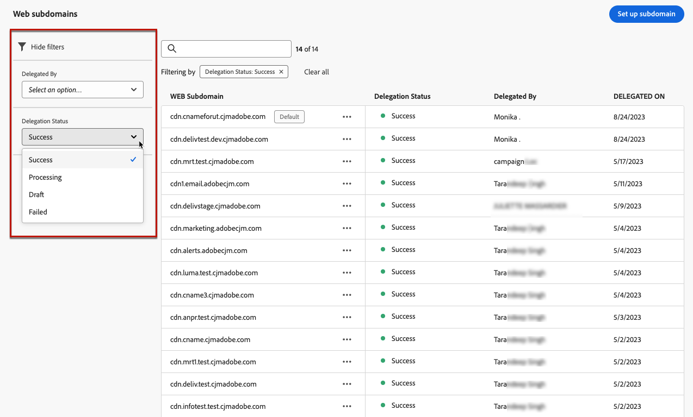

# 配置 Web 子域 {#web-subdomains}

>[!CONTEXTUALHELP]
>id="ajo_admin_subdomain_web_header"
>title="委派 Web 子域"
>abstract="您将设置您的子域以供网页渠道使用。可使用已委派给 Adobe 的子域或配置另一子域。"

>[!CONTEXTUALHELP]
>id="ajo_admin_subdomain_web"
>title="委派 Web 子域"
>abstract="如果您将来自 Adobe Experience Manager Assets 的内容添加到您的 Web 体验，则必须设置将用于发布此内容的子域。在已委派给 Adobe 的子域中进行选择或配置新的子域。"

>[!CONTEXTUALHELP]
>id="ajo_admin_subdomain_web_default"
>title="设置 Web 子域"
>abstract="从委派给 Adobe 的子域的列表中选择一个子域。可将此 Web 子域设置为默认子域，但一次只能使用一个默认子域。"

## Web子域入门 {#gs-web-subdomains}

在创作Web体验时，如果添加来自[Adobe Experience Manager Assets](../integrations/assets.md)库的内容，则必须设置将用于发布此内容的子域。

您可以使用已委派给Adobe的子域，也可以配置其他子域。 在[本节](../configuration/delegate-subdomain.md)中了解有关将子域委派到Adobe的更多信息。

Web子域配置&#x200B;**对所有环境通用**。 因此：

* 要访问和编辑Web子域，您必须对生产沙盒具有&#x200B;**[!UICONTROL 管理Web子域]**&#x200B;权限。

* 对Web子域的任何修改也将影响生产沙箱。

您可以创建多个Web子域，但只会使用&#x200B;**default**&#x200B;子域。 您可以更改默认的Web子域，但一次只能使用一个子域。

## 访问和管理Web子域 {#access-web-subdomains}

要访问Web体验的子域，请执行以下步骤：

1. 浏览到&#x200B;**[!UICONTROL 管理]** > **[!UICONTROL 渠道]**&#x200B;菜单，然后选择&#x200B;**[!UICONTROL Web设置]** > **[!UICONTROL Web子域]**。 此时将显示使用当前沙盒设置的所有子域。

   

1. 您可以筛选委派每个子域的用户或其中一个委派状态（**[!UICONTROL 草稿]**、**[!UICONTROL 正在处理]**、**[!UICONTROL 成功]**&#x200B;或&#x200B;**[!UICONTROL 失败]**）。

   

1. 当前用作默认值的子域旁边显示&#x200B;**[!UICONTROL Default]**&#x200B;徽章。 要更改默认子域，请从所需子域旁边的&#x200B;**[!UICONTROL 更多操作]**&#x200B;按钮中选择&#x200B;**[!UICONTROL 设置为默认值]**。

   

   您可以更改默认的Web子域，但一次只能使用一个子域。

## 使用现有子域 {#web-use-existing-subdomain}

要使用已委派给Adobe的子域，请执行以下步骤：

1. 访问&#x200B;**[!UICONTROL 管理]** > **[!UICONTROL 渠道]**&#x200B;菜单，然后选择&#x200B;**[!UICONTROL Web设置]** > **[!UICONTROL Web子域]**。

1. 单击&#x200B;**[!UICONTROL 设置子域]**。

1. 从&#x200B;**[!UICONTROL 配置类型]**&#x200B;部分中选择&#x200B;**[!UICONTROL 使用委派的子域]**&#x200B;选项，然后从列表中选择委派的子域。

   

   >[!NOTE]
   >
   >您不能选择已用作Web子域的子域。

1. 将自动添加将显示在Web URL中的前缀。 您无法更改它。

1. 要将此子域设置为默认值，请选择相应的选项。

   

   将只使用&#x200B;**default**&#x200B;子域。

1. 单击&#x200B;**[!UICONTROL 提交]**。 子域获得&#x200B;**[!UICONTROL 成功]**&#x200B;状态。 它可供您的Web体验使用。

   在极少数情况下，子域设置可能会失败。 在这种情况下，您可以从&#x200B;**[!UICONTROL 更多操作]**&#x200B;图标中删除&#x200B;**[!UICONTROL 失败]**&#x200B;子域以使用&#x200B;**[!UICONTROL 删除]**&#x200B;按钮清理列表。

## 配置新的子域 {#web-configure-new-subdomain}

>[!CONTEXTUALHELP]
>id="ajo_admin_web_subdomain_dns"
>title="生成匹配的 DNS 记录"
>abstract="要配置新的 Web 子域，您需要复制在 Journey Optimizer 界面中显示的 Adobe 名称服务器信息，并将其粘贴到域托管解决方案以生成匹配的 DNS 记录。检查成功后，该子域即可用于发布来自 Adobe Experience Manager Assets 库的内容。"

默认情况下，[!DNL Journey Optimizer]允许您总共委派&#x200B;**最多10个子域**（包括电子邮件和Web渠道）。 但是，根据您的许可合同，您最多可以委派 100 个子域。请联系您的 Adobe 联系人，以进一步了解您有权使用的子域数量。

要配置新子域，请执行以下步骤：

1. 访问&#x200B;**[!UICONTROL 管理]** > **[!UICONTROL 渠道]**&#x200B;菜单，然后选择&#x200B;**[!UICONTROL Web设置]** > **[!UICONTROL Web子域]**。

1. 单击&#x200B;**[!UICONTROL 设置子域]**。

1. 从&#x200B;**[!UICONTROL 配置类型]**&#x200B;部分中选择&#x200B;**[!UICONTROL 添加您自己的域]**。

1. 指定要委派的子域。

   >[!CAUTION]
   >
   >* 无法使用现有Web子域。
   >
   >* 子域中不允许使用大写字母。

   

   不允许将无效子域委派给Adobe。 确保输入贵组织拥有的有效子域，如marketing.yourcompany.com。

   支持（同一父域的）多级别子域。 例如，您可以使用“web.marketing.yourcompany.com”。

1. 要将此子域设置为默认值，请选择相应的选项。

   >[!NOTE]
   >
   >将只使用&#x200B;**default**&#x200B;子域。

1. 将显示要放置在DNS服务器上的记录。 复制此记录或下载CSV文件，然后导航到您的域托管解决方案以生成匹配的DNS记录。

1. 确保已将DNS记录生成到域托管解决方案中。 如果一切配置正确，请选中“我确认……”框，然后单击&#x200B;**[!UICONTROL 提交]**。

   

   配置新的Web子域时，它始终指向CNAME记录。

1. 提交子域委派后，子域将显示在状态为&#x200B;**[!UICONTROL 正在处理]**&#x200B;的列表中。 有关子域状态的详细信息，请参阅[此部分](../configuration/about-subdomain-delegation.md#access-delegated-subdomains).<!--Same statuses?-->

   在能够使用该子域发送Web消息之前，您必须等待Adobe执行所需的检查，这可能需要&#x200B;**最多4个小时**。

1. 检查成功后，子域将获得&#x200B;**[!UICONTROL Success]**&#x200B;状态。 它可用于创建Web渠道配置。

   请注意，如果您无法在托管解决方案上创建验证记录，则子域将标记为&#x200B;**[!UICONTROL 失败]**。

<!--
Only a subdomain with the **[!UICONTROL Success]** status can be set as default.
You cannot delete a subdomain with the **[!UICONTROL Processing]** status.
-->

## 取消委派子域 {#undelegate-subdomain}

如果要取消委派Web子域，请与您的Adobe代表联系，告知您要取消委派的子域。

<!--
1. Deactivate all the channel configurations associated with the subdomain. [Learn how](../configuration/channel-surfaces.md#deactivate-a-surface)

1. Stop the active campaigns associated with the subdomains. [Learn how](../campaigns/modify-stop-campaign.md#stop)

1. Stop the active journeys associated with the subdomains. [Learn how](../building-journeys/end-journey.md#stop-journey)-->

如果Web子域是[新委派的子域](#web-configure-new-subdomain)，则可以从托管解决方案中删除您为Web子域创建的CNAME DNS记录（但不删除原始电子邮件子域，如果有的话）。

Adobe处理您的请求后，未委派域不再显示在子域清单页面上。
