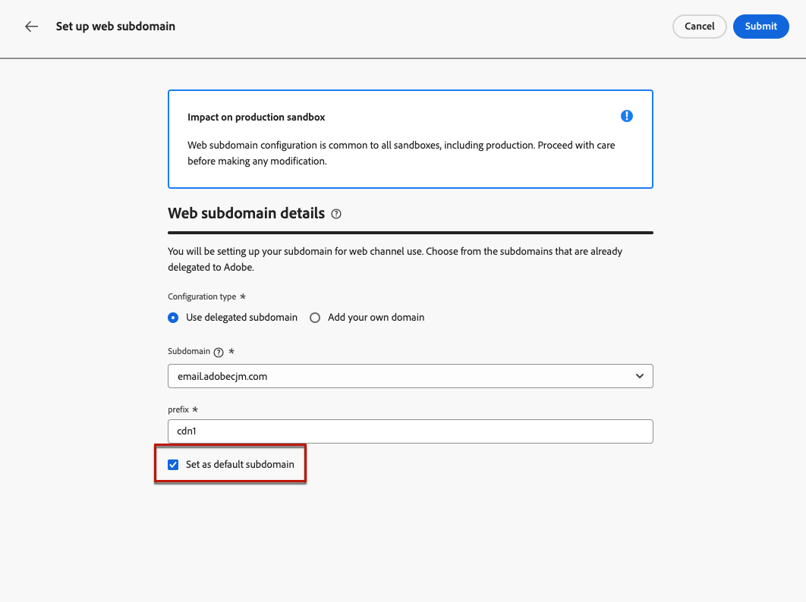

# 配置Web子域 {#web-subdomains}

>[!CONTEXTUALHELP]
>id="ajo_admin_subdomain_web_header"
>title="委派Web子域"
>abstract="您将设置子域以供Web渠道使用。 从已委派给Adobe的子域中进行选择。"

>[!CONTEXTUALHELP]
>id="ajo_admin_subdomain_web"
>title="委派Web子域"
>abstract="如果将来自Adobe Experience Manager Assets Essentials的内容添加到Web体验，则必须设置用于发布此内容的子域。 从已委派到Adobe的子域中进行选择。"

>[!CONTEXTUALHELP]
>id="ajo_admin_subdomain_web_default"
>title="设置Web子域"
>abstract="从委派给Adobe的子域列表中选择子域。 您可以将此Web子域设置为默认子域，但一次只能使用一个默认子域。"

在创作Web体验时，如果您添加来自 [Adobe Experience Manager Assets Essentials](../email/assets-essentials.md) 库中，您必须设置用于发布此内容的子域。

要执行此操作，您必须从已委派给Adobe的子域列表中进行选择。 了解有关将子域委派到的更多信息，请Adobe [此部分](../configuration/delegate-subdomain.md).

>[!CAUTION]
>
>Web子域配置对所有环境都是通用的。 因此：
>
>* 要访问和编辑Web子域，您必须具有 **[!UICONTROL 管理Web子域]** 对生产沙盒的权限。
>
> * 对Web子域的任何修改也会影响生产沙箱。

您可以创建多个Web子域，但 **默认** 子域。 您可以更改默认的Web子域，但一次只能使用一个子域。

1. 访问 **[!UICONTROL 管理]** > **[!UICONTROL 渠道]** 菜单，然后选择 **[!UICONTROL Web配置]** > **[!UICONTROL Web子域]**.

   

1. 单击 **[!UICONTROL 设置子域]**.

1. 从列表中选择委派的子域。

   

   >[!NOTE]
   >
   >无法选择已用作Web子域的子域。

1. 要将此子域设置为默认值，请选择相应的选项。

   

   >[!NOTE]
   >
   >仅 **默认** 子域。

1. 单击&#x200B;**[!UICONTROL 提交]**. 子域获取 **[!UICONTROL 成功]** 状态。 它已准备好用于您的Web体验。

1. 的 **[!UICONTROL 默认]** 标记显示在当前用作默认的子域旁边。 要更改默认子域，请选择 **[!UICONTROL 设置为默认值]** 从 **[!UICONTROL 更多操作]** 按钮。

   >[!NOTE]
   >
   >您可以更改默认的Web子域，但一次只能使用一个子域。

   

   <!--Only a subdomain with the **[!UICONTROL Success]** status can be set as default.-->

1. 您只能删除 **[!UICONTROL 失败]** 子域来清理列表。 要执行此操作，请选择 **[!UICONTROL 删除]** 从 **[!UICONTROL 更多操作]** 按钮。

<!--You cannot delete a subdomain with the **[!UICONTROL Processing]** status.-->
