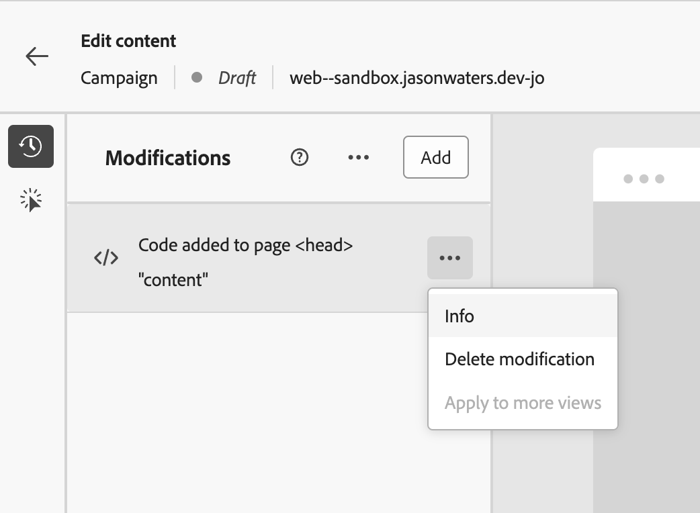

# 使用Web非可视化编辑器 {#web-non-visual-editor}

除了[!DNL Journey Optimizer]可视化[Web设计器](web-visual-editor.md)之外，您还可以使用&#x200B;**非可视编辑器**&#x200B;向网页添加修改。

如果不能或不允许安装浏览器扩展(如[Adobe Experience Cloud可视化帮助程序](web-prerequisites.md#visual-authoring-prerequisites))，则此功能可能很有用，在Web设计器中加载网页需要该工具。

在某些情况下，您还可能会发现使用非可视编辑器对特定CSS选择器应用修改会更容易，而不会冒修改网页上的其他元素或更改页面结构的风险。

要通过非可视化编辑器创作Web体验，请执行以下步骤。

1. 从历程或营销策划中的&#x200B;**[!UICONTROL 编辑内容]**&#x200B;屏幕中，取消选择&#x200B;**[!UICONTROL 可视编辑器]**&#x200B;选项。

1. 单击&#x200B;**[!UICONTROL 添加修改]**&#x200B;以开始编辑您的Web内容。

   

1. 此时将显示非可视编辑器。 您可以使用左窗格添加第一次修改。

   

1. 在下拉列表中，选择修改类型。

   有两种类型可用。 它们有不同的选择。 有关更多详细信息，请参阅下面的链接：

   * **[!UICONTROL CSS选择器]** - [了解更多](manage-web-modifications.md#css-selector)
   * **[!UICONTROL 页面`<head>`]** - [了解更多](manage-web-modifications.md#page-head)

1. 单击&#x200B;**[!UICONTROL 添加个性化]**&#x200B;按钮。 个性化编辑器将打开。

   您可以利用[!DNL Journey Optimizer]个性化编辑器及其所有个性化和创作功能。 [了解详情](../personalization/personalization-build-expressions.md)

1. 输入您的内容并&#x200B;**[!UICONTROL 保存]**&#x200B;您的更改。

   

1. 您的第一次修改显示在&#x200B;**[!UICONTROL 修改]**&#x200B;窗格的顶部。

   单击修改旁边的&#x200B;**[!UICONTROL 更多操作]**&#x200B;按钮，然后选择&#x200B;**[!UICONTROL 信息]**&#x200B;以显示其详细信息。 如果需要，您还可以&#x200B;**[!UICONTROL 删除修改]**。

   {width="50%" align="left"}

   >[!NOTE]
   >
   >**[!UICONTROL 修改]**&#x200B;窗格与使用[Web设计器](web-visual-editor.md)时相同。 您可以对其执行的所有操作在[此部分](manage-web-modifications.md#use-modifications-pane)中都有详细说明。

1. 单击&#x200B;**[!UICONTROL 修改]**&#x200B;窗格顶部的&#x200B;**[!UICONTROL 添加]**&#x200B;按钮以添加其他修改，并重复上述步骤。

1. 此外，您还可以选择网站的任何元素并跟踪对该元素的点击。 要启用点击跟踪并定义要跟踪的操作，请单击左边栏上的第二个图标，如下所示：

   {width="50%" align="left"}

   使用&#x200B;**添加组件**&#x200B;按钮选择要跟踪的新操作。 在[本节](monitor-web-experiences.md#use-click-tracking)中了解有关点击跟踪用法的更多信息。

1. 单击屏幕左上方的箭头以浏览回历程或营销策划版屏幕。 您可以查看当前更改数量并添加更多修改。

   

   如果需要，您还可以切换到Web设计器。 您的所有修改都将被保留。
