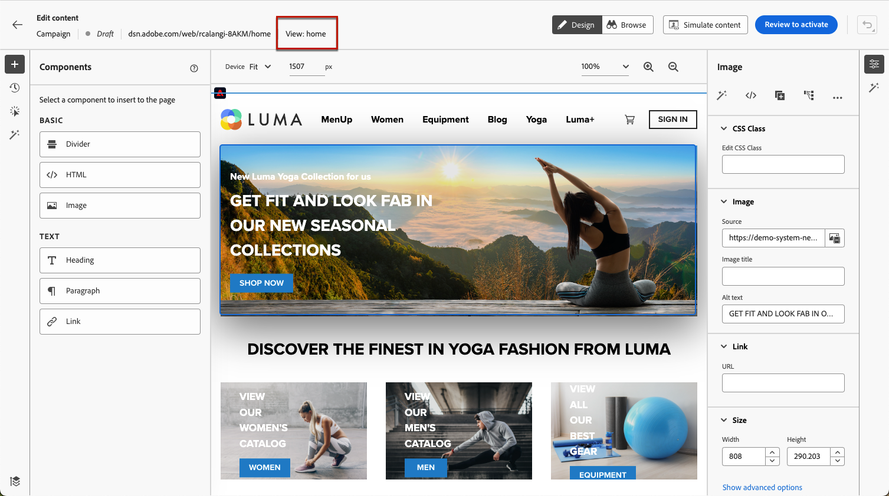

# 创作单页应用程序 {#web-author-spas}

## 关于视图 {#about-views}

>[!CONTEXTUALHELP]
>id="ajo_web_designer_modifications_views"
>title="将更改应用于所选视图"
>abstract="更改将仅应用于所选视图。可使用&#x200B;**浏览**&#x200B;模式发现视图并导航到这些视图。找不到您要找的视图？"
>additional-url="https://experienceleague.adobe.com/docs/platform-learn/implement-web-sdk/overview.html?lang=zh-Hans" text="了解详情"

**单页应用程序** (SPA)现在可以在Web设计器可视编辑器中创作。 这允许您选择特定的 **查看次数** 要将网页修改应用于。

[在此视频中了解如何创作单页面应用程序](#video)

视图可定义为整个网站或网站上的一组可视化元素，例如主页、整个产品网站或所有结账页面上的投放首选项框架。

需要一次性开发人员设置才能定义Adobe Experience Platform Web SDK实施中的视图。 这使您能够在SPA上创建并运行Adobe Journey Optimizer Web营销活动。

## 在Web SDK实施中定义视图 {#define-views}

可在Adobe中利用XDM视图 [!DNL Journey Optimizer] 使营销人员能够通过Web可视化编辑器在SPA上运行Web个性化和实验营销活动。 [了解详情](web-spa-implementation.md)

要能够访问和创作中的视图，请执行以下操作 [!DNL Journey Optimizer] 用户界面中，请确保您遵循中列出的步骤 [本节](web-spa-implementation.md#implement-xdm-views).

## 在Web设计器中发现视图 {#discover-views}

在Adobe Experience Platform Web SDK实施中完成SPA设置后，您需要浏览要应用修改的网站的所有视图。 请按照以下步骤操作。

1. [创建Web活动](create-web.md) 并访问 [Web设计器](edit-web-content.md).

   您当前所在的视图将显示在左上方。

   

1. 交换到 **[!UICONTROL 浏览]** 模式。 [了解详情](../web/edit-web-content.md#browse-mode)

   

1. 在网站的不同页面之间导航以发现所有页面。 当您浏览其他页面时，顶部显示的视图名称会发生更改。

   

## 将修改应用于其他视图 {#apply-modifications-views}

在特定视图中添加修改后，可将其应用于其他选定视图。 请按照以下步骤操作。

>[!CAUTION]
>
>如果您尚未使用 **[!UICONTROL 浏览]** 模式中，您将无法选择它们来应用您的修改。 [了解详情](#discover-views)

1. 选择 **[!UICONTROL 修改]** 图标，以在左侧显示相应的窗格。

   

1. 选择任何修改并单击 **[!UICONTROL 更多操作]** 按钮。 选择 **[!UICONTROL 应用于更多视图]**.

   

1. 选择要将更改应用到其中的视图。

   

1. 单击&#x200B;**[!UICONTROL 应用]**。

1. 交换到 **[!UICONTROL 浏览]** 模式，检查修改是否已应用于所需页面。

   

## 操作方法视频{#video}

以下视频介绍了如何：

* 使用以下方式发现SPA视图 **[!UICONTROL 浏览]** 模式
* 在当前视图上进行创作
* 将网站修改应用于发现的多个视图或所有视图
* 对修改执行批量操作

>[!VIDEO](https://video.tv.adobe.com/v/3424536/?quality=12&learn=on)
