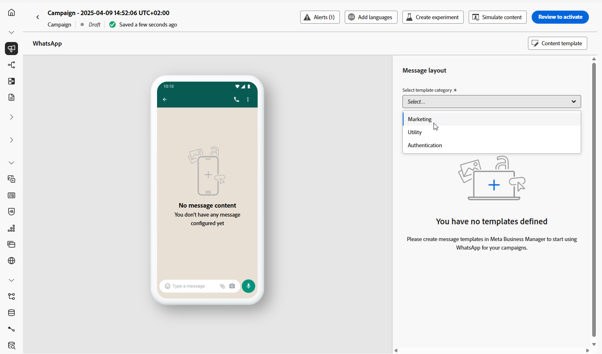

# 创建WhatsApp消息 {#create-whatsapp}

>[!BEGINSHADEBOX]

**目录**

* [开始使用WhatsApp消息](get-started-whatsapp.md)
* [WhatsApp配置入门](whatsapp-configuration.md)
* **[创建WhatsApp消息](create-whatsapp.md)**
* [检查并发送您的WhatsApp消息](send-whatsapp.md)

>[!ENDSHADEBOX]

借助Adobe Journey Optimizer，您可以在WhatsApp上设计和发送吸引人的消息。 只需将WhatsApp操作添加到您的历程或营销策划中，并制作消息内容，如下所述。 Adobe Journey Optimizer还允许您在发送WhatsApp消息之前对其进行测试，确保完美呈现、准确个性化以及所有设置的正确配置。

请注意，Journey Optimizer仅支持出站消息元素。

+++ 了解有关支持的消息元素和行动号召的更多信息

WhatsApp支持以下消息类型：

| 消息功能 | 描述 |
|-|-|
| 标头 | 显示在消息正文上方的可选文本。 |
| 文本 | 通过参数支持动态内容。 |
| 图像(JPEG、PNG) | 必须是8位RGB或RGBA格式，且大小必须小于5 MB。 |
| 视频 | 必须为3GPP或MP4，小于16 MB，并通过URL托管。 |
| 音频 | 仅适用于响应消息。 必须是AAC、AMR、MP3、MP4音频或OGG格式，托管在URL上，并且小于16 MB。 |
| 文档 | 必须小于100 MB，在URL上托管，并且采用以下格式之一： .txt、.xls/.xlsx、.doc/.docx、.ppt/.pptx或.pdf。 |
| 正文文本 | 通过参数支持动态内容。 |
| 页脚文本 | 通过参数支持动态内容。 |

以下call-to-action选项适用于您的WhatsApp消息：

| 行动号召 | 描述 |
|-|-|
| 访问网站 | 仅允许一个按钮，并包含变量参数。 |

+++

## 添加WhatsApp消息 {#create-whatsapp-journey-campaign}

浏览以下选项卡，了解如何在营销活动或历程中添加WhatsApp消息。

>[!BEGINTABS]

>[!TAB 向历程添加WhatsApp消息]

1. 打开您的历程，然后从面板的&#x200B;**操作**&#x200B;部分拖放&#x200B;**WhatsApp活动**。

   

1. 提供有关消息的基本信息（标签、说明、类别），然后选择要使用的消息配置。

   有关如何配置历程的详细信息，请参阅[此页面](../building-journeys/journey-gs.md)

   默认情况下，**[!UICONTROL 配置]**&#x200B;字段已预填充用户用于该渠道的最后一个配置。

您现在可以从&#x200B;**[!UICONTROL 编辑内容]**&#x200B;按钮开始设计WhatsApp消息的内容，如下所述。

>[!TAB 向促销活动添加WhatsApp消息]

1. 访问&#x200B;**[!UICONTROL 营销活动]**&#x200B;菜单，然后单击&#x200B;**[!UICONTROL 创建营销活动]**。

1. 选择&#x200B;**计划 — 营销**&#x200B;营销活动类型。

1. 从&#x200B;**[!UICONTROL 属性]**&#x200B;部分，编辑营销活动的&#x200B;**[!UICONTROL 标题]**&#x200B;和&#x200B;**[!UICONTROL 描述]**。

1. 单击&#x200B;**[!UICONTROL 选择受众]**&#x200B;按钮，从可用Adobe Experience Platform受众列表中定义要定位的受众。 [了解详情](../audience/about-audiences.md)。

1. 在&#x200B;**[!UICONTROL 身份命名空间]**&#x200B;字段中，选择要使用的命名空间，以便识别所选受众中的个人。 [了解详情](../event/about-creating.md#select-the-namespace)。

1. 在&#x200B;**[!UICONTROL 操作]**&#x200B;部分中，选择&#x200B;**[!UICONTROL WhatsApp]**，然后选择或创建新配置。

   在[此页面](whatsapp-configuration.md)上了解有关WhatsApp配置的更多信息。

   

1. 单击&#x200B;**[!UICONTROL 创建试验]**&#x200B;开始配置内容试验并创建处理以测量其性能并为目标受众确定最佳选项。 [了解详情](../content-management/content-experiment.md)

1. 在&#x200B;**[!UICONTROL 操作跟踪]**&#x200B;部分中，指定是否要跟踪WhatsApp消息中链接的点击次数。

1. 营销活动旨在按特定日期或循环频率执行。 在[本节](../campaigns/create-campaign.md#schedule)中了解如何配置促销活动的&#x200B;**[!UICONTROL 计划]**。

1. 从&#x200B;**[!UICONTROL 操作触发器]**&#x200B;菜单中，选择WhatsApp消息的&#x200B;**[!UICONTROL 频率]**：

   * 一次
   * 每日
   * 每周
   * 月

您现在可以从&#x200B;**[!UICONTROL 编辑内容]**&#x200B;按钮开始设计WhatsApp消息的内容，如下所述。

>[!ENDTABS]

## 定义WhatsApp内容{#whatsapp-content}

>[!BEGINSHADEBOX]

在Journey Optimizer中设计WhatsApp消息之前，您首先需要在Meta中创建和设计模板。 [了解详情](https://www.facebook.com/business/help/2055875911147364?id=2129163877102343)

请注意，您的WhatsApp模板必须先获得Meta的批准，然后才能在Journey Optimizer中使用。 此过程通常需要几个小时，但可能最多需要24小时。 [了解详情](https://developers.facebook.com/docs/whatsapp/message-templates/guidelines/#approval-process)

>[!ENDSHADEBOX]

1. 在历程或营销策划配置屏幕中，单击&#x200B;**[!UICONTROL 编辑内容]**&#x200B;按钮配置WhatsApp消息内容。

<!--
1. Select **[!UICONTROL Template message]**.
-->

1. 选择您的&#x200B;**模板类别**：

   * 营销
   * 实用工具
   * 身份验证

   [了解有关模板类别的更多信息](https://developers.facebook.com/docs/whatsapp/updates-to-pricing/new-template-guidelines/#template-category-guidelines)

   

1. 从&#x200B;**WhatsApp模板**&#x200B;下拉列表中，选择您之前在Meta中创建的模板。

   [了解有关如何创建Whatsapp模板的更多信息](https://www.facebook.com/business/help/2055875911147364?id=2129163877102343)

   

1. 使用个性化编辑器向模板中添加个性化。 您可以使用任何属性，例如配置文件名称或城市。

   浏览以下页面，了解有关[个性化](../personalization/personalize.md)的更多信息。

   

1. 使用&#x200B;**[!UICONTROL 模拟内容]**&#x200B;按钮预览您的WhatsApp消息内容、缩短的URL和个性化内容。 [了解详情](send-whatsapp.md)

执行测试并验证内容后，您可以向受众发送WhatsApp消息。 这些步骤在[此页面](send-whatsapp.md)上详述

<!--
* **[!UICONTROL Template message]**: Predefined message imported from Meta into Journey Optimizer. These are intended for sending notifications, alerts, or updates to your customers.

* **[!UICONTROL Response message]**: Message created in Journey Optimizer and sent in reply to customer queries or interactions.

>[!BEGINTABS]

>[!TAB Template message]

1. From the journey or campaign configuration screen, click the **[!UICONTROL Edit content]** button to configure the WhatsApp message content.

1. Select **[!UICONTROL Template message]**.

1. Choose your Template category. [Learn more](https://developers.facebook.com/docs/WhatsApp/updates-to-pricing/new-template-guidelines/)

1. From the **WhatsApp template** drop-down, select your previously created template designed in Meta.

1. Use the personalization editor to define content, add personalization and dynamic content. You can use any attribute, such as the profile name or city for example. You can also define conditional rules. Browse to the following pages to learn more about [personalization](../personalization/personalize.md) and [dynamic content](../personalization/get-started-dynamic-content.md) in the personalization editor.

1. Use the **[!UICONTROL Simulate content]** button to preview your WhatsApp message content, shortened URLs, and personalized content. [Learn more](send-whatsapp.md)

Once you have performed your tests and validated the content, you can send your WhatsApp message to your audience. These steps are detailed on [this page](send-whatsapp.md)

>[!TAB Response message]

1. From the journey or campaign configuration screen, click the **[!UICONTROL Edit content]** button to configure the WhatsApp message content.

1. Select **[!UICONTROL Response message]**.

1. Enter your text in the **[!UICONTROL Body]** field.

1. Use the personalization editor to define content, add personalization and dynamic content. You can use any attribute, such as the profile name or city for example. You can also define conditional rules. Browse to the following pages to learn more about [personalization](../personalization/personalize.md) and [dynamic content](../personalization/get-started-dynamic-content.md) in the personalization editor.

1. Use the **[!UICONTROL Simulate content]** button to preview your WhatsApp message content, shortened URLs, and personalized content. [Learn more](send-whatsapp.md)

Once you have performed your tests and validated the content, you can send your WhatsApp message to your audience. These steps are detailed on [this page](send-whatsapp.md)

>[!ENDTABS]
-->
