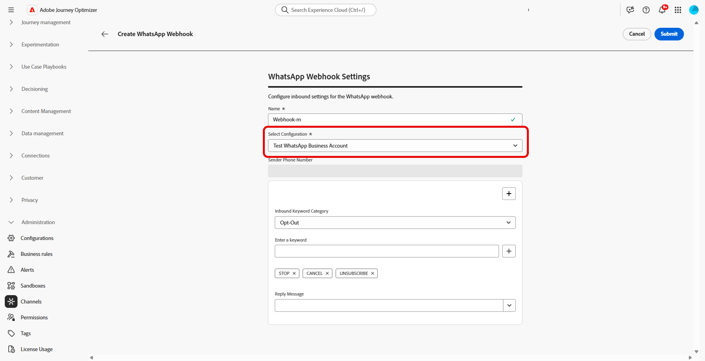
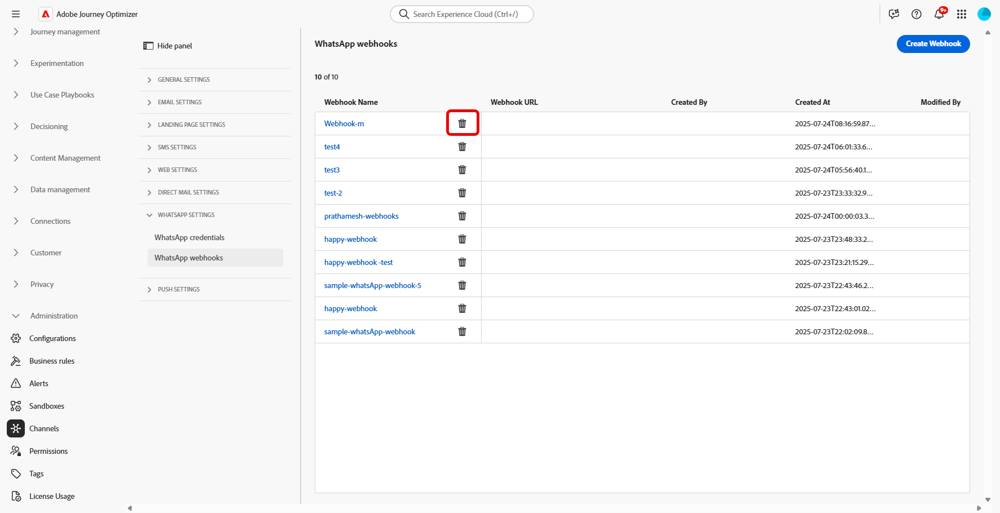
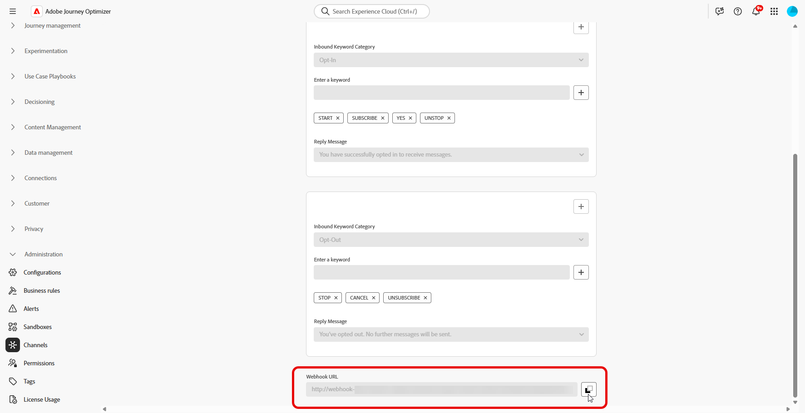

# WhatsApp 配置入门 {#whatsapp-config}

在发送WhatsApp消息之前，必须配置Adobe Journey Optimizer环境并与WhatsApp帐户关联。 要执行此操作，请执行以下操作：

1. [创建您的WhatsApp API凭据](#WhatsApp-credentials)
1. [创建WhatsApp Webhook](#WhatsApp-webhook)
1. [创建WhatsApp配置](#WhatsApp-configuration)

这些步骤必须由Adobe Journey Optimizer [系统管理员](../start/path/administrator.md)执行。

## 创建WhatsApp API凭据 {#whatsapp-credentials}

1. 在左边栏中，浏览到&#x200B;**[!UICONTROL 管理]** `>` **[!UICONTROL 渠道]**&#x200B;并选择&#x200B;**[!UICONTROL API凭据]**&#x200B;菜单。 单击&#x200B;**[!UICONTROL 创建新API凭据]**&#x200B;按钮。

1. 配置API凭据，如下所述：

   * **API令牌**：输入您的API令牌。 请参阅[Meta文档](https://developers.facebook.com/blog/post/2022/12/05/auth-tokens/)以了解详情
   * **业务帐户ID**：输入与业务组合相关的唯一编号。 请参阅[Meta文档](https://www.facebook.com/business/help/1181250022022158?id=180505742745347)以了解详情。

   

1. 单击&#x200B;**[!UICONTROL 继续]**。

1. 选择要连接到WhatsApp API凭据的&#x200B;**WhatsApp商业帐户**。

   

1. 选择用于发送WhatsApp消息的&#x200B;**发件人名称**。

1. 您的电话号码设置会自动填写：

   * **质量评级**：反映客户对过去24小时内发送的邮件的反馈。
      * 绿色：高品质
      * 黄色：Medium品质
      * 红色：低品质

     了解有关[质量评级](https://www.facebook.com/business/help/766346674749731#)的更多信息

   * **吞吐量**：指示您的电话号码可以发送消息的速率。

1. 完成API凭据配置后，单击&#x200B;**[!UICONTROL 提交]**。

创建和配置API凭据后，现在需要为WhatsApp消息创建Webhook。 [了解详情](#whatsapp-webhook)

## 创建 Webhook {#WhatsApp-webhook}

>[!CONTEXTUALHELP]
>id="ajo_admin_whatsapp_webhook_inbound_keyword_category"
>title="入站关键词类别"
>abstract="<b>选择加入</b>：用户订阅后，发送您定义的自动回复。 <b>选择退出</b>：用户取消订阅后，发送您定义的自动回复。 <b>帮助</b>：用户请求帮助或支持时，发送您定义的自动回复。 <b>默认</b>：没有关键词匹配时，发送您的备用自动回复。"

>[!CONTEXTUALHELP]
>id="ajo_admin_whatsapp_webhook_inbound_keyword"
>title="输入您的关键词"
>abstract="您可以定义关键词，用于根据用户文本触发特定的自动响应。关键词不区分大小写，例如 stop 和 STOP 的效果是一样的。"

>[!CONTEXTUALHELP]
>id="ajo_admin_whatsapp_webhook_webhook_url"
>title="回调 URL"
>abstract="此对象的验证请求和 webhook 通知将被发送到指定的 URL。"

>[!CONTEXTUALHELP]
>id="ajo_admin_whatsapp_webhook_verify_token"
>title="验证令牌"
>abstract="Meta 在验证过程中返回的用于确认和验证回调 URL 的令牌。"

>[!NOTE]
>
>如果没有指定的选择加入或选择退出关键词，则不会启用标准同意消息。

成功创建WhatsApp API凭据后，您现在可以将Webhook配置为：

* **捕获入站响应**&#x200B;以管理选择加入和选择退出同意
* **接收传递报告**，例如读回执（如果可用）和邮件传递状态
* 在Adobe Experience Platform数据集中&#x200B;**启用分析和报表跟踪事件**

Webhook用作Meta的WhatsApp商业平台与Adobe Journey Optimizer之间的通信桥梁，允许您接收有关消息事件和用户交互的实时通知。

1. 在左边栏中，导航到&#x200B;**[!UICONTROL 管理]** `>` **[!UICONTROL 渠道]**，选择&#x200B;**[!UICONTROL WhatsApp设置]**&#x200B;下的&#x200B;**[!UICONTROL WhatsApp Webhook]**&#x200B;菜单，然后单击&#x200B;**[!UICONTROL 创建Webhook]**&#x200B;按钮。

   

1. 输入webhook的&#x200B;**[!UICONTROL 名称]**。

1. 从&#x200B;**[!UICONTROL 选择配置]**&#x200B;下拉列表中，选择您之前创建的[API凭据](#whatsapp-credentials)。

   

1. 选择您的&#x200B;**[!UICONTROL 入站关键词类别]**，例如：

   * **[!UICONTROL 选择加入关键字]**
   * **[!UICONTROL 选择退出关键字]**
   * **[!UICONTROL 帮助关键字]**
   * **[!UICONTROL 默认]** — 与其他关键字不匹配的所有入站邮件的回退类别。 使用此类别可在Adobe Experience Platform数据集中启用跟踪事件（打开次数、投放报告）。

1. 输入您的&#x200B;**[!UICONTROL 关键字]**&#x200B;并单击。

   

1. 在&#x200B;**[!UICONTROL 回复消息]**&#x200B;字段中，输入收到配置的关键字时发送的消息，或从下拉菜单中选择预定义选项。

   

<!--
1. Click **[!UICONTROL View payload editor]** to validate and customize your request payloads. 
    
    You can dynamically personalize your payload using profile attributes, and ensure accurate data is sent for processing and response generation with the help of built-in helper functions.
-->
1. 单击以添加其他&#x200B;**[!UICONTROL 入站关键字]**。

1. 完成WhatsApp Webhook的配置后，单击&#x200B;**[!UICONTROL 提交]**。

1. 在&#x200B;**[!UICONTROL Webhooks]**&#x200B;菜单中，单击以删除您的WhatsApp Webhook。

   

1. 要修改现有配置并访问您的&#x200B;**[!UICONTROL Webhook URL]**&#x200B;或&#x200B;**[!UICONTROL Webhook验证标记]**，请找到所需的Webhook，然后单击&#x200B;**[!UICONTROL 编辑]**&#x200B;选项以进行必要的更改。

1. 复制此处生成的&#x200B;**[!UICONTROL Webhook验证令牌]**，然后将其粘贴到Meta界面中，作为Webhook设置的一部分。

   有关如何以及在何处添加此验证令牌的详细说明，请参阅[Meta文档](https://developers.facebook.com/docs/graph-api/webhooks/getting-started#configure-webhooks-product)。

1. 从您以前提交的&#x200B;**[!UICONTROL WhatsApp Webhook]**&#x200B;访问和复制新的&#x200B;**[!UICONTROL Webhook URL]**。

   

现在，您的Webhook已配置完毕，您可以创建WhatsApp配置了。

## 创建WhatsApp配置 {#whatsapp-configuration}

1. 在左边栏中，浏览到&#x200B;**[!UICONTROL 管理]** > **[!UICONTROL 渠道]**&#x200B;并选择&#x200B;**[!UICONTROL 常规设置]** > **[!UICONTROL 渠道配置]**。 单击&#x200B;**[!UICONTROL 创建渠道配置]**&#x200B;按钮。

   

1. 输入配置的名称和描述（可选），然后选择WhatsApp渠道。

   >[!NOTE]
   >
   > 名称必须以字母(A-Z)开头。 它只能包含字母数字字符。 您还可以使用下划线 `_`、点 `.` 和连字符 `-` 符号。

1. 选择&#x200B;**[!DNL WhatsApp]**&#x200B;作为您的渠道。

   {width=80%}

1. 选择&#x200B;**[!UICONTROL 营销操作]**&#x200B;以使用此配置将同意策略关联到消息。 所有与营销活动相关的同意政策均可利用，以尊重客户的偏好。 [了解详情](../action/consent.md#surface-marketing-actions)

1. 在&#x200B;**[!UICONTROL WhatsApp设置]**&#x200B;部分中，选择之前创建的&#x200B;**[!UICONTROL WhatsApp配置]**。

   {width=80%}

1. 输入&#x200B;要用于通信的&#x200B;**[!UICONTROL 发件人电话号码]**。

1. 使用&#x200B;**[!UICONTROL WhatsApp执行字段]**&#x200B;在配置文件属性中选择要优先使用的电话号码（如果数据库中有多个号码可用）。 [了解详情](../configuration/primary-email-addresses.md#override-execution-address-channel-config)

   >[!NOTE]
   >
   >默认情况下，[!DNL Journey Optimizer]在沙盒级别使用[常规设置](../configuration/primary-email-addresses.md)中指定的电话号码。 更新此字段将覆盖使用此配置的历程和营销活动的默认值。

1. 配置所有参数后，单击&#x200B;**[!UICONTROL 提交]**&#x200B;以确认。 您还可以将渠道配置另存为草稿，并稍后恢复其配置。

1. 创建渠道配置后，它将显示在状态为&#x200B;**[!UICONTROL 正在处理]**&#x200B;的列表中。

   >[!NOTE]
   >
   >如果检查不成功，请在[本节](../configuration/channel-surfaces.md)中进一步了解可能的失败原因。

1. 检查成功后，通道配置将获得&#x200B;**[!UICONTROL 活动]**&#x200B;状态。 它随时可用于投放消息。

配置后，您可以利用所有现成的渠道功能，如消息创作、个性化、链接跟踪和报告。

您现在可以使用Journey Optimizer发送WhatsApp消息了。

## WhatsApp渠道设置疑难解答 {#troubleshooting}

### API凭据设置期间出现HTTP 500错误

如果在配置WhatsApp API凭据时遇到HTTP 500错误，请按照以下故障排除步骤操作：

1. **验证权利**：确认您的组织已设置`cjm_whatsapp`权利。 如果没有此权限，无法配置WhatsApp渠道。

1. **验证业务帐户字段**：确保正确填写所有必填字段：
   * **API令牌**：必须是具有适当权限的有效Meta访问令牌。 [了解详情](https://developers.facebook.com/blog/post/2022/12/05/auth-tokens/)
   * **Business帐户ID**：必须与您的Meta Business帐户ID完全匹配。 [了解详情](https://www.facebook.com/business/help/1181250022022158?id=180505742745347)

1. **在外部测试凭据**：直接使用Meta API验证您的凭据，以确认问题与凭据有关，还是与Journey Optimizer凭据处理有关。

1. **启用高级日志记录**：要识别内部服务器或身份验证错误配置，请在Journey Optimizer环境中启用高级日志以提供有关API调用失败的详细信息。

1. **联系支持人员**：如果环境和权利已确认有效，但HTTP 500错误仍然存在，请联系您的Adobe代表。

## 操作方法视频 {#video}

以下视频介绍了如何在Adobe Journey Optimizer中设置WhatsApp渠道。

+++ 观看视频

>[!VIDEO](https://video.tv.adobe.com/v/3470268/?learn=on)

+++
