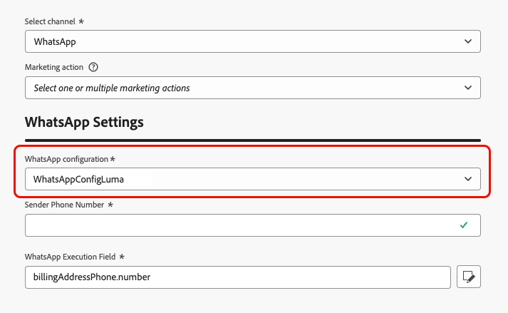

# WhatsApp配置入门 {#whatsapp-config}

>[!BEGINSHADEBOX]

**目录**

* [开始使用WhatsApp消息](get-started-whatsapp.md)
* **[开始使用WhatsApp配置](whatsapp-configuration.md)**
* [创建WhatsApp消息](create-whatsapp.md)
* [检查并发送您的WhatsApp消息](send-whatsapp.md)

>[!ENDSHADEBOX]

在发送WhatsApp消息之前，必须配置Adobe Journey Optimizer环境并与WhatsApp帐户关联。 要执行此操作，请执行以下操作：

1. [创建您的WhatsApp API凭据](#WhatsApp-credentials)
1. [创建WhatsApp配置](#WhatsApp-configuration)

这些步骤必须由Adobe Journey Optimizer [系统管理员](../start/path/administrator.md)执行。

## 创建WhatsApp API凭据 {#whatsapp-credentials}

1. 在左边栏中，浏览到&#x200B;**[!UICONTROL 管理]** `>` **[!UICONTROL 渠道]**&#x200B;并选择&#x200B;**[!UICONTROL API凭据]**&#x200B;菜单。 单击&#x200B;**[!UICONTROL 创建新API凭据]**&#x200B;按钮。

1. 配置API凭据，如下所述：

   * **API令牌**：输入您的API令牌。 请参阅[元文档](https://developers.facebook.com/docs/facebook-login/guides/access-tokens/)以了解详情
   * **业务帐户ID**：输入与业务组合相关的唯一编号。 请参阅[元文档](https://www.facebook.com/business/help/1181250022022158?id=180505742745347)以了解详情。

   

1. 单击&#x200B;**[!UICONTROL 继续]**。

1. 选择要连接到WhatsApp API凭据的&#x200B;**商业帐户**。

   

1. 选择用于发送Whatsapp消息的&#x200B;**电话号码**。

1. 您的电话号码设置会自动填写：

   * **质量评级**：反映客户对过去24小时内发送的邮件的反馈。
      * 绿色：高品质
      * 黄色：Medium品质
      * 红色：低品质

     了解有关[质量评级](https://www.facebook.com/business/help/766346674749731#)的更多信息

   * **吞吐量**：指示您的电话号码可以发送消息的速率。

1. 完成API凭据配置后，单击&#x200B;**[!UICONTROL 提交]**。

创建和配置API凭据后，现在需要为WhatsApp消息创建渠道配置。 [了解详情](#whatsapp-configuration)

## 创建WhatsApp配置 {#whatsapp-configuration}

1. 在左边栏中，浏览到&#x200B;**[!UICONTROL 管理]** > **[!UICONTROL 渠道]**&#x200B;并选择&#x200B;**[!UICONTROL 常规设置]** > **[!UICONTROL 渠道配置]**。 单击&#x200B;**[!UICONTROL 创建渠道配置]**&#x200B;按钮。

   

1. 输入配置的名称和描述（可选），然后选择WhatsApp渠道。

   >[!NOTE]
   >
   > 名称必须以字母(A-Z)开头。 它只能包含字母数字字符。 您还可以使用下划线 `_`、点 `.` 和连字符 `-` 符号。

1. 选择&#x200B;**[!DNL WhatsApp]**&#x200B;作为您的渠道。

   

1. 选择&#x200B;**[!UICONTROL 营销操作]**&#x200B;以使用此配置将同意策略关联到消息。 所有与营销活动相关的同意政策均可利用，以尊重客户的偏好。 了解详情

1. 选择之前创建的&#x200B;**[!UICONTROL WhatsApp API配置]**。

   

1. 输入&#x200B;要用于通信的&#x200B;**[!UICONTROL 发件人号码]**。

1. 配置所有参数后，单击&#x200B;**[!UICONTROL 提交]**&#x200B;以确认。 您还可以将渠道配置另存为草稿，并稍后恢复其配置。

1. 创建渠道配置后，它将显示在状态为&#x200B;**[!UICONTROL 正在处理]**&#x200B;的列表中。

   >[!NOTE]
   >
   >如果检查不成功，请在[本节](../configuration/channel-surfaces.md)中进一步了解可能的失败原因。

1. 检查成功后，通道配置将获得&#x200B;**[!UICONTROL 活动]**&#x200B;状态。 它随时可用于投放消息。

您现在可以使用Journey Optimizer发送WhatsApp消息了。

